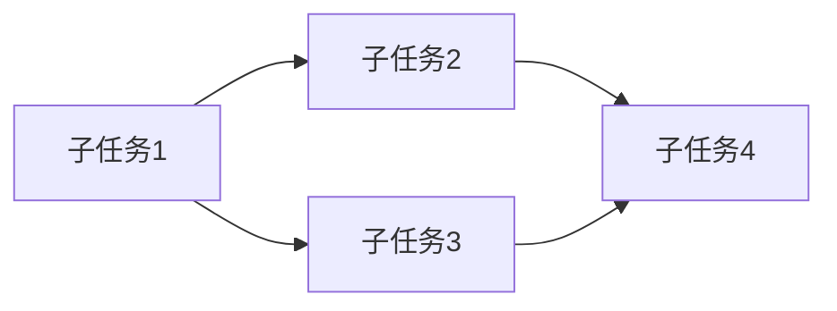

# 需求识别提示模板

此模板用于识别当前任务需要的能力，发现能力缺口。

## 使用说明

当开始一个新任务时，使用此模板分析所需能力，识别能力缺口。

## 需求识别流程

### 第一步：任务分解

```markdown
## 任务分解

### 原始任务
{用户的原始任务描述}

### 任务理解
{Agent对任务的理解}

### 子任务分解
将任务分解为可执行的子任务：

| 序号 | 子任务 | 说明 | 预期输出 |
|------|--------|------|----------|
| 1 | {子任务1} | {说明} | {输出} |
| 2 | {子任务2} | {说明} | {输出} |
| 3 | {子任务3} | {说明} | {输出} |
...

### 任务依赖关系

```

### 第二步：能力映射

```markdown
## 能力映射

### 能力需求矩阵

| 子任务 | 需要的能力 | 能力类型 | 重要程度 |
|--------|------------|----------|----------|
| {子任务1} | {能力1} | 领域知识 | 必需 |
| {子任务1} | {能力2} | 技术技能 | 必需 |
| {子任务2} | {能力3} | 工具使用 | 推荐 |
| {子任务3} | {能力4} | 最佳实践 | 可选 |

### 能力类型说明

- **领域知识**: 特定领域的专业知识
  - 示例：金融计算、医疗数据处理、法律合规
  
- **技术技能**: 特定技术的使用能力
  - 示例：React开发、Docker部署、数据库优化
  
- **工具使用**: 特定工具的使用经验
  - 示例：Git操作、Webpack配置、调试工具
  
- **最佳实践**: 特定场景的最佳实践
  - 示例：性能优化、安全加固、代码规范
  
- **流程方法**: 特定流程的执行方法
  - 示例：CI/CD流程、代码审查流程、测试流程
```

### 第三步：能力检查

```markdown
## 能力检查

### 已有能力评估

对每个需要的能力，评估是否已具备：

| 能力 | 是否具备 | 熟练程度 | 来源 | 说明 |
|------|----------|----------|------|------|
| {能力1} | 是 | 高 | 内置 | {说明} |
| {能力2} | 是 | 中 | 已安装技能 | {说明} |
| {能力3} | 否 | - | - | 缺少此能力 |
| {能力4} | 部分 | 低 | 基础知识 | 需要加强 |

### 熟练程度定义

- **高**: 能够独立完成复杂任务
- **中**: 能够完成常规任务，复杂任务需要参考
- **低**: 有基本了解，需要指导
- **无**: 完全不了解

### 能力来源

- **内置**: Agent内置能力
- **已安装技能**: 已通过Skills CLI安装的技能
- **基础知识**: 通用知识，需要特定领域加强
- **缺失**: 完全缺少，需要获取
```

### 第四步：缺口识别

```markdown
## 能力缺口识别

### 能力缺口清单

```yaml
capability_gaps:
  # 完全缺少的能力
  missing:
    - name: "国际化实现"
      description: "多语言支持的实现方案"
      type: "技术技能"
      priority: "critical"  # critical|high|medium|low
      impact: "无法完成国际化功能"
      blocking: true  # 是否阻塞任务
      
    - name: "JWT认证"
      description: "JWT令牌的生成和验证"
      type: "技术技能"
      priority: "high"
      impact: "认证功能不完整"
      blocking: false
      
  # 部分具备但需要加强的能力
  need_enhancement:
    - name: "React性能优化"
      current_level: "low"
      required_level: "medium"
      gap: "需要了解React.memo、useMemo等优化技术"
      priority: "medium"
```

### 缺口影响分析

| 缺口能力 | 影响子任务 | 影响程度 | 是否阻塞 | 替代方案 |
|----------|------------|----------|----------|----------|
| 国际化实现 | 子任务2 | 高 | 是 | 暂时使用硬编码 |
| JWT认证 | 子任务3 | 中 | 否 | 使用session方案 |
| React优化 | 子任务4 | 低 | 否 | 先完成功能再优化 |

### 缺口优先级排序

```markdown
按优先级排序的能力缺口：

#### P0 - 阻塞性缺口（必须解决）
1. **国际化实现**
   - 影响：无法完成核心功能
   - 建议：立即安装相关技能或学习

#### P1 - 高优先级缺口（强烈建议解决）
2. **JWT认证**
   - 影响：功能不完整
   - 建议：安装技能获取能力

#### P2 - 中优先级缺口（建议解决）
3. **React性能优化**
   - 影响：性能可能不佳
   - 建议：有时间时学习

#### P3 - 低优先级缺口（可选解决）
4. **单元测试最佳实践**
   - 影响：测试覆盖可能不够
   - 建议：后续改进
```
```

### 第五步：解决方案确定

```markdown
## 解决方案

### 解决方案矩阵

| 缺口能力 | 解决方案 | 预计时间 | 可行性 | 推荐方案 |
|----------|----------|----------|--------|----------|
| 国际化实现 | 安装技能 | 5分钟 | 高 | ✓ |
| 国际化实现 | 自学 | 2小时 | 中 | |
| JWT认证 | 安装技能 | 5分钟 | 高 | ✓ |
| React优化 | 安装技能 | 5分钟 | 高 | ✓ |
| React优化 | 自学 | 1小时 | 中 | |

### 解决方案类型

#### 安装技能（推荐）
```yaml
solution:
  type: "install_skill"
  skill_search:
    keywords: ["i18n", "internationalization", "react"]
  recommended_skills:
    - id: "react-i18n-guide"
      source: "vercel-labs/agent-skills"
  estimated_time: "5分钟"
```

#### 学习获取
```yaml
solution:
  type: "learn"
  learning_resources:
    - type: "documentation"
      url: "https://react.i18next.com/"
    - type: "tutorial"
      url: "..."
  estimated_time: "2小时"
```

#### 替代方案
```yaml
solution:
  type: "alternative"
  alternative_approach: "使用简单的翻译对象实现基本国际化"
  trade_offs:
    - "功能较简单"
    - "不支持动态切换"
  estimated_time: "30分钟"
```

#### 请求帮助
```yaml
solution:
  type: "request_help"
  help_type: "user_guidance"  # user_guidance|expert_help
  request_message: "需要用户指导国际化实现方案"
```
```

## 需求识别输出格式

```yaml
capability_identification_result:
  identification_id: "IDENT-{YYYYMMDD}-{序号}"
  timestamp: "{ISO 8601时间戳}"
  
  task:
    description: "任务描述"
    subtasks: ["子任务1", "子任务2", "子任务3"]
    
  required_capabilities:
    - name: "能力名称"
      type: "技术技能"
      importance: "必需"
      subtasks: ["子任务1", "子任务2"]
      
  existing_capabilities:
    - name: "已有能力"
      level: "高"
      source: "内置"
      
  capability_gaps:
    critical:
      - name: "关键缺口"
        impact: "阻塞任务"
        blocking: true
        
    high:
      - name: "高优先级缺口"
        impact: "功能不完整"
        blocking: false
        
    medium:
      - name: "中优先级缺口"
        impact: "效率降低"
        blocking: false
        
  solutions:
    - gap: "国际化实现"
      recommended_solution: "install_skill"
      skill_recommendation:
        id: "react-i18n-guide"
        source: "vercel-labs/agent-skills"
        
  next_actions:
    - action: "install_skill"
      skill_id: "react-i18n-guide"
      priority: "critical"
```

## 需求识别示例

### 示例1：开发用户认证模块

```yaml
capability_identification_result:
  task:
    description: "为Web应用开发用户认证模块"
    subtasks:
      - "设计认证流程"
      - "实现登录/注册API"
      - "实现JWT令牌管理"
      - "添加权限控制"
      - "编写单元测试"
      
  required_capabilities:
    - name: "认证流程设计"
      type: "领域知识"
      importance: "必需"
      subtasks: ["设计认证流程"]
      
    - name: "JWT实现"
      type: "技术技能"
      importance: "必需"
      subtasks: ["实现JWT令牌管理"]
      
    - name: "Node.js开发"
      type: "技术技能"
      importance: "必需"
      subtasks: ["实现登录/注册API"]
      
    - name: "安全最佳实践"
      type: "最佳实践"
      importance: "推荐"
      subtasks: ["实现登录/注册API", "添加权限控制"]
      
  existing_capabilities:
    - name: "Node.js开发"
      level: "高"
      source: "内置"
      
    - name: "数据库操作"
      level: "中"
      source: "内置"
      
  capability_gaps:
    critical:
      - name: "JWT实现"
        impact: "无法实现令牌管理"
        blocking: true
        
    high:
      - name: "认证安全最佳实践"
        impact: "可能存在安全漏洞"
        blocking: false
        
  solutions:
    - gap: "JWT实现"
      recommended_solution: "install_skill"
      skill_recommendation:
        id: "jwt-auth-guide"
        source: "vercel-labs/agent-skills"
        
    - gap: "认证安全最佳实践"
      recommended_solution: "install_skill"
      skill_recommendation:
        id: "auth-security-guide"
        source: "vercel-labs/agent-skills"
```

### 示例2：数据分析报告生成

```yaml
capability_identification_result:
  task:
    description: "生成销售数据分析报告"
    subtasks:
      - "数据提取和清洗"
      - "数据分析和统计"
      - "生成可视化图表"
      - "导出PDF报告"
      
  required_capabilities:
    - name: "数据分析"
      type: "技术技能"
      importance: "必需"
      subtasks: ["数据分析和统计"]
      
    - name: "数据可视化"
      type: "技术技能"
      importance: "必需"
      subtasks: ["生成可视化图表"]
      
    - name: "PDF生成"
      type: "技术技能"
      importance: "必需"
      subtasks: ["导出PDF报告"]
      
  existing_capabilities:
    - name: "数据处理"
      level: "中"
      source: "内置"
      
    - name: "Python编程"
      level: "高"
      source: "内置"
      
  capability_gaps:
    high:
      - name: "数据可视化"
        impact: "无法生成图表"
        blocking: true
        
    medium:
      - name: "PDF生成"
        impact: "无法导出报告"
        blocking: true
        
  solutions:
    - gap: "数据可视化"
      recommended_solution: "install_skill"
      skill_recommendation:
        id: "python-visualization"
        source: "vercel-labs/agent-skills"
        
    - gap: "PDF生成"
      recommended_solution: "install_skill"
      skill_recommendation:
        id: "python-pdf-generation"
        source: "vercel-labs/agent-skills"
```

## 注意事项

1. **全面分析**: 不要遗漏重要的能力需求
2. **优先级明确**: 根据影响程度确定优先级
3. **可行评估**: 评估解决方案的可行性
4. **渐进解决**: 先解决阻塞问题，再逐步优化
5. **记录缺口**: 未解决的缺口要记录到知识库