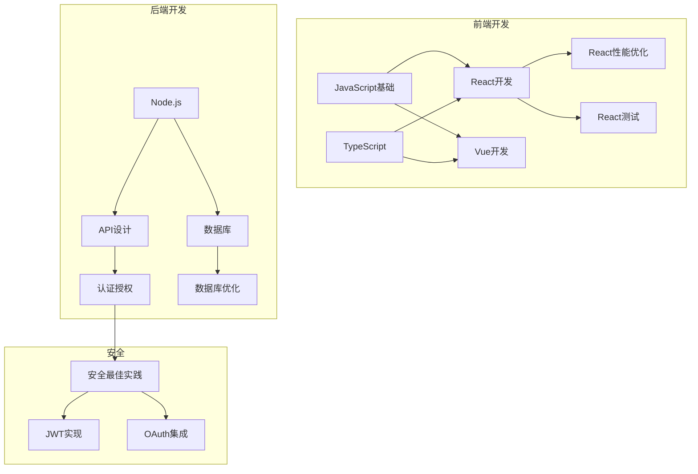

# 能力映射模板

此模板用于维护能力与技能之间的映射关系，帮助快速找到所需技能。

## 能力映射结构

```yaml
# 能力映射配置
capability_map:
  # 元数据
  metadata:
    version: "1.0.0"
    updated_at: "2024-01-15T00:00:00Z"
    
  # 领域映射
  domains: {}
  
  # 任务映射
  tasks: {}
  
  # 技术映射
  technologies: {}
```

## 领域映射

```yaml
# 按领域分类的能力映射
domains:
  # 前端开发
  frontend:
    name: "前端开发"
    description: "Web前端开发相关能力"
    
    capabilities:
      # React开发
      react_development:
        name: "React开发"
        description: "使用React框架进行前端开发"
        
        skills:
          - id: "react-best-practices"
            priority: 1  # 推荐优先级
            notes: "React最佳实践指南"
            
          - id: "react-hooks-guide"
            priority: 1
            notes: "React Hooks使用指南"
            
          - id: "react-performance"
            priority: 2
            notes: "React性能优化"
            
        prerequisites:
          - "javascript_basics"
          - "typescript_basics"
          
      # Vue开发
      vue_development:
        name: "Vue开发"
        description: "使用Vue框架进行前端开发"
        
        skills:
          - id: "vue-best-practices"
            priority: 1
            
          - id: "vue-composition-api"
            priority: 1
            
      # CSS/样式
      css_styling:
        name: "CSS样式"
        description: "CSS和样式相关能力"
        
        skills:
          - id: "css-guide"
            priority: 1
            
          - id: "tailwind-guide"
            priority: 2
            
  # 后端开发
  backend:
    name: "后端开发"
    description: "服务端开发相关能力"
    
    capabilities:
      # API设计
      api_design:
        name: "API设计"
        description: "RESTful和GraphQL API设计"
        
        skills:
          - id: "rest-api-design"
            priority: 1
            
          - id: "graphql-guide"
            priority: 2
            
      # 数据库
      database:
        name: "数据库"
        description: "数据库设计和优化"
        
        skills:
          - id: "sql-optimization"
            priority: 1
            
          - id: "mongodb-guide"
            priority: 2
            
          - id: "database-design"
            priority: 1
            
  # 运维部署
  devops:
    name: "运维部署"
    description: "DevOps和部署相关能力"
    
    capabilities:
      # 容器化
      containerization:
        name: "容器化"
        description: "Docker和容器编排"
        
        skills:
          - id: "docker-guide"
            priority: 1
            
          - id: "kubernetes-guide"
            priority: 2
            
      # CI/CD
      cicd:
        name: "CI/CD"
        description: "持续集成和持续部署"
        
        skills:
          - id: "github-actions-guide"
            priority: 1
            
          - id: "ci-cd-best-practices"
            priority: 2
```

## 任务映射

```yaml
# 按任务类型的能力映射
tasks:
  # 用户认证
  user_authentication:
    name: "用户认证"
    description: "实现用户登录、注册、权限管理"
    
    required_capabilities:
      - "authentication_basics"
      - "jwt_implementation"
      
    recommended_capabilities:
      - "security_best_practices"
      - "session_management"
      
    skills:
      - id: "auth-best-practices"
        priority: 1
        notes: "认证安全最佳实践"
        
      - id: "jwt-guide"
        priority: 1
        notes: "JWT实现指南"
        
      - id: "oauth-guide"
        priority: 2
        notes: "OAuth集成指南"
        
    example_usage: |
      当用户需要实现登录功能时：
      1. 首先安装 auth-best-practices
      2. 然后安装 jwt-guide
      3. 根据需要安装 oauth-guide
      
  # 国际化
  internationalization:
    name: "国际化"
    description: "实现多语言支持"
    
    required_capabilities:
      - "i18n_implementation"
      
    skills:
      - id: "react-i18n-guide"
        priority: 1
        context: "React项目"
        
      - id: "vue-i18n-guide"
        priority: 1
        context: "Vue项目"
        
      - id: "localization-best-practices"
        priority: 2
        
  # 数据可视化
  data_visualization:
    name: "数据可视化"
    description: "图表和数据可视化"
    
    skills:
      - id: "chart-guide"
        priority: 1
        
      - id: "d3-guide"
        priority: 2
        
      - id: "data-visualization-best-practices"
        priority: 1
        
  # 性能优化
  performance_optimization:
    name: "性能优化"
    description: "应用性能优化"
    
    skills:
      - id: "web-performance"
        priority: 1
        
      - id: "react-performance"
        priority: 1
        context: "React项目"
        
      - id: "database-optimization"
        priority: 2
        
  # 测试
  testing:
    name: "测试"
    description: "单元测试、集成测试、E2E测试"
    
    skills:
      - id: "unit-testing-guide"
        priority: 1
        
      - id: "integration-testing-guide"
        priority: 2
        
      - id: "e2e-testing-guide"
        priority: 2
```

## 技术映射

```yaml
# 按技术栈的能力映射
technologies:
  # React
  react:
    name: "React"
    version: "18+"
    
    core_skills:
      - id: "react-best-practices"
        required: true
        
      - id: "react-hooks-guide"
        required: true
        
      - id: "typescript-react"
        required: false
        
    advanced_skills:
      - id: "react-performance"
        
      - id: "react-testing"
        
      - id: "react-state-management"
        
    ecosystem_skills:
      - id: "nextjs-guide"
        context: "Next.js框架"
        
      - id: "redux-guide"
        context: "Redux状态管理"
        
  # Node.js
  nodejs:
    name: "Node.js"
    version: "18+"
    
    core_skills:
      - id: "nodejs-best-practices"
        required: true
        
      - id: "express-guide"
        required: false
        
    advanced_skills:
      - id: "nodejs-performance"
        
      - id: "nodejs-security"
        
  # TypeScript
  typescript:
    name: "TypeScript"
    version: "5+"
    
    core_skills:
      - id: "typescript-guide"
        required: true
        
      - id: "typescript-advanced"
        required: false
        
  # Python
  python:
    name: "Python"
    version: "3.10+"
    
    core_skills:
      - id: "python-best-practices"
        required: true
        
      - id: "python-type-hints"
        required: false
        
    domain_skills:
      - id: "python-data-science"
        context: "数据科学"
        
      - id: "python-web-development"
        context: "Web开发"
```

## 能力依赖关系

```yaml
# 能力依赖关系定义
capability_dependencies:
  # 认证能力依赖
  authentication_basics:
    prerequisites: []
    corequisites: []
    
  jwt_implementation:
    prerequisites:
      - "authentication_basics"
    corequisites: []
    
  oauth_integration:
    prerequisites:
      - "authentication_basics"
    corequisites:
      - "jwt_implementation"
      
  # React能力依赖
  react_basics:
    prerequisites:
      - "javascript_basics"
    corequisites: []
    
  react_hooks:
    prerequisites:
      - "react_basics"
    corequisites: []
    
  react_performance:
    prerequisites:
      - "react_basics"
      - "react_hooks"
    corequisites: []
```

## 能力图谱



## 使用指南

### 查找技能

```yaml
# 根据能力查找技能
find_skill_request:
  # 方式1：通过领域查找
  domain: "frontend"
  capability: "react_development"
  
  # 方式2：通过任务查找
  task: "user_authentication"
  
  # 方式3：通过技术查找
  technology: "react"
  
  # 返回结果
  result:
    recommended_skills:
      - id: "react-best-practices"
        priority: 1
        
      - id: "react-hooks-guide"
        priority: 1
```

### 安装推荐技能

```bash
# 安装特定领域的核心技能
npx skills add vercel-labs/agent-skills --skill react-best-practices --skill react-hooks-guide

# 安装特定任务所需的技能
npx skills add vercel-labs/agent-skills --skill auth-best-practices --skill jwt-guide
```

## 映射更新

### 更新流程

```markdown
## 能力映射更新流程

### 新增能力映射

1. 确定能力所属领域
2. 定义能力描述和范围
3. 关联相关技能
4. 设置优先级
5. 定义依赖关系

### 更新技能关联

1. 新技能发布时更新映射
2. 技能更新时检查关联
3. 废弃技能时移除映射

### 定期维护

1. 每月检查映射有效性
2. 更新过时的关联
3. 添加新的能力定义
```

## 注意事项

1. **优先级设置**: 核心技能优先级高，高级技能优先级低
2. **依赖管理**: 安装技能前检查依赖是否满足
3. **版本兼容**: 注意技能版本与技术栈版本的兼容性
4. **定期更新**: 技能生态在发展，定期更新映射
5. **反馈改进**: 发现映射不准确时及时反馈