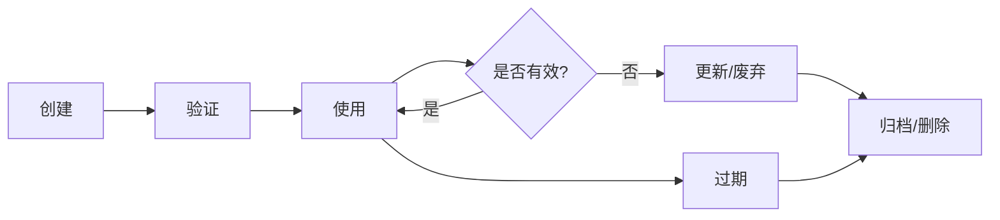

# 知识积累 (Knowledge Accumulation)

让Agent能够持久化存储学到的知识、最佳实践和经验教训，实现跨会话复用。

## 何时使用此技能

使用此技能当：

- 需要存储从任务中学到的知识
- 需要检索相关的历史知识
- 需要更新或修正已有知识
- 需要管理知识库（清理、组织）
- 发现知识缺口需要记录
- 项目特定的编码规范需要记录
- 用户偏好和习惯需要记忆
- 领域知识需要积累

## 核心能力

| 能力 | 描述 |
|------|------|
| 知识提取 | 从对话和任务中提取有价值的知识 |
| 结构化存储 | 以结构化格式存储知识，便于检索 |
| 知识检索 | 根据上下文自动检索相关知识 |
| 知识更新 | 增量更新已有知识，避免冗余 |
| 知识遗忘 | 清理过时或错误的知识 |

## 知识分类体系

### 知识类型

| 类型 | 说明 | 示例 |
|------|------|------|
| lesson | 教训/经验 | 从错误中学到的教训 |
| pattern | 模式/最佳实践 | 代码模式、设计模式 |
| preference | 用户偏好 | 用户的编码风格偏好 |
| fact | 事实/知识点 | 领域知识、技术事实 |
| config | 配置信息 | 项目配置、环境信息 |
| decision | 架构决策 | 重要的技术决策记录 |

### 知识优先级

| 优先级 | 说明 | 存储策略 |
|--------|------|----------|
| critical | 关键知识，必须记住 | 永久存储，高置信度 |
| important | 重要知识，应该记住 | 长期存储，定期验证 |
| normal | 普通知识，可以记住 | 常规存储，按需清理 |
| low | 次要知识，可选记住 | 短期存储，自动过期 |

## 使用方法

### 1. 存储知识

```yaml
# 知识存储请求格式
knowledge_request:
  action: "store"
  
  store:
    # 知识类型
    category: "lesson|pattern|preference|fact|config|decision"
    
    # 知识内容
    title: "知识标题"
    content: "知识内容（详细描述）"
    
    # 上下文信息
    context: "获取上下文（在哪里、为什么学到的）"
    
    # 标签（便于检索）
    tags: ["标签1", "标签2", "标签3"]
    
    # 优先级
    priority: "critical|important|normal|low"
    
    # 置信度（0-1，表示对知识正确性的确信程度）
    confidence: 0.8
    
    # 过期时间（可选，用于时效性知识）
    expires_at: "2024-12-31T23:59:59Z"
    
    # 关联信息
    related_files: ["文件路径1", "文件路径2"]
    related_skills: ["skill1", "skill2"]
    references: ["参考链接1", "参考链接2"]
```

### 2. 检索知识

```yaml
# 知识检索请求格式
knowledge_request:
  action: "retrieve"
  
  retrieve:
    # 查询内容
    query: "查询内容或关键词"
    
    # 当前上下文（帮助理解查询意图）
    context: "当前任务的上下文"
    
    # 过滤条件（可选）
    categories: ["lesson", "pattern"]  # 只检索特定类型
    tags: ["标签1"]  # 只检索特定标签
    priority: "important"  # 只检索特定优先级
    min_confidence: 0.7  # 最低置信度
    
    # 返回结果配置
    max_results: 5  # 最大返回数量
    include_expired: false  # 是否包含过期知识
```

### 3. 更新知识

```yaml
# 知识更新请求格式
knowledge_request:
  action: "update"
  
  update:
    # 知识ID（要更新的知识）
    id: "KNOW-{YYYYMMDD}-{序号}"
    
    # 更新内容
    changes:
      content: "更新后的内容"  # 可选
      confidence: 0.9  # 可选，更新置信度
      tags: ["新标签1", "新标签2"]  # 可选，替换标签
      priority: "important"  # 可选，更新优先级
      
    # 更新原因
    reason: "更新原因说明"
```

### 4. 删除知识

```yaml
# 知识删除请求格式
knowledge_request:
  action: "delete"
  
  delete:
    # 知识ID或查询条件
    id: "KNOW-{YYYYMMDD}-{序号}"  # 按ID删除
    
    # 或按条件批量删除
    query: "查询条件"
    tags: ["过期标签"]
    older_than: "2023-01-01"  # 删除此日期之前的知识
    
    # 删除原因
    reason: "删除原因说明"
```

## 知识存储位置

### 存储层级

```
知识存储
├── 全局知识库（跨项目共享）
│   ├── 通用编程知识
│   ├── 工具使用技巧
│   └── 最佳实践
│
├── 项目知识库（项目特定）
│   ├── 项目配置
│   ├── 编码规范
│   ├── 架构决策
│   └── 领域知识
│
└── 会话知识库（当前会话）
    ├── 临时发现
    ├── 用户偏好
    └── 任务上下文
```

### 存储介质

| 存储方式 | 优点 | 缺点 | 适用场景 |
|----------|------|------|----------|
| MCP Memory System | 跨会话持久化、自动检索 | 依赖外部系统 | 全局知识 |
| 本地文件 `.ai-coder/knowledge/` | 可读性好、可版本控制 | 需要手动管理 | 项目知识 |
| 会话上下文 | 实时、无需存储 | 会话结束后丢失 | 临时知识 |

## 与其他技能的协作

### 协作触发条件

| 触发场景 | 协作技能 | 协作方式 |
|----------|----------|----------|
| 发现知识缺口 | capability-extension | 请求安装新技能获取知识 |
| 知识验证需求 | self-reflection | 反思验证知识正确性 |
| 知识应用需求 | performance-optimization | 应用优化知识提升效率 |

### 协作示例

```markdown
## 存储反思结果

当 self-reflection 技能产生教训时：

1. 接收反思结果：
   ```yaml
   reflection_result:
     lessons_learned:
       - insight: "学到的教训"
         context: "上下文"
         applicable_scenarios: "适用场景"
   ```

2. 转换为知识存储请求：
   ```yaml
   knowledge_request:
     action: "store"
     store:
       category: "lesson"
       content: "学到的教训"
       context: "上下文"
       tags: ["反思", "教训"]
       confidence: 0.8
   ```

3. 执行存储操作

## 发现知识缺口

当检索知识时发现缺少某方面知识：

1. 记录知识缺口：
   ```yaml
   knowledge_gap:
     description: "缺少的知识描述"
     context: "需要的上下文"
     priority: "high"
   ```

2. 请求能力扩展：
   ```yaml
   capability_request:
     action: "identify"
     identify:
       current_task: "当前任务"
       missing_capabilities: ["获取缺失知识的能力"]
       context: "任务上下文"
   ```

3. 调用 capability-extension 技能
```

## 知识检索策略

### 1. 语义检索

根据查询的语义含义进行检索：

```markdown
## 语义检索流程

1. 分析查询意图
2. 提取关键词和概念
3. 在知识库中匹配
4. 计算相关度得分
5. 返回最相关的结果

### 示例
查询: "如何处理空指针异常"
匹配: 
- 空指针检查最佳实践（相关度: 0.95）
- 防御性编程模式（相关度: 0.85）
- 错误处理指南（相关度: 0.75）
```

### 2. 上下文检索

根据当前任务上下文自动检索相关知识：

```markdown
## 上下文检索流程

1. 分析当前任务
2. 识别任务类型和领域
3. 提取关键实体和概念
4. 检索相关领域知识
5. 按相关度排序返回

### 示例
当前任务: "为用户认证模块添加密码重置功能"
自动检索:
- 密码安全最佳实践
- 认证模块设计模式
- 用户认证相关教训
```

### 3. 关联检索

基于知识间的关联关系进行检索：

```markdown
## 关联检索流程

1. 找到当前知识点
2. 分析关联关系
3. 检索关联知识
4. 构建知识图谱
5. 返回关联结果

### 示例
当前知识: "使用Optional避免空指针"
关联知识:
- Java Optional最佳实践
- 空指针异常处理
- 函数式编程模式
```

## 知识库管理

### 知识生命周期



### 知识维护操作

```markdown
## 定期维护任务

### 每日维护
- 清理过期的临时知识
- 验证低置信度知识
- 合并重复知识

### 每周维护
- 检查知识使用频率
- 更新重要知识的置信度
- 清理不再使用的知识

### 每月维护
- 知识库完整性检查
- 知识关联关系维护
- 知识分类调整
```

## 提示模板

### 知识提取提示

使用 `prompts/extract.md` 中的模板从对话中提取知识：

```markdown
# 知识提取提示

请从以下对话中提取有价值的知识：

## 对话内容
{conversation}

请识别并提取：

1. **事实性知识**: 客观事实、技术知识点
2. **模式性知识**: 最佳实践、代码模式
3. **教训性知识**: 从错误中学到的教训
4. **偏好性知识**: 用户偏好、习惯
5. **决策性知识**: 重要决策及其理由

对每条知识，请提供：
- 标题：简短描述
- 内容：详细说明
- 上下文：获取背景
- 标签：便于检索
- 置信度：0-1
```

### 知识组织提示

使用 `prompts/organize.md` 中的模板组织知识：

```markdown
# 知识组织提示

请组织以下知识点：

## 知识列表
{knowledge_list}

请进行：

1. **分类**: 将知识分到合适的类别
2. **去重**: 识别并合并重复知识
3. **关联**: 建立知识间的关联关系
4. **优先级**: 根据重要性设置优先级
5. **标签**: 添加或优化标签

输出组织后的知识结构。
```

### 知识检索提示

使用 `prompts/retrieve.md` 中的模板检索知识：

```markdown
# 知识检索提示

请根据以下查询检索相关知识：

## 查询内容
{query}

## 当前上下文
{context}

请检索并返回：

1. **直接匹配**: 直接相关的知识
2. **语义相关**: 意思相近的知识
3. **上下文相关**: 与当前任务相关的知识
4. **关联知识**: 通过关联关系找到的知识

对每条结果，请说明：
- 匹配原因
- 相关度得分
- 如何应用
```

## 注意事项

1. **知识质量**:
   - 只存储有价值的知识
   - 确保知识准确可靠
   - 标注置信度

2. **知识时效**:
   - 标注知识的时效性
   - 定期验证和更新
   - 及时清理过期知识

3. **知识隐私**:
   - 不存储敏感信息
   - 遵守数据保护规定
   - 用户可以删除知识

4. **知识冗余**:
   - 避免重复存储
   - 定期合并相似知识
   - 保持知识库精简

5. **知识检索**:
   - 提供足够的上下文
   - 使用准确的标签
   - 合理设置返回数量

## 示例用法

### 示例1：存储编码规范

```yaml
knowledge_request:
  action: "store"
  store:
    category: "pattern"
    title: "项目代码命名规范"
    content: |
      ## 命名规范
      
      ### 变量命名
      - 使用camelCase
      - 布尔值使用is/has前缀
      
      ### 函数命名
      - 使用camelCase
      - 动词开头，如getUser, saveData
      
      ### 类命名
      - 使用PascalCase
      - 名词，如UserService, OrderController
    context: "项目团队约定的编码规范"
    tags: ["编码规范", "命名", "最佳实践"]
    priority: "important"
    confidence: 1.0
    related_files: [".eslintrc.js", "README.md"]
```

### 示例2：检索相关知识

```yaml
knowledge_request:
  action: "retrieve"
  retrieve:
    query: "如何处理用户认证"
    context: "正在开发用户登录功能"
    categories: ["pattern", "lesson"]
    max_results: 5
```

### 示例3：更新知识

```yaml
knowledge_request:
  action: "update"
  update:
    id: "KNOW-20240115-001"
    changes:
      content: "更新后的内容，包含新的最佳实践"
      confidence: 0.95
    reason: "发现了更好的实践方法"
```

### 示例4：清理过期知识

```yaml
knowledge_request:
  action: "delete"
  delete:
    query: "旧版本的配置"
    older_than: "2023-01-01"
    reason: "配置已过时，不再适用"