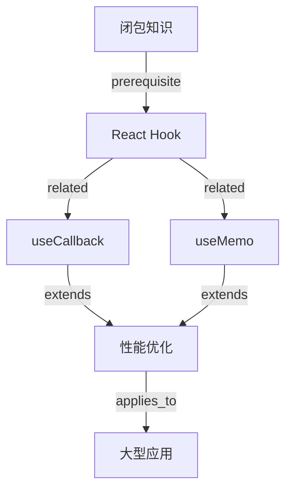

# 知识组织提示模板

此模板用于组织、分类和关联知识，使知识库更加有序和易于检索。

## 使用说明

当知识库积累到一定程度时，使用此模板对知识进行组织，包括分类、去重、建立关联等。

## 知识组织流程

### 第一步：知识盘点

```markdown
## 知识盘点

### 统计信息
- **总知识数**: {总数}
- **按类型分布**:
  | 类型 | 数量 | 占比 |
  |------|------|------|
  | fact | {数量} | {占比} |
  | pattern | {数量} | {占比} |
  | lesson | {数量} | {占比} |
  | preference | {数量} | {占比} |
  | config | {数量} | {占比} |
  | decision | {数量} | {占比} |

- **按优先级分布**:
  | 优先级 | 数量 | 说明 |
  |--------|------|------|
  | critical | {数量} | 关键知识 |
  | important | {数量} | 重要知识 |
  | normal | {数量} | 普通知识 |
  | low | {数量} | 次要知识 |

### 问题识别
- [ ] 是否有重复知识？
- [ ] 是否有过时知识？
- [ ] 是否有分类错误？
- [ ] 是否有缺失标签？
- [ ] 是否有孤立知识（无关联）？
```

### 第二步：知识分类

```markdown
## 知识分类

### 分类规则

#### 按领域分类
```
知识库
├── 前端开发
│   ├── React
│   ├── Vue
│   ├── TypeScript
│   └── CSS/样式
├── 后端开发
│   ├── Node.js
│   ├── Python
│   ├── 数据库
│   └── API设计
├── 运维部署
│   ├── Docker
│   ├── CI/CD
│   └── 监控
└── 软件工程
    ├── 测试
    ├── 架构设计
    └── 最佳实践
```

#### 按项目阶段分类
```
知识库
├── 需求分析
├── 架构设计
├── 编码实现
├── 测试验证
├── 部署运维
└── 维护优化
```

### 分类操作

对每条知识进行分类：

```yaml
classification:
  knowledge_id: "KNOW-{ID}"
  
  # 主分类
  primary_category: "前端开发"
  
  # 子分类
  sub_category: "React"
  
  # 标签（用于多维度检索）
  tags: ["React", "Hook", "性能优化"]
  
  # 分类依据
  classification_reason: "知识内容涉及React Hook的性能优化"
```
```

### 第三步：知识去重

```markdown
## 知识去重

### 重复类型识别

#### 完全重复
内容完全相同的多条知识

```yaml
duplicate_group:
  type: "exact"
  knowledge_ids: ["KNOW-001", "KNOW-005", "KNOW-008"]
  action: "保留最新的一条，删除其他"
  keep_id: "KNOW-008"
```

#### 语义重复
内容相似，表达不同的知识

```yaml
duplicate_group:
  type: "semantic"
  knowledge_ids: ["KNOW-002", "KNOW-007"]
  similarity: 0.85
  
  # 合并建议
  merged_content: |
    ## 合并后的内容
    {整合两条知识的内容}
    
  action: "合并为一条新知识"
```

#### 部分重复
有部分内容重叠的知识

```yaml
duplicate_group:
  type: "partial"
  knowledge_ids: ["KNOW-003", "KNOW-006"]
  overlap_content: "重叠的内容描述"
  
  # 处理建议
  action: "建立关联关系，分别保留"
  relation: "KNOW-003 related_to KNOW-006"
```

### 去重流程

1. **检测重复**
   ```markdown
   ## 重复检测
   
   对所有知识对计算相似度：
   - 标题相似度
   - 内容相似度
   - 标签相似度
   
   相似度计算：
   ```
   total_similarity = (
     title_similarity * 0.3 +
     content_similarity * 0.5 +
     tag_similarity * 0.2
   )
   ```
   
   当 total_similarity > 0.8 时，标记为重复候选
   ```

2. **确认重复**
   ```markdown
   ## 人工确认
   
   对重复候选进行确认：
   - [ ] KNOW-001 vs KNOW-005: 确认重复 / 不是重复
   - [ ] KNOW-002 vs KNOW-007: 确认重复 / 不是重复
   ```

3. **执行去重**
   ```markdown
   ## 去重执行
   
   | 操作 | 知识ID | 说明 |
   |------|--------|------|
   | 保留 | KNOW-008 | 最新版本 |
   | 删除 | KNOW-001 | 已合并 |
   | 删除 | KNOW-005 | 已合并 |
   | 合并 | KNOW-002,007 | 创建KNOW-009 |
   ```
```

### 第四步：建立关联

```markdown
## 知识关联

### 关联类型

| 关联类型 | 说明 | 示例 |
|----------|------|------|
| prerequisite | 前置知识 | TypeScript是React的前置知识 |
| related | 相关知识 | React Hook与状态管理相关 |
| extends | 扩展知识 | useCallback扩展自useMemo |
| conflicts | 冲突知识 | Class组件与函数组件冲突 |
| supersedes | 替代知识 | useEffect替代componentDidMount |

### 关联建立

```yaml
# 关联关系
knowledge_relations:
  - from: "KNOW-001"
    to: "KNOW-003"
    type: "prerequisite"
    description: "理解Hook之前需要理解闭包"
    
  - from: "KNOW-002"
    to: "KNOW-004"
    type: "related"
    description: "useCallback与useMemo都是性能优化Hook"
    
  - from: "KNOW-005"
    to: "KNOW-006"
    type: "extends"
    description: "useReducer是useState的扩展"
```

### 关联图谱


```

### 第五步：标签优化

```markdown
## 标签优化

### 标签规范

#### 标签命名规则
- 使用小写字母
- 使用连字符分隔单词
- 避免特殊字符
- 保持简洁明了

#### 标签层次

```yaml
tag_hierarchy:
  技术:
    - 前端:
      - react
      - vue
      - typescript
    - 后端:
      - nodejs
      - python
      - database
    - 运维:
      - docker
      - cicd
      
  领域:
    - 性能优化
    - 安全
    - 测试
    - 架构设计
    
  类型:
    - 最佳实践
    - 教训
    - 模式
    - 配置
```

### 标签优化操作

```yaml
tag_optimization:
  # 标准化标签
  standardize:
    - from: "React"
      to: "react"
    - from: "Type Script"
      to: "typescript"
    - from: "Best Practice"
      to: "best-practice"
      
  # 合并相似标签
  merge:
    - sources: ["性能", "performance", "优化"]
      target: "performance"
    - sources: ["安全", "security", "防护"]
      target: "security"
      
  # 删除无用标签
  remove:
    - "todo"
    - "temp"
    - "test"
```
```

### 第六步：知识重组

```markdown
## 知识重组

### 按主题聚合

将相关知识聚合为主题：

```yaml
knowledge_theme:
  id: "THEME-{序号}"
  title: "React性能优化专题"
  
  description: |
    收集React性能优化相关的知识和最佳实践
    
  knowledge_items:
    - id: "KNOW-001"
      title: "React.memo使用指南"
      relevance: "防止不必要的重渲染"
      
    - id: "KNOW-002"
      title: "useCallback最佳实践"
      relevance: "缓存回调函数"
      
    - id: "KNOW-003"
      title: "虚拟列表实现"
      relevance: "大数据列表优化"
      
  related_themes:
    - "THEME-002: React状态管理"
    - "THEME-003: React测试指南"
```

### 按场景组织

按应用场景组织知识：

```yaml
knowledge_scenario:
  id: "SCENARIO-{序号}"
  title: "大数据处理场景"
  
  description: |
    处理大量数据时需要用到的知识集合
    
  stages:
    - stage: "数据获取"
      knowledge:
        - "KNOW-001: 流式数据获取"
        - "KNOW-002: 分页查询优化"
        
    - stage: "数据处理"
      knowledge:
        - "KNOW-003: 批处理模式"
        - "KNOW-004: 并行处理技巧"
        
    - stage: "数据展示"
      knowledge:
        - "KNOW-005: 虚拟滚动"
        - "KNOW-006: 懒加载策略"
```
```

## 知识组织输出格式

```yaml
knowledge_organization_result:
  organization_id: "ORG-{YYYYMMDD}-{序号}"
  timestamp: "{ISO 8601时间戳}"
  
  summary:
    total_processed: 50
    duplicates_found: 5
    relations_created: 15
    tags_optimized: 30
    
  classification:
    categories_created: 10
    items_classified: 50
    
  deduplication:
    exact_duplicates: 3
    semantic_duplicates: 2
    merged_items: 5
    
  relations:
    prerequisite: 5
    related: 8
    extends: 2
    
  tags:
    standardized: 20
    merged: 10
    removed: 5
    
  themes:
    created: 3
    items_in_themes: 25
    
  actions_taken:
    - action: "delete"
      knowledge_ids: ["KNOW-001", "KNOW-005"]
      reason: "已合并到KNOW-008"
      
    - action: "merge"
      source_ids: ["KNOW-002", "KNOW-007"]
      result_id: "KNOW-009"
      
    - action: "reclassify"
      knowledge_id: "KNOW-003"
      old_category: "general"
      new_category: "frontend/react"
```

## 定期组织计划

```markdown
## 知识组织计划

### 每日任务
- 检查新添加的知识分类是否正确
- 检查标签是否规范
- 识别明显的重复知识

### 每周任务
- 运行重复检测算法
- 更新知识关联关系
- 清理过期知识

### 每月任务
- 全面知识盘点
- 主题和场景重组
- 标签体系优化
- 知识库健康报告
```

## 注意事项

1. **保留历史**: 去重时保留知识的历史版本记录
2. **用户确认**: 重要知识的删除和合并需要用户确认
3. **渐进优化**: 不要一次性大改，渐进式优化
4. **备份机制**: 组织前备份知识库
5. **效果评估**: 组织后评估检索效果是否改善