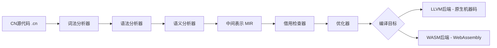

# CN 语言设计规格书

> **版本**: v0.1-draft  
> **日期**: 2026-07-08  
> **状态**: 待审批

---

## 一、设计决策汇总

| 维度 | 选择 | 参考语言 |
|------|------|----------|
| 语言定位 | **全栈语言** — 从系统到Web全覆盖 | Rust, Nim |
| 内存管理 | **所有权系统** — 编译期检查所有权、借用、生命周期 | Rust |
| 类型系统 | **静态强类型+类型推断+完整泛型** | Rust |
| 并发模型 | **所有权+借用+生命周期** — 编译期并发安全，Send/Sync | Rust |
| 中文语法 | **全中文关键字+完全支持中文标识符** — 最彻底中文化 | 原创 |
| 编译目标 | **LLVM后端+WASM目标** — 原生+Web全栈 | Rust |
| FFI策略 | **不需要FFI** — 自建生态，纯净独立 | 原创 |
| 错误处理 | **结果类型+?运算符** — 类型系统表达可恢复错误，无try/catch | Rust |
| 编程范式 | **多范式（函数式+命令式）** — 灵活选择 | Rust |
| 元编程 | **宏系统** — 声明宏+过程宏 | Rust |
| 包管理 | **内置包管理器** — 类似cargo | Rust/Cargo |

---

## 二、核心设计理念

### 2.1 一句话定位

> **CN是一门全栈中文编程语言，以所有权系统保证内存安全和并发安全，以全中文语法降低中文使用者的编程门槛，以LLVM+WASM实现从系统到Web的全场景覆盖。**

### 2.2 设计原则

1. **安全第一** — 编译期消除内存错误和数据竞争
2. **中文优先** — 全中文关键字和标识符，用中文思考编程
3. **零成本抽象** — 高级特性不引入运行时开销
4. **全栈覆盖** — 一门语言，系统/服务端/Web/嵌入式通吃
5. **生态独立** — 自建标准库和包生态，不依赖外部语言生态

---

## 三、语法设计草案

### 3.1 中文关键字映射表

| 类别 | Rust关键字 | CN关键字 | 说明 |
|------|-----------|---------|------|
| 声明 | `fn` | `函数` | 函数定义 |
| 声明 | `const` | `常量` | 常量 |
| 声明 | `static` | `静态` | 静态变量/静态生命周期（不再用于静态方法，改用关联函数） |
| 声明 | `type` | `类型` | 类型别名 |
| 声明 | `struct` | `结构` | 结构体 |
| 声明 | `enum` | `枚举` | 枚举 |
| 声明 | `trait` | `特征` | 特征/trait |
| 声明 | `impl` | `实现` | 实现 |
| 声明 | `mod` | `模块` | 模块 |
| 声明 | `crate` | `包` | 包/crate |
| 声明 | `macro` | `宏` | 宏定义 |
| 绑定 | `let` | `让` | 变量绑定 |
| 绑定 | `let mut` | `让 可变` | 可变绑定 |
| 控制流 | `if` | `如果` | 条件判断 |
| 控制流 | `else` | `否则` | 否则分支 |
| 控制流 | `else if` | `否则 如果` | 否则如果 |
| 控制流 | `match` | `匹配` | 模式匹配 |
| 控制流 | `loop` | `循环` | 无限循环 |
| 控制流 | `while` | `当` | 条件循环 |
| 控制流 | `for` | `对于` | 迭代循环 |
| 控制流 | `in` | `在` | 迭代范围 |
| 控制流 | `return` | `返回` | 函数返回 |
| 控制流 | `break` | `跳出` | 跳出循环 |
| 控制流 | `continue` | `继续` | 继续循环 |
| 类型 | `i8/i16/i32/i64/i128` | `整8/整16/整32/整64/整128` | 有符号整数类型 |
| 类型 | `u8/u16/u32/u64/u128` | `正8/正16/正32/正64/正128` | 无符号整数类型 |
| 类型 | `f32/f64` | `浮32/浮64` | 浮点数类型 |
| 类型 | `bool` | `布尔` | 布尔类型 |
| 类型 | `char` | `字符` | Unicode字符类型 |
| 类型 | `str` | `文` | 字符串切片类型 |
| 类型 | `String` | `字符串` | 堆分配字符串类型 |
| 类型构造 | `Vec<T>` | `列表<T>` | 动态数组 |
| 类型构造 | `HashMap<K,V>` | `字典<K,V>` | 哈希映射 |
| 类型构造 | `HashSet<T>` | `集合<T>` | 哈希集合 |
| 类型构造 | `Option<T>` | `可选<T>` | 可选值 |
| 类型构造 | `Result<T,E>` | `结果<T,E>` | 结果类型 |
| 类型构造 | `Box<T>` | `盒子<T>` | 堆分配 |
| 类型构造 | `Rc<T>` | `共享<T>` | 引用计数 |
| 类型构造 | `Arc<T>` | `原子共享<T>` | 原子引用计数 |
| 引用 | `ref` | `引用` | 引用绑定 |
| 引用 | `move` | `移动` | 移动语义 |
| 引用 | `self` | `自身` | 自身引用 |
| 引用 | `Self` | `本类型` | 类型自身 |
| 引用 | `super` | `父级` | 父模块 |
| 泛型 | _(泛型参数前缀)_ | `泛型` | 泛型参数声明（如 `<泛型 T>`） |
| 泛型 | `where` | `其中` | 约束子句 |
| 泛型 | `as` | `作为` | 类型转换 |
| 泛型 | `dyn` | `动态` | 动态分发 |
| 可见性 | `pub` | `公开` | 可见性-公开 |
| 可见性 | `priv` | `私有` | 可见性-私有 |
| 异步 | `async` | `异步` | 异步 |
| 异步 | `await` | `等待` | 等待异步结果 |
| 异步 | `gen` | `生成` | 生成器 |
| 导入 | `use` | `使用` | 使用声明 |
| 导入 | `import` | `导入` | 导入声明（与`使用`区分） |
| 布尔 | `true` | `真` | 布尔真 |
| 布尔 | `false` | `假` | 布尔假 |
| 特殊 | `todo!/unimplemented!` | `未实现` | 未实现标记 |
| 特殊 | `undefined` | `未定义` | 未定义标记 |
| 特殊 | `unsafe` | `不安全` | 不安全代码块 |

### 3.2 中文类型名称映射

| Rust类型 | CN类型 | 说明 |
|---------|--------|------|
| `i8/i16/i32/i64/i128` | `整8/整16/整32/整64/整128` | 有符号整数 |
| `u8/u16/u32/u64/u128` | `正8/正16/正32/正64/正128` | 无符号整数 |
| `f32/f64` | `浮32/浮64` | 浮点数 |
| `bool` | `布尔` | 布尔类型 |
| `char` | `字符` | Unicode字符 |
| `str` | `文` | 字符串切片 |
| `String` | `字符串` | 堆分配字符串 |
| `Vec<T>` | `列表<T>` | 动态数组 |
| `HashMap<K,V>` | `字典<K,V>` | 哈希映射 |
| `HashSet<T>` | `集合<T>` | 哈希集合 |
| `Option<T>` | `可选<T>` | 可选值 |
| `Result<T,E>` | `结果<T,E>` | 结果类型 |
| `Box<T>` | `盒子<T>` | 堆分配 |
| `Rc<T>` | `共享<T>` | 引用计数 |
| `Arc<T>` | `原子共享<T>` | 原子引用计数 |

### 3.3 代码示例

#### Hello World

```cn
函数 主() {
    打印行!("你好，世界！");
}
```

#### 所有权与借用

```cn
函数 示例() {
    让 s1 = 字符串::从("你好");
    让 s2 = s1;           // s1 的所有权移动到 s2
    // 打印行!(s1);       // 错误：s1 已失效

    让 可变 s3 = 字符串::从("世界");
    让 s3引用 = &可变 s3;   // 可变借用（"引用"是关键字，不能做变量名）
    s3引用.推入字符('！');
    // s3 在借用期间不可使用

    打印行!("{}", s3);     // 借用结束后可使用
}
```

#### 结构体与特征

```cn
结构 矩形 {
    浮64 宽度,
    浮64 高度,
}

实现 矩形 {
    函数 新(浮64 宽度, 浮64 高度) -> 自身 {
        自身 { 宽度: 宽度, 高度: 高度 }
    }

    函数 面积(&自身) -> 浮64 {
        自身.宽度 * 自身.高度
    }
}

特征 描述 {
    函数 描述(&自身) -> 字符串;
}

实现 描述 对于 矩形 {
    函数 描述(&自身) -> 字符串 {
        格式化!("矩形 {}x{}", 自身.宽度, 自身.高度)
    }
}
```

#### 枚举与模式匹配

```cn
枚举 形状 {
    圆形(浮64),
    矩形(浮64, 浮64),
    三角形(浮64, 浮64, 浮64),
}

函数 计算面积(&形状 s) -> 浮64 {
    匹配 s {
        形状::圆形(半径) => 3.14159 * 半径 * 半径,
        形状::矩形(宽, 高) => 宽 * 高,
        形状::三角形(底, 高, _) => 0.5 * 底 * 高,
    }
}
```

#### 泛型与约束

```cn
函数 最大值<泛型 T>(T a, T b) -> T
    其中 T: 偏序特征
{
    如果 a >= b { a } 否则 { b }
}

结构 容器<泛型 T> {
    T 值,
}

实现<泛型 T> 容器<T> {
    函数 新(T 值) -> 自身 {
        自身 { 值: 值 }
    }

    函数 获取(&自身) -> &T {
        &自身.值
    }
}
```

#### 错误处理

```cn
函数 读取配置(&文 路径) -> 结果<配置, 错误> {
    让 内容 = 文件系统::读取到字符串(路径)?;
    让 配置 = 解析配置(&内容)?;
    返回 正常(配置);
}

函数 主() {
    匹配 读取配置("配置.cn") {
        正常(配置) => 打印行!("配置加载成功: {:?}", 配置),
        异常(错误) => 打印行!("配置加载失败: {}", 错误),
    }
}
```

#### 并发与异步

```cn
异步 函数 获取数据(&文 网址) -> 结果<字符串, 网络错误> {
    让 响应 = 网络::获取(网址).等待?;
    让 内容 = 响应.读取文本().等待?;
    返回 正常(内容);
}

异步 函数 主() {
    让 任务1 = 生成 异步 获取数据("https://示例.cn/数据1");
    让 任务2 = 生成 异步 获取数据("https://示例.cn/数据2");
    让 (结果1, 结果2) = 加入!(任务1, 任务2).等待;
    打印行!("结果1: {:?}, 结果2: {:?}", 结果1, 结果2);
}
```

#### 宏

```cn
// 声明宏
宏 创建获取器!($结构名:标识, $字段:标识, $类型:类型) {
    实现 $结构名 {
        公开 函数 获取_$字段(&自身) -> &$类型 {
            &自身.$字段
        }
    }
}

结构 用户 {
    字符串 姓名,
    整32 年龄,
}

创建获取器!(用户, 姓名, 字符串);
创建获取器!(用户, 年龄, 整32);

// 过程宏 - 派生
#[派生(调试, 克隆, 描述)]
结构 点 {
    浮64 x,
    浮64 y,
}
```

---

## 四、编译器架构概览

### 4.1 编译流水线



### 4.2 编译器模块划分

| 模块 | 职责 | 说明 |
|------|------|------|
| 词法分析器 | 源码转Token流 | 支持中文关键字和标识符的UTF-8分词 |
| 语法分析器 | Token流转AST | 递归下降解析器，生成抽象语法树 |
| 语义分析器 | AST转HIR | 类型检查、名称解析、泛型单态化准备 |
| 中间表示 | HIR转MIR | 降低为更适合分析的中间表示 |
| 借用检查器 | MIR验证 | 所有权、借用、生命周期检查 |
| 单态化 | MIR转具体MIR | 泛型实例化 |
| 优化器 | MIR优化 | 死代码消除、内联、常量折叠等 |
| LLVM代码生成 | MIR转LLVM IR | 生成LLVM中间表示 |
| WASM代码生成 | MIR转Wasm | 生成WebAssembly字节码 |

---

## 五、标准库与包管理器

> 详见 [CN语言标准库与包管理器设计.md](CN语言标准库与包管理器设计.md)

---

## 六、关键挑战与风险

> 详见 [CN语言挑战与风险分析.md](CN语言挑战与风险分析.md)

---

## 七、开发路线图

> 详见 [CN语言开发路线图.md](CN语言开发路线图.md)