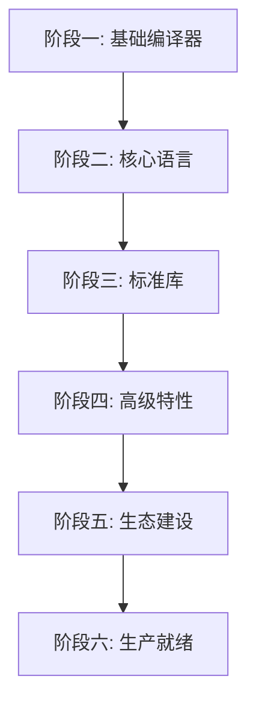

# CN 语言开发路线图

> **关联文档**: [CN语言设计规格书.md](CN语言设计规格书.md)

---

## 阶段总览

---

## 阶段一：基础编译器

**目标**: 能编译运行Hello World

- [X] 项目初始化 — Rust项目结构、构建配置
- [X] 词法分析器 — UTF-8中文分词、Token定义
- [X] 语法分析器 — 递归下降解析器、AST定义
- [X] 基础类型系统 — 整8~整128、正8~正128、浮32/浮64、布尔、字符
- [X] 简单代码生成 — 临时用Cranelift或直接生成LLVM IR
- [X] 基础运行时 — 最小运行时，支持打印输出
- [X] 里程碑: Hello World可运行

## 阶段二：核心语言

**目标**: 支持基本语言特性，可编写简单程序

- [X] 变量绑定与类型推断 — 让/让 可变、局部类型推断
- [X] 函数定义与调用 — 函数、参数、返回值
- [X] 控制流 — 如果/否则/匹配/当/对于/循环
- [X] 结构体 — 结构定义、字段访问、方法
- [X] 枚举 — 枚举定义、变体、模式匹配
- [X] 所有权基础 — 移动语义、克隆
- [X] 借用基础 — 不可变借用、可变借用、基本规则检查
- [X] 字符串系统 — 文/字符串类型、UTF-8处理
- [X] 数组与切片 — 固定数组、切片操作
- [X] 里程碑: 可编写基本算法和数据结构

## 阶段三：标准库

**目标**: 核心标准库可用，支持实际开发

- [x] 核心库:基础 — 可选✅/结果✅/迭代器✅/克隆✅/哈希✅/默认✅/复制✅/调试❌（Display已实现，Debug未实现） ✅ 已完善（2026-07-21）
- [x] 核心库:智能指针 — 盒子✅/共享✅/原子共享✅ ✅ 已完善（2026-07-23 E2E验证通过）
- [x] 核心库:标记 — 复制✅+大小✅已完成，发送/同步延后到阶段四（需多线程运行时） ✅ 已完善（2026-07-23）
- [x] 标准库:集合 — 列表✅(7方法)/字典✅(7方法)/集合✅(5方法) ✅ 已完善（2026-07-21）
- [x] 标准库:输入输出 — 16个IO函数✅ / 读写流trait✅（读流+写流，2026-07-23 E2E验证通过） ✅ 已完善（2026-07-23）
- [x] 标准库:文件系统 — 文件和目录操作 ✅ 已完善（2026-07-22）— 16个IO函数（文件打开/关闭/读取行/写入/存在/删除/重命名/复制/大小 + 目录创建/删除/列表/存在/当前目录/切换目录 + 标准输入/标准错误）
- [x] 标准库:字符串处理 — 17个包装函数✅ + 格式化()函数✅（{}占位符格式化） ✅ 已完善（2026-07-21）
- [x] 包管理器货舱 — 基础版，支持依赖管理 ✅ 已完整实现（6个源码文件+22个单元测试，E2E验证通过 2026-07-23）
- [x] 里程碑: 可开发命令行工具 ✅ 已完成（2026-07-22）— 文件统计工具（10个子命令：行数/字符数/大小/信息/复制/重命名/删除/存在/帮助/用法）

## 阶段四：高级特性

**目标**: 支持Rust级高级特性

- [x] 泛型系统 — 泛型函数、泛型结构体、泛型特征 ✅ 阶段三已完成
- [x] 特征系统 — 特征定义、实现、约束、默认方法 ✅ 阶段三已完成
- [x] 生命周期 — 显式标注、基本推断 ✅ 阶段四第一批已完成（2026-07-25 E2E验证通过）
- [x] 借用检查器NLL — 非词法生命周期 ✅ 阶段四第一批已完成（2026-07-25 E2E验证通过）
- [x] 声明宏 — 宏规则风格宏 ✅ 阶段四第二批已完成（2026-07-25 E2E验证通过）
- [x] 异步/等待 — 异步/等待基础支持 ✅ 阶段四第三批已完成（2026-07-25 E2E验证通过）
- [x] 并发原语 — 线程、互斥锁、原子操作 ✅ 阶段四第三批已完成（2026-07-25 E2E验证通过）
- [x] WASM目标 — WebAssembly编译支持 ✅ 阶段四第四批已完成（2026-07-25 E2E验证通过）→ ✅ LLVM后端已解决Cranelift wasm32限制（2026-07-26）
- [x] 里程碑: 可开发并发Web服务 ✅ 阶段四全部完成（2026-07-25 E2E验证通过）

## 阶段五：生态建设

**目标**: 建立开发者生态

- [x] LLVM后端 — 替换Cranelift，支持WASM/优化/调试信息/交叉编译 ✅ 已完成（2026-07-26 全部6批E2E通过）
- [x] 过程宏 — derive/attribute宏 ✅ 已完成（2026-08-01 枚举派生+相等/偏序派生+属性宏框架）
- [x] 标准库:网络 — TCP/UDP/HTTP ✅ 阶段五第二批已完成（2026-07-30 E2E验证通过）
- [x] 标准库:异步运行时 — 完整异步运行时 ✅ 已完成（2026-08-01 E2E验证通过）— 协作式异步运行时（8个内置函数），支持异步块/await/spawn/yield/睡眠/任务计数，Cranelift+LLVM双后端验证通过
- [x] 标准库:编码 — JSON/序列化/反序列化 ✅ 已完成（2026-07-30 E2E验证通过）— JSON解析器/序列化器/值操作（19个内置函数），支持解析/创建/序列化/对象操作/数组操作
- [x] 中文特色库 — 拼音/分词/编码转换/历法 ✅ 已完成（2026-07-30 E2E验证通过）— 拼音转换/农历转换/中文数字转换（10个内置函数），拼音首字母/天干地支/数字转中文
- [x] LSP服务器 — 编辑器集成、自动补全、错误提示 ✅ 已完成（2026-08-01）— 基于tower-lsp实现LSP服务器（cn-lsp crate），支持诊断信息/自动补全/跳转定义/悬停提示/文档符号，85个单元测试通过，VSCode扩展（TextMate语法高亮+LSP客户端）
- [x] IDE插件 — VSCode扩展 ✅ 已完成（2026-08-02）— 增强VSCode扩展（v0.2.0），新增编译/运行命令、状态栏（LSP状态+后端切换）、10个代码片段、编译器配置项（路径/后端/优化级别/标准库路径）、右键菜单和编辑器标题栏按钮，打包生成cn-language-0.2.0.vsix
- [x] 包仓库货站 — 在线包仓库 ✅ 已完成（2026-08-02）— 客户端（semver解析/缓存管理/API客户端/依赖解析/CLI命令）+ 服务端（Axum+SQLite+REST API），87个单元测试+7个E2E测试全部通过
- [x] 文档系统 — 自动文档生成 ✅ 已完成（2026-08-03）— cn-docgen crate（model/extractor/parser/renderer/templates），标准库16个文件注释迁移///，cn-cargo doc子命令，23个测试+8个E2E全部通过
- [x] 示例项目 — 围棋对战与教学游戏 ✅ 已完成（2026-07-26）— 命令行围棋游戏（规则引擎/提子/劫争/简单AI/MCTS/棋谱/教学模式），验证LLVM后端在实际项目中的稳定性
- [x] 里程碑: 社区可贡献第三方包 ✅ 已完成（2026-08-04）— 7个种子包（日志/路径/环境/进程/双端队列/缓冲IO/正则），4个C运行时函数集（23个内置函数），真实发布流程验证通过，社区贡献指南（包开发指南/发布指南/命名规范）

## 阶段六：生产就绪

**目标**: 可用于生产环境

- [x] 编译优化 — 增量编译、并行编译 ✅ 已完成（2026-08-05）— 7个阶段全部完成：AST/HIR serde序列化、AstCache文件级缓存、ModuleDepGraph模块依赖图、IncrementalContext增量编译集成、rayon并行词法/语法分析、函数级并行LLVM IR生成、CLI集成与优化（--timing/--cache-stats/--jobs/--parallel-codegen）
- [x] 错误信息优化 — 中文错误信息、错误恢复 ✅ 已完成（2026-08-05）— 7个阶段全部完成：类型友好显示(HirTy Display)、Token友好显示(TokenKind Display)、统一错误格式(CompileError+ErrorPhase+From转换)、源码上下文显示(render_error/render_errors)、Parser错误恢复(同步Token+recover_to_sync_point)、多错误收集(驱动程序集成)、修复建议(10种建议规则+Levenshtein编辑距离匹配)
- [x] 性能基准 — 与Rust/C/Go性能对比 ✅ 已完成（2026-08-05）— 6个算法（斐波那契递归/阶乘循环/素数筛法/矩阵乘法/字符串拼接/冒泡排序）×5种编译目标（CN O0/CN O2/Rust/C/Go）= 30个基准测试，自动化脚本run_benchmarks.py，CN O2优化后在斐波那契递归上达到Rust 95%性能
- [x] 安全审计 — 编译器安全审查 ✅ 已完成（2026-08-06）— 7个阶段全部完成：认证安全加固(argon2+OsRng)、命令注入防护(fork+execvp)、C运行时内存安全(malloc NULL检查+整数溢出防护)、路径遍历防护(缓存键哈希+tar解压校验)、XSS防护(HTML转义)、健壮性加固(递归深度限制+unwrap替换)
- [x] 稳定性保证 — 向后兼容承诺 ✅ 已完成（2026-08-06）— 向后兼容政策文档(7章节)、版本规范文档(6章节)、编译器--version选项
- [x] 完整文档 — 语言参考、标准库文档、教程 ✅ 已完成（2026-08-06）— 语言参考手册(13章+3附录)、标准库参考(23个模块API文档)、入门教程(10章)
- [x] 示例项目 — Web服务、CLI工具、系统工具 ✅ 已完成（2026-08-06）— 3个完整示例项目：Web服务（TCP HTTP服务器，路由分发，JSON响应）、CLI工具（文件统计/查找/帮助子命令，日志记录）、系统工具（系统信息/进程管理/路径操作/正则匹配/双端队列），全部编译通过并运行验证
- [x] 里程碑: v1.0正式发布 ✅ 已完成（2026-08-06）— 发布说明文档、路线图全部标记完成、最终验证通过

---

## v1.1 核心能力补全（2026-08-06）

**目标**: 补齐v1.0已知限制中影响实际开发的关键缺口

- [x] 多线程运行时 — Send/Sync标记特征、线程模块、同步原语、原子操作 ✅ 已完成（2026-08-06）— 3个标准库模块（线程/同步/原子）、36个内置函数、7项E2E测试通过
- [x] Debug特征完善 — {:?}格式化占位符 ✅ 已完成（2026-08-06）— LLVM和Cranelift双后端支持、6项E2E测试通过
- [x] 包管理器高级特性 — 工作空间/条件编译/特性开关 ✅ 已完成（2026-08-06）— #[配置]属性解析、CfgContext求值、workspace多包构建、97个单元测试通过
- [x] LSP高级特性 — 代码重构/内联提示/调用层次 ✅ 已完成（2026-08-06）— 6个新文件（符号索引/调用图/重命名/代码操作/内联提示/调用层次）、4个ServerCapabilities、7个LanguageServer方法
- [x] 交叉编译目标扩展 — Linux/macOS/ARM目标 ✅ 已完成（2026-08-06）— Target::Triple变体、TargetInfo、--linker选项、6项E2E测试通过

---

## v1.2.0-alpha.1 FFI基础设施（2026-08-07）

**目标**: 为编译器自举（v2.0）补齐FFI前置条件，实现extern语法、裸指针类型、unsafe块/函数、空类型

- [x] Lexer层 — TokenKind::Extern和TokenKind::Void关键字 ✅ 已完成（2026-08-07）— 新增"外部"和"空"两个FFI关键字
- [x] Parser层 — AST节点（Ty::RawPtr/Ty::Void/Expr::UnsafeBlock/Item::Extern/ExternBlock/ExternFn/FnItem.is_unsafe） ✅ 已完成（2026-08-07）— extern块解析、裸指针类型解析、unsafe块/函数解析
- [x] HIR层 — HirTy::RawPtr/HirTy::Void/HirExpr::UnsafeBlock/HirItem::Extern/HirExternBlock/HirExternFn/HirFn.is_unsafe/HirProgram.extern_blocks ✅ 已完成（2026-08-07）— HIR降级支持extern块和unsafe块
- [x] Typeck层 — 裸指针类型检查、unsafe块类型检查、extern函数签名注册 ✅ 已完成（2026-08-07）— 类型系统支持裸指针和void返回类型
- [x] Codegen层 — 裸指针LLVM类型映射、extern函数声明生成、unsafe块代码生成 ✅ 已完成（2026-08-07）— LLVM代码生成器支持FFI调用
- [x] E2E测试 — 4项FFI测试全部通过 ✅ 已完成（2026-08-07）— test_ffi_basic(abs调用输出42)、test_ffi_unsafe_fn(unsafe函数输出42)、test_ffi_raw_ptr(malloc/free调用输出"内存分配释放成功")、test_ffi_void_return(void返回类型输出"void返回类型测试")
- [x] FFI导出方向 — `#[导出("C")]`属性 + `cnc --crate-type cdylib`动态库编译 ✅ 已完成（2026-08-09）— 从HIR导出标记→类型检查FFI兼容性→代码生成原始名+External链接→DLL符号导出（MSVC /EXPORT）→C程序调用验证全流程通过（详见047-阶段1B-FFI导出功能架构设计方案）
- [x] 自举阶段1：CN词法分析器 ✅ 已完成（2026-08-09）— 阶段1A词法器核心模块（13个CN文件约2534行）+ 阶段1B FFI桥接与E2E验证（4个测试全部通过：e2e_compare_fn_def / e2e_compare_fn_params / e2e_compare_operators / e2e_multi_call_no_crash），编译为target/cn_lexer.dll集成到Rust编译器（详见047-阶段1-CN词法分析器架构设计）

---

## 技术栈选择

| 组件 | 技术选择 | 说明 |
|------|----------|------|
| 编译器宿主语言 | Rust | 自举前用Rust编写编译器 |
| 词法分析 | 手写词法分析器 | 支持UTF-8中文分词 |
| 语法分析 | 递归下降+Pratt解析 | 表达式用Pratt，其余递归下降 |
| 中间表示 | 自定义MIR | 参考Rust MIR设计 |
| 代码生成 | inkwell crate | Rust的LLVM绑定 |
| WASM生成 | wasm-rs或直接生成 | 通过LLVM或直接生成WASM |
| 包管理器 | Rust编写 | 内置工具链 |
| LSP服务器 | Rust + tower-lsp | 编辑器协议支持 |
