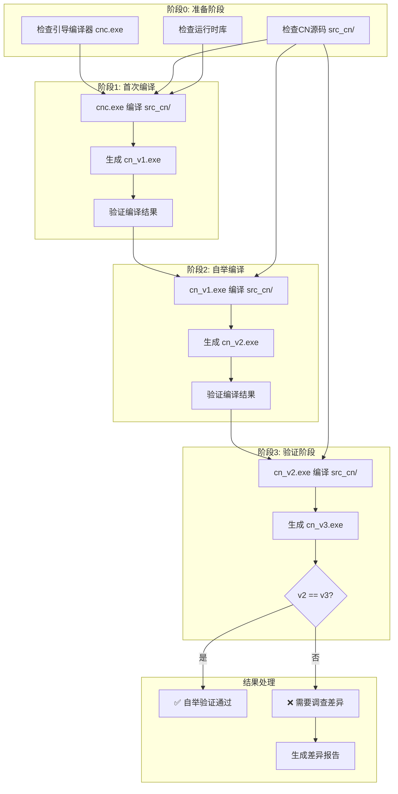

# 执行单元 10：引导流程模块

> **执行状态**: ⏳ 待执行
> **预估Token**: 输入 ~40k / 输出 ~60k / 总计 ~100k
> **执行顺序**: 第10个执行（阶段四：集成验证）

---

## 1. 任务概述

### 1.1 任务目标

实现CN语言自托管编译器的完整引导流程，包括三阶段自举验证和发布准备。

### 1.2 功能要求

| 功能项 | 说明 | 优先级 |
|--------|------|--------|
| 引导脚本 | 自动化引导流程 | ⭐⭐⭐ 高 |
| 三阶段验证 | 自举验证流程 | ⭐⭐⭐ 高 |
| 差异分析 | 编译结果差异分析 | ⭐⭐ 中 |
| 发布准备 | 发布包构建 | ⭐⭐ 中 |
| 回退机制 | 失败时回退 | ⭐⭐ 中 |

### 1.3 验收标准

- [ ] 引导流程能够自动完成三阶段编译
- [ ] 自举验证能够检测编译器正确性
- [ ] 差异分析能够定位问题
- [ ] 发布包能够正常构建

---

## 2. 上下文文件清单

### 2.1 设计文档（必读）

| 文件路径 | 说明 | 预估Token |
|---------|------|----------|
| `plans/014 CN语言自托管编译器技术设计文档.md` | 主设计文档（第4节技术方案、第8节风险与缓解） | ~10k |

### 2.2 C实现源码（参考）

| 文件路径 | 说明 | 预估Token |
|---------|------|----------|
| `src/cli/cnc/main.c` | 编译器主程序 | ~5k |

### 2.3 构建脚本（参考）

| 文件路径 | 说明 | 预估Token |
|---------|------|----------|
| `CMakeLists.txt` | CMake配置 | ~5k |

**输入Token总计**: ~20k

---

## 3. 详细任务描述

### 3.1 引导流程设计



### 3.2 引导脚本实现

```bash
#!/bin/bash
# bootstrap.sh - CN语言自托管引导脚本

set -e

# 配置
BUILD_DIR="./build"
SRC_CN="./src_cn"
CNC_BOOTSTRAP="$BUILD_DIR/src/cnc.exe"
CN_V1="$BUILD_DIR/cn_v1.exe"
CN_V2="$BUILD_DIR/cn_v2.exe"
CN_V3="$BUILD_DIR/cn_v3.exe"
LOG_DIR="$BUILD_DIR/logs"

# 颜色输出
RED='\033[0;31m'
GREEN='\033[0;32m'
YELLOW='\033[1;33m'
NC='\033[0m' # No Color

echo "========================================"
echo "  CN语言自托管编译器引导流程"
echo "========================================"
echo ""

# 创建日志目录
mkdir -p $LOG_DIR

# 阶段0: 准备阶段
echo -e "${YELLOW}[阶段0] 检查环境...${NC}"

# 检查引导编译器
if [ ! -f "$CNC_BOOTSTRAP" ]; then
    echo -e "${RED}错误: 未找到引导编译器 $CNC_BOOTSTRAP${NC}"
    echo "请先运行 build.sh 构建引导编译器"
    exit 1
fi
echo "✓ 引导编译器: $CNC_BOOTSTRAP"

# 检查CN源码
if [ ! -d "$SRC_CN" ]; then
    echo -e "${RED}错误: 未找到CN源码目录 $SRC_CN${NC}"
    exit 1
fi
echo "✓ CN源码目录: $SRC_CN"

# 检查运行时库
if [ ! -f "$BUILD_DIR/libcn_runtime.a" ] && [ ! -f "$BUILD_DIR/src/cnc.lib" ]; then
    echo -e "${RED}错误: 未找到运行时库${NC}"
    exit 1
fi
echo "✓ 运行时库已就绪"

echo ""

# 阶段1: 首次编译
echo -e "${YELLOW}[阶段1] 使用C编译器编译CN源码...${NC}"
START_TIME=$(date +%s)

$CNC_BOOTSTRAP $SRC_CN -o $CN_V1 --emit-c 2>&1 | tee $LOG_DIR/stage1.log

if [ ! -f "$CN_V1" ]; then
    echo -e "${RED}❌ 阶段1编译失败${NC}"
    exit 1
fi

END_TIME=$(date +%s)
echo -e "${GREEN}✓ 生成: cn_v1.exe (耗时: $((END_TIME - START_TIME))秒)${NC}"
echo ""

# 阶段2: 自举编译
echo -e "${YELLOW}[阶段2] 使用cn_v1编译器自举编译...${NC}"
START_TIME=$(date +%s)

$CN_V1 $SRC_CN -o $CN_V2 --emit-c 2>&1 | tee $LOG_DIR/stage2.log

if [ ! -f "$CN_V2" ]; then
    echo -e "${RED}❌ 阶段2编译失败${NC}"
    exit 1
fi

END_TIME=$(date +%s)
echo -e "${GREEN}✓ 生成: cn_v2.exe (耗时: $((END_TIME - START_TIME))秒)${NC}"
echo ""

# 阶段3: 验证阶段
echo -e "${YELLOW}[阶段3] 使用cn_v2编译器验证自举...${NC}"
START_TIME=$(date +%s)

$CN_V2 $SRC_CN -o $CN_V3 --emit-c 2>&1 | tee $LOG_DIR/stage3.log

if [ ! -f "$CN_V3" ]; then
    echo -e "${RED}❌ 阶段3编译失败${NC}"
    exit 1
fi

END_TIME=$(date +%s)
echo -e "${GREEN}✓ 生成: cn_v3.exe (耗时: $((END_TIME - START_TIME))秒)${NC}"
echo ""

# 验证自举
echo "========================================"
echo "  自举验证"
echo "========================================"

# 计算哈希
HASH_V1=$(sha256sum $CN_V1 | cut -d' ' -f1)
HASH_V2=$(sha256sum $CN_V2 | cut -d' ' -f1)
HASH_V3=$(sha256sum $CN_V3 | cut -d' ' -f1)

echo "v1 哈希: $HASH_V1"
echo "v2 哈希: $HASH_V2"
echo "v3 哈希: $HASH_V3"
echo ""

# 比较哈希
if [ "$HASH_V2" = "$HASH_V3" ]; then
    echo -e "${GREEN}========================================${NC}"
    echo -e "${GREEN}  ✅ 自举验证通过！${NC}"
    echo -e "${GREEN}========================================${NC}"
    echo ""
    echo "CN语言编译器已成功实现自托管。"
    echo "最终编译器: $CN_V2"
    
    # 复制最终版本
    cp $CN_V2 $BUILD_DIR/cn.exe
    echo "已复制到: $BUILD_DIR/cn.exe"
    
    exit 0
else
    echo -e "${RED}========================================${NC}"
    echo -e "${RED}  ❌ 自举验证失败！${NC}"
    echo -e "${RED}========================================${NC}"
    echo ""
    echo "v2 和 v3 编译结果不一致，需要调查差异。"
    
    # 生成差异报告
    echo "生成差异报告..."
    diff $BUILD_DIR/v2.c $BUILD_DIR/v3.c > $LOG_DIR/diff_v2_v3.txt || true
    
    echo "差异报告: $LOG_DIR/diff_v2_v3.txt"
    
    exit 1
fi
```

### 3.3 验证脚本实现

```bash
#!/bin/bash
# verify_bootstrap.sh - 自举验证脚本

set -e

BUILD_DIR="./build"
SRC_CN="./src_cn"

echo "=== CN语言自举验证 ==="
echo ""

# 编译三个版本
echo "[1/3] 使用C编译器编译..."
./build/src/cnc.exe $SRC_CN -o $BUILD_DIR/v1.c --emit-c
gcc $BUILD_DIR/v1.c -o $BUILD_DIR/v1.exe -I./include -L./build -lcn_runtime

echo "[2/3] 使用v1编译器编译..."
$BUILD_DIR/v1.exe $SRC_CN -o $BUILD_DIR/v2.c --emit-c
gcc $BUILD_DIR/v2.c -o $BUILD_DIR/v2.exe -I./include -L./build -lcn_runtime

echo "[3/3] 使用v2编译器编译..."
$BUILD_DIR/v2.exe $SRC_CN -o $BUILD_DIR/v3.c --emit-c
gcc $BUILD_DIR/v3.c -o $BUILD_DIR/v3.exe -I./include -L./build -lcn_runtime

# 比较生成的C代码
echo ""
echo "=== 比较生成的C代码 ==="

# 计算哈希
HASH_V1=$(sha256sum $BUILD_DIR/v1.c | cut -d' ' -f1)
HASH_V2=$(sha256sum $BUILD_DIR/v2.c | cut -d' ' -f1)
HASH_V3=$(sha256sum $BUILD_DIR/v3.c | cut -d' ' -f1)

echo "v1.c 哈希: $HASH_V1"
echo "v2.c 哈希: $HASH_V2"
echo "v3.c 哈希: $HASH_V3"
echo ""

if [ "$HASH_V1" = "$HASH_V2" ] && [ "$HASH_V2" = "$HASH_V3" ]; then
    echo "✅ 自举验证通过！"
    echo "三个版本生成的C代码完全一致。"
    exit 0
else
    echo "❌ 自举验证失败！"
    echo "版本哈希不一致，需要调查差异。"
    
    # 生成差异报告
    echo ""
    echo "生成差异报告..."
    
    if [ "$HASH_V1" != "$HASH_V2" ]; then
        diff $BUILD_DIR/v1.c $BUILD_DIR/v2.c > $BUILD_DIR/diff_v1_v2.txt || true
        echo "v1 vs v2 差异: $BUILD_DIR/diff_v1_v2.txt"
    fi
    
    if [ "$HASH_V2" != "$HASH_V3" ]; then
        diff $BUILD_DIR/v2.c $BUILD_DIR/v3.c > $BUILD_DIR/diff_v2_v3.txt || true
        echo "v2 vs v3 差异: $BUILD_DIR/diff_v2_v3.txt"
    fi
    
    exit 1
fi
```

### 3.4 回退脚本实现

```bash
#!/bin/bash
# rollback.sh - 回退到C版本

set -e

echo "=== 回退到C实现版本 ==="
echo ""

# 1. 备份CN源码
echo "[1/4] 备份CN源码..."
BACKUP_FILE="src_cn_backup_$(date +%Y%m%d_%H%M%S).tar.gz"
tar -czf $BACKUP_FILE src_cn/
echo "备份文件: $BACKUP_FILE"

# 2. 恢复C版本构建
echo "[2/4] 恢复C版本构建..."
cd build
cmake .. -DBUILD_BOOTSTRAP=ON -DBUILD_SELF_HOSTED=OFF
cmake --build . --config Release
cd ..

# 3. 验证C版本
echo "[3/4] 验证C版本..."
./build/src/cnc.exe --version
./build/src/cnc.exe tests/回归测试/基础测试.cn -o test_output.exe

# 4. 更新文档
echo "[4/4] 更新文档..."
cat >> docs/回退日志.md << EOF

## 回退记录

- 时间: $(date)
- 原因: $1
- 备份文件: $BACKUP_FILE

EOF

echo ""
echo "✅ 回退完成，已恢复到C实现版本"
```

### 3.5 发布脚本实现

```bash
#!/bin/bash
# release.sh - 发布准备脚本

set -e

VERSION=${1:-"1.0.0"}
BUILD_DIR="./build"
RELEASE_DIR="./release/cn-$VERSION"

echo "=== CN语言编译器发布准备 ==="
echo "版本: $VERSION"
echo ""

# 创建发布目录
mkdir -p $RELEASE_DIR/bin
mkdir -p $RELEASE_DIR/lib
mkdir -p $RELEASE_DIR/include
mkdir -p $RELEASE_DIR/docs

# 复制编译器
echo "[1/5] 复制编译器..."
cp $BUILD_DIR/cn.exe $RELEASE_DIR/bin/
cp $BUILD_DIR/src/cnc.exe $RELEASE_DIR/bin/

# 复制运行时库
echo "[2/5] 复制运行时库..."
cp $BUILD_DIR/libcn_runtime.a $RELEASE_DIR/lib/ 2>/dev/null || \
cp $BUILD_DIR/src/cnc.lib $RELEASE_DIR/lib/cn_runtime.lib 2>/dev/null || true

# 复制头文件
echo "[3/5] 复制头文件..."
cp -r include/cnlang $RELEASE_DIR/include/

# 复制文档
echo "[4/5] 复制文档..."
cp README.md $RELEASE_DIR/docs/
cp -r docs/* $RELEASE_DIR/docs/

# 创建版本信息
echo "[5/5] 创建版本信息..."
cat > $RELEASE_DIR/VERSION << EOF
CN语言编译器
版本: $VERSION
构建时间: $(date)
构建平台: $(uname -a)
EOF

# 打包
echo ""
echo "打包发布文件..."
cd release
tar -czf cn-$VERSION.tar.gz cn-$VERSION
zip -r cn-$VERSION.zip cn-$VERSION

echo ""
echo "✅ 发布准备完成"
echo "发布目录: $RELEASE_DIR"
echo "发布包: release/cn-$VERSION.tar.gz"
echo "发布包: release/cn-$VERSION.zip"
```

### 3.6 实现步骤

| 步骤 | 任务 | 说明 |
|------|------|------|
| 1 | 创建引导脚本 | `bootstrap.sh` |
| 2 | 创建验证脚本 | `verify_bootstrap.sh` |
| 3 | 创建回退脚本 | `rollback.sh` |
| 4 | 创建发布脚本 | `release.sh` |
| 5 | 测试引导流程 | 执行完整引导 |
| 6 | 测试验证流程 | 执行自举验证 |
| 7 | 测试回退流程 | 模拟回退场景 |
| 8 | 测试发布流程 | 构建发布包 |

---

## 4. 产出物清单

### 4.1 脚本文件

| 文件路径 | 说明 | 预估Token |
|---------|------|----------|
| `bootstrap.sh` | 引导脚本 | ~5k |
| `verify_bootstrap.sh` | 验证脚本 | ~3k |
| `rollback.sh` | 回退脚本 | ~2k |
| `release.sh` | 发布脚本 | ~2k |

### 4.2 文档文件

| 文件路径 | 说明 | 预估Token |
|---------|------|----------|
| `docs/引导流程文档.md` | 引导流程文档 | ~3k |
| `docs/回退日志.md` | 回退日志 | ~1k |

**输出Token总计**: ~16k（脚本+文档）

---

## 5. 依赖关系

### 5.1 上游依赖

| 模块 | 说明 | 状态 |
|------|------|------|
| 构建系统模块 | CMake构建 | ⏳ 待实现 |
| 测试框架模块 | 测试验证 | ⏳ 待实现 |
| 所有编译器模块 | 完整编译器 | ⏳ 待实现 |

### 5.2 下游依赖

| 模块 | 说明 |
|------|------|
| 无 | 最终模块 |

---

## 6. 风险与缓解

| 风险 | 可能性 | 影响 | 缓解措施 |
|------|--------|------|---------|
| 自举验证失败 | 中 | 高 | 详细差异分析，回退机制 |
| 编译时间过长 | 低 | 低 | 增量编译，并行编译 |
| 跨平台问题 | 中 | 中 | 多平台测试 |

---

## 7. 执行检查清单

### 7.1 开始前检查

- [ ] 已阅读设计文档相关章节
- [ ] 所有编译器模块已完成
- [ ] 构建系统模块已完成
- [ ] 测试框架模块已完成

### 7.2 完成后检查

- [ ] 所有脚本已创建
- [ ] 引导流程正常工作
- [ ] 自举验证通过
- [ ] 回退机制正常工作
- [ ] 发布包正常构建
- [ ] 文档已更新

---

## 8. 执行记录

| 日期 | 执行内容 | 结果 |
|------|---------|------|
| - | - | - |

---

> **创建时间**: 2026-03-30
> **最后更新**: 2026-03-30
