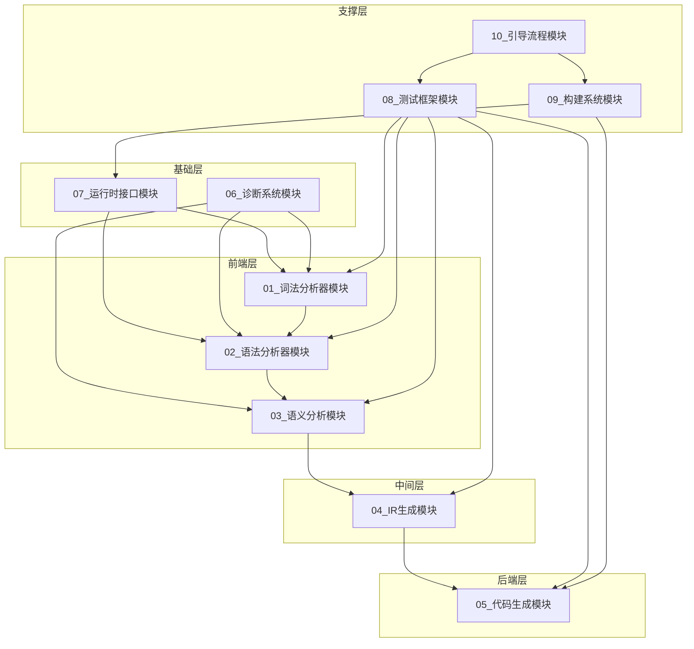

# CN语言自托管编译器技术设计文档 - 执行单元拆解

> **文档版本**: v2.0
> **创建时间**: 2026-03-30
> **更新时间**: 2026-03-30
> **源文档**: [`plans/014 CN语言自托管编译器技术设计文档.md`](../../plans/014%20CN语言自托管编译器技术设计文档.md)

---

## 拆解概述

### 设计原则

1. **Token预算控制**：每个执行单元综合Token消耗量在100k-130k区间
2. **输入侧**：30k-60k Token（上下文文件加载）
3. **输出侧**：剩余空间（代码生成、文档输出）
4. **业务领域划分**：按技术组件独立拆分

### 重要说明

本文档已修正以下问题：
- **移除虚构关键字**：`新建`、`删除`、`且`、`或`、`非`、`是`、`在` 等不存在于CN语言
- **修正函数语法**：返回类型使用 `->` 而非冒号，`重写` 关键字位于函数开头
- **修正运算符**：使用 `&&`、`||`、`!` 而非中文运算符
- **修正循环语法**：使用 `循环 (初始化; 条件; 更新)` 格式
- **运行时接口**：已在 `include/cnlang/runtime/stdlib.h` 中实现，避免重复设计

---

## 执行单元清单

| 编号 | 执行单元名称 | 主要内容 | 状态 |
|------|-------------|---------|------|
| 01 | 词法分析器模块 | 词法分析器CN重写 | ✅ 已完成 |
| 02 | 语法分析器模块 | 语法分析器CN重写 | ✅ 已完成 |
| 03 | 语义分析模块 | 语义分析器CN重写 | ⏳ 待执行 |
| 04 | IR生成模块 | IR生成器CN重写 | ⏳ 待执行 |
| 05 | 代码生成模块 | 代码生成器CN重写 | ⏳ 待执行 |
| 06 | 诊断系统模块 | 诊断系统CN重写 | ✅ 已完成 |
| 07 | 运行时接口模块 | 运行时库CN接口 | ✅ 已完成 |
| 08 | 测试框架模块 | 测试框架搭建 | ⏳ 待执行 |
| 09 | 构建系统模块 | CMake构建配置 | ⏳ 待执行 |
| 10 | 引导流程模块 | 自举验证流程 | ⏳ 待执行 |

---

## 执行单元依赖关系



---

## 执行顺序建议

### 阶段一：基础设施（第1-2周）

| 顺序 | 模块 | 说明 |
|------|------|------|
| 1 | **07_运行时接口模块** | 提供基础运行时支持（已在C中实现，创建CN接口声明） |
| 2 | **06_诊断系统模块** | 提供错误处理能力 |

### 阶段二：前端开发（第3-6周）

| 顺序 | 模块 | 说明 |
|------|------|------|
| 3 | **01_词法分析器模块** | 词法分析 |
| 4 | **02_语法分析器模块** | 语法分析 |
| 5 | **03_语义分析模块** | 语义分析 |

### 阶段三：后端开发（第7-8周）

| 顺序 | 模块 | 说明 |
|------|------|------|
| 6 | **04_IR生成模块** | IR生成 |
| 7 | **05_代码生成模块** | 代码生成 |

### 阶段四：集成验证（第9-12周）

| 顺序 | 模块 | 说明 |
|------|------|------|
| 8 | **08_测试框架模块** | 测试验证 |
| 9 | **09_构建系统模块** | 构建配置 |
| 10 | **10_引导流程模块** | 自举验证 |

---

## Token预算分配

| 执行单元 | 输入Token | 输出Token | 总计Token |
|---------|----------|----------|----------|
| 01_词法分析器 | ~50k | ~70k | ~120k |
| 02_语法分析器 | ~55k | ~75k | ~130k |
| 03_语义分析模块 | ~50k | ~80k | ~130k |
| 04_IR生成模块 | ~45k | ~75k | ~120k |
| 05_代码生成模块 | ~45k | ~75k | ~120k |
| 06_诊断系统模块 | ~40k | ~60k | ~100k |
| 07_运行时接口模块 | ~45k | ~65k | ~110k |
| 08_测试框架模块 | ~50k | ~70k | ~120k |
| 09_构建系统模块 | ~35k | ~55k | ~90k |
| 10_引导流程模块 | ~40k | ~60k | ~100k |

---

## CN语言语法规范要点

### 关键字列表（仅使用以下关键字）

**控制流关键字（10个）**：`如果`、`否则`、`当`、`循环`、`返回`、`中断`、`继续`、`选择`、`情况`、`默认`

**类型关键字（7个）**：`整数`、`小数`、`字符串`、`布尔`、`空类型`、`结构体`、`枚举`

**声明关键字（8个）**：`函数`、`变量`、`模块`、`导入`、`从`、`公开`、`私有`、`静态`

**常量关键字（3个）**：`真`、`假`、`无`

**OOP关键字（9个）**：`类`、`接口`、`保护`、`虚拟`、`重写`、`抽象`、`实现`、`自身`、`基类`

**异常关键字（4个）**：`尝试`、`捕获`、`抛出`、`最终`

### 函数定义语法

```cn
// 正确语法
函数 名字(参数) -> 返回类型 { }
重写 函数 方法() -> 返回类型 { }  // 重写在开头
```

### 运算符

- 使用 `&&` 而非 `且`
- 使用 `||` 而非 `或`
- 使用 `!` 而非 `非`

### 循环语法

```cn
// for循环
循环 (整数 i = 0; i < 10; i = i + 1) { }

// while循环
当 (条件) { }
```

### 对象创建

CN语言没有 `new` 关键字，使用函数调用：
```cn
变量 实例 = 类名.创建(参数);
```

---

## 已实现的运行时接口

以下接口已在 [`include/cnlang/runtime/stdlib.h`](../../include/cnlang/runtime/stdlib.h) 中实现：

### 内存管理
- `分配内存(size)` / `释放内存(ptr)` / `重新分配内存(ptr, new_size)`

### 字符串操作
- `复制字符串(dest, src)` / `连接字符串(dest, src)` / `比较字符串(s1, s2)` / `获取字符串长度(s)`

### 文件操作
- `打开文件(path, mode)` / `关闭文件(file)` / `读取文件(file, buffer, size)` / `写入文件(file, buffer, size)`

### 标准输入输出
- `打印字符串(str)` / `打印行(str)` / `读取行()` / `读取整数(out_val)`

### 动态数组
- `创建数组(初始容量)` / `销毁数组(数组)` / `数组添加(数组, 元素)` / `数组获取(数组, 索引)` / `数组长度(数组)`

### 命令行参数
- `获取参数个数()` / `获取参数(索引)` / `查找选项(选项名)` / `选项存在(选项名)`

---

## 文档修订历史

| 版本 | 日期 | 修订内容 | 作者 |
|------|------|---------|------|
| v1.0 | 2026-03-30 | 初始版本 | AI Architect |
| v2.0 | 2026-03-30 | 修正语法错误，移除虚构关键字，确保符合语法规范 | AI Architect |
