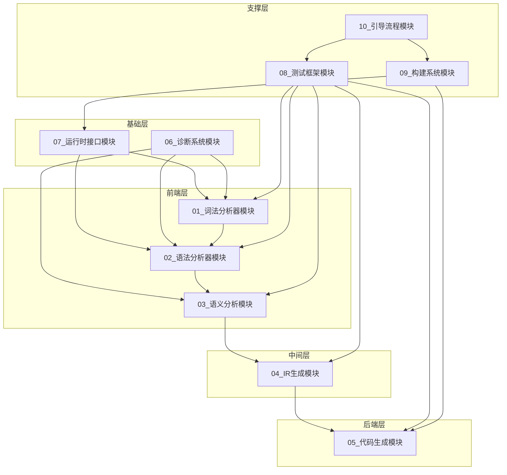

# CN语言自托管编译器技术设计文档 - 执行单元拆解

> **文档版本**: v1.0
> **创建时间**: 2026-03-30
> **源文档**: [`plans/014 CN语言自托管编译器技术设计文档.md`](../../plans/014%20CN语言自托管编译器技术设计文档.md)

---

## 拆解概述

### 设计原则

1. **Token预算控制**：每个执行单元综合Token消耗量在120k-150k区间
2. **输入侧**：40k-60k Token（上下文文件加载）
3. **输出侧**：剩余空间（代码生成、文档输出）
4. **业务领域划分**：按技术组件独立拆分

### 执行单元清单

| 编号 | 执行单元名称 | 主要内容 | 状态 |
|------|-------------|---------|------|
| 01 | 词法分析器模块 | 词法分析器CN重写 | ⏳ 待执行 |
| 02 | 语法分析器模块 | 语法分析器CN重写 | ⏳ 待执行 |
| 03 | 语义分析模块 | 语义分析器CN重写 | ⏳ 待执行 |
| 04 | IR生成模块 | IR生成器CN重写 | ⏳ 待执行 |
| 05 | 代码生成模块 | 代码生成器CN重写 | ⏳ 待执行 |
| 06 | 诊断系统模块 | 诊断系统CN重写 | ⏳ 待执行 |
| 07 | 运行时接口模块 | 运行时库CN接口 | ⏳ 待执行 |
| 08 | 测试框架模块 | 测试框架搭建 | ⏳ 待执行 |
| 09 | 构建系统模块 | CMake构建配置 | ⏳ 待执行 |
| 10 | 引导流程模块 | 自举验证流程 | ⏳ 待执行 |

---

## 执行单元依赖关系

---

## 执行顺序建议

### 阶段一：基础设施（第1-2周）
1. **07_运行时接口模块** - 提供基础运行时支持
2. **06_诊断系统模块** - 提供错误处理能力

### 阶段二：前端开发（第3-6周）
3. **01_词法分析器模块** - 词法分析
4. **02_语法分析器模块** - 语法分析
5. **03_语义分析模块** - 语义分析

### 阶段三：后端开发（第7-8周）
6. **04_IR生成模块** - IR生成
7. **05_代码生成模块** - 代码生成

### 阶段四：集成验证（第9-12周）
8. **08_测试框架模块** - 测试验证
9. **09_构建系统模块** - 构建配置
10. **10_引导流程模块** - 自举验证

---

## Token预算分配

| 执行单元 | 输入Token | 输出Token | 总计Token |
|---------|----------|----------|----------|
| 01_词法分析器 | ~50k | ~70k | ~120k |
| 02_语法分析器 | ~55k | ~75k | ~130k |
| 03_语义分析模块 | ~50k | ~80k | ~130k |
| 04_IR生成模块 | ~45k | ~75k | ~120k |
| 05_代码生成模块 | ~45k | ~75k | ~120k |
| 06_诊断系统模块 | ~40k | ~60k | ~100k |
| 07_运行时接口模块 | ~45k | ~65k | ~110k |
| 08_测试框架模块 | ~50k | ~70k | ~120k |
| 09_构建系统模块 | ~35k | ~55k | ~90k |
| 10_引导流程模块 | ~40k | ~60k | ~100k |

---

## 文档修订历史

| 版本 | 日期 | 修订内容 | 作者 |
|------|------|---------|------|
| v1.0 | 2026-03-30 | 初始版本 | AI Architect |
