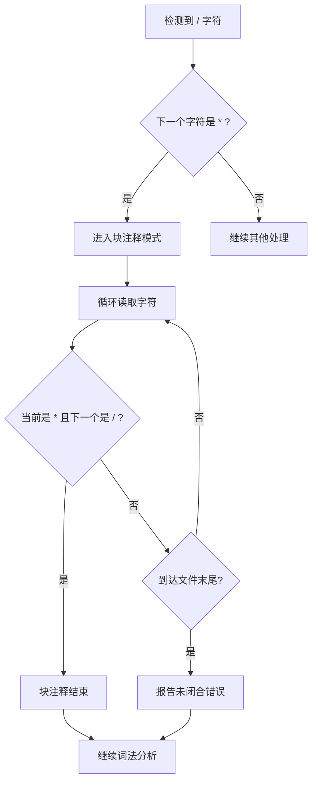

# CN Language 块注释实现方案

> **文档说明**：本文档基于实际源代码分析，为CN Language添加块注释支持提供完整实现方案。
>
> **创建时间**：2026-03-27
> **关联文档**：`plans/001 CN Language语法规范设计文档.md`

---

## 目录

1. [需求分析](#1-需求分析)
2. [当前实现状态](#2-当前实现状态)
3. [实现方案设计](#3-实现方案设计)
4. [需要修改的文件](#4-需要修改的文件)
5. [实现步骤](#5-实现步骤)
6. [测试用例](#6-测试用例)
7. [注意事项](#7-注意事项)

---

## 1. 需求分析

### 1.1 背景

当前CN Language词法分析器仅支持单行注释 `//`，不支持块注释。根据以下规范文档，块注释应使用 `/* */` 格式：

| 规范文档 | 定义内容 |
|---------|---------|
| [`CN_Language 语言规范草案（核心子集）.md:337`](docs/specifications/CN_Language 语言规范草案（核心子集）.md:337) | "块注释使用：`/* 注释内容 */`" |
| [`CN_Language 语法标准.md:32`](docs/design/CN_Language 语法标准.md:32) | "多行注释：`/* 注释内容 */`" |
| [`CN_Language CN代码风格规范.md:327`](docs/specifications/CN_Language CN代码风格规范.md:327) | "块注释使用 `/* ... */`" |

### 1.2 功能需求

1. **基本功能**：支持 `/* 注释内容 */` 格式的块注释
2. **多行支持**：块注释可以跨越多行
3. **嵌套处理**：不支持嵌套块注释（与C语言一致）
4. **错误处理**：未闭合的块注释应报告错误

### 1.3 语法格式选择

| 格式选项 | 优点 | 缺点 | 结论 |
|---------|------|------|------|
| `/* */` | C语言标准、规范文档已定义、工具兼容性好 | 无 | ✅ 采用 |
| `/*- -*/` | 更明确的中文风格 | 非标准、工具兼容性差 | ❌ 不采用 |
| `注释{ }` | 纯中文风格 | 与现有规范冲突、解析复杂 | ❌ 不采用 |

**结论**：采用 `/* */` 格式，与规范文档和C语言保持一致。

---

## 2. 当前实现状态

### 2.1 词法分析器位置

| 文件 | 说明 |
|------|------|
| [`src/frontend/lexer/lexer.c`](src/frontend/lexer/lexer.c) | 词法分析器实现 |
| [`include/cnlang/frontend/lexer.h`](include/cnlang/frontend/lexer.h) | 词法分析器头文件 |
| [`include/cnlang/frontend/token.h`](include/cnlang/frontend/token.h) | Token类型定义 |

### 2.2 当前单行注释实现

**代码来源**：[`lexer.c:227-238`](src/frontend/lexer/lexer.c:227)

```c
for (;;) {
    c = current_char(lexer);
    if (c == '/' && peek_char(lexer) == '/') {
        while (c != '\n' && c != '\0') {
            advance(lexer);
            c = current_char(lexer);
        }
        skip_whitespace(lexer);
        continue;
    }
    break;
}
```

**分析**：
- 单行注释处理在 `cn_frontend_lexer_next_token` 函数开头
- 使用 `for` 循环处理连续的注释和空白
- 注释内容被跳过，不生成Token

### 2.3 辅助函数

| 函数 | 位置 | 说明 |
|------|------|------|
| `current_char()` | [`lexer.c:9-16`](src/frontend/lexer/lexer.c:9) | 获取当前字符 |
| `peek_char()` | [`lexer.c:18-25`](src/frontend/lexer/lexer.c:18) | 预览下一个字符 |
| `advance()` | [`lexer.c:27-44`](src/frontend/lexer/lexer.c:27) | 前进一个字符，更新行列号 |
| `skip_whitespace()` | [`lexer.c:46-55`](src/frontend/lexer/lexer.c:46) | 跳过空白字符 |
| `report_lex_error()` | [`lexer.c:143-156`](src/frontend/lexer/lexer.c:143) | 报告词法错误 |

---

## 3. 实现方案设计

### 3.1 块注释处理流程



### 3.2 代码实现方案

在 [`lexer.c:227-238`](src/frontend/lexer/lexer.c:227) 的注释处理循环中添加块注释处理：

```c
for (;;) {
    c = current_char(lexer);
    
    // 单行注释处理
    if (c == '/' && peek_char(lexer) == '/') {
        while (c != '\n' && c != '\0') {
            advance(lexer);
            c = current_char(lexer);
        }
        skip_whitespace(lexer);
        continue;
    }
    
    // 块注释处理 - 新增
    if (c == '/' && peek_char(lexer) == '*') {
        advance(lexer);  // 跳过 '/'
        advance(lexer);  // 跳过 '*'
        c = current_char(lexer);
        
        // 查找块注释结束标记
        while (c != '\0') {
            if (c == '*' && peek_char(lexer) == '/') {
                advance(lexer);  // 跳过 '*'
                advance(lexer);  // 跳过 '/'
                break;
            }
            advance(lexer);
            c = current_char(lexer);
        }
        
        // 检查是否未闭合
        if (c == '\0') {
            report_lex_error(lexer, CN_DIAG_CODE_LEX_UNTERMINATED_BLOCK_COMMENT, 
                           "未终止的块注释");
        }
        
        skip_whitespace(lexer);
        continue;
    }
    
    break;
}
```

### 3.3 错误码定义

需要在诊断模块添加新的错误码：

```c
// 在 include/cnlang/support/diagnostics.h 中添加
CN_DIAG_CODE_LEX_UNTERMINATED_BLOCK_COMMENT,  // 未终止的块注释
```

---

## 4. 需要修改的文件

| 文件 | 修改内容 | 优先级 |
|------|---------|--------|
| [`src/frontend/lexer/lexer.c`](src/frontend/lexer/lexer.c) | 添加块注释处理逻辑 | P0 |
| [`include/cnlang/support/diagnostics.h`](include/cnlang/support/diagnostics.h) | 添加块注释错误码 | P0 |
| [`plans/001 CN Language语法规范设计文档.md`](plans/001 CN Language语法规范设计文档.md) | 更新注释规范说明 | P1 |
| [`tools/vscode/cnlang-lsp/cnlang.tmLanguage.json`](tools/vscode/cnlang-lsp/cnlang.tmLanguage.json) | 更新VSCode语法高亮 | P2 |

---

## 5. 实现步骤

### 步骤1：添加诊断错误码

**文件**：[`include/cnlang/support/diagnostics.h`](include/cnlang/support/diagnostics.h)

**操作**：在 `CnDiagCode` 枚举中添加：
```c
CN_DIAG_CODE_LEX_UNTERMINATED_BLOCK_COMMENT,
```

### 步骤2：实现块注释处理

**文件**：[`src/frontend/lexer/lexer.c`](src/frontend/lexer/lexer.c)

**操作**：在第227-238行的注释处理循环中添加块注释处理代码（见3.2节）

### 步骤3：更新语法规范文档

**文件**：[`plans/001 CN Language语法规范设计文档.md`](plans/001 CN Language语法规范设计文档.md)

**操作**：更新第235-254行的注释规则部分，将"不支持块注释"改为"支持块注释"

### 步骤4：更新VSCode语法高亮

**文件**：[`tools/vscode/cnlang-lsp/cnlang.tmLanguage.json`](tools/vscode/cnlang-lsp/cnlang.tmLanguage.json)

**操作**：添加块注释的语法高亮规则

### 步骤5：编写测试用例

**文件**：新建 `tests/unit/lexer_block_comment_test.c`

**操作**：编写块注释的单元测试

---

## 6. 测试用例

### 6.1 基本测试

```cn
/* 这是一个简单的块注释 */
变量 x = 10;

/*
 * 这是一个多行块注释
 * 第二行
 * 第三行
 */
变量 y = 20;
```

### 6.2 边界测试

```cn
/* 空注释 */变量 a = 1;

/**** 多个星号 ****/变量 b = 2;

/* 包含中文的块注释：测试中文支持 */变量 c = 3;

/* 包含代码的注释：函数 测试() {} */变量 d = 4;
```

### 6.3 错误测试

```cn
/* 未闭合的块注释
变量 e = 5;
// 预期：报告 "未终止的块注释" 错误
```

### 6.4 混合测试

```cn
// 单行注释
变量 a = 1;
/* 块注释 */变量 b = 2;
// 另一个单行注释
/* 
 * 块注释中的内容
 */变量 c = 3;
```

---

## 7. 注意事项

### 7.1 经验教训（来自 lessons.md）

根据 [`lessons.md`](lessons.md) 的记录，编写技术文档时必须：

1. **严格基于源代码**：每个语法规则都要有对应的代码依据
2. **标注代码来源**：使用 `文件名:行号` 格式标注来源
3. **禁止臆想猜测**：不编写代码中不存在的内容

### 7.2 实现注意事项

1. **行列号更新**：块注释跨越多行时，`advance()` 函数会自动更新行号
2. **错误恢复**：报告未闭合错误后，应继续词法分析，不应中断
3. **性能考虑**：块注释处理是线性扫描，时间复杂度 O(n)
4. **嵌套注释**：不支持嵌套，遇到 `*/` 即结束（与C语言一致）

### 7.3 兼容性考虑

1. **与C语言一致**：采用与C语言相同的块注释语法，便于用户理解
2. **工具兼容**：现有C语言工具（如格式化工具）可以正确处理
3. **向后兼容**：不影响现有的单行注释功能

---

## 附录：相关代码位置

| 功能 | 文件 | 行号 |
|------|------|------|
| 词法分析器主函数 | `src/frontend/lexer/lexer.c` | 214-636 |
| 单行注释处理 | `src/frontend/lexer/lexer.c` | 227-238 |
| 字符读取函数 | `src/frontend/lexer/lexer.c` | 9-44 |
| 错误报告函数 | `src/frontend/lexer/lexer.c` | 143-156 |
| Token类型定义 | `include/cnlang/frontend/token.h` | 10-92 |
| Lexer结构体 | `include/cnlang/frontend/lexer.h` | 15-23 |
