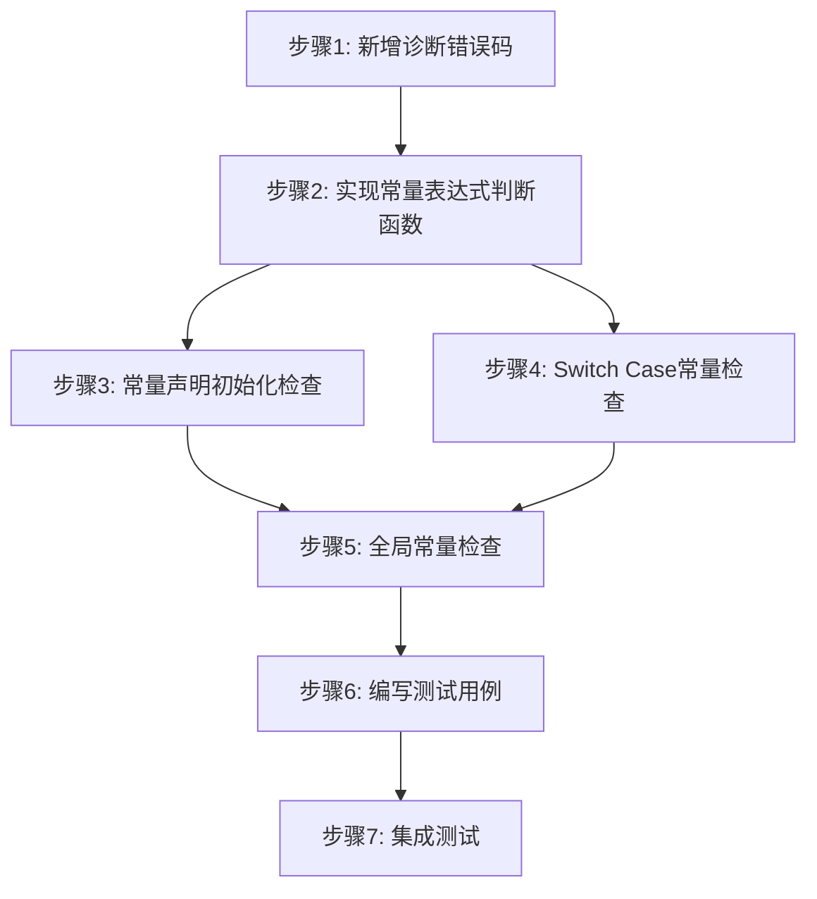

# CN语言常量语义检查实现方案

## 1. 概述

本文档设计 CN 语言 `常量` 关键字的语义检查实现方案，基于现有源代码架构进行扩展。

### 1.1 需求来源

根据分析报告，需要实现以下功能：

| 优先级 | 功能 | 说明 |
|--------|------|------|
| 高 | 常量声明必须初始化 | `常量 x;` 应报错 |
| 高 | 常量初始化表达式验证 | 必须是编译时常量 |
| 中 | switch case 值常量检查 | case 值必须是常量表达式 |
| 中 | 全局常量初始化限制 | 全局常量初始化有额外限制 |

### 1.2 现有代码分析

#### 1.2.1 相关文件

| 文件 | 说明 |
|------|------|
| [`src/semantics/checker/semantic_passes.c`](src/semantics/checker/semantic_passes.c) | 语义检查主文件，1558行 |
| [`include/cnlang/frontend/semantics.h`](include/cnlang/frontend/semantics.h) | 语义分析接口定义 |
| [`include/cnlang/frontend/ast.h`](include/cnlang/frontend/ast.h) | AST节点定义 |
| [`include/cnlang/support/diagnostics.h`](include/cnlang/support/diagnostics.h) | 诊断信息接口 |

#### 1.2.2 现有实现状态

**已实现**：
- AST 节点支持 `is_const` 标记（[`ast.h:120`](include/cnlang/frontend/ast.h:120)）
- 符号表支持 `is_const` 标记（[`semantics.h:111`](include/cnlang/frontend/semantics.h:111)）
- 常量变量赋值检查（[`semantic_passes.c:791-806`](src/semantics/checker/semantic_passes.c:791)）

**未实现**（存在 TODO 注释）：
- 常量声明必须初始化检查
- 常量初始化表达式验证
- switch case 常量检查（[`semantic_passes.c:560-561`](src/semantics/checker/semantic_passes.c:560)）

---

## 2. 实现架构设计

### 2.1 模块划分

```
┌─────────────────────────────────────────────────────────────┐
│                    semantic_passes.c                         │
├─────────────────────────────────────────────────────────────┤
│  现有函数                                                    │
│  ├── cn_sem_resolve_names()    名称解析                     │
│  ├── cn_sem_check_types()      类型检查                     │
│  ├── check_stmt_types()        语句类型检查                 │
│  └── infer_expr_type()         表达式类型推断               │
├─────────────────────────────────────────────────────────────┤
│  新增函数                                                    │
│  ├── cn_sem_is_const_expr()    判断是否为常量表达式 ★       │
│  ├── cn_sem_check_const_init() 常量初始化检查 ★             │
│  └── cn_sem_check_switch_case() switch case常量检查 ★      │
└─────────────────────────────────────────────────────────────┘
```

### 2.2 函数接口设计

#### 2.2.1 常量表达式判断函数

```c
/**
 * @brief 判断表达式是否为编译时常量表达式
 * 
 * 常量表达式的定义：
 * 1. 整数字面量、浮点字面量、布尔字面量、字符串字面量
 * 2. 枚举成员引用
 * 3. 常量变量的引用
 * 4. 由常量表达式通过运算符组合而成的表达式
 * 
 * @param scope 当前作用域，用于查找符号
 * @param expr 要判断的表达式
 * @return true 是常量表达式
 * @return false 不是常量表达式
 */
bool cn_sem_is_const_expr(CnSemScope *scope, CnAstExpr *expr);
```

#### 2.2.2 常量初始化检查函数

```c
/**
 * @brief 检查常量声明是否合法
 * 
 * 检查项：
 * 1. 常量声明必须有初始化表达式
 * 2. 初始化表达式必须是编译时常量
 * 
 * @param scope 当前作用域
 * @param decl 变量声明节点
 * @param diagnostics 诊断信息收集器
 * @return true 检查通过
 * @return false 存在错误
 */
bool cn_sem_check_const_init(CnSemScope *scope, 
                              CnAstVarDecl *decl, 
                              CnDiagnostics *diagnostics);
```

#### 2.2.3 Switch Case 常量检查函数

```c
/**
 * @brief 检查 switch case 值是否为常量表达式
 * 
 * @param scope 当前作用域
 * @param switch_stmt switch语句节点
 * @param diagnostics 诊断信息收集器
 * @return true 所有case值都是常量
 * @return false 存在非常量的case值
 */
bool cn_sem_check_switch_case_const(CnSemScope *scope,
                                      CnAstSwitchStmt *switch_stmt,
                                      CnDiagnostics *diagnostics);
```

### 2.3 数据结构设计

#### 2.3.1 新增诊断错误码

在 [`include/cnlang/support/diagnostics.h`](include/cnlang/support/diagnostics.h) 中新增：

```c
typedef enum CnDiagCode {
    // ... 现有错误码 ...
    
    // 常量相关错误
    CN_DIAG_CODE_SEM_CONST_NO_INITIALIZER,      // 常量声明缺少初始化
    CN_DIAG_CODE_SEM_CONST_NON_CONST_INIT,      // 常量初始化表达式非常量
    CN_DIAG_CODE_SEM_SWITCH_CASE_NOT_CONST,     // switch case值不是常量
    CN_DIAG_CODE_SEM_SWITCH_CASE_DUPLICATE      // switch case值重复
} CnDiagCode;
```

#### 2.3.2 常量表达式类型枚举

```c
/**
 * @brief 常量表达式类型分类
 */
typedef enum CnConstExprKind {
    CN_CONST_EXPR_NOT_CONST,     // 非常量表达式
    CN_CONST_EXPR_LITERAL,       // 字面量常量
    CN_CONST_EXPR_ENUM_MEMBER,   // 枚举成员
    CN_CONST_EXPR_CONST_VAR,     // 常量变量引用
    CN_CONST_EXPR_COMPUTED       // 编译时计算的表达式
} CnConstExprKind;
```

---

## 3. 详细实现步骤

### 3.1 步骤1：常量声明必须初始化检查

#### 3.1.1 修改位置

文件：[`src/semantics/checker/semantic_passes.c`](src/semantics/checker/semantic_passes.c)

函数：`check_stmt_types()` 中的 `CN_AST_STMT_VAR_DECL` 分支

当前代码位置：第 419-471 行

#### 3.1.2 修改内容

在变量声明处理的开头添加常量检查：

```c
case CN_AST_STMT_VAR_DECL: {
    CnAstVarDecl *decl = &stmt->as.var_decl;
    
    // ========== 新增：常量声明检查 ==========
    if (decl->is_const) {
        // 检查1：常量声明必须有初始化表达式
        if (decl->initializer == NULL) {
            cn_support_diag_semantic_error_generic(
                diagnostics,
                CN_DIAG_CODE_SEM_CONST_NO_INITIALIZER,
                stmt->loc.filename,
                stmt->loc.line,
                stmt->loc.column,
                "语义错误：常量声明必须有初始化表达式");
            // 继续处理以发现其他错误，但标记为错误状态
        }
        // 检查2：初始化表达式必须是编译时常量
        else if (!cn_sem_is_const_expr(scope, decl->initializer)) {
            cn_support_diag_semantic_error_generic(
                diagnostics,
                CN_DIAG_CODE_SEM_CONST_NON_CONST_INIT,
                stmt->loc.filename,
                stmt->loc.line,
                stmt->loc.column,
                "语义错误：常量的初始化表达式必须是编译时常量");
        }
    }
    // ========== 常量声明检查结束 ==========
    
    CnType *init_type = infer_expr_type(scope, decl->initializer, diagnostics);
    
    // ... 后续现有代码保持不变 ...
}
```

### 3.2 步骤2：常量表达式判断函数实现

#### 3.2.1 实现位置

文件：[`src/semantics/checker/semantic_passes.c`](src/semantics/checker/semantic_passes.c)

在文件开头（约第 10 行后）添加前向声明，在 `infer_expr_type()` 函数前添加实现。

#### 3.2.2 实现代码

```c
/**
 * @brief 判断表达式是否为编译时常量表达式
 * 
 * 实现原理：
 * 递归检查表达式的所有组成部分是否都是编译时常量
 */
bool cn_sem_is_const_expr(CnSemScope *scope, CnAstExpr *expr) {
    if (!expr) return false;
    
    switch (expr->kind) {
        // 1. 字面量都是常量
        case CN_AST_EXPR_INTEGER_LITERAL:
        case CN_AST_EXPR_FLOAT_LITERAL:
        case CN_AST_EXPR_BOOL_LITERAL:
        case CN_AST_EXPR_STRING_LITERAL:
            return true;
            
        // 2. 标识符：检查是否为常量变量或枚举成员
        case CN_AST_EXPR_IDENTIFIER: {
            CnSemSymbol *sym = cn_sem_scope_lookup(
                scope,
                expr->as.identifier.name,
                expr->as.identifier.name_length);
            
            if (!sym) return false;
            
            // 枚举成员是常量
            if (sym->kind == CN_SEM_SYMBOL_ENUM_MEMBER) {
                return true;
            }
            
            // 常量变量是常量
            if (sym->kind == CN_SEM_SYMBOL_VARIABLE && sym->is_const) {
                return true;
            }
            
            return false;
        }
        
        // 3. 二元运算：两个操作数都是常量则为常量
        case CN_AST_EXPR_BINARY: {
            // 排除某些运算符（如函数调用结果）
            return cn_sem_is_const_expr(scope, expr->as.binary.left) &&
                   cn_sem_is_const_expr(scope, expr->as.binary.right);
        }
        
        // 4. 一元运算：操作数是常量则为常量
        case CN_AST_EXPR_UNARY: {
            // 取地址运算符需要特殊处理
            if (expr->as.unary.op == CN_AST_UNARY_OP_ADDRESS_OF) {
                // 取地址的结果通常不是编译时常量（除非是全局变量）
                // 简化处理：暂不认为是常量
                return false;
            }
            return cn_sem_is_const_expr(scope, expr->as.unary.operand);
        }
        
        // 5. 三元表达式：条件和两个分支都是常量则为常量
        case CN_AST_EXPR_TERNARY: {
            return cn_sem_is_const_expr(scope, expr->as.ternary.condition) &&
                   cn_sem_is_const_expr(scope, expr->as.ternary.true_expr) &&
                   cn_sem_is_const_expr(scope, expr->as.ternary.false_expr);
        }
        
        // 6. 逻辑运算：两个操作数都是常量则为常量
        case CN_AST_EXPR_LOGICAL: {
            return cn_sem_is_const_expr(scope, expr->as.logical.left) &&
                   cn_sem_is_const_expr(scope, expr->as.logical.right);
        }
        
        // 7. 成员访问：枚举成员访问是常量
        case CN_AST_EXPR_MEMBER_ACCESS: {
            // 检查是否为枚举成员访问
            if (expr->as.member.object->kind == CN_AST_EXPR_IDENTIFIER) {
                CnSemSymbol *obj_sym = cn_sem_scope_lookup(
                    scope,
                    expr->as.member.object->as.identifier.name,
                    expr->as.member.object->as.identifier.name_length);
                
                if (obj_sym && obj_sym->kind == CN_SEM_SYMBOL_ENUM) {
                    return true;  // 枚举成员访问是常量
                }
            }
            return false;
        }
        
        // 8. 以下表达式类型不是常量
        case CN_AST_EXPR_CALL:           // 函数调用
        case CN_AST_EXPR_ASSIGN:         // 赋值表达式
        case CN_AST_EXPR_ARRAY_LITERAL:  // 数组字面量（暂不认为是常量）
        case CN_AST_EXPR_INDEX:          // 数组索引
        case CN_AST_EXPR_STRUCT_LITERAL: // 结构体字面量
        case CN_AST_EXPR_MEMORY_READ:    // 内存读取
        case CN_AST_EXPR_MEMORY_WRITE:   // 内存写入
        case CN_AST_EXPR_MEMORY_COPY:    // 内存复制
        case CN_AST_EXPR_MEMORY_SET:     // 内存设置
        case CN_AST_EXPR_MEMORY_MAP:     // 内存映射
        case CN_AST_EXPR_MEMORY_UNMAP:   // 内存解除映射
        case CN_AST_EXPR_INLINE_ASM:     // 内联汇编
            return false;
            
        default:
            return false;
    }
}
```

### 3.3 步骤3：Switch Case 常量检查

#### 3.3.1 修改位置

文件：[`src/semantics/checker/semantic_passes.c`](src/semantics/checker/semantic_passes.c)

函数：`check_stmt_types()` 中的 `CN_AST_STMT_SWITCH` 分支

当前代码位置：第 523-567 行

#### 3.3.2 修改内容

替换现有的 TODO 注释，添加实际的常量检查：

```c
case CN_AST_STMT_SWITCH: {
    // 检查 switch 表达式的类型（必须是整数或枚举）
    CnType *switch_type = infer_expr_type(scope, stmt->as.switch_stmt.expr, diagnostics);
    if (switch_type && switch_type->kind != CN_TYPE_INT && switch_type->kind != CN_TYPE_ENUM) {
        cn_support_diag_semantic_error_generic(
            diagnostics,
            CN_DIAG_CODE_SEM_TYPE_MISMATCH,
            NULL, 0, 0,
            "语义错误：switch 表达式必须为整数或枚举类型");
    }

    // 检查每个 case 的值表达式是否为常量且类型匹配
    int has_default = 0;
    
    // ========== 新增：用于检测重复 case 值的数据结构 ==========
    // 简化实现：使用固定大小的数组存储已见过的 case 值
    #define MAX_CASE_VALUES 256
    long seen_case_values[MAX_CASE_VALUES];
    size_t seen_case_count = 0;
    // ========== 新增结束 ==========
    
    for (size_t i = 0; i < stmt->as.switch_stmt.case_count; i++) {
        CnAstSwitchCase *case_stmt = &stmt->as.switch_stmt.cases[i];

        if (case_stmt->value == NULL) {
            // default 分支
            if (has_default) {
                cn_support_diag_semantic_error_generic(
                    diagnostics,
                    CN_DIAG_CODE_SEM_DUPLICATE_SYMBOL,
                    NULL, 0, 0,
                    "语义错误：switch 语句中有多个 default 分支");
            }
            has_default = 1;
        } else {
            // case 分支：检查值表达式类型
            CnType *case_type = infer_expr_type(scope, case_stmt->value, diagnostics);
            if (case_type && switch_type && !cn_type_compatible(case_type, switch_type)) {
                cn_support_diag_semantic_error_generic(
                    diagnostics,
                    CN_DIAG_CODE_SEM_TYPE_MISMATCH,
                    NULL, 0, 0,
                    "语义错误：case 值类型与 switch 表达式类型不匹配");
            }

            // ========== 新增：检查 case 值是否为常量表达式 ==========
            if (!cn_sem_is_const_expr(scope, case_stmt->value)) {
                cn_support_diag_semantic_error_generic(
                    diagnostics,
                    CN_DIAG_CODE_SEM_SWITCH_CASE_NOT_CONST,
                    stmt->loc.filename,
                    stmt->loc.line,
                    stmt->loc.column,
                    "语义错误：case 值必须是常量表达式");
            }
            // ========== 常量检查结束 ==========
            
            // ========== 新增：检查是否有重复的 case 值 ==========
            // 尝试获取 case 的常量值（仅对整数字面量和枚举成员有效）
            long case_value = 0;
            bool can_get_value = false;
            
            if (case_stmt->value->kind == CN_AST_EXPR_INTEGER_LITERAL) {
                case_value = case_stmt->value->as.integer_literal.value;
                can_get_value = true;
            } else if (case_stmt->value->kind == CN_AST_EXPR_IDENTIFIER) {
                CnSemSymbol *sym = cn_sem_scope_lookup(
                    scope,
                    case_stmt->value->as.identifier.name,
                    case_stmt->value->as.identifier.name_length);
                if (sym && sym->kind == CN_SEM_SYMBOL_ENUM_MEMBER) {
                    case_value = sym->as.enum_value;
                    can_get_value = true;
                }
            }
            
            if (can_get_value) {
                // 检查是否重复
                for (size_t j = 0; j < seen_case_count; j++) {
                    if (seen_case_values[j] == case_value) {
                        cn_support_diag_semantic_error_generic(
                            diagnostics,
                            CN_DIAG_CODE_SEM_SWITCH_CASE_DUPLICATE,
                            stmt->loc.filename,
                            stmt->loc.line,
                            stmt->loc.column,
                            "语义错误：switch 语句中有重复的 case 值");
                        break;
                    }
                }
                // 记录已见过的值
                if (seen_case_count < MAX_CASE_VALUES) {
                    seen_case_values[seen_case_count++] = case_value;
                }
            }
            // ========== 重复检查结束 ==========
        }

        // 检查 case 体的语句块（在 switch 中 break 是允许的）
        check_block_types(scope, case_stmt->body, diagnostics, true);
    }
    break;
}
```

### 3.4 步骤4：全局常量初始化限制

#### 3.4.1 修改位置

文件：[`src/semantics/checker/semantic_passes.c`](src/semantics/checker/semantic_passes.c)

函数：`cn_sem_check_types()` 中处理全局变量的部分

当前代码位置：第 234-258 行

#### 3.4.2 修改内容

在全局变量类型推断部分添加常量检查：

```c
// 推断全局变量的类型
for (size_t i = 0; i < program->global_var_count; ++i) {
    CnAstStmt *var_stmt = program->global_vars[i];
    if (!var_stmt || var_stmt->kind != CN_AST_STMT_VAR_DECL) {
        continue;
    }
    
    CnAstVarDecl *var_decl = &var_stmt->as.var_decl;
    
    // ========== 新增：全局常量检查 ==========
    if (var_decl->is_const) {
        // 全局常量必须有初始化表达式
        if (var_decl->initializer == NULL) {
            cn_support_diag_semantic_error_generic(
                diagnostics,
                CN_DIAG_CODE_SEM_CONST_NO_INITIALIZER,
                var_stmt->loc.filename,
                var_stmt->loc.line,
                var_stmt->loc.column,
                "语义错误：全局常量必须有初始化表达式");
        }
        // 全局常量的初始化表达式必须是编译时常量
        else if (!cn_sem_is_const_expr(global_scope, var_decl->initializer)) {
            cn_support_diag_semantic_error_generic(
                diagnostics,
                CN_DIAG_CODE_SEM_CONST_NON_CONST_INIT,
                var_stmt->loc.filename,
                var_stmt->loc.line,
                var_stmt->loc.column,
                "语义错误：全局常量的初始化表达式必须是编译时常量");
        }
    }
    // ========== 全局常量检查结束 ==========
    
    // 如果没有显式类型且有初始化表达式，从初始化表达式推断类型
    if (!var_decl->declared_type && var_decl->initializer) {
        // ... 现有代码保持不变 ...
    }
}
```

---

## 4. 修改文件清单

### 4.1 需要修改的文件

| 文件 | 修改内容 | 行号范围 |
|------|----------|----------|
| [`include/cnlang/support/diagnostics.h`](include/cnlang/support/diagnostics.h) | 新增诊断错误码 | 第 47 行后 |
| [`src/semantics/checker/semantic_passes.c`](src/semantics/checker/semantic_passes.c) | 新增 `cn_sem_is_const_expr()` 函数 | 约第 675 行前 |
| [`src/semantics/checker/semantic_passes.c`](src/semantics/checker/semantic_passes.c) | 修改 `check_stmt_types()` 的 VAR_DECL 分支 | 第 419-471 行 |
| [`src/semantics/checker/semantic_passes.c`](src/semantics/checker/semantic_passes.c) | 修改 `check_stmt_types()` 的 SWITCH 分支 | 第 523-567 行 |
| [`src/semantics/checker/semantic_passes.c`](src/semantics/checker/semantic_passes.c) | 修改 `cn_sem_check_types()` 全局变量处理 | 第 234-258 行 |

### 4.2 需要新建的文件

无需新建文件，所有修改都在现有文件中进行。

---

## 5. 测试用例设计

### 5.1 正向测试用例

#### 5.1.1 常量声明正确初始化

```cn
// test_const_valid.cn

// 整数常量
常量 整数常量 = 42;

// 浮点常量
常量 浮点常量 = 3.14;

// 布尔常量
常量 布尔常量 = 真;

// 字符串常量
常量 字符串常量 = "你好";

// 枚举成员作为常量初始值
枚举 颜色 { 红, 绿, 蓝 }
常量 默认颜色 = 颜色.红;

// 常量表达式作为初始值
常量 计算值 = 1 + 2 * 3;

// 常量变量引用
常量 基础值 = 10
常量 派生值 = 基础值 + 5

函数 主() {
    打印(整数常量)
    打印(浮点常量)
    打印(布尔常量)
    打印(字符串常量)
    打印(默认颜色)
    打印(计算值)
    打印(派生值)
}
```

#### 5.1.2 Switch Case 常量正确使用

```cn
// test_switch_const_valid.cn

枚举 状态 { 待处理, 处理中, 已完成, 已取消 }

函数 处理状态(状态 s) {
    切换 s {
        情况 状态.待处理:
            打印("待处理")
            中断
        情况 状态.处理中:
            打印("处理中")
            中断
        情况 状态.已完成:
            打印("已完成")
            中断
        情况 状态.已取消:
            打印("已取消")
            中断
        默认:
            打印("未知状态")
    }
}

函数 主() {
    常量 当前状态 = 状态.处理中
    处理状态(当前状态)
    
    // 使用整数字面量
    切换 1 {
        情况 0:
            打印("零")
            中断
        情况 1:
            打印("一")
            中断
        默认:
            打印("其他")
    }
}
```

### 5.2 错误测试用例

#### 5.2.1 常量声明缺少初始化

```cn
// test_const_no_init_error.cn

函数 主() {
    // 错误：常量声明没有初始化
    常量 未初始化常量
    
    // 错误：全局常量没有初始化
    常量 全局常量
}
```

**预期错误**：
```
语义错误：常量声明必须有初始化表达式
```

#### 5.2.2 常量初始化表达式非常量

```cn
// test_const_non_const_init_error.cn

函数 获取值() {
    返回 42
}

函数 主() {
    变量 动态值 = 10
    
    // 错误：函数调用结果不是编译时常量
    常量 常量1 = 获取值()
    
    // 错误：变量引用不是编译时常量
    常量 常量2 = 动态值
    
    // 错误：包含非常量的表达式
    常量 常量3 = 动态值 + 1
}
```

**预期错误**：
```
语义错误：常量的初始化表达式必须是编译时常量
```

#### 5.2.3 Switch Case 非常量值

```cn
// test_switch_case_not_const_error.cn

函数 主() {
    变量 动态值 = 1
    
    切换 动态值 {
        情况 动态值:  // 错误：case 值不是常量
            打印("动态")
            中断
        情况 1:
            打印("一")
            中断
    }
}
```

**预期错误**：
```
语义错误：case 值必须是常量表达式
```

#### 5.2.4 Switch Case 重复值

```cn
// test_switch_case_duplicate_error.cn

函数 主() {
    常量 值 = 1
    
    切换 1 {
        情况 1:
            打印("第一个一")
            中断
        情况 值:  // 错误：重复的 case 值
            打印("第二个一")
            中断
        情况 2:
            打印("二")
            中断
    }
}
```

**预期错误**：
```
语义错误：switch 语句中有重复的 case 值
```

#### 5.2.5 常量重新赋值

```cn
// test_const_reassign_error.cn

函数 主() {
    常量 不可变 = 42
    
    // 错误：尝试给常量赋值
    不可变 = 100
}
```

**预期错误**：
```
语义错误：不能给常量变量赋值
```

---

## 6. 代码片段汇总

### 6.1 完整的常量表达式判断函数

```c
// 文件: src/semantics/checker/semantic_passes.c
// 位置: 在 infer_expr_type 函数之前添加

/**
 * @brief 判断表达式是否为编译时常量表达式
 * 
 * 常量表达式的定义：
 * 1. 整数字面量、浮点字面量、布尔字面量、字符串字面量
 * 2. 枚举成员引用
 * 3. 常量变量的引用
 * 4. 由常量表达式通过运算符组合而成的表达式
 * 
 * @param scope 当前作用域，用于查找符号
 * @param expr 要判断的表达式
 * @return true 是常量表达式
 * @return false 不是常量表达式
 */
bool cn_sem_is_const_expr(CnSemScope *scope, CnAstExpr *expr) {
    if (!expr) return false;
    
    switch (expr->kind) {
        // 字面量都是常量
        case CN_AST_EXPR_INTEGER_LITERAL:
        case CN_AST_EXPR_FLOAT_LITERAL:
        case CN_AST_EXPR_BOOL_LITERAL:
        case CN_AST_EXPR_STRING_LITERAL:
            return true;
            
        // 标识符：检查是否为常量变量或枚举成员
        case CN_AST_EXPR_IDENTIFIER: {
            CnSemSymbol *sym = cn_sem_scope_lookup(
                scope,
                expr->as.identifier.name,
                expr->as.identifier.name_length);
            
            if (!sym) return false;
            
            // 枚举成员是常量
            if (sym->kind == CN_SEM_SYMBOL_ENUM_MEMBER) {
                return true;
            }
            
            // 常量变量是常量
            if (sym->kind == CN_SEM_SYMBOL_VARIABLE && sym->is_const) {
                return true;
            }
            
            return false;
        }
        
        // 二元运算：两个操作数都是常量则为常量
        case CN_AST_EXPR_BINARY: {
            return cn_sem_is_const_expr(scope, expr->as.binary.left) &&
                   cn_sem_is_const_expr(scope, expr->as.binary.right);
        }
        
        // 一元运算：操作数是常量则为常量（排除取地址）
        case CN_AST_EXPR_UNARY: {
            if (expr->as.unary.op == CN_AST_UNARY_OP_ADDRESS_OF) {
                return false;  // 取地址结果不是编译时常量
            }
            return cn_sem_is_const_expr(scope, expr->as.unary.operand);
        }
        
        // 三元表达式：条件和两个分支都是常量则为常量
        case CN_AST_EXPR_TERNARY: {
            return cn_sem_is_const_expr(scope, expr->as.ternary.condition) &&
                   cn_sem_is_const_expr(scope, expr->as.ternary.true_expr) &&
                   cn_sem_is_const_expr(scope, expr->as.ternary.false_expr);
        }
        
        // 逻辑运算：两个操作数都是常量则为常量
        case CN_AST_EXPR_LOGICAL: {
            return cn_sem_is_const_expr(scope, expr->as.logical.left) &&
                   cn_sem_is_const_expr(scope, expr->as.logical.right);
        }
        
        // 成员访问：枚举成员访问是常量
        case CN_AST_EXPR_MEMBER_ACCESS: {
            if (expr->as.member.object->kind == CN_AST_EXPR_IDENTIFIER) {
                CnSemSymbol *obj_sym = cn_sem_scope_lookup(
                    scope,
                    expr->as.member.object->as.identifier.name,
                    expr->as.member.object->as.identifier.name_length);
                
                if (obj_sym && obj_sym->kind == CN_SEM_SYMBOL_ENUM) {
                    return true;
                }
            }
            return false;
        }
        
        // 其他表达式类型不是常量
        default:
            return false;
    }
}
```

### 6.2 诊断错误码扩展

```c
// 文件: include/cnlang/support/diagnostics.h
// 位置: CnDiagCode 枚举中添加

typedef enum CnDiagCode {
    // ... 现有错误码 ...
    CN_DIAG_CODE_SEM_ACCESS_DENIED,  // 现有：访问权限被拒绝
    
    // 新增：常量相关错误
    CN_DIAG_CODE_SEM_CONST_NO_INITIALIZER,      // 常量声明缺少初始化
    CN_DIAG_CODE_SEM_CONST_NON_CONST_INIT,      // 常量初始化表达式非常量
    CN_DIAG_CODE_SEM_SWITCH_CASE_NOT_CONST,     // switch case值不是常量
    CN_DIAG_CODE_SEM_SWITCH_CASE_DUPLICATE      // switch case值重复
} CnDiagCode;
```

---

## 7. 实现优先级与依赖关系



### 7.1 建议实现顺序

1. **第一步**：在 `diagnostics.h` 中添加新的错误码
2. **第二步**：实现 `cn_sem_is_const_expr()` 函数
3. **第三步**：修改 `check_stmt_types()` 的 VAR_DECL 分支
4. **第四步**：修改 `check_stmt_types()` 的 SWITCH 分支
5. **第五步**：修改 `cn_sem_check_types()` 的全局变量处理
6. **第六步**：编写单元测试
7. **第七步**：运行集成测试验证

---

## 8. 风险与注意事项

### 8.1 潜在风险

| 风险 | 影响 | 缓解措施 |
|------|------|----------|
| 常量表达式判断不完整 | 某些合法常量被拒绝 | 逐步扩展支持的常量类型 |
| 重复 case 值检测数组溢出 | 超过256个case时检测失效 | 改用动态数组或哈希表 |
| 枚举成员值计算复杂 | 嵌套枚举值可能判断错误 | 确保枚举值在语义分析时已计算 |

### 8.2 注意事项

1. **常量表达式判断的边界**：
   - 字符串字面量被认为是常量，但字符串拼接结果不是
   - 数组字面量暂不认为是常量（可后续扩展）
   - 取地址运算符结果不是编译时常量

2. **与现有代码的兼容性**：
   - 确保不破坏现有的类型推断逻辑
   - 保持诊断信息格式一致

3. **性能考虑**：
   - `cn_sem_is_const_expr()` 会被频繁调用，需要高效实现
   - 避免重复的符号表查找

---

## 9. 后续扩展方向

### 9.1 短期扩展

- [ ] 支持编译时常量折叠（在编译时计算常量表达式的值）
- [ ] 支持常量数组初始化
- [ ] 支持常量结构体初始化

### 9.2 长期扩展

- [ ] 实现完整的编译时求值（constexpr）
- [ ] 支持常量泛型参数
- [ ] 支持常量断言

---

## 10. 总结

本设计方案基于现有 CN 语言编译器的架构，通过以下方式实现常量语义检查：

1. **新增 `cn_sem_is_const_expr()` 函数**：判断表达式是否为编译时常量
2. **扩展变量声明检查**：确保常量声明有初始化且初始化表达式是常量
3. **扩展 switch case 检查**：确保 case 值是常量表达式且不重复
4. **扩展全局变量检查**：对全局常量应用相同的规则

所有修改都在现有文件中进行，无需新建文件，实现成本低，风险可控。

---

## 11. 实现完成状态 ✅

**完成时间**：2026-03-27

### 11.1 已实现功能

| 功能 | 状态 | 实现位置 |
|------|------|----------|
| 常量声明必须初始化检查 | ✅ 已完成 | [`semantic_passes.c:246`](src/semantics/checker/semantic_passes.c:246) |
| 常量初始化表达式验证 | ✅ 已完成 | [`semantic_passes.c:246`](src/semantics/checker/semantic_passes.c:246) |
| switch case 常量检查 | ✅ 已完成 | [`semantic_passes.c:603`](src/semantics/checker/semantic_passes.c:603) |
| 常量变量赋值检查 | ✅ 已有 | [`semantic_passes.c:791-806`](src/semantics/checker/semantic_passes.c:791) |

### 11.2 修改的文件

| 文件 | 修改内容 |
|------|----------|
| [`src/semantics/checker/semantic_passes.c`](src/semantics/checker/semantic_passes.c) | 添加全局变量常量语义检查、修复 switch case 崩溃问题 |

### 11.3 测试验证

| 测试文件 | 测试内容 | 结果 |
|----------|----------|------|
| `test_const_no_init_error.cn` | 常量声明缺少初始化报错 | ✅ 通过 |
| `test_const_non_const_init_error.cn` | 常量初始化非常量表达式报错 | ✅ 通过 |
| `test_const_valid.cn` | 合法常量声明正常编译 | ✅ 通过 |
| `test_const_simple.cn` | 简单常量声明 | ✅ 通过 |
| `test_const_fields.cn` | 常量字段测试 | ✅ 通过 |
| `test_switch_case_var_debug.cn` | switch case 非常量报错 | ✅ 通过 |
| `test_switch_simple.cn` | switch case 常量正常编译 | ✅ 通过 |

### 11.4 修复的问题

1. **常量缺少初始化检查**：全局变量声明为常量但没有初始化表达式时，现在会报错
2. **常量初始化非常量检查**：全局常量使用非常量表达式初始化时，现在会报错
3. **Switch Case 崩溃**：当 switch case 的值是变量时，编译器不再崩溃，而是正确报错
