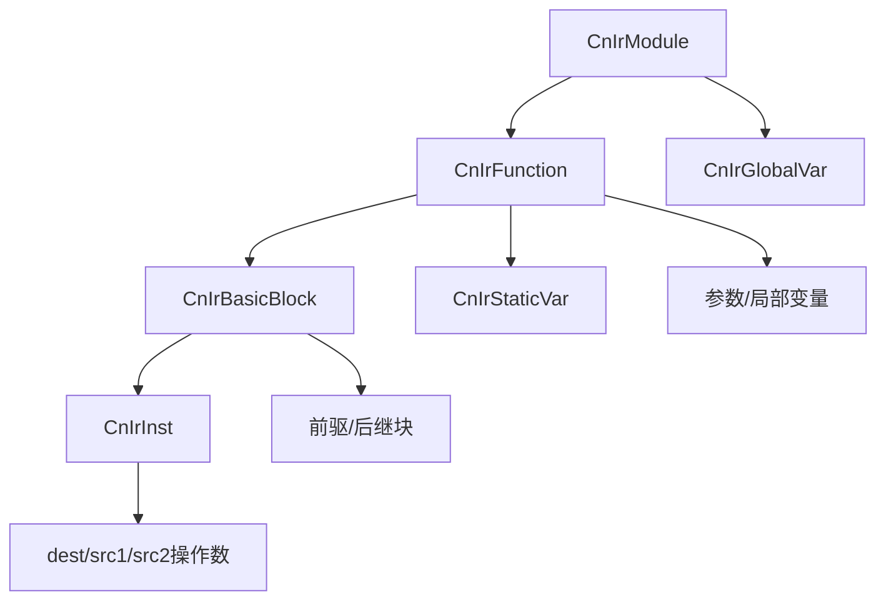
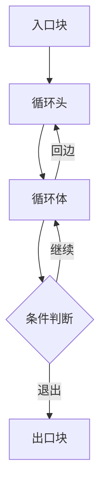
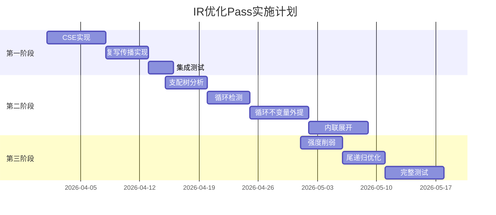

# CN语言IR优化Pass扩展方案

## 1. 概述

### 1.1 当前IR优化状态

CN语言编译器目前已实现两个基础优化Pass：

| Pass名称 | 文件位置 | 功能描述 |
|---------|---------|---------|
| 常量折叠 | [`constant_folding.c`](src/ir/passes/constant_folding.c) | 编译期计算常量表达式，将算术/逻辑运算替换为结果 |
| 死代码消除 | [`dead_code_elimination.c`](src/ir/passes/dead_code_elimination.c) | 移除不可达的基本块 |

**现有实现特点**：
- 常量折叠支持整数加、减、乘、除、模、位运算和比较运算
- 死代码消除基于控制流图（CFG）可达性分析
- Pass执行顺序：先常量折叠，后死代码消除

### 1.2 扩展目标和意义

**目标**：构建完整的IR优化体系，提升生成代码的执行效率

**意义**：
1. **性能提升**：通过多种优化技术组合，可显著减少运行时开销
2. **代码质量**：生成更紧凑、高效的C代码
3. **编译器成熟度**：完善的优化Pass是现代编译器的重要标志

---

## 2. IR结构回顾

### 2.1 IR数据结构层次



**核心结构定义**（参考 [`ir.h`](include/cnlang/ir/ir.h)）：

```c
// 模块 → 函数 → 基本块 → 指令
CnIrModule
├── CnIrFunction (链表)
│   ├── CnIrBasicBlock (链表)
│   │   ├── CnIrInst (双向链表)
│   │   ├── preds (前驱块列表)
│   │   └── succs (后继块列表)
│   ├── params (参数数组)
│   ├── locals (局部变量数组)
│   └── static_vars (静态变量链表)
└── CnIrGlobalVar (全局变量链表)
```

### 2.2 33种IR指令类型

| 分类 | 指令 | 说明 |
|-----|------|------|
| **算术运算** | `ADD`, `SUB`, `MUL`, `DIV`, `MOD` | 整数/浮点四则运算 |
| **位运算** | `AND`, `OR`, `XOR`, `SHL`, `SHR`, `NEG`, `NOT` | 按位操作 |
| **比较运算** | `EQ`, `NE`, `LT`, `LE`, `GT`, `GE` | 条件比较 |
| **内存操作** | `ALLOCA`, `LOAD`, `STORE`, `MOV`, `ADDRESS_OF`, `DEREF` | 内存访问 |
| **控制流** | `LABEL`, `JUMP`, `BRANCH`, `CALL`, `RET` | 流程控制 |
| **结构体** | `GET_ELEMENT_PTR`, `MEMBER_ACCESS` | 结构体操作 |
| **其他** | `PHI`, `SELECT` | SSA支持/三元运算 |

### 2.3 Pass执行机制

```c
// Pass函数指针类型
typedef void (*CnIrPassFunc)(CnIrModule *module);

// 当前默认Pass执行流程
void cn_ir_run_default_passes(CnIrModule *module) {
    cn_ir_pass_constant_folding(module);    // 1. 常量折叠
    cn_ir_pass_dead_code_elimination(module); // 2. 死代码消除
}
```

---

## 3. 待实现的优化Pass详细设计

### 3.1 公共子表达式消除（CSE）- 高优先级 ⭐⭐⭐

#### 算法原理

公共子表达式消除（Common Subexpression Elimination）识别程序中相同的表达式计算，将其结果缓存复用，避免重复计算。

**示例**：
```c
// 优化前
a = b + c;
d = b + c;  // 重复计算 b + c

// 优化后
t = b + c;
a = t;
d = t;
```

#### 数据结构：表达式哈希表

```c
// 表达式规范化表示（用于哈希）
typedef struct CnIrExprKey {
    CnIrInstKind kind;       // 操作类型
    int src1_id;             // 操作数1的规范化ID
    int src2_id;             // 操作数2的规范化ID
    // 对于交换律运算，保证 src1_id <= src2_id
} CnIrExprKey;

// 表达式哈希表项
typedef struct CnIrExprEntry {
    CnIrExprKey key;
    int result_reg;          // 计算结果存放的寄存器
    CnIrInst *inst;          // 对应的指令
    struct CnIrExprEntry *next;
} CnIrExprEntry;

// 表达式哈希表
#define EXPR_HASH_SIZE 256
typedef struct CnIrExprTable {
    CnIrExprEntry *buckets[EXPR_HASH_SIZE];
} CnIrExprTable;
```

#### 实现步骤

```
算法：局部公共子表达式消除
输入：CnIrFunction *func
输出：优化后的函数

1. 对每个基本块 B in func:
   2. 初始化表达式哈希表 table
   3. 对每条指令 I in B:
      4. 如果 I 是可CSE的运算指令:
         5. 规范化 I 的操作数，生成 key
         6. 在 table 中查找 key
         7. 如果找到匹配 entry:
            8. 将 I 替换为 MOV 指令，使用 entry.result_reg
            9. 删除原指令（标记为死代码）
         10. 否则:
            11. 将 I 的结果插入 table
   12. 清理 table
```

#### 伪代码

```c
void cn_ir_pass_cse(CnIrModule *module) {
    if (!module) return;
    
    for (CnIrFunction *func = module->first_func; func; func = func->next) {
        for (CnIrBasicBlock *block = func->first_block; block; block = block->next) {
            CnIrExprTable *table = expr_table_new();
            
            for (CnIrInst *inst = block->first_inst; inst; inst = inst->next) {
                if (!is_cse_candidate(inst)) continue;
                
                CnIrExprKey key = normalize_expr(inst);
                CnIrExprEntry *entry = expr_table_lookup(table, &key);
                
                if (entry) {
                    // 找到公共子表达式，替换为复写
                    replace_with_copy(inst, entry->result_reg);
                } else {
                    // 新表达式，记录到表中
                    expr_table_insert(table, &key, inst->dest.as.reg_id, inst);
                }
            }
            
            expr_table_free(table);
        }
    }
}

// 判断指令是否可进行CSE
static bool is_cse_candidate(CnIrInst *inst) {
    switch (inst->kind) {
        case CN_IR_INST_ADD:
        case CN_IR_INST_SUB:
        case CN_IR_INST_MUL:
        case CN_IR_INST_DIV:
        case CN_IR_INST_MOD:
        case CN_IR_INST_AND:
        case CN_IR_INST_OR:
        case CN_IR_INST_XOR:
        case CN_IR_INST_SHL:
        case CN_IR_INST_SHR:
        case CN_IR_INST_EQ:
        case CN_IR_INST_NE:
        case CN_IR_INST_LT:
        case CN_IR_INST_LE:
        case CN_IR_INST_GT:
        case CN_IR_INST_GE:
            return inst->src1.kind == CN_IR_OP_REG && 
                   inst->src2.kind == CN_IR_OP_REG;
        default:
            return false;
    }
}

// 规范化表达式（处理交换律）
static CnIrExprKey normalize_expr(CnIrInst *inst) {
    CnIrExprKey key;
    key.kind = inst->kind;
    
    int id1 = inst->src1.as.reg_id;
    int id2 = inst->src2.as.reg_id;
    
    // 对于交换律运算，保证顺序一致
    if (is_commutative(inst->kind) && id1 > id2) {
        key.src1_id = id2;
        key.src2_id = id1;
    } else {
        key.src1_id = id1;
        key.src2_id = id2;
    }
    
    return key;
}
```

---

### 3.2 复写传播 - 高优先级 ⭐⭐⭐

#### 算法原理

复写传播（Copy Propagation）跟踪 `MOV` 指令定义的值等价关系，将后续对目标寄存器的引用替换为源操作数，消除不必要的复写指令。

**示例**：
```c
// 优化前
t1 = a;      // MOV t1, a
t2 = t1 + b; // 使用 t1

// 优化后
t2 = a + b;  // 直接使用 a
```

#### 与CSE的配合

```
执行顺序：CSE → 复写传播 → 死代码消除

原因：
1. CSE 会产生新的 MOV 指令
2. 复写传播可以消除这些 MOV
3. 死代码消除清理无用的指令
```

#### 实现步骤

```
算法：复写传播
输入：CnIrFunction *func
输出：优化后的函数

1. 对每个基本块 B in func:
   2. 初始化复写映射表 copy_map (reg_id → operand)
   3. 对每条指令 I in B:
      4. 如果 I 是 MOV 指令:
         5. 记录 copy_map[I.dest] = I.src1
      6. 否则:
         7. 对 I 的每个操作数 op:
            8. 如果 op 是寄存器且 op.reg_id in copy_map:
               9. 替换 op 为 copy_map[op.reg_id]
```

#### 伪代码

```c
// 复写映射表
#define COPY_MAP_SIZE 256
typedef struct CnIrCopyMap {
    CnIrOperand mappings[COPY_MAP_SIZE];
    bool valid[COPY_MAP_SIZE];
} CnIrCopyMap;

void cn_ir_pass_copy_propagation(CnIrModule *module) {
    if (!module) return;
    
    for (CnIrFunction *func = module->first_func; func; func = func->next) {
        for (CnIrBasicBlock *block = func->first_block; block; block = block->next) {
            CnIrCopyMap *map = copy_map_new();
            
            for (CnIrInst *inst = block->first_inst; inst; inst = inst->next) {
                if (inst->kind == CN_IR_INST_MOV) {
                    // 记录复写关系
                    if (inst->dest.kind == CN_IR_OP_REG) {
                        copy_map_set(map, inst->dest.as.reg_id, inst->src1);
                    }
                } else {
                    // 传播复写
                    propagate_copy(map, &inst->src1);
                    propagate_copy(map, &inst->src2);
                    
                    // 处理额外参数（如 CALL 指令）
                    for (size_t i = 0; i < inst->extra_args_count; i++) {
                        propagate_copy(map, &inst->extra_args[i]);
                    }
                }
            }
            
            copy_map_free(map);
        }
    }
}

static void propagate_copy(CnIrCopyMap *map, CnIrOperand *op) {
    if (op->kind != CN_IR_OP_REG) return;
    
    int reg_id = op->as.reg_id;
    if (map->valid[reg_id]) {
        *op = map->mappings[reg_id];
    }
}
```

---

### 3.3 循环不变量外提 - 中优先级 ⭐⭐

#### 循环检测算法

使用支配树（Dominator Tree）识别自然循环：



**循环检测步骤**：
1. 构建控制流图（CFG）
2. 计算支配关系
3. 识别回边（back edge）：从循环体指向循环头的边
4. 收集循环体所有基本块

#### 不变量识别

一条指令是循环不变量的条件：
1. 指令的所有操作数是常量，或
2. 指令的所有操作数在循环外定义，或
3. 指令的所有操作数是其他循环不变量的结果

#### 安全外提条件

**可以安全外提的情况**：
- 指令没有副作用
- 指令支配循环的所有出口
- 指令在循环的支配边界内唯一

**不能外提的情况**：
- 可能触发异常的指令（如除法，除数可能为0）
- 可能产生副作用的指令（如函数调用）
- 循环可能不执行的情况

#### 实现步骤

```
算法：循环不变量外提
输入：CnIrFunction *func
输出：优化后的函数

1. 构建支配树
2. 识别所有自然循环
3. 对每个循环 L:
   4. 迭代计算循环不变量:
      5. 对每条指令 I in L:
         6. 如果 I 的操作数都是常量或在循环外定义:
            7. 标记 I 为不变量
   8. 对每个不变量 I:
      9. 检查安全外提条件
      10. 如果安全，将 I 移动到循环前置块
```

#### 伪代码

```c
// 循环结构
typedef struct CnIrLoop {
    CnIrBasicBlock *header;      // 循环头
    CnIrBasicBlock **body;       // 循环体基本块数组
    int body_count;
    CnIrBasicBlock *preheader;   // 前置块（外提目标）
} CnIrLoop;

void cn_ir_pass_loop_invariant_code_motion(CnIrModule *module) {
    if (!module) return;
    
    for (CnIrFunction *func = module->first_func; func; func = func->next) {
        // 1. 构建支配树
        CnIrDominatorTree *dom_tree = build_dominator_tree(func);
        
        // 2. 识别循环
        CnIrLoop **loops = detect_loops(func, dom_tree);
        
        // 3. 处理每个循环
        for (int i = 0; loops[i]; i++) {
            CnIrLoop *loop = loops[i];
            
            // 迭代识别不变量
            bool changed = true;
            while (changed) {
                changed = false;
                for (int j = 0; j < loop->body_count; j++) {
                    CnIrBasicBlock *block = loop->body[j];
                    for (CnIrInst *inst = block->first_inst; inst; inst = inst->next) {
                        if (is_loop_invariant(inst, loop) && is_safe_to_hoist(inst, loop, dom_tree)) {
                            hoist_instruction(inst, loop->preheader);
                            changed = true;
                        }
                    }
                }
            }
        }
        
        free_loops(loops);
        free_dominator_tree(dom_tree);
    }
}

// 判断是否为循环不变量
static bool is_loop_invariant(CnIrInst *inst, CnIrLoop *loop) {
    // 检查操作数是否在循环外定义
    if (!is_operand_loop_invariant(&inst->src1, loop)) return false;
    if (!is_operand_loop_invariant(&inst->src2, loop)) return false;
    return true;
}

static bool is_operand_loop_invariant(CnIrOperand *op, CnIrLoop *loop) {
    if (op->kind == CN_IR_OP_IMM_INT || op->kind == CN_IR_OP_IMM_FLOAT) {
        return true;  // 常量
    }
    if (op->kind == CN_IR_OP_REG) {
        // 检查定义是否在循环外
        return !is_defined_in_loop(op->as.reg_id, loop);
    }
    return false;
}
```

---

### 3.4 内联展开 - 中优先级 ⭐⭐

#### 内联决策启发式

**内联条件**：
1. 函数体较小（指令数 < 阈值，如20条）
2. 函数不是递归函数
3. 函数没有被取地址
4. 调用点在热路径上（可选）

**不内联的情况**：
- 函数体过大（代码膨胀）
- 递归函数（无限展开）
- 虚函数调用（动态分发）
- 函数有复杂控制流

#### 实现策略

```c
// 内联配置
typedef struct CnIrInlineConfig {
    int max_inst_count;      // 最大指令数阈值
    int max_inline_depth;    // 最大内联深度
    bool inline_recursive;   // 是否内联递归函数
} CnIrInlineConfig;

// 默认配置
static CnIrInlineConfig default_inline_config = {
    .max_inst_count = 20,
    .max_inline_depth = 3,
    .inline_recursive = false
};
```

#### 实现步骤

```
算法：函数内联
输入：CnIrModule *module, CnIrInlineConfig *config
输出：优化后的模块

1. 收集所有函数调用点
2. 对每个调用点 call_site:
   3. 获取被调用函数 callee
   4. 如果满足内联条件:
      5. 创建参数到实参的映射
      6. 复制 callee 的基本块到调用点
      7. 替换形参为实参
      8. 替换返回值为调用结果
      9. 删除原 CALL 指令
```

#### 伪代码

```c
void cn_ir_pass_inline(CnIrModule *module, CnIrInlineConfig *config) {
    if (!module || !config) return;
    
    bool changed = true;
    while (changed) {
        changed = false;
        
        for (CnIrFunction *caller = module->first_func; caller; caller = caller->next) {
            for (CnIrBasicBlock *block = caller->first_block; block; block = block->next) {
                CnIrInst *inst = block->first_inst;
                while (inst) {
                    CnIrInst *next = inst->next;
                    
                    if (inst->kind == CN_IR_INST_CALL) {
                        CnIrFunction *callee = find_function(module, inst->src1.as.sym_name);
                        
                        if (should_inline(caller, callee, config)) {
                            inline_function(caller, block, inst, callee);
                            changed = true;
                        }
                    }
                    
                    inst = next;
                }
            }
        }
    }
}

// 判断是否应该内联
static bool should_inline(CnIrFunction *caller, CnIrFunction *callee, CnIrInlineConfig *config) {
    if (!callee) return false;
    
    // 不内联递归调用
    if (caller == callee) return false;
    
    // 检查函数体大小
    int inst_count = count_instructions(callee);
    if (inst_count > config->max_inst_count) return false;
    
    return true;
}

// 执行内联
static void inline_function(CnIrFunction *caller, CnIrBasicBlock *block, 
                            CnIrInst *call_inst, CnIrFunction *callee) {
    // 1. 创建形参到实参的映射
    CnIrOperand *arg_map = create_arg_mapping(call_inst, callee);
    
    // 2. 分割基本块
    CnIrBasicBlock *after_call = split_block_at(block, call_inst);
    
    // 3. 复制被调用函数的基本块
    CnIrBasicBlock *first_copied = NULL;
    CnIrBasicBlock *last_copied = NULL;
    
    for (CnIrBasicBlock *cb = callee->first_block; cb; cb = cb->next) {
        CnIrBasicBlock *copied = copy_basic_block(cb);
        // 替换形参为实参
        substitute_args(copied, arg_map);
        
        if (!first_copied) first_copied = copied;
        last_copied = copied;
    }
    
    // 4. 连接基本块
    block->last_inst->kind = CN_IR_INST_JUMP;
    block->last_inst->dest = cn_ir_op_label(first_copied);
    
    // 5. 处理返回指令
    for (CnIrBasicBlock *cb = first_copied; cb; cb = cb->next) {
        for (CnIrInst *inst = cb->first_inst; inst; inst = inst->next) {
            if (inst->kind == CN_IR_INST_RET) {
                // 替换返回为跳转到 after_call
                inst->kind = CN_IR_INST_JUMP;
                inst->dest = cn_ir_op_label(after_call);
            }
        }
    }
    
    free(arg_map);
}
```

---

### 3.5 强度削弱 - 低优先级 ⭐

#### 优化模式列表

| 原操作 | 优化后操作 | 条件 |
|-------|----------|------|
| `x * 2` | `x << 1` | 整数乘法 |
| `x * 4` | `x << 2` | 整数乘法 |
| `x * 8` | `x << 3` | 整数乘法 |
| `x / 2` | `x >> 1` | 无符号整数除法 |
| `x / 4` | `x >> 2` | 无符号整数除法 |
| `x % 2` | `x & 1` | 整数取模 |
| `x % 4` | `x & 3` | 整数取模 |
| `x * 0` | `0` | 乘零 |
| `x + 0` | `x` | 加零 |
| `x - 0` | `x` | 减零 |
| `x * 1` | `x` | 乘一 |
| `x / 1` | `x` | 除一 |

#### 实现方式

```c
void cn_ir_pass_strength_reduction(CnIrModule *module) {
    if (!module) return;
    
    for (CnIrFunction *func = module->first_func; func; func = func->next) {
        for (CnIrBasicBlock *block = func->first_block; block; block = block->next) {
            for (CnIrInst *inst = block->first_inst; inst; inst = inst->next) {
                apply_strength_reduction(inst);
            }
        }
    }
}

static void apply_strength_reduction(CnIrInst *inst) {
    if (inst->kind == CN_IR_INST_MUL && inst->src2.kind == CN_IR_OP_IMM_INT) {
        long long factor = inst->src2.as.imm_int;
        
        // x * 2^n → x << n
        if (is_power_of_two(factor)) {
            inst->kind = CN_IR_INST_SHL;
            inst->src2.as.imm_int = log2(factor);
        }
        // x * 0 → 0
        else if (factor == 0) {
            inst->kind = CN_IR_INST_MOV;
            inst->src1 = cn_ir_op_imm_int(0, inst->dest.type);
            inst->src2 = cn_ir_op_none();
        }
        // x * 1 → x
        else if (factor == 1) {
            inst->kind = CN_IR_INST_MOV;
            inst->src2 = cn_ir_op_none();
        }
    }
    else if (inst->kind == CN_IR_INST_DIV && inst->src2.kind == CN_IR_OP_IMM_INT) {
        long long divisor = inst->src2.as.imm_int;
        
        // x / 2^n → x >> n (仅无符号)
        if (is_power_of_two(divisor) && is_unsigned_type(inst->src1.type)) {
            inst->kind = CN_IR_INST_SHR;
            inst->src2.as.imm_int = log2(divisor);
        }
        // x / 1 → x
        else if (divisor == 1) {
            inst->kind = CN_IR_INST_MOV;
            inst->src2 = cn_ir_op_none();
        }
    }
    else if (inst->kind == CN_IR_INST_MOD && inst->src2.kind == CN_IR_OP_IMM_INT) {
        long long modulus = inst->src2.as.imm_int;
        
        // x % 2^n → x & (2^n - 1)
        if (is_power_of_two(modulus)) {
            inst->kind = CN_IR_INST_AND;
            inst->src2.as.imm_int = modulus - 1;
        }
    }
    else if (inst->kind == CN_IR_INST_ADD && inst->src2.kind == CN_IR_OP_IMM_INT) {
        // x + 0 → x
        if (inst->src2.as.imm_int == 0) {
            inst->kind = CN_IR_INST_MOV;
            inst->src2 = cn_ir_op_none();
        }
    }
    else if (inst->kind == CN_IR_INST_SUB && inst->src2.kind == CN_IR_OP_IMM_INT) {
        // x - 0 → x
        if (inst->src2.as.imm_int == 0) {
            inst->kind = CN_IR_INST_MOV;
            inst->src2 = cn_ir_op_none();
        }
    }
}

// 辅助函数：判断是否为2的幂
static bool is_power_of_two(long long n) {
    return n > 0 && (n & (n - 1)) == 0;
}

// 辅助函数：计算以2为底的对数
static int log2(long long n) {
    int result = 0;
    while (n > 1) {
        n >>= 1;
        result++;
    }
    return result;
}
```

---

### 3.6 尾递归优化 - 低优先级 ⭐

#### 尾调用识别

尾调用是指函数返回前的最后一个操作是调用另一个函数（包括自身）。

**尾调用特征**：
```c
// 尾递归示例
函数 阶乘(整数 n, 整数 acc) {
    如果 (n <= 1) {
        返回 acc;
    }
    返回 阶乘(n - 1, n * acc);  // 尾调用
}
```

#### 转换为循环的方法

```c
// 优化前（尾递归）
函数 阶乘(整数 n, 整数 acc) {
    如果 (n <= 1) 返回 acc;
    返回 阶乘(n - 1, n * acc);
}

// 优化后（循环）
函数 阶乘(整数 n, 整数 acc) {
    循环 {
        如果 (n <= 1) 返回 acc;
        acc = n * acc;
        n = n - 1;
    }
}
```

#### 实现步骤

```
算法：尾递归优化
输入：CnIrFunction *func
输出：优化后的函数

1. 检查函数是否包含尾递归调用:
   2. 遍历所有基本块
   3. 检查是否存在 CALL 指令后紧跟 RET 指令
   4. 检查被调用函数是否为自身

5. 如果存在尾递归:
   6. 创建循环头基本块
   7. 将参数赋值指令插入循环头
   8. 将尾递归调用转换为参数更新 + 跳转到循环头
   9. 删除原 CALL 和 RET 指令
```

#### 伪代码

```c
void cn_ir_pass_tail_recursion_elimination(CnIrModule *module) {
    if (!module) return;
    
    for (CnIrFunction *func = module->first_func; func; func = func->next) {
        // 查找尾递归调用点
        CnIrInst *tail_call = find_tail_recursive_call(func);
        
        if (tail_call) {
            transform_tail_recursion_to_loop(func, tail_call);
        }
    }
}

// 查找尾递归调用
static CnIrInst *find_tail_recursive_call(CnIrFunction *func) {
    for (CnIrBasicBlock *block = func->first_block; block; block = block->next) {
        for (CnIrInst *inst = block->first_inst; inst; inst = inst->next) {
            if (inst->kind == CN_IR_INST_CALL) {
                // 检查是否调用自身
                if (strcmp(inst->src1.as.sym_name, func->name) != 0) continue;
                
                // 检查是否为尾调用（CALL 后紧跟 RET）
                CnIrInst *next = inst->next;
                while (next && next->kind == CN_IR_INST_MOV) {
                    next = next->next;  // 跳过可能的 MOV 指令
                }
                
                if (next && next->kind == CN_IR_INST_RET) {
                    return inst;
                }
            }
        }
    }
    return NULL;
}

// 转换尾递归为循环
static void transform_tail_recursion_to_loop(CnIrFunction *func, CnIrInst *tail_call) {
    // 1. 创建循环头（在函数入口后）
    CnIrBasicBlock *loop_header = cn_ir_basic_block_new("tail_rec_loop");
    
    // 2. 将原入口块跳转到循环头
    CnIrBasicBlock *entry = func->first_block;
    CnIrInst *jump_to_header = cn_ir_inst_new(CN_IR_INST_JUMP, 
                                               cn_ir_op_label(loop_header),
                                               cn_ir_op_none(), cn_ir_op_none());
    entry->last_inst = jump_to_header;
    
    // 3. 在尾调用点创建参数更新指令
    CnIrBasicBlock *tail_block = find_block_containing(func, tail_call);
    
    // 创建参数赋值指令
    for (size_t i = 0; i < func->param_count; i++) {
        CnIrInst *assign = cn_ir_inst_new(CN_IR_INST_MOV,
                                          func->params[i],
                                          tail_call->extra_args[i],
                                          cn_ir_op_none());
        cn_ir_basic_block_add_inst(tail_block, assign);
    }
    
    // 4. 替换尾调用为跳转到循环头
    tail_call->kind = CN_IR_INST_JUMP;
    tail_call->dest = cn_ir_op_label(loop_header);
    tail_call->src1 = cn_ir_op_none();
    
    // 5. 删除原 RET 指令
    CnIrInst *ret_inst = tail_call->next;
    while (ret_inst && ret_inst->kind != CN_IR_INST_RET) {
        ret_inst = ret_inst->next;
    }
    if (ret_inst) {
        // 从链表中移除
        if (ret_inst->prev) ret_inst->prev->next = ret_inst->next;
        if (ret_inst->next) ret_inst->next->prev = ret_inst->prev;
        free(ret_inst);
    }
    
    // 6. 将循环头插入函数
    cn_ir_function_add_block(func, loop_header);
}
```

---

## 4. 文件修改清单

### 4.1 需要创建的新文件

| 文件路径 | 功能描述 |
|---------|---------|
| `src/ir/passes/cse.c` | 公共子表达式消除实现 |
| `src/ir/passes/copy_propagation.c` | 复写传播实现 |
| `src/ir/passes/loop_invariant.c` | 循环不变量外提实现 |
| `src/ir/passes/inline.c` | 函数内联实现 |
| `src/ir/passes/strength_reduction.c` | 强度削弱实现 |
| `src/ir/passes/tail_recursion.c` | 尾递归优化实现 |
| `src/ir/analysis/dominator.c` | 支配树分析（循环优化依赖） |
| `src/ir/analysis/loop_detect.c` | 循环检测算法 |
| `include/cnlang/ir/analysis.h` | IR分析接口头文件 |

### 4.2 需要修改的现有文件

| 文件路径 | 修改内容 |
|---------|---------|
| [`include/cnlang/ir/pass.h`](include/cnlang/ir/pass.h) | 添加新Pass函数声明 |
| [`src/ir/passes/dead_code_elimination.c`](src/ir/passes/dead_code_elimination.c) | 更新 `cn_ir_run_default_passes()` |
| [`src/CMakeLists.txt`](src/CMakeLists.txt) | 添加新源文件到构建列表 |

### 4.3 pass.h 更新内容

```c
#ifndef CN_IR_PASS_H
#define CN_IR_PASS_H

#include "cnlang/ir/ir.h"

#ifdef __cplusplus
extern "C" {
#endif

// ========== 基础优化 Pass ==========

// 常量折叠优化
void cn_ir_pass_constant_folding(CnIrModule *module);

// 死代码删除优化
void cn_ir_pass_dead_code_elimination(CnIrModule *module);

// ========== 高优先级 Pass ==========

// 公共子表达式消除
void cn_ir_pass_cse(CnIrModule *module);

// 复写传播
void cn_ir_pass_copy_propagation(CnIrModule *module);

// ========== 中优先级 Pass ==========

// 循环不变量外提
void cn_ir_pass_loop_invariant_code_motion(CnIrModule *module);

// 函数内联配置
typedef struct CnIrInlineConfig {
    int max_inst_count;      // 最大指令数阈值
    int max_inline_depth;    // 最大内联深度
    bool inline_recursive;   // 是否内联递归函数
} CnIrInlineConfig;

// 函数内联
void cn_ir_pass_inline(CnIrModule *module, CnIrInlineConfig *config);

// ========== 低优先级 Pass ==========

// 强度削弱
void cn_ir_pass_strength_reduction(CnIrModule *module);

// 尾递归优化
void cn_ir_pass_tail_recursion_elimination(CnIrModule *module);

// ========== Pass 管理器 ==========

// 运行所有基础优化 Pass
void cn_ir_run_default_passes(CnIrModule *module);

// 运行完整优化流水线
void cn_ir_run_optimization_pipeline(CnIrModule *module, int opt_level);

#ifdef __cplusplus
}
#endif

#endif /* CN_IR_PASS_H */
```

### 4.4 CMakeLists.txt 更新

```cmake
# 在 cnc 可执行文件源列表中添加
add_executable(cnc
    # ... 现有文件 ...
    
    # IR 优化 Pass
    ir/passes/constant_folding.c
    ir/passes/dead_code_elimination.c
    ir/passes/cse.c                    # 新增
    ir/passes/copy_propagation.c       # 新增
    ir/passes/loop_invariant.c         # 新增
    ir/passes/inline.c                 # 新增
    ir/passes/strength_reduction.c     # 新增
    ir/passes/tail_recursion.c         # 新增
    
    # IR 分析模块
    ir/analysis/dominator.c            # 新增
    ir/analysis/loop_detect.c          # 新增
)
```

---

## 5. 测试策略

### 5.1 测试框架设计

```
tests/unit/ir/
├── test_constant_folding.c
├── test_dead_code_elimination.c
├── test_cse.c
├── test_copy_propagation.c
├── test_loop_invariant.c
├── test_inline.c
├── test_strength_reduction.c
└── test_tail_recursion.c
```

### 5.2 各Pass测试用例设计

#### 5.2.1 CSE测试用例

```c
// 测试1：基本公共子表达式
// 输入IR:
//   %1 = ADD %a, %b
//   %2 = ADD %a, %b
// 期望输出:
//   %1 = ADD %a, %b
//   %2 = MOV %1

// 测试2：交换律处理
// 输入IR:
//   %1 = ADD %a, %b
//   %2 = ADD %b, %a  // 应识别为相同表达式
// 期望输出:
//   %1 = ADD %a, %b
//   %2 = MOV %1

// 测试3：不同表达式
// 输入IR:
//   %1 = ADD %a, %b
//   %2 = ADD %a, %c
// 期望输出: 保持不变
```

#### 5.2.2 复写传播测试用例

```c
// 测试1：基本复写传播
// 输入IR:
//   %1 = MOV %a
//   %2 = ADD %1, %b
// 期望输出:
//   %1 = MOV %a
//   %2 = ADD %a, %b

// 测试2：链式复写
// 输入IR:
//   %1 = MOV %a
//   %2 = MOV %1
//   %3 = ADD %2, %b
// 期望输出:
//   %1 = MOV %a
//   %2 = MOV %a
//   %3 = ADD %a, %b
```

#### 5.2.3 循环不变量外提测试用例

```c
// 测试1：简单不变量
// 输入:
//   for (i = 0; i < n; i++) {
//       x = a + b;  // a, b 不在循环内改变
//       arr[i] = x;
//   }
// 期望: x = a + b 外提到循环前

// 测试2：条件执行的不变量
// 输入:
//   for (i = 0; i < n; i++) {
//       if (condition) {
//           x = a + b;
//       }
//   }
// 期望: 不外提（可能不执行）
```

#### 5.2.4 内联测试用例

```c
// 测试1：小函数内联
// 输入:
//   函数 小函数(整数 x) { 返回 x + 1; }
//   主函数() { 整数 y = 小函数(5); }
// 期望: 小函数被内联，主函数变为 { y = 5 + 1; }

// 测试2：大函数不内联
// 输入:
//   函数 大函数(...) { /* 100条指令 */ }
// 期望: 不内联
```

#### 5.2.5 强度削弱测试用例

```c
// 测试1：乘法转移位
// 输入IR: %1 = MUL %x, 4
// 期望输出: %1 = SHL %x, 2

// 测试2：除法转移位
// 输入IR: %1 = DIV %x, 8 (无符号)
// 期望输出: %1 = SHR %x, 3

// 测试3：取模转与运算
// 输入IR: %1 = MOD %x, 16
// 期望输出: %1 = AND %x, 15
```

#### 5.2.6 尾递归优化测试用例

```c
// 测试1：简单尾递归
// 输入:
//   函数 阶乘(整数 n, 整数 acc) {
//       如果 (n <= 1) 返回 acc;
//       返回 阶乘(n - 1, n * acc);
//   }
// 期望: 转换为循环

// 测试2：非尾递归不优化
// 输入:
//   函数 斐波那契(整数 n) {
//       如果 (n <= 1) 返回 n;
//       返回 斐波那契(n-1) + 斐波那契(n-2);  // 非尾调用
//   }
// 期望: 不优化
```

### 5.3 优化效果验证方法

#### 5.3.1 指令计数统计

```c
// 统计优化前后的指令数
typedef struct CnIrStats {
    int total_insts;
    int arith_insts;
    int mem_insts;
    int ctrl_insts;
    int call_insts;
} CnIrStats;

void cn_ir_collect_stats(CnIrModule *module, CnIrStats *stats);
void cn_ir_print_stats_diff(CnIrStats *before, CnIrStats *after);
```

#### 5.3.2 性能基准测试

```bash
# 运行优化前后的性能对比
./run_benchmark.sh --before-opt
./run_benchmark.sh --after-opt

# 输出对比报告
```

---

## 6. 实施顺序建议

### 6.1 分阶段实施计划



### 6.2 各阶段验收标准

#### 第一阶段：基础优化（高优先级）

| Pass | 验收标准 |
|------|---------|
| CSE | 能识别并消除基本块内的公共子表达式，测试用例通过率100% |
| 复写传播 | 能正确传播MOV指令的值，不破坏程序语义 |

**验收测试**：
```bash
# 运行单元测试
./tests/run_ir_tests.sh --pass=cse,copy_prop

# 编译测试程序验证正确性
./cnc test_programs/basic_opt.cn -o test_basic && ./test_basic
```

#### 第二阶段：高级优化（中优先级）

| Pass | 验收标准 |
|------|---------|
| 循环不变量外提 | 能正确识别并安全外提循环不变量，不改变程序语义 |
| 内联展开 | 能内联小函数，代码膨胀率 < 20% |

**验收测试**：
```bash
# 运行循环优化测试
./tests/run_ir_tests.sh --pass=loop,inline

# 性能基准测试
./benchmark/run_opt_benchmark.sh --stage=2
```

#### 第三阶段：辅助优化（低优先级）

| Pass | 验收标准 |
|------|---------|
| 强度削弱 | 能正确转换乘除法为位移运算 |
| 尾递归优化 | 能将尾递归转换为循环，栈使用量减少 |

**验收测试**：
```bash
# 完整测试套件
./tests/run_all_ir_tests.sh

# 性能对比报告
./benchmark/generate_report.sh
```

### 6.3 Pass执行顺序

```c
// 优化流水线
void cn_ir_run_optimization_pipeline(CnIrModule *module, int opt_level) {
    switch (opt_level) {
        case 0:  // -O0: 无优化
            break;
            
        case 1:  // -O1: 基础优化
            cn_ir_pass_constant_folding(module);
            cn_ir_pass_dead_code_elimination(module);
            break;
            
        case 2:  // -O2: 标准优化
            cn_ir_pass_constant_folding(module);
            cn_ir_pass_cse(module);
            cn_ir_pass_copy_propagation(module);
            cn_ir_pass_dead_code_elimination(module);
            cn_ir_pass_strength_reduction(module);
            break;
            
        case 3:  // -O3: 激进优化
            cn_ir_pass_constant_folding(module);
            cn_ir_pass_cse(module);
            cn_ir_pass_copy_propagation(module);
            cn_ir_pass_loop_invariant_code_motion(module);
            cn_ir_pass_inline(module, &default_inline_config);
            cn_ir_pass_tail_recursion_elimination(module);
            cn_ir_pass_strength_reduction(module);
            cn_ir_pass_dead_code_elimination(module);
            break;
    }
}
```

---

## 附录A：IR指令完整列表

| 序号 | 指令 | 操作数 | 说明 |
|-----|------|-------|------|
| 1 | `ADD` | dest, src1, src2 | 加法：dest = src1 + src2 |
| 2 | `SUB` | dest, src1, src2 | 减法：dest = src1 - src2 |
| 3 | `MUL` | dest, src1, src2 | 乘法：dest = src1 * src2 |
| 4 | `DIV` | dest, src1, src2 | 除法：dest = src1 / src2 |
| 5 | `MOD` | dest, src1, src2 | 取模：dest = src1 % src2 |
| 6 | `AND` | dest, src1, src2 | 按位与：dest = src1 & src2 |
| 7 | `OR` | dest, src1, src2 | 按位或：dest = src1 \| src2 |
| 8 | `XOR` | dest, src1, src2 | 按位异或：dest = src1 ^ src2 |
| 9 | `SHL` | dest, src1, src2 | 左移：dest = src1 << src2 |
| 10 | `SHR` | dest, src1, src2 | 右移：dest = src1 >> src2 |
| 11 | `NEG` | dest, src1 | 取负：dest = -src1 |
| 12 | `NOT` | dest, src1 | 取反：dest = ~src1 |
| 13 | `EQ` | dest, src1, src2 | 相等：dest = (src1 == src2) |
| 14 | `NE` | dest, src1, src2 | 不等：dest = (src1 != src2) |
| 15 | `LT` | dest, src1, src2 | 小于：dest = (src1 < src2) |
| 16 | `LE` | dest, src1, src2 | 小于等于：dest = (src1 <= src2) |
| 17 | `GT` | dest, src1, src2 | 大于：dest = (src1 > src2) |
| 18 | `GE` | dest, src1, src2 | 大于等于：dest = (src1 >= src2) |
| 19 | `ALLOCA` | dest, size | 栈分配：dest = 栈空间地址 |
| 20 | `LOAD` | dest, addr | 加载：dest = *addr |
| 21 | `STORE` | addr, value | 存储：*addr = value |
| 22 | `MOV` | dest, src | 移动：dest = src |
| 23 | `ADDRESS_OF` | dest, src | 取地址：dest = &src |
| 24 | `DEREF` | dest, src | 解引用：dest = *src |
| 25 | `LABEL` | name | 标签定义 |
| 26 | `JUMP` | target | 无条件跳转 |
| 27 | `BRANCH` | cond, true_target, false_target | 条件跳转 |
| 28 | `CALL` | dest, func, args... | 函数调用 |
| 29 | `RET` | value | 函数返回 |
| 30 | `GET_ELEMENT_PTR` | dest, base, index | 获取元素指针 |
| 31 | `MEMBER_ACCESS` | dest, struct, member | 结构体成员访问 |
| 32 | `PHI` | dest, (value, block)... | SSA PHI指令 |
| 33 | `SELECT` | dest, cond, true_val, false_val | 三元选择 |

---

## 附录B：参考文献

1. 《编译原理》（龙书）- Alfred V. Aho 等
2. 《高级编译器设计与实现》- Steven S. Muchnick
3. LLVM Optimization Passes Documentation
4. GCC Optimization Options

---

## 7. 实施状态

### 7.1 已完成的优化Pass

| Pass名称 | 文件位置 | 完成日期 | 状态 |
|---------|---------|---------|------|
| 常量折叠 | [`constant_folding.c`](src/ir/passes/constant_folding.c) | - | ✅ 已有 |
| 死代码消除 | [`dead_code_elimination.c`](src/ir/passes/dead_code_elimination.c) | - | ✅ 已有 |
| 公共子表达式消除 | [`cse.c`](src/ir/passes/cse.c) | 2026-03-27 | ✅ 已实现 |
| 复写传播 | [`copy_propagation.c`](src/ir/passes/copy_propagation.c) | 2026-03-27 | ✅ 已实现 |
| 循环不变量外提 | [`loop_invariant.c`](src/ir/passes/loop_invariant.c) | 2026-03-27 | ✅ 已实现 |
| 函数内联展开 | [`inlining.c`](src/ir/passes/inlining.c) | 2026-03-27 | ✅ 已实现 |
| 强度削弱 | [`strength_reduction.c`](src/ir/passes/strength_reduction.c) | 2026-03-27 | ✅ 已实现 |
| 尾递归优化 | [`tail_call_opt.c`](src/ir/passes/tail_call_opt.c) | 2026-03-27 | ✅ 已实现 |

### 7.2 单元测试

- [`tests/unit/ir_passes_test.c`](tests/unit/ir_passes_test.c) - IR优化Pass单元测试（约770行）

### 7.3 Pass执行顺序

当前默认Pass链执行顺序：

```c
void cn_ir_run_default_passes(CnIrModule *module) {
    cn_ir_pass_constant_folding(module);           // 1. 常量折叠
    cn_ir_pass_inline(module, &default_config);    // 2. 函数内联展开
    cn_ir_pass_loop_invariant_code_motion(module); // 3. 循环不变量外提
    cn_ir_pass_cse(module);                        // 4. 公共子表达式消除
    cn_ir_pass_copy_propagation(module);           // 5. 复写传播
    cn_ir_pass_strength_reduction(module);         // 6. 强度削弱
    cn_ir_pass_tail_recursion_elimination(module); // 7. 尾递归优化
    cn_ir_pass_dead_code_elimination(module);      // 8. 死代码消除
}
```

### 7.4 优化效果总结

| 优化Pass | 优化效果 |
|---------|---------|
| 公共子表达式消除 | 避免重复计算，减少指令数 |
| 复写传播 | 消除不必要的MOV指令 |
| 循环不变量外提 | 减少循环内计算，提升循环性能 |
| 函数内联 | 消除函数调用开销，减少栈操作 |
| 强度削弱 | 用低代价操作替代高代价操作（如位移替代乘除） |
| 尾递归优化 | 避免栈溢出，节省内存空间 |

---

**文档版本**: v1.1
**创建日期**: 2026-03-27
**更新日期**: 2026-03-27
**作者**: CN语言编译器开发团队
