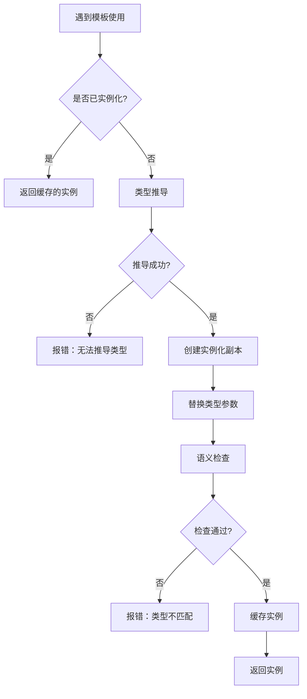
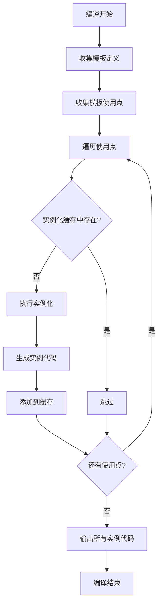
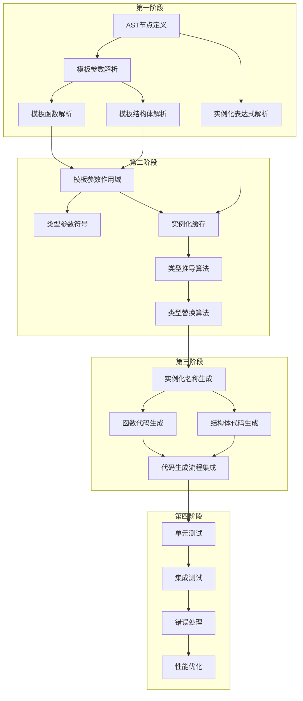

# CN语言泛型编程支持方案

> **文档说明**：本文档设计CN语言的泛型编程支持，使用中文关键字`模板`实现类型参数化。
>
> **生成时间**：2026-03-29
> **参考文档**：[`plans/003 CN语言现状分析与进化方向.md`](plans/003%20CN语言现状分析与进化方向.md)

---

## 目录

1. [概述](#一概述)
2. [语法设计](#二语法设计)
3. [词法分析扩展](#三词法分析扩展)
4. [语法分析扩展](#四语法分析扩展)
5. [模板参数解析](#五模板参数解析)
6. [模板实例化机制](#六模板实例化机制)
7. [代码生成（单态化）](#七代码生成单态化)
8. [文件修改清单](#八文件修改清单)
9. [测试策略](#九测试策略)
10. [实施顺序](#十实施顺序)

---

## 一、概述

### 1.1 目标

为CN语言添加泛型编程支持，实现以下功能：

1. **类型参数化**：允许函数和结构体使用类型参数
2. **编译期实例化**：通过单态化（Monomorphization）生成具体类型的代码
3. **类型推导**：自动推导模板参数类型
4. **实例化缓存**：避免重复生成相同类型的实例

### 1.2 范围

| 功能 | 支持范围 |
|------|---------|
| 模板函数 | ✅ 支持 |
| 模板结构体 | ✅ 支持 |
| 模板参数约束 | ⏳ 第一期不支持，预留扩展 |
| 模板默认参数 | ⏳ 第一期不支持，预留扩展 |
| 模板特化 | ❌ 不支持 |
| 模板模板参数 | ❌ 不支持 |

### 1.3 设计原则

1. **简洁性**：语法简洁，易于理解和使用
2. **类型安全**：编译期类型检查，避免运行时错误
3. **零运行时开销**：单态化生成具体代码，无泛型运行时成本
4. **与现有架构兼容**：复用现有的类型系统和代码生成器

---

## 二、语法设计

### 2.1 模板关键字

使用中文关键字 `模板` 作为泛型声明的起始关键字。

**代码来源**：[`keywords.c:47`](src/frontend/lexer/keywords.c:47) - 已定义为预留关键字

### 2.2 模板参数语法

#### 2.2.1 单参数模板

```cn
模板<T>
函数 最大值(T a, T b) -> T {
    如果 (a > b) {
        返回 a;
    }
    返回 b;
}
```

#### 2.2.2 多参数模板

```cn
模板<K, V>
结构体 键值对 {
    K 键;
    V 值;
}
```

#### 2.2.3 预留：默认参数（第二期）

```cn
模板<T, 默认类型 = 整数>  // 预留语法
函数 创建默认值() -> T {
    返回 默认类型();
}
```

#### 2.2.4 预留：参数约束（第二期）

```cn
模板<T: 可比较>  // 预留语法，约束T必须实现可比较接口
函数 排序(T[] 数组) {
    // ...
}
```

### 2.3 模板函数语法

#### 2.3.1 基本语法

```cn
模板<T>
函数 函数名(参数列表) -> 返回类型 {
    函数体
}
```

#### 2.3.2 示例

```cn
// 交换两个值
模板<T>
函数 交换(T* a, T* b) -> 空类型 {
    T 临时 = *a;
    *a = *b;
    *b = 临时;
}

// 数组查找
模板<T>
函数 查找(T[] 数组, 整数 长度, T 目标) -> 整数 {
    循环 (变量 i = 0; i < 长度; i++) {
        如果 (数组[i] == 目标) {
            返回 i;
        }
    }
    返回 -1;
}

// 泛型打印（使用类型名）
模板<T>
函数 打印值(T 值) -> 空类型 {
    打印(值);  // 依赖运行时重载或类型判断
}
```

### 2.4 模板结构体语法

#### 2.4.1 基本语法

```cn
模板<T>
结构体 结构体名 {
    字段列表
}
```

#### 2.4.2 示例

```cn
// 泛型数组包装
模板<T>
结构体 数组 {
    T* 数据;
    整数 长度;
    整数 容量;
}

// 泛型链表节点
模板<T>
结构体 链表节点 {
    T 值;
    链表节点<T>* 下一个;
}

// 键值对
模板<K, V>
结构体 映射项 {
    K 键;
    V 值;
}
```

### 2.5 模板实例化语法

#### 2.5.1 显式实例化

```cn
// 调用模板函数
整数 结果 = 最大值<整数>(10, 20);

// 声明模板结构体变量
数组<小数> 浮点数组;
映射项<字符串, 整数> 计数器;
```

#### 2.5.2 类型推导（自动实例化）

```cn
// 编译器自动推导T为整数
整数 结果 = 最大值(10, 20);

// 编译器自动推导T为小数
小数 结果2 = 最大值(3.14, 2.71);
```

### 2.6 完整示例

```cn
// 泛型栈实现
模板<T>
结构体 栈 {
    T* 数据;
    整数 顶部;
    整数 容量;
}

模板<T>
函数 栈初始化(栈<T>* s, 整数 容量) -> 空类型 {
    s.数据 = 分配内存(容量 * 大小(T));
    s.顶部 = 0;
    s.容量 = 容量;
}

模板<T>
函数 栈压入(栈<T>* s, T 值) -> 空类型 {
    如果 (s.顶部 >= s.容量) {
        返回;  // 栈满
    }
    s.数据[s.顶部] = 值;
    s.顶部 = s.顶部 + 1;
}

模板<T>
函数 栈弹出(栈<T>* s) -> T {
    如果 (s.顶部 <= 0) {
        返回 无;  // 栈空
    }
    s.顶部 = s.顶部 - 1;
    返回 s.数据[s.顶部];
}

// 使用示例
函数 主程序() -> 整数 {
    栈<整数> 整数栈;
    栈初始化(&整数栈, 100);
    栈压入(&整数栈, 42);
    栈压入(&整数栈, 100);
    整数 值 = 栈弹出(&整数栈);  // 值 = 100
    
    栈<字符串> 字符串栈;
    栈初始化(&字符串栈, 50);
    栈压入(&字符串栈, "你好");
    字符串 消息 = 栈弹出(&字符串栈);  // 消息 = "你好"
    
    返回 0;
}
```

---

## 三、词法分析扩展

### 3.1 Token类型定义

`模板` 关键字的Token类型已定义：

**代码来源**：[`token.h:45`](include/cnlang/frontend/token.h:45)

```c
CN_TOKEN_KEYWORD_TEMPLATE, // 模板
```

### 3.2 关键字注册

`模板` 关键字已注册：

**代码来源**：[`keywords.c:47`](src/frontend/lexer/keywords.c:47)

```c
{"模板", CN_TOKEN_KEYWORD_TEMPLATE, "预留关键字"},
```

### 3.3 新增Token类型

需要新增以下Token类型用于模板语法：

```c
// 在 include/cnlang/frontend/token.h 中添加

CN_TOKEN_LESS,             // <  已存在
CN_TOKEN_GREATER,          // >  已存在

// 模板参数列表分隔符（复用现有Token）
// < 和 > 用于模板参数列表
// , 用于分隔多个模板参数
```

**说明**：模板语法可以复用现有的 `<`、`>`、`,` Token，无需新增。

### 3.4 词法分析器修改

**文件**：[`src/frontend/lexer/lexer.c`](src/frontend/lexer/lexer.c:1)

**修改内容**：无需修改，`模板` 关键字已作为预留关键字处理。

---

## 四、语法分析扩展

### 4.1 AST节点设计

#### 4.1.1 模板参数节点

```c
// 在 include/cnlang/frontend/ast.h 中添加

/**
 * @brief 模板参数定义
 */
typedef struct CnAstTemplateParam {
    const char *name;             // 参数名称（如 "T"）
    size_t name_length;           // 名称长度
    struct CnType *constraint;    // 类型约束（预留，可为NULL）
    struct CnType *default_type;  // 默认类型（预留，可为NULL）
} CnAstTemplateParam;

/**
 * @brief 模板参数列表
 */
typedef struct CnAstTemplateParams {
    CnAstTemplateParam *params;   // 参数数组
    size_t param_count;           // 参数数量
} CnAstTemplateParams;
```

#### 4.1.2 模板函数声明节点

```c
/**
 * @brief 模板函数声明
 */
typedef struct CnAstTemplateFunctionDecl {
    CnAstTemplateParams *template_params;  // 模板参数
    CnAstFunctionDecl *function;           // 函数声明（复用现有结构）
} CnAstTemplateFunctionDecl;
```

#### 4.1.3 模板结构体声明节点

```c
/**
 * @brief 模板结构体声明
 */
typedef struct CnAstTemplateStructDecl {
    CnAstTemplateParams *template_params;  // 模板参数
    CnAstStructDecl *struct_decl;          // 结构体声明（复用现有结构）
} CnAstTemplateStructDecl;
```

#### 4.1.4 模板实例化表达式

```c
/**
 * @brief 模板实例化表达式
 * 
 * 用于表示 类型<参数列表> 的实例化语法
 */
typedef struct CnAstTemplateInstantiation {
    const char *template_name;        // 模板名称
    size_t template_name_length;      // 名称长度
    struct CnType **type_args;        // 类型实参数组
    size_t type_arg_count;            // 类型实参数量
} CnAstTemplateInstantiation;
```

#### 4.1.5 AST节点种类扩展

```c
// 在 CnAstStmtKind 枚举中添加
typedef enum CnAstStmtKind {
    // ... 现有类型 ...
    CN_AST_STMT_TEMPLATE_FUNCTION_DECL,  // 模板函数声明
    CN_AST_STMT_TEMPLATE_STRUCT_DECL,    // 模板结构体声明
} CnAstStmtKind;

// 在 CnAstExprKind 枚举中添加
typedef enum CnAstExprKind {
    // ... 现有类型 ...
    CN_AST_EXPR_TEMPLATE_INSTANTIATION,  // 模板实例化
} CnAstExprKind;
```

### 4.2 解析算法

#### 4.2.1 模板参数列表解析

```c
/**
 * @brief 解析模板参数列表
 * 
 * 语法：模板<参数1, 参数2, ...>
 * 
 * @param parser 解析器上下文
 * @return CnAstTemplateParams* 解析后的参数列表，失败返回NULL
 */
static CnAstTemplateParams *parse_template_params(CnParser *parser) {
    // 1. 期望 '模板' 关键字
    if (!match(parser, CN_TOKEN_KEYWORD_TEMPLATE)) {
        return NULL;
    }
    
    // 2. 期望 '<'
    if (!match(parser, CN_TOKEN_LESS)) {
        report_error(parser, "期望 '<' 开始模板参数列表");
        return NULL;
    }
    
    // 3. 解析参数列表
    CnAstTemplateParams *params = cn_ast_template_params_new();
    
    do {
        // 期望标识符作为类型参数名
        if (!check(parser, CN_TOKEN_IDENT)) {
            report_error(parser, "期望类型参数名称");
            break;
        }
        
        CnAstTemplateParam param = {
            .name = parser->current.lexeme_begin,
            .name_length = parser->current.lexeme_length,
            .constraint = NULL,    // 第一期不支持
            .default_type = NULL   // 第一期不支持
        };
        
        cn_ast_template_params_add(params, &param);
        advance(parser);
        
    } while (match(parser, CN_TOKEN_COMMA));
    
    // 4. 期望 '>'
    if (!match(parser, CN_TOKEN_GREATER)) {
        report_error(parser, "期望 '>' 结束模板参数列表");
        cn_ast_template_params_free(params);
        return NULL;
    }
    
    return params;
}
```

#### 4.2.2 模板函数解析

```c
/**
 * @brief 解析模板函数声明
 * 
 * 语法：模板<T> 函数 函数名(参数列表) -> 返回类型 { 函数体 }
 */
static CnAstStmt *parse_template_function_decl(CnParser *parser) {
    // 1. 解析模板参数
    CnAstTemplateParams *template_params = parse_template_params(parser);
    if (!template_params) {
        return NULL;
    }
    
    // 2. 解析函数声明（复用现有函数解析逻辑）
    CnAstFunctionDecl *function = parse_function_decl_internal(parser);
    if (!function) {
        cn_ast_template_params_free(template_params);
        return NULL;
    }
    
    // 3. 创建模板函数节点
    CnAstTemplateFunctionDecl *decl = cn_ast_template_function_decl_new();
    decl->template_params = template_params;
    decl->function = function;
    
    return cn_ast_stmt_new(CN_AST_STMT_TEMPLATE_FUNCTION_DECL, decl);
}
```

#### 4.2.3 模板实例化解析

```c
/**
 * @brief 解析模板实例化表达式
 * 
 * 语法：模板名<类型1, 类型2, ...>
 */
static CnAstExpr *parse_template_instantiation(CnParser *parser, const char *name, size_t name_len) {
    // 1. 期望 '<'
    if (!match(parser, CN_TOKEN_LESS)) {
        return NULL;  // 不是模板实例化
    }
    
    // 2. 解析类型实参列表
    CnAstTemplateInstantiation *inst = cn_ast_template_instantiation_new(name, name_len);
    
    do {
        // 解析类型
        CnType *type_arg = parse_type(parser);
        if (!type_arg) {
            report_error(parser, "期望类型参数");
            break;
        }
        
        cn_ast_template_instantiation_add_type_arg(inst, type_arg);
        
    } while (match(parser, CN_TOKEN_COMMA));
    
    // 3. 期望 '>'
    if (!match(parser, CN_TOKEN_GREATER)) {
        report_error(parser, "期望 '>' 结束模板实参列表");
        cn_ast_template_instantiation_free(inst);
        return NULL;
    }
    
    return cn_ast_expr_new(CN_AST_EXPR_TEMPLATE_INSTANTIATION, inst);
}
```

### 4.3 语法分析器修改

**文件**：[`src/frontend/parser/parser.c`](src/frontend/parser/parser.c:1)

**修改位置**：

1. **顶层声明解析**（约263-402行）：添加模板函数和模板结构体的解析入口

```c
// 在 parse_declaration() 函数中添加
static CnAstStmt *parse_declaration(CnParser *parser) {
    // 检查模板关键字
    if (check(parser, CN_TOKEN_KEYWORD_TEMPLATE)) {
        return parse_template_declaration(parser);
    }
    
    // ... 现有逻辑 ...
}

static CnAstStmt *parse_template_declaration(CnParser *parser) {
    // 预读判断是模板函数还是模板结构体
    // 模板<T> 函数 ... 或 模板<T> 结构体 ...
    
    CnAstTemplateParams *params = parse_template_params(parser);
    if (!params) return NULL;
    
    if (check(parser, CN_TOKEN_KEYWORD_FN)) {
        // 模板函数
        return parse_template_function_decl_with_params(parser, params);
    } else if (check(parser, CN_TOKEN_KEYWORD_STRUCT)) {
        // 模板结构体
        return parse_template_struct_decl_with_params(parser, params);
    } else {
        report_error(parser, "模板声明后期望 '函数' 或 '结构体'");
        cn_ast_template_params_free(params);
        return NULL;
    }
}
```

2. **表达式解析**（约1359-2075行）：添加模板实例化的解析

```c
// 在 parse_primary_expr() 函数中添加
static CnAstExpr *parse_primary_expr(CnParser *parser) {
    // ... 现有逻辑 ...
    
    if (check(parser, CN_TOKEN_IDENT)) {
        const char *name = parser->current.lexeme_begin;
        size_t name_len = parser->current.lexeme_length;
        advance(parser);
        
        // 检查是否是模板实例化
        if (check(parser, CN_TOKEN_LESS)) {
            return parse_template_instantiation(parser, name, name_len);
        }
        
        // 普通标识符
        return cn_ast_expr_identifier(name, name_len);
    }
    
    // ... 现有逻辑 ...
}
```

---

## 五、模板参数解析

### 5.1 类型参数表

模板参数表存储在 `CnAstTemplateParams` 结构中：

```c
/**
 * @brief 模板参数表结构
 */
struct CnAstTemplateParams {
    CnAstTemplateParam *params;   // 参数数组
    size_t param_count;           // 参数数量
    size_t capacity;              // 容量
};
```

### 5.2 参数作用域

模板参数在函数/结构体内部作为类型名使用：

```c
/**
 * @brief 创建模板参数作用域
 * 
 * 将模板参数注册为类型符号，使其在函数体/结构体内部可用
 */
void cn_template_params_bind_to_scope(
    CnAstTemplateParams *params,
    CnSemScope *scope
) {
    for (size_t i = 0; i < params->param_count; i++) {
        CnAstTemplateParam *param = &params->params[i];
        
        // 创建类型符号
        CnSemSymbol *sym = cn_sem_symbol_new(
            param->name,
            param->name_length,
            CN_SYM_TYPE_PARAMETER,  // 新增符号类型
            NULL  // 类型参数本身没有类型
        );
        
        // 添加到作用域
        cn_sem_scope_insert(scope, sym);
    }
}
```

### 5.3 参数约束（预留）

第一期不支持参数约束，但预留扩展接口：

```c
/**
 * @brief 检查类型是否满足约束
 * 
 * 第一期始终返回true，第二期实现约束检查
 */
bool cn_template_check_constraint(
    CnType *type,
    CnType *constraint
) {
    if (constraint == NULL) {
        return true;  // 无约束
    }
    
    // TODO: 第二期实现接口约束检查
    return true;
}
```

---

## 六、模板实例化机制

### 6.1 实例化时机

模板实例化发生在以下时机：

| 场景 | 实例化时机 | 说明 |
|------|-----------|------|
| 函数调用 | 首次调用时 | 根据实参类型推导模板参数 |
| 类型声明 | 使用模板类型时 | 如 `栈<整数> s;` |
| 显式实例化 | 编译到实例化点时 | 如 `最大值<整数>(a, b);` |

### 6.2 实例化缓存

```c
/**
 * @brief 模板实例化缓存
 * 
 * 存储已实例化的模板，避免重复生成
 */
typedef struct CnTemplateInstance {
    const char *template_name;       // 模板名称
    size_t template_name_length;     // 名称长度
    CnType **type_args;              // 类型实参
    size_t type_arg_count;           // 实参数量
    
    // 实例化结果
    CnAstFunctionDecl *instantiated_function;  // 实例化的函数（如果是函数模板）
    CnAstStructDecl *instantiated_struct;      // 实例化的结构体（如果是结构体模板）
    CnType *instantiated_type;                 // 实例化的类型
} CnTemplateInstance;

/**
 * @brief 模板实例化缓存表
 */
typedef struct CnTemplateInstanceCache {
    CnTemplateInstance *instances;   // 实例数组
    size_t instance_count;           // 实例数量
    size_t capacity;                 // 容量
} CnTemplateInstanceCache;
```

### 6.3 类型推导

```c
/**
 * @brief 从函数实参推导模板参数
 * 
 * @param template_params 模板形参列表
 * @param call_args 函数调用实参列表
 * @param out_type_args 输出的类型实参
 * @return int 推导成功返回1，失败返回0
 */
int cn_template_deduce_type_args(
    CnAstTemplateParams *template_params,
    CnAstExpr **call_args,
    size_t call_arg_count,
    CnType ***out_type_args
) {
    // 1. 初始化类型实参数组
    CnType **type_args = calloc(template_params->param_count, sizeof(CnType*));
    
    // 2. 遍历函数参数，进行类型推导
    for (size_t i = 0; i < call_arg_count; i++) {
        CnType *arg_type = cn_ast_expr_get_type(call_args[i]);
        
        // 获取对应函数参数的类型（可能包含模板参数）
        // 如果是模板参数T，则推导 T = arg_type
        // 如果是复合类型（如 T*），则进行模式匹配
    }
    
    // 3. 检查是否所有模板参数都已推导
    for (size_t i = 0; i < template_params->param_count; i++) {
        if (type_args[i] == NULL) {
            // 推导失败
            free(type_args);
            return 0;
        }
    }
    
    *out_type_args = type_args;
    return 1;
}
```

### 6.4 实例化流程



### 6.5 实例化实现

```c
/**
 * @brief 实例化模板函数
 * 
 * @param template 模板函数声明
 * @param type_args 类型实参
 * @param type_arg_count 类型实参数量
 * @return CnAstFunctionDecl* 实例化的函数声明
 */
CnAstFunctionDecl *cn_template_instantiate_function(
    CnAstTemplateFunctionDecl *template,
    CnType **type_args,
    size_t type_arg_count
) {
    // 1. 创建函数声明的深拷贝
    CnAstFunctionDecl *instance = cn_ast_function_decl_clone(template->function);
    
    // 2. 构建类型参数映射表
    CnTypeMap *type_map = cn_type_map_new();
    for (size_t i = 0; i < template->template_params->param_count; i++) {
        const char *param_name = template->template_params->params[i].name;
        cn_type_map_insert(type_map, param_name, type_args[i]);
    }
    
    // 3. 替换函数参数类型中的模板参数
    for (size_t i = 0; i < instance->parameter_count; i++) {
        instance->parameters[i].declared_type = 
            cn_type_substitute(instance->parameters[i].declared_type, type_map);
    }
    
    // 4. 替换返回类型中的模板参数
    if (instance->return_type) {
        instance->return_type = cn_type_substitute(instance->return_type, type_map);
    }
    
    // 5. 替换函数体中的类型引用
    cn_ast_block_substitute_types(instance->body, type_map);
    
    // 6. 生成实例化名称
    // 例如：最大值<整数> -> __cn_template_最大值_整数
    instance->name = cn_template_generate_instance_name(
        template->function->name,
        type_args,
        type_arg_count
    );
    
    cn_type_map_free(type_map);
    return instance;
}
```

---

## 七、代码生成（单态化）

### 7.1 单态化策略

CN语言采用**编译期单态化**策略：

1. **完全展开**：每个实例化类型生成独立的代码
2. **零运行时开销**：生成的代码与手写特化版本相同
3. **代码膨胀控制**：通过实例化缓存避免重复生成

### 7.2 实例化名称生成

```c
/**
 * @brief 生成模板实例的唯一名称
 * 
 * 格式：__cn_template_原名称_类型1_类型2_...
 * 
 * 例如：最大值<整数> -> __cn_template_最大值_整数
 *       栈<小数> -> __cn_template_栈_小数
 */
const char *cn_template_generate_instance_name(
    const char *template_name,
    CnType **type_args,
    size_t type_arg_count
) {
    // 计算名称长度
    size_t len = strlen("__cn_template_") + strlen(template_name);
    for (size_t i = 0; i < type_arg_count; i++) {
        len += 1;  // 下划线
        len += strlen(cn_type_get_name(type_args[i]));
    }
    
    // 构建名称
    char *name = malloc(len + 1);
    strcpy(name, "__cn_template_");
    strcat(name, template_name);
    
    for (size_t i = 0; i < type_arg_count; i++) {
        strcat(name, "_");
        strcat(name, cn_type_get_name(type_args[i]));
    }
    
    return name;
}
```

### 7.3 C代码生成

#### 7.3.1 模板函数代码生成

```c
/**
 * @brief 生成模板函数实例的C代码
 * 
 * @param cgen 代码生成器上下文
 * @param instance 实例化的函数
 */
void cn_cgen_template_function_instance(
    CnCgenContext *cgen,
    CnAstFunctionDecl *instance
) {
    // 与普通函数代码生成相同，只是函数名被替换
    // 例如：
    // CN: 模板<T> 函数 最大值(T a, T b) -> T { ... }
    // 实例化<整数>: long long __cn_template_最大值_整数(long long a, long long b) { ... }
    
    cn_cgen_function(cgen, instance);
}
```

#### 7.3.2 模板结构体代码生成

```c
/**
 * @brief 生成模板结构体实例的C代码
 * 
 * @param cgen 代码生成器上下文
 * @param instance 实例化的结构体
 */
void cn_cgen_template_struct_instance(
    CnCgenContext *cgen,
    CnAstStructDecl *instance
) {
    // 例如：
    // CN: 模板<T> 结构体 栈 { T* 数据; 整数 顶部; }
    // 实例化<整数>: struct __cn_template_栈_整数 { long long* 数据; long long 顶部; }
    
    fprintf(cgen->out, "struct %s {\n", instance->name);
    
    for (size_t i = 0; i < instance->field_count; i++) {
        CnAstStructField *field = &instance->fields[i];
        const char *c_type = get_c_type_string(field->field_type);
        fprintf(cgen->out, "    %s %s;\n", c_type, field->name);
    }
    
    fprintf(cgen->out, "};\n");
}
```

### 7.4 代码生成流程



### 7.5 代码生成器修改

**文件**：[`src/backend/cgen/cgen.c`](src/backend/cgen/cgen.c:1)

**修改内容**：

1. 添加模板实例化代码生成入口
2. 在遍历AST时收集模板使用点
3. 在代码生成阶段输出所有实例化代码

```c
// 在 cn_cgen_program() 函数中添加

void cn_cgen_program(CnCgenContext *cgen, CnAstProgram *program) {
    // 1. 收集模板定义
    CnTemplateRegistry *templates = cn_template_registry_new();
    collect_template_definitions(templates, program);
    
    // 2. 收集模板使用点并实例化
    CnTemplateInstanceCache *cache = cn_template_instance_cache_new();
    collect_and_instantiate_templates(templates, cache, program);
    
    // 3. 生成所有实例化代码
    for (size_t i = 0; i < cache->instance_count; i++) {
        CnTemplateInstance *inst = &cache->instances[i];
        if (inst->instantiated_function) {
            cn_cgen_function(cgen, inst->instantiated_function);
        }
        if (inst->instantiated_struct) {
            cn_cgen_struct(cgen, inst->instantiated_struct);
        }
    }
    
    // 4. 生成普通代码（跳过模板定义本身）
    // ... 现有逻辑 ...
    
    cn_template_registry_free(templates);
    cn_template_instance_cache_free(cache);
}
```

---

## 八、文件修改清单

### 8.1 需要新建的文件

| 文件路径 | 说明 | 预估行数 |
|---------|------|---------|
| `include/cnlang/frontend/template.h` | 模板相关数据结构和接口声明 | ~150行 |
| `src/frontend/template/template.c` | 模板实例化核心逻辑 | ~400行 |
| `src/frontend/template/template_cache.c` | 模板实例化缓存实现 | ~200行 |
| `src/frontend/template/template_deduce.c` | 类型推导实现 | ~300行 |
| `src/frontend/template/template_subst.c` | 类型替换实现 | ~250行 |
| `tests/unit/template_test.c` | 模板功能单元测试 | ~500行 |

### 8.2 需要修改的文件

| 文件路径 | 修改内容 | 修改位置 |
|---------|---------|---------|
| `include/cnlang/frontend/token.h` | 确认 `CN_TOKEN_KEYWORD_TEMPLATE` 已定义 | 第45行 |
| `include/cnlang/frontend/ast.h` | 添加模板相关AST节点定义 | 新增约100行 |
| `src/frontend/lexer/keywords.c` | 确认 `模板` 关键字已注册 | 第47行 |
| `src/frontend/parser/parser.c` | 添加模板语法解析逻辑 | 新增约300行 |
| `include/cnlang/frontend/semantics.h` | 添加模板参数类型支持 | 新增约50行 |
| `src/semantics/resolution/scope_builder.c` | 处理模板参数作用域 | 新增约100行 |
| `src/backend/cgen/cgen.c` | 添加模板实例化代码生成 | 新增约150行 |
| `src/CMakeLists.txt` | 添加新源文件到构建系统 | 新增约5行 |

### 8.3 目录结构

```
src/frontend/template/
├── template.c           # 模板核心逻辑
├── template_cache.c     # 实例化缓存
├── template_deduce.c    # 类型推导
└── template_subst.c     # 类型替换

include/cnlang/frontend/
└── template.h           # 模板接口声明
```

---

## 九、测试策略

### 9.1 单元测试用例

#### 9.1.1 词法分析测试

```c
// 测试模板关键字识别
void test_lexer_template_keyword() {
    const char *source = "模板<T>";
    CnLexer *lexer = cn_lexer_new(source);
    CnToken tok = cn_lexer_next(lexer);
    
    ASSERT_EQ(tok.kind, CN_TOKEN_KEYWORD_TEMPLATE);
    cn_lexer_free(lexer);
}
```

#### 9.1.2 语法分析测试

```c
// 测试模板函数解析
void test_parser_template_function() {
    const char *source = 
        "模板<T> "
        "函数 最大值(T a, T b) -> T {"
        "    如果 (a > b) { 返回 a; }"
        "    返回 b;"
        "}";
    
    CnParser *parser = cn_parser_new(source);
    CnAstStmt *stmt = cn_parser_parse_declaration(parser);
    
    ASSERT_NOT_NULL(stmt);
    ASSERT_EQ(stmt->kind, CN_AST_STMT_TEMPLATE_FUNCTION_DECL);
    
    cn_parser_free(parser);
}

// 测试模板结构体解析
void test_parser_template_struct() {
    const char *source = 
        "模板<T> "
        "结构体 容器 {"
        "    T 数据;"
        "    整数 长度;"
        "}";
    
    CnParser *parser = cn_parser_new(source);
    CnAstStmt *stmt = cn_parser_parse_declaration(parser);
    
    ASSERT_NOT_NULL(stmt);
    ASSERT_EQ(stmt->kind, CN_AST_STMT_TEMPLATE_STRUCT_DECL);
    
    cn_parser_free(parser);
}
```

#### 9.1.3 类型推导测试

```c
// 测试简单类型推导
void test_deduce_simple_type() {
    // 模板<T> 函数 最大值(T a, T b) -> T
    // 调用：最大值(10, 20)
    // 推导：T = 整数
    
    CnType *int_type = cn_type_new_primitive(CN_TYPE_INT64);
    CnType *type_args[1] = {NULL};
    
    int result = cn_template_deduce_from_args(
        template_params,
        &int_type, 1,  // 实参类型
        type_args
    );
    
    ASSERT_EQ(result, 1);
    ASSERT_TRUE(cn_type_equals(type_args[0], int_type));
}

// 测试指针类型推导
void test_deduce_pointer_type() {
    // 模板<T> 函数 交换(T* a, T* b)
    // 调用：交换(&x, &y)  其中 x, y 是整数
    // 推导：T = 整数
    
    CnType *int_type = cn_type_new_primitive(CN_TYPE_INT64);
    CnType *int_ptr = cn_type_new_pointer(int_type);
    CnType *type_args[1] = {NULL};
    
    int result = cn_template_deduce_from_args(
        template_params,
        &int_ptr, 1,
        type_args
    );
    
    ASSERT_EQ(result, 1);
    ASSERT_TRUE(cn_type_equals(type_args[0], int_type));
}
```

#### 9.1.4 实例化测试

```c
// 测试函数实例化
void test_instantiate_function() {
    // 模板<T> 函数 最大值(T a, T b) -> T
    // 实例化<整数>
    
    CnAstFunctionDecl *instance = cn_template_instantiate_function(
        template_function,
        &int_type, 1
    );
    
    ASSERT_NOT_NULL(instance);
    ASSERT_STR_EQ(instance->name, "__cn_template_最大值_整数");
    ASSERT_TRUE(cn_type_equals(instance->parameters[0].declared_type, int_type));
    ASSERT_TRUE(cn_type_equals(instance->parameters[1].declared_type, int_type));
    ASSERT_TRUE(cn_type_equals(instance->return_type, int_type));
}

// 测试结构体实例化
void test_instantiate_struct() {
    // 模板<T> 结构体 栈 { T* 数据; 整数 顶部; }
    // 实例化<小数>
    
    CnAstStructDecl *instance = cn_template_instantiate_struct(
        template_struct,
        &float_type, 1
    );
    
    ASSERT_NOT_NULL(instance);
    ASSERT_STR_EQ(instance->name, "__cn_template_栈_小数");
    ASSERT_TRUE(cn_type_is_pointer(instance->fields[0].field_type));
    ASSERT_TRUE(cn_type_equals(
        cn_type_get_pointer_base(instance->fields[0].field_type),
        float_type
    ));
}
```

### 9.2 集成测试用例

#### 9.2.1 简单模板函数

```cn
// test_simple_template.cn
模板<T>
函数 加一(T x) -> T {
    返回 x + 1;
}

函数 主程序() -> 整数 {
    整数 a = 加一(10);      // 推导 T = 整数
    小数 b = 加一(3.14);    // 推导 T = 小数
    
    打印(a);  // 输出: 11
    打印(b);  // 输出: 4.14
    
    返回 0;
}
```

#### 9.2.2 多参数模板

```cn
// test_multi_param_template.cn
模板<K, V>
结构体 键值对 {
    K 键;
    V 值;
}

函数 主程序() -> 整数 {
    键值对<字符串, 整数> 项1;
    项1.键 = "年龄";
    项1.值 = 25;
    
    键值对<整数, 小数> 项2;
    项2.键 = 1;
    项2.值 = 99.9;
    
    返回 0;
}
```

#### 9.2.3 泛型数据结构

```cn
// test_generic_stack.cn
模板<T>
结构体 栈 {
    T* 数据;
    整数 顶部;
    整数 容量;
}

模板<T>
函数 栈初始化(栈<T>* s, 整数 容量) -> 空类型 {
    s.数据 = 分配内存(容量 * 大小(T));
    s.顶部 = 0;
    s.容量 = 容量;
}

模板<T>
函数 栈压入(栈<T>* s, T 值) -> 空类型 {
    如果 (s.顶部 < s.容量) {
        s.数据[s.顶部] = 值;
        s.顶部 = s.顶部 + 1;
    }
}

模板<T>
函数 栈弹出(栈<T>* s) -> T {
    如果 (s.顶部 > 0) {
        s.顶部 = s.顶部 - 1;
        返回 s.数据[s.顶部];
    }
    返回 无;
}

函数 主程序() -> 整数 {
    栈<整数> 整数栈;
    栈初始化(&整数栈, 100);
    
    栈压入(&整数栈, 1);
    栈压入(&整数栈, 2);
    栈压入(&整数栈, 3);
    
    整数 值 = 栈弹出(&整数栈);  // 值 = 3
    
    返回 0;
}
```

#### 9.2.4 类型推导边界情况

```cn
// test_deduction_edge_cases.cn
模板<T>
函数 打印值(T 值) -> 空类型 {
    打印(值);
}

函数 主程序() -> 整数 {
    // 字面量推导
    打印值(42);        // T = 整数
    打印值(3.14);      // T = 小数
    打印值("你好");    // T = 字符串
    打印值(真);        // T = 布尔
    
    // 变量推导
    整数 x = 100;
    打印值(x);         // T = 整数
    
    返回 0;
}
```

### 9.3 错误测试用例

```cn
// test_template_errors.cn

// 错误1：模板参数数量不匹配
模板<T>
函数 单参数(T x) -> T { 返回 x; }

函数 测试错误1() {
    单参数<整数, 小数>(10);  // 错误：期望1个参数，提供2个
}

// 错误2：类型推导失败
模板<T>
函数 相等(T a, T b) -> 布尔 {
    返回 a == b;
}

函数 测试错误2() {
    相等(10, 3.14);  // 错误：无法推导T，整数和小数冲突
}

// 错误3：使用未实例化的模板
模板<T>
结构体 容器 { T 值; }

函数 测试错误3() {
    容器 c;  // 错误：缺少模板参数
    容器<整数> c2;  // 正确
}
```

---

## 十、实施顺序

### 10.1 第一阶段：基础框架（预计工作量：中）

| 任务 | 说明 | 依赖 |
|------|------|------|
| 1.1 AST节点定义 | 在 `ast.h` 中添加模板相关节点 | 无 |
| 1.2 模板参数解析 | 实现 `parse_template_params()` | 1.1 |
| 1.3 模板函数解析 | 实现 `parse_template_function_decl()` | 1.2 |
| 1.4 模板结构体解析 | 实现 `parse_template_struct_decl()` | 1.2 |
| 1.5 模板实例化表达式解析 | 实现 `parse_template_instantiation()` | 1.1 |

**验收标准**：
- 能够正确解析模板函数和模板结构体声明
- 能够正确解析模板实例化表达式
- AST节点结构完整，可通过单元测试

### 10.2 第二阶段：语义分析（预计工作量：中）

| 任务 | 说明 | 依赖 |
|------|------|------|
| 2.1 模板参数作用域 | 将模板参数绑定到作用域 | 1.x |
| 2.2 类型参数符号 | 添加 `CN_SYM_TYPE_PARAMETER` 符号类型 | 2.1 |
| 2.3 模板实例化缓存 | 实现实例化缓存机制 | 2.1 |
| 2.4 类型推导算法 | 实现模板参数类型推导 | 2.3 |
| 2.5 类型替换算法 | 实现类型参数替换 | 2.4 |

**验收标准**：
- 模板参数在函数体/结构体内可见
- 类型推导能够正确推导简单类型
- 类型替换能够正确生成实例化类型

### 10.3 第三阶段：代码生成（预计工作量：中）

| 任务 | 说明 | 依赖 |
|------|------|------|
| 3.1 实例化名称生成 | 生成唯一的实例化名称 | 2.x |
| 3.2 模板函数代码生成 | 生成实例化函数的C代码 | 3.1 |
| 3.3 模板结构体代码生成 | 生成实例化结构体的C代码 | 3.1 |
| 3.4 代码生成流程集成 | 在编译流程中集成模板实例化 | 3.2, 3.3 |

**验收标准**：
- 生成的C代码能够正确编译
- 实例化代码功能正确
- 无代码重复生成

### 10.4 第四阶段：测试与优化（预计工作量：低）

| 任务 | 说明 | 依赖 |
|------|------|------|
| 4.1 单元测试 | 编写完整的单元测试 | 3.x |
| 4.2 集成测试 | 编写集成测试用例 | 4.1 |
| 4.3 错误处理 | 完善错误诊断信息 | 4.2 |
| 4.4 性能优化 | 优化实例化缓存和类型推导 | 4.3 |

**验收标准**：
- 所有单元测试通过
- 所有集成测试通过
- 错误信息清晰准确

### 10.5 实施依赖图



---

## 附录A：与其他语言对比

| 特性 | CN语言 | C++ | Rust | Java |
|------|--------|-----|------|------|
| 语法 | `模板<T>` | `template<typename T>` | `fn name<T>()` | `<T>` |
| 实例化方式 | 单态化 | 单态化 | 单态化 | 类型擦除 |
| 类型推导 | 支持 | 部分 | 完整 | 不支持 |
| 参数约束 | 预留 | concepts | where子句 | extends |
| 运行时开销 | 零 | 零 | 零 | 有 |

---

## 附录B：参考资料

1. [`plans/003 CN语言现状分析与进化方向.md`](plans/003%20CN语言现状分析与进化方向.md) - 项目现状分析
2. [`plans/001 CN Language语法规范设计文档.md`](plans/001%20CN%20Language语法规范设计文档.md) - 语法规范
3. [`src/frontend/lexer/keywords.c`](src/frontend/lexer/keywords.c:1) - 关键字定义
4. [`include/cnlang/frontend/token.h`](include/cnlang/frontend/token.h:1) - Token类型定义
5. [`include/cnlang/frontend/ast.h`](include/cnlang/frontend/ast.h:1) - AST节点定义
6. [`include/cnlang/frontend/semantics.h`](include/cnlang/frontend/semantics.h:1) - 类型系统定义

---

## 附录C：实施状态

### 已完成功能

| 阶段 | 功能 | 状态 | 完成时间 |
|------|------|------|---------|
| 第一阶段 | 词法分析扩展 | ✅ 已完成 | - |
| 第一阶段 | 语法分析扩展 | ✅ 已完成 | - |
| 第二阶段 | 模板参数解析 | ✅ 已完成 | 2026-03-29 |
| 第二阶段 | 实例化缓存 | ✅ 已完成 | 2026-03-29 |
| 第二阶段 | 类型推导算法 | ✅ 已完成 | 2026-03-29 |
| 第二阶段 | 类型替换算法 | ✅ 已完成 | 2026-03-29 |
| 第三阶段 | 实例化名称生成 | ✅ 已完成 | 2026-03-29 |
| 第三阶段 | 函数代码生成 | ✅ 已完成 | 2026-03-29 |
| 第三阶段 | 结构体代码生成 | ✅ 已完成 | 2026-03-29 |
| 第三阶段 | 代码生成流程集成 | ✅ 已完成 | 2026-03-29 |
| 第四阶段 | 单元测试 | ⏳ 待实现 | - |
| 第四阶段 | 集成测试 | ⏳ 待实现 | - |

### 新增文件清单

| 文件路径 | 说明 | 行数 |
|---------|------|------|
| `include/cnlang/semantics/template.h` | 模板相关接口头文件 | ~425行 |
| `include/cnlang/backend/template_cgen.h` | 模板代码生成接口 | ~110行 |
| `src/semantics/template/template_cache.c` | 模板实例化缓存实现 | ~450行 |
| `src/semantics/template/template_instantiation.c` | 模板实例化核心逻辑 | ~494行 |
| `src/semantics/template/type_substitution.c` | 类型替换实现 | ~350行 |
| `src/backend/cgen/template_cgen.c` | 模板代码生成实现 | ~390行 |

### 代码生成示例

**CN代码**：
```cn
模板<T>
函数 最大值(T a, T b) -> T {
    如果 (a > b) { 返回 a; }
    返回 b;
}

整数 主函数() {
    整数 x = 最大值<整数>(1, 2);
    返回 0;
}
```

**生成的C代码**：
```c
long long __cn_template_最大值_int(long long a, long long b) {
    if (a > b) { return a; }
    return b;
}

int main() {
    long long x = __cn_template_最大值_int(1, 2);
    return 0;
}
```

### 文档版本

- v1.0 - 初始设计文档
- v1.1 - 添加实施状态（2026-03-29）

---

> **文档结束**
>
> 本文档设计CN语言的泛型编程支持，所有设计决策均基于现有编译器架构。实施时请参考对应的源代码文件。
