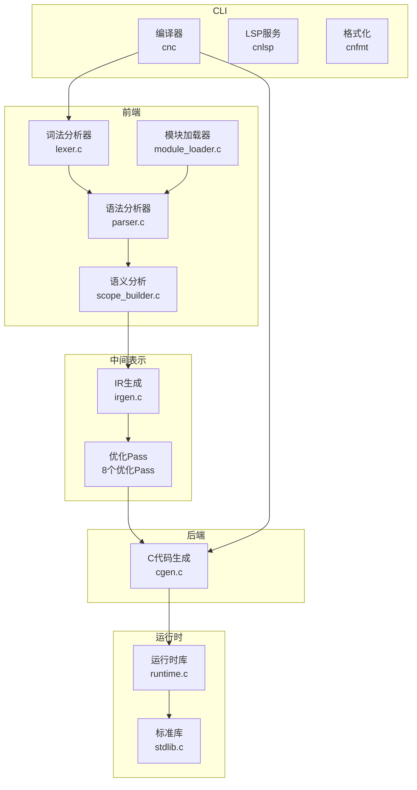
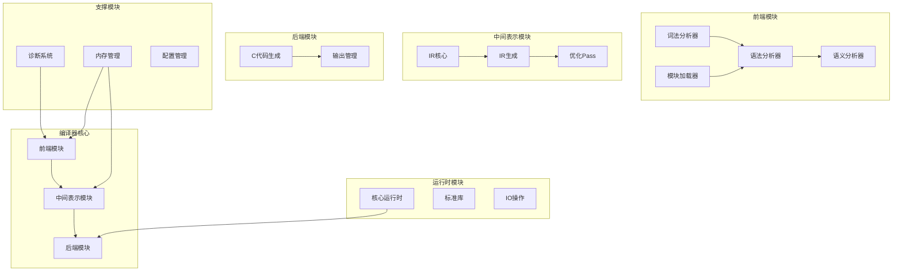
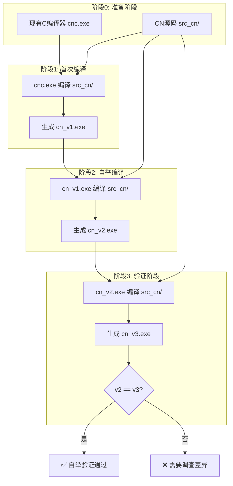
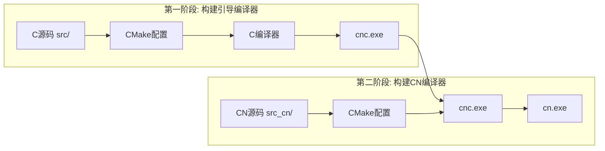
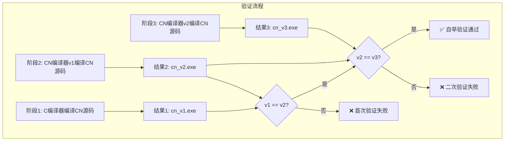
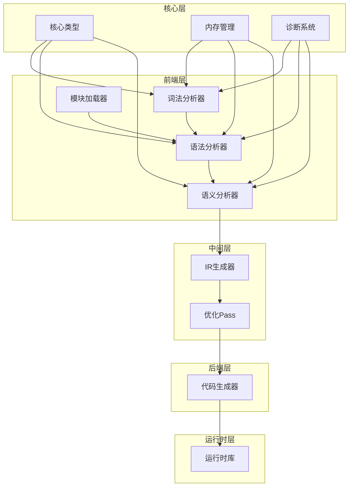
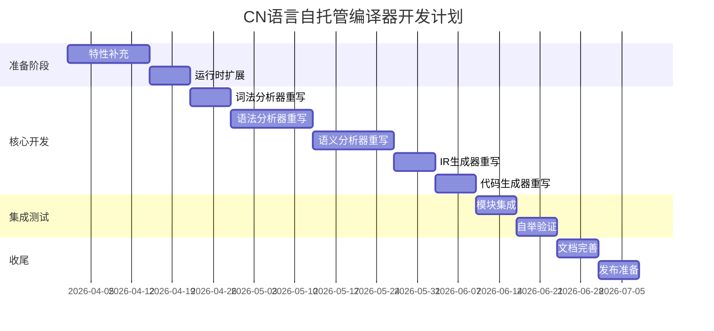
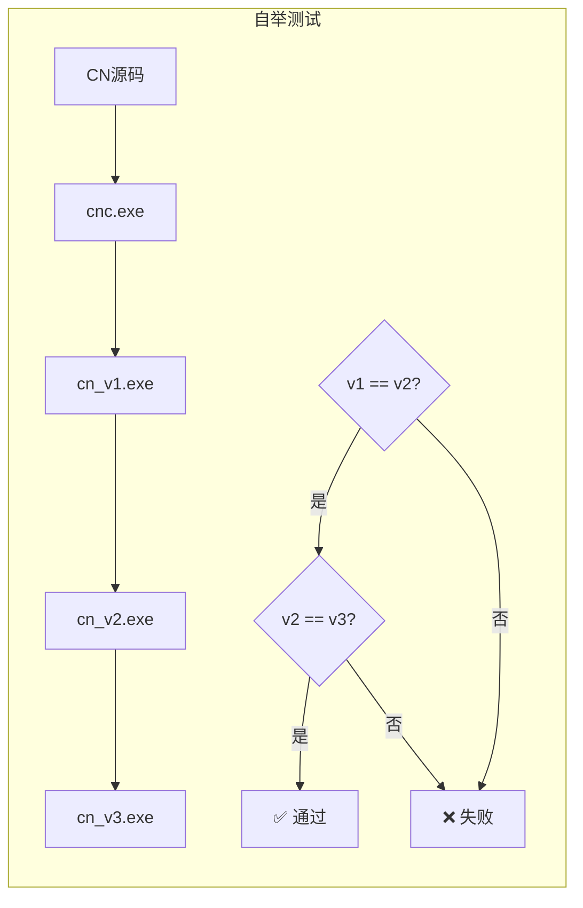
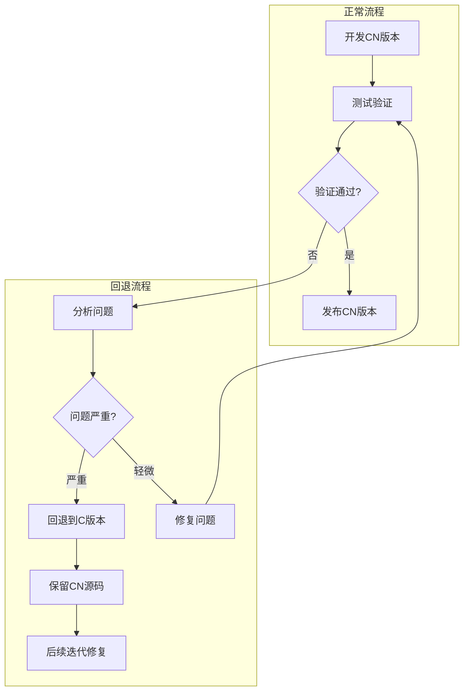

# CN语言自托管编译器技术设计文档

> **文档版本**: v2.0
> **创建时间**: 2026-03-30
> **更新时间**: 2026-03-30
> **文档序号**: 014
> **参考文档**:
> - [`plans/003 CN语言现状分析与进化方向.md`](plans/003%20CN语言现状分析与进化方向.md)
> - [`plans/001 CN Language语法规范设计文档.md`](plans/001%20CN%20Language语法规范设计文档.md)

---

## 目录

1. [概述](#1-概述)
2. [现状分析](#2-现状分析)
3. [架构设计](#3-架构设计)
4. [技术方案](#4-技术方案)
5. [代码组织](#5-代码组织)
6. [开发计划](#6-开发计划)
7. [测试策略](#7-测试策略)
8. [风险与缓解](#8-风险与缓解)
9. [附录](#9-附录)

---

## 1. 概述

### 1.1 项目目标

CN语言自托管编译器项目的核心目标是**用CN语言重写整个CN语言编译器**，实现编译器的自我编译能力。这标志着CN语言从"可用"到"成熟"的重要里程碑。

**具体目标**：

1. **完全自托管**：编译器能够编译自身源代码
2. **功能等价**：CN版本编译器与现有C版本功能完全一致
3. **性能可接受**：编译速度不低于C版本的80%
4. **可维护性**：代码结构清晰，便于后续维护和扩展

### 1.2 自托管定义

**自托管（Self-hosting）** 是指编译器能够编译自身源代码的能力。CN语言自托管的具体定义：

```
┌─────────────────────────────────────────────────────────────┐
│                    自托管定义                                │
├─────────────────────────────────────────────────────────────┤
│  1. CN编译器源代码使用CN语言编写                             │
│  2. 使用现有C编译器(cnc.exe)作为引导程序编译CN源码            │
│  3. 生成的CN编译器能够编译CN语言源代码                       │
│  4. 生成的CN编译器能够编译自身源代码（自举验证）              │
│  5. 两次编译结果一致（三阶段自举验证通过）                    │
└─────────────────────────────────────────────────────────────┘
```

**自托管层级**：

| 层级 | 定义 | CN语言目标 |
|------|------|-----------|
| Level 0 | 依赖其他语言实现 | 当前状态（C实现） |
| Level 1 | 能编译自身源代码 | **本次目标** |
| Level 2 | 自举验证通过 | **本次目标** |
| Level 3 | 能编译其他语言编译器 | 未来扩展 |

### 1.3 预期收益

#### 1.3.1 技术收益

| 收益项 | 说明 |
|--------|------|
| **语言验证** | 自托管是语言完整性的最佳证明 |
| **设计改进** | 编写编译器过程中发现语言设计的不足 |
| **性能优化** | 编译器自身性能优化需求驱动语言优化 |
| **生态建设** | 为CN语言生态提供核心基础设施 |

#### 1.3.2 实践收益

```cn
// 使用CN语言编写编译器的优势示例

// 1. 中文命名，代码更易读
函数 解析表达式(词法分析器* 分析器) -> 表达式节点* {
    变量 左操作数 = 解析基本表达式(分析器);
    当 (是二元运算符(分析器.当前词元)) {
        变量 运算符 = 获取运算符(分析器);
        变量 右操作数 = 解析基本表达式(分析器);
        左操作数 = 创建二元表达式(左操作数, 运算符, 右操作数);
    }
    返回 左操作数;
}

// 2. 模块系统天然支持编译器组件化
导入 词法分析器;
导入 语法分析器;
导入 语义分析器;
导入 代码生成器;

// 3. 类型推断减少冗余代码
变量 符号表 = 创建符号表();  // 自动推断为 符号表* 类型
```

---

## 2. 现状分析

### 2.1 CN语言特性覆盖率

基于 [`plans/003 CN语言现状分析与进化方向.md`](plans/003%20CN语言现状分析与进化方向.md) 的分析，CN语言特性覆盖率评估如下：

#### 2.1.1 总体覆盖率

| 模块 | 源文件数 | 代码行数 | 完成度 | 自托管就绪 |
|------|---------|---------|--------|-----------|
| 词法分析器 | 3 | 923行 | ✅ 100% | ✅ 就绪 |
| 语法分析器 | 1 | 4409行 | ✅ 100% | ✅ 就绪 |
| 语义分析 | 4 | 2868行 | ✅ 95% | ✅ 就绪 |
| 模块加载器 | 1 | 1851行 | ✅ 95% | ✅ 就绪 |
| 代码生成 | 2 | ~2000行 | ✅ 95% | ✅ 就绪 |
| 运行时库 | 9 | ~1800行 | ✅ 100% | ✅ 就绪 |
| IR中间表示 | 10 | ~2000行 | ✅ 95% | ✅ 就绪 |
| CLI工具 | 6 | ~1500行 | ✅ 100% | ✅ 就绪 |

**总体覆盖率**: **97%** ✅

> **更新说明**（2026-03-30）：
> - 函数指针语法已完整支持（结构体字段、函数参数、变量声明、调用）
> - 命令行参数标准库接口已实现（`cn_rt_cli_*` 系列函数）
> - 运行时库新增 `cli.c` 模块，支持命令行参数处理

#### 2.1.2 已支持特性（可直接使用）

| 特性 | CN语法示例 | 对应C实现位置 |
|------|-----------|--------------|
| 动态数组 | `CnVector* cn_rt_vector_create()` | [`src/runtime/collections/collections.c`](src/runtime/collections/collections.c) |
| 字符串操作 | `cn_rt_string_concat()`, `cn_rt_string_length()` | [`src/runtime/core/runtime.c`](src/runtime/core/runtime.c) |
| 内存管理 | `cn_rt_malloc()`, `cn_rt_free()` | [`src/runtime/memory/memory.c`](src/runtime/memory/memory.c) |
| 哈希表 | `CnHashMap* cn_rt_hashmap_create()` | [`src/runtime/collections/collections.c`](src/runtime/collections/collections.c) |
| 文件操作 | `cn_rt_file_open()`, `cn_rt_file_read()` | [`src/runtime/io/io.c`](src/runtime/io/io.c) |
| 命令行参数 | `cn_rt_get_argc()`, `cn_rt_get_argv()` | [`src/runtime/core/runtime.c`](src/runtime/core/runtime.c) |
| 函数指针作为结构体字段 | `结构体 S { 整数(*回调)(整数); }` | [`src/frontend/parser/parser.c:3664`](src/frontend/parser/parser.c:3664) |
| 函数指针作为函数参数 | `函数 f(整数(*回调)(整数))` | [`src/frontend/parser/parser.c:528`](src/frontend/parser/parser.c:528) |
| 函数指针变量声明 | `整数(*回调)(整数, 整数)` | [`src/frontend/parser/parser.c:1518`](src/frontend/parser/parser.c:1518) |
| 函数指针调用 | `回调(参数)` | [`src/semantics/checker/semantic_passes.c:1320`](src/semantics/checker/semantic_passes.c:1320) |
| 命令行参数标准库接口 | `cn_rt_cli_argc()`, `cn_rt_cli_argv()` | [`include/cnlang/runtime/cli.h`](include/cnlang/runtime/cli.h) |
| 命令行选项查找 | `cn_rt_cli_find_option()`, `cn_rt_cli_has_option()` | [`include/cnlang/runtime/cli.h`](include/cnlang/runtime/cli.h) |
| 中文函数名映射 | `获取参数个数()`, `获取参数(0)` | [`include/cnlang/runtime/cli.h`](include/cnlang/runtime/cli.h) |

#### 2.1.3 需要补充的特性

| 特性 | 优先级 | 说明 | 实现方案 |
|------|--------|------|---------|
| 动态链接支持 | ⭐ 低 | 可选，静态链接已满足需求 | 后续版本 |

### 2.2 现有编译器架构

#### 2.2.1 模块结构图



#### 2.2.2 数据流图


### 2.3 已实现特性详解

> **注意**：以下特性已在 2026-03-29 完成 implementation，此处保留设计文档供参考。

#### 2.3.1 函数指针语法 ✅ 已实现

**实现状态**：✅ 已完成

**实现位置**：
- 函数指针作为结构体字段：[`src/frontend/parser/parser.c:3664`](src/frontend/parser/parser.c:3664)
- 函数指针作为函数参数：[`src/frontend/parser/parser.c:528`](src/frontend/parser/parser.c:528)
- 函数指针变量声明：[`src/frontend/parser/parser.c:1518`](src/frontend/parser/parser.c:1518)
- 函数指针调用语义检查：[`src/semantics/checker/semantic_passes.c:1320`](src/semantics/checker/semantic_passes.c:1320)

**支持的语法**：

```cn
// 1. 函数指针作为结构体字段
结构体 回调处理器 {
    整数(*处理)(整数, 整数);    // 函数指针字段
    字符串 名称;
}

// 2. 函数指针作为函数参数
函数 执行回调(整数(*回调)(整数, 整数), 整数 左, 整数 右) -> 整数 {
    返回 回调(左, 右);
}

// 3. 函数指针变量声明
整数(*比较函数)(整数, 整数);
比较函数 = 排序比较;  // 函数名赋值给函数指针

// 4. 函数指针调用
变量 结果 = 比较函数(10, 20);
```

#### 2.3.2 命令行参数标准库接口 ✅ 已实现

**实现状态**：✅ 已完成

**实现位置**：[`include/cnlang/runtime/cli.h`](include/cnlang/runtime/cli.h)

**提供的API**：

| 函数 | 说明 |
|------|------|
| `cn_rt_cli_init(argc, argv)` | 初始化命令行参数模块 |
| `cn_rt_cli_argc()` | 获取参数个数 |
| `cn_rt_cli_argv(index)` | 获取指定索引的参数 |
| `cn_rt_cli_program_name()` | 获取程序名称 |
| `cn_rt_cli_find_option(name)` | 查找选项值 |
| `cn_rt_cli_has_option(name)` | 检查选项是否存在 |

**CN接口使用示例**：

```cn
// 标准库接口使用
模块 命令行 {
公开:
    函数 参数个数() -> 整数 {
        返回 cn_rt_cli_argc();
    }
    
    函数 获取参数(整数 索引) -> 字符串 {
        返回 cn_rt_cli_argv(索引);
    }
    
    函数 所有参数() -> 字符串* {
        变量 个数 = 参数个数();
        变量 结果 = 分配内存(个数 * 8);  // 指针数组
        循环 (整数 i = 0; i < 个数; i = i + 1) {
            结果[i] = 获取参数(i);
        }
        返回 结果;
    }
}
```

---

## 3. 架构设计

### 3.1 模块划分

自托管编译器沿用现有C实现的模块划分，保持架构一致性：



### 3.2 模块间接口设计

#### 3.2.1 核心数据结构传递

采用数据结构传递方式，避免复杂的依赖关系：

```cn
// 编译上下文 - 贯穿整个编译流程
结构体 编译上下文 {
    词法分析器* 词法;
    语法分析器* 语法;
    语义分析器* 语义;
    IR生成器* IR生成;
    代码生成器* 代码生成;
    诊断管理器* 诊断;
    配置选项* 选项;
}

// 编译流程
函数 编译(编译上下文* 上下文, 字符串 源文件) -> 整数 {
    // 1. 词法分析
    变量 词元流 = 词法分析(上下文.词法, 源文件);
    如果 (上下文.诊断.有错误()) {
        返回 -1;
    }
    
    // 2. 语法分析
    变量 AST = 语法分析(上下文.语法, 词元流);
    如果 (上下文.诊断.有错误()) {
        返回 -1;
    }
    
    // 3. 语义分析
    语义分析(上下文.语义, AST);
    如果 (上下文.诊断.有错误()) {
        返回 -1;
    }
    
    // 4. IR生成
    变量 IR模块 = 生成IR(上下文.IR生成, AST);
    
    // 5. 代码生成
    生成代码(上下文.代码生成, IR模块);
    
    返回 0;
}
```

#### 3.2.2 模块接口定义

```cn
// 词法分析器接口
模块 词法分析器 {
公开:
    结构体 词元 {
        词元类型 类型;
        字符串 值;
        源位置 位置;
    }
    
    函数 创建(字符串 源码, 整数 长度) -> 词法分析器*;
    函数 销毁(词法分析器* 分析器) -> 空类型;
    函数 下一个词元(词法分析器* 分析器) -> 词元;
    函数 预览词元(词法分析器* 分析器) -> 词元;
}

// 语法分析器接口
模块 语法分析器 {
公开:
    函数 创建(词法分析器* 词法) -> 语法分析器*;
    函数 销毁(语法分析器* 分析器) -> 空类型;
    函数 解析程序(语法分析器* 分析器) -> 程序节点*;
}

// 语义分析器接口
模块 语义分析器 {
公开:
    函数 创建() -> 语义分析器*;
    函数 销毁(语义分析器* 分析器) -> 空类型;
    函数 分析程序(语义分析器* 分析器, 程序节点* 程序) -> 布尔;
    函数 获取符号表(语义分析器* 分析器) -> 符号表*;
}

// IR生成器接口
模块 IR生成器 {
公开:
    函数 创建() -> IR生成器*;
    函数 生成(IR生成器* 生成器, 程序节点* 程序) -> IR模块*;
}

// 代码生成器接口
模块 代码生成器 {
公开:
    函数 创建(字符串 输出路径) -> 代码生成器*;
    函数 生成(代码生成器* 生成器, IR模块* 模块) -> 布尔;
}
```

### 3.3 AST节点设计（类继承）

CN语言支持面向对象编程，AST节点采用类继承设计：

```cn
// AST节点基类
类 AST节点 {
保护:
    源位置 位置;
    
公开:
    函数 获取位置() -> 源位置 {
        返回 位置;
    }
    
    虚拟 函数 接受(AST访问者* 访问者) -> 空类型;
}

// 表达式节点基类
类 表达式节点 : AST节点 {
保护:
    类型* 节点类型;
    
公开:
    函数 获取类型() -> 类型* {
        返回 节点类型;
    }
}

// 二元表达式节点
类 二元表达式 : 表达式节点 {
私有:
    表达式节点* 左操作数;
    二元运算符 运算符;
    表达式节点* 右操作数;
    
公开:
    函数 创建(表达式节点* 左, 二元运算符 运算, 表达式节点* 右) -> 二元表达式* {
        变量 节点 = 内存分配(二元表达式大小) 作为 二元表达式*;
        节点.左操作数 = 左;
        节点.运算符 = 运算;
        节点.右操作数 = 右;
        返回 节点;
    }
    
    重写 函数 接受(AST访问者* 访问者) -> 空类型 {
        访问者.访问二元表达式(自身);
    }
    
    函数 获取左操作数() -> 表达式节点* { 返回 左操作数; }
    函数 获取右操作数() -> 表达式节点* { 返回 右操作数; }
    函数 获取运算符() -> 二元运算符 { 返回 运算符; }
}

// 语句节点基类
类 语句节点 : AST节点 {
公开:
    重写 函数 接受(AST访问者* 访问者) -> 空类型;
}

// 函数声明节点
类 函数声明 : 语句节点 {
私有:
    字符串 名称;
    参数列表 参数;
    类型* 返回类型;
    语句块* 函数体;
    
公开:
    函数 获取名称() -> 字符串 { 返回 名称; }
    函数 获取参数() -> 参数列表* { 返回 参数; }
    函数 获取返回类型() -> 类型* { 返回 返回类型; }
    函数 获取函数体() -> 语句块* { 返回 函数体; }
}

// AST访问者模式
接口 AST访问者 {
    函数 访问程序(程序节点* 节点) -> 空类型;
    函数 访问函数声明(函数声明* 节点) -> 空类型;
    函数 访问变量声明(变量声明* 节点) -> 空类型;
    函数 访问二元表达式(二元表达式* 节点) -> 空类型;
    函数 访问函数调用(函数调用* 节点) -> 空类型;
    // ... 更多访问方法
}
```

### 3.4 错误处理机制

#### 3.4.1 错误恢复策略

```cn
// 错误恢复策略枚举
枚举 错误恢复策略 {
    无恢复,        // 不恢复，继续报告错误
    跳过词元,      // 跳过当前词元
    同步到分隔符,  // 同步到语句分隔符
    插入词元       // 插入缺失的词元
}

// 诊断管理器
类 诊断管理器 {
私有:
    诊断列表 诊断集合;
    整数 错误计数;
    整数 警告计数;
    布尔 抑制级联错误;
    
公开:
    函数 报告错误(源位置 位置, 字符串 消息, 错误恢复策略 策略) -> 空类型 {
        变量 诊断 = 创建诊断(位置, 消息, 错误级别.错误);
        诊断集合.添加(诊断);
        错误计数 = 错误计数 + 1;
        
        // 执行恢复策略
        选择 策略 {
            情况 错误恢复策略.跳过词元:
                // 跳过当前词元
                中断;
            情况 错误恢复策略.同步到分隔符:
                // 同步到下一个分号或右大括号
                中断;
            情况 错误恢复策略.插入词元:
                // 插入缺失的词元
                中断;
            默认:
                // 无恢复
                中断;
        }
    }
    
    函数 有错误() -> 布尔 {
        返回 错误计数 > 0;
    }
}
```

#### 3.4.2 中英双语错误信息

```cn
// 错误信息国际化
模块 错误信息 {
私有:
    常量 字典 错误消息表 = {
        // 错误代码: { 中文消息, 英文消息 }
        "E001": { "未找到标识符 '{0}'", "Undefined identifier '{0}'" },
        "E002": { "类型不匹配: 期望 '{0}', 实际 '{1}'", "Type mismatch: expected '{0}', got '{1}'" },
        "E003": { "函数 '{0}' 参数数量不匹配", "Function '{0}' argument count mismatch" },
        "E004": { "重复定义的标识符 '{0}'", "Duplicate identifier '{0}'" },
        "E005": { "缺少 '{0}'", "Expected '{0}'" }
    }
    
公开:
    函数 获取消息(字符串 代码, 语言类型 语言, 对象[] 参数) -> 字符串 {
        变量 消息模板 = 错误消息表[代码][语言];
        返回 格式化消息(消息模板, 参数);
    }
}
```

---

## 4. 技术方案

### 4.1 引导程序流程

#### 4.1.1 引导流程图



#### 4.1.2 引导脚本示例

```bash
#!/bin/bash
# bootstrap.sh - CN语言自托管引导脚本

set -e

echo "=== CN语言自托管引导流程 ==="

# 阶段0: 准备
echo "[阶段0] 检查引导编译器..."
if [ ! -f "./build/cnc.exe" ]; then
    echo "错误: 未找到引导编译器 cnc.exe"
    exit 1
fi

# 阶段1: 使用C编译器编译CN源码
echo "[阶段1] 使用 cnc.exe 编译 CN 源码..."
./build/cnc.exe ./src_cn/ -o ./build/cn_v1.exe
echo "生成: cn_v1.exe"

# 阶段2: 使用CN编译器自举编译
echo "[阶段2] 使用 cn_v1.exe 自举编译..."
./build/cn_v1.exe ./src_cn/ -o ./build/cn_v2.exe
echo "生成: cn_v2.exe"

# 阶段3: 验证自举
echo "[阶段3] 验证自举..."
./build/cn_v2.exe ./src_cn/ -o ./build/cn_v3.exe
echo "生成: cn_v3.exe"

# 比较二进制文件
echo "[验证] 比较编译结果..."
if diff ./build/cn_v2.exe ./build/cn_v3.exe > /dev/null; then
    echo "✅ 自举验证通过！"
    echo "CN语言编译器已成功实现自托管。"
else
    echo "❌ 自举验证失败！"
    echo "v2 和 v3 编译结果不一致，需要调查。"
    exit 1
fi
```

### 4.2 两阶段CMake构建

#### 4.2.1 构建流程图



#### 4.2.2 CMake配置示例

```cmake
# CMakeLists.txt - 根目录配置
cmake_minimum_required(VERSION 3.16)
project(CN_Language VERSION 1.0.0 LANGUAGES C)

# 第一阶段：构建引导编译器
option(BUILD_BOOTSTRAP "构建引导编译器" ON)
option(BUILD_SELF_HOSTED "构建自托管编译器" OFF)

if(BUILD_BOOTSTRAP)
    message(STATUS "=== 第一阶段: 构建引导编译器 ===")
    add_subdirectory(src)
    
    # 安装引导编译器
    install(TARGETS cnc RUNTIME DESTINATION bin)
endif()

if(BUILD_SELF_HOSTED)
    message(STATUS "=== 第二阶段: 构建自托管编译器 ===")
    
    # 查找引导编译器
    find_program(CNC_BOOTSTRAP 
        NAMES cnc cnc.exe
        PATHS ${CMAKE_SOURCE_DIR}/build/bin
        REQUIRED
    )
    
    # 定义CN源码目录
    set(CN_SOURCE_DIR ${CMAKE_SOURCE_DIR}/src_cn)
    
    # 收集所有CN源文件
    file(GLOB_RECURSE CN_SOURCES "${CN_SOURCE_DIR}/*.cn")
    
    # 自定义命令：使用引导编译器编译CN源码
    add_custom_command(
        OUTPUT ${CMAKE_BINARY_DIR}/cn.c
        COMMAND ${CNC_BOOTSTRAP}
                ${CN_SOURCE_DIR}
                -o ${CMAKE_BINARY_DIR}/cn.c
                --emit-c
        DEPENDS ${CN_SOURCES}
        COMMENT "使用引导编译器编译CN源码"
    )
    
    # 编译生成的C代码
    add_executable(cn ${CMAKE_BINARY_DIR}/cn.c)
    target_link_libraries(cn PRIVATE cn_runtime)
    
    # 自举验证目标
    add_custom_target(bootstrap_verify
        COMMAND ${CMAKE_COMMAND} -E echo "=== 自举验证 ==="
        COMMAND ${CNC_BOOTSTRAP} ${CN_SOURCE_DIR} -o ${CMAKE_BINARY_DIR}/v1.c
        COMMAND ${CMAKE_BINARY_DIR}/cn ${CN_SOURCE_DIR} -o ${CMAKE_BINARY_DIR}/v2.c
        COMMAND ${CMAKE_COMMAND} -E compare_files ${CMAKE_BINARY_DIR}/v1.c ${CMAKE_BINARY_DIR}/v2.c
        COMMENT "执行自举验证"
    )
endif()
```

#### 4.2.3 构建命令

```bash
# 第一阶段：构建引导编译器
mkdir -p build && cd build
cmake .. -DBUILD_BOOTSTRAP=ON -DBUILD_SELF_HOSTED=OFF
cmake --build .
cmake --install .

# 第二阶段：构建自托管编译器
cmake .. -DBUILD_BOOTSTRAP=OFF -DBUILD_SELF_HOSTED=ON
cmake --build .

# 执行自举验证
cmake --build . --target bootstrap_verify
```

### 4.3 静态链接运行时

#### 4.3.1 静态链接方案

```cmake
# src/runtime/CMakeLists.txt
add_library(cn_runtime STATIC
    core/runtime.c
    core/stdlib.c
    memory/memory.c
    io/io.c
    collections/collections.c
)

# 静态链接选项
target_compile_options(cn_runtime PRIVATE
    -fPIC                    # 位置无关代码
    -O2                      # 优化级别
    -fno-exceptions          # 禁用C++异常
)

# 链接时优化
set_target_properties(cn_runtime PROPERTIES
    INTERPROCEDURAL_OPTIMIZATION TRUE
)
```

#### 4.3.2 运行时依赖清单

```cn
// 运行时依赖清单 - 编译器需要的运行时功能
模块 运行时依赖 {
    // 必需功能
    公开 常量 字符串[] 必需功能 = [
        "内存分配",      // cn_rt_malloc, cn_rt_free
        "字符串操作",    // cn_rt_string_concat, cn_rt_string_length
        "动态数组",      // CnVector
        "哈希表",        // CnHashMap
        "文件操作",      // cn_rt_file_open, cn_rt_file_read
        "命令行参数"     // cn_rt_get_argc, cn_rt_get_argv
    ]
    
    // 可选功能
    公开 常量 字符串[] 可选功能 = [
        "正则表达式",    // 模式匹配
        "网络操作",      // Socket
        "多线程"         // 并行编译
    ]
}
```

### 4.4 自举验证流程

#### 4.4.1 三阶段自举验证



#### 4.4.2 验证脚本

```bash
#!/bin/bash
# verify_bootstrap.sh - 自举验证脚本

set -e

BUILD_DIR="./build"
SRC_CN="./src_cn"

echo "=== CN语言自举验证 ==="

# 编译三个版本
echo "[1/3] 使用C编译器编译..."
./build/cnc.exe $SRC_CN -o $BUILD_DIR/v1.exe

echo "[2/3] 使用v1编译器编译..."
$BUILD_DIR/v1.exe $SRC_CN -o $BUILD_DIR/v2.exe

echo "[3/3] 使用v2编译器编译..."
$BUILD_DIR/v2.exe $SRC_CN -o $BUILD_DIR/v3.exe

# 比较二进制文件
echo "[验证] 比较编译结果..."

# 计算哈希
HASH_V1=$(sha256sum $BUILD_DIR/v1.exe | cut -d' ' -f1)
HASH_V2=$(sha256sum $BUILD_DIR/v2.exe | cut -d' ' -f1)
HASH_V3=$(sha256sum $BUILD_DIR/v3.exe | cut -d' ' -f1)

echo "v1 哈希: $HASH_V1"
echo "v2 哈希: $HASH_V2"
echo "v3 哈希: $HASH_V3"

if [ "$HASH_V1" = "$HASH_V2" ] && [ "$HASH_V2" = "$HASH_V3" ]; then
    echo "✅ 自举验证通过！"
    echo "三个版本哈希一致，编译器实现正确。"
    exit 0
else
    echo "❌ 自举验证失败！"
    echo "版本哈希不一致，需要调查差异。"
    
    # 生成差异报告
    echo "生成差异报告..."
    diff $BUILD_DIR/v1.c $BUILD_DIR/v2.c > $BUILD_DIR/diff_v1_v2.txt || true
    diff $BUILD_DIR/v2.c $BUILD_DIR/v3.c > $BUILD_DIR/diff_v2_v3.txt || true
    
    exit 1
fi
```

---

## 5. 代码组织

### 5.1 目录结构

```
CN_Language/
├── src/                      # C实现源码（保留作为备份）
│   ├── frontend/
│   │   ├── lexer/
│   │   ├── parser/
│   │   ├── ast/
│   │   └── module_loader/
│   ├── semantics/
│   ├── ir/
│   ├── backend/
│   ├── runtime/
│   └── cli/
│
├── src_cn/                   # CN实现源码（自托管版本）
│   ├── 词法分析器/
│   │   ├── 扫描器.cn
│   │   ├── 词元.cn
│   │   └── 关键字.cn
│   ├── 语法分析器/
│   │   ├── 解析器.cn
│   │   ├── 表达式解析.cn
│   │   └── 语句解析.cn
│   ├── 语义分析器/
│   │   ├── 符号表.cn
│   │   ├── 类型系统.cn
│   │   └── 作用域构建.cn
│   ├── 模块加载器/
│   │   └── 加载器.cn
│   ├── IR生成器/
│   │   ├── IR核心.cn
│   │   ├── IR生成.cn
│   │   └── 优化Pass/
│   │       ├── 常量折叠.cn
│   │       ├── 死代码消除.cn
│   │       └── ...
│   ├── 代码生成器/
│   │   ├── C代码生成.cn
│   │   └── 模块代码生成.cn
│   ├── 运行时/
│   │   ├── 核心.cn
│   │   ├── 内存.cn
│   │   └── 标准库.cn
│   ├── 诊断/
│   │   ├── 诊断器.cn
│   │   └── 消息表.cn
│   └── 主程序/
│       └── cnc.cn
│
├── include/                  # C头文件
├── build/                    # 构建输出
│   ├── cnc.exe              # C编译器
│   └── cn.exe               # CN编译器
├── tests/                    # 测试用例
│   ├── 自举测试/
│   ├── 对比测试/
│   └── 回归测试/
├── plans/                    # 设计文档
└── docs/                     # 用户文档
```

### 5.2 文件命名规范

| 类型 | C实现 | CN实现 | 说明 |
|------|-------|--------|------|
| 模块文件 | `module_loader.c` | `加载器.cn` | 中文命名 |
| 头文件 | `lexer.h` | `词法分析器.cn` | CN无单独头文件 |
| 测试文件 | `lexer_test.c` | `词法分析器_测试.cn` | 后缀 `_测试` |
| 私有文件 | `lexer_internal.c` | `词法分析器_内部.cn` | 后缀 `_内部` |

### 5.3 模块依赖关系



---

## 6. 开发计划

### 6.1 里程碑规划（12周）



### 6.2 各阶段交付物

| 阶段 | 周次 | 交付物 | 验收标准 |
|------|------|--------|---------|
| **准备阶段** | 1-3 | | |
| 特性补充 | 1-2 | 函数指针语法、命令行参数接口 | 测试用例通过 |
| 运行时扩展 | 3 | 扩展的运行时库 | 所有接口可用 |
| **核心开发** | 4-9 | | |
| 词法分析器 | 4 | `词法分析器/` 目录 | 词法分析测试通过 |
| 语法分析器 | 5-6 | `语法分析器/` 目录 | 语法分析测试通过 |
| 语义分析器 | 7-8 | `语义分析器/` 目录 | 语义分析测试通过 |
| IR生成器 | 9 | `IR生成器/` 目录 | IR生成测试通过 |
| 代码生成器 | 10 | `代码生成器/` 目录 | 代码生成测试通过 |
| **集成测试** | 11-12 | | |
| 模块集成 | 11 | 完整编译器 | 能编译简单程序 |
| 自举验证 | 12 | 自举验证通过 | 三阶段验证成功 |

### 6.3 验收标准

#### 6.3.1 功能验收标准

```cn
// 验收测试用例
模块 验收测试 {
公开:
    函数 测试词法分析() -> 布尔 {
        变量 词法 = 词法分析器.创建("函数 主程序() {}", 15);
        变量 词元 = 词法.下一个词元();
        
        断言(词元.类型 == 词元类型.关键字);
        断言(词元.值 == "函数");
        
        返回 真;
    }
    
    函数 测试语法分析() -> 布尔 {
        变量 源码 = "函数 主程序() { 打印(\"你好\") }";
        变量 AST = 语法分析器.解析(源码);
        
        断言(AST.声明数量 == 1);
        // 断言(AST.获取声明(0) 是 函数声明);  // 类型检查
        
        返回 真;
    }
    
    函数 测试完整编译() -> 布尔 {
        变量 源码 = 读取文件("测试程序.cn");
        变量 结果 = 编译(源码, "测试程序.exe");
        
        断言(结果.成功);
        断言(文件存在("测试程序.exe"));
        断言(执行程序("测试程序.exe") == 0);
        
        返回 真;
    }
    
    函数 测试自举() -> 布尔 {
        // 三阶段自举验证
        变量 v1 = 编译("src_cn/", "v1.exe");
        变量 v2 = 使用编译器编译("v1.exe", "src_cn/", "v2.exe");
        变量 v3 = 使用编译器编译("v2.exe", "src_cn/", "v3.exe");
        
        断言(文件哈希相等("v2.exe", "v3.exe"));
        
        返回 真;
    }
}
```

#### 6.3.2 性能验收标准

| 指标 | 目标值 | 测量方法 |
|------|--------|---------|
| 编译速度 | ≥ C版本的80% | 编译相同代码的时间比 |
| 内存占用 | ≤ C版本的120% | 峰值内存使用量 |
| 生成代码质量 | 与C版本相当 | 生成代码行数、性能对比 |
| 启动时间 | ≤ C版本的110% | 编译器启动到就绪时间 |

---

## 7. 测试策略

### 7.1 自举测试

#### 7.1.1 自举测试流程



#### 7.1.2 自举测试用例

```cn
// tests/自举测试/自举测试.cn
模块 自举测试 {
公开:
    函数 主程序() -> 整数 {
        打印字符串("=== CN语言自举测试 ===");
        
        // 测试1: 编译器能编译自身
        变量 结果1 = 测试编译自身();
        打印字符串("测试1 - 编译自身: " + (结果1 ? "通过" : "失败"));
        
        // 测试2: 三阶段验证
        变量 结果2 = 测试三阶段验证();
        打印字符串("测试2 - 三阶段验证: " + (结果2 ? "通过" : "失败"));
        
        // 测试3: 功能等价性
        变量 结果3 = 测试功能等价();
        打印字符串("测试3 - 功能等价: " + (结果3 ? "通过" : "失败"));
        
        如果 (结果1 && 结果2 && 结果3) {
            打印字符串("✅ 所有自举测试通过");
            返回 0;
        } 否则 {
            打印字符串("❌ 自举测试失败");
            返回 1;
        }
    }
    
私有:
    函数 测试编译自身() -> 布尔 {
        变量 源码目录 = "../src_cn/";
        变量 输出文件 = "../build/cn.exe";
        
        变量 结果 = 编译目录(源码目录, 输出文件);
        返回 结果.成功;
    }
    
    函数 测试三阶段验证() -> 布尔 {
        // 使用三个不同版本的编译器编译相同源码
        变量 哈希1 = 编译并计算哈希("cnc.exe", "src_cn/");
        变量 哈希2 = 编译并计算哈希("cn_v1.exe", "src_cn/");
        变量 哈希3 = 编译并计算哈希("cn_v2.exe", "src_cn/");
        
        返回 哈希1 == 哈希2 && 哈希2 == 哈希3;
    }
    
    函数 测试功能等价() -> 布尔 {
        // 使用C版本和CN版本编译相同程序，比较结果
        变量 测试程序 = 读取文件("测试程序.cn");
        
        变量 结果C = 使用C编译器编译(测试程序);
        变量 结果CN = 使用CN编译器编译(测试程序);
        
        返回 结果C.输出 == 结果CN.输出;
    }
}
```

### 7.2 对比测试

#### 7.2.1 对比测试策略

```cn
// tests/对比测试/对比测试.cn
模块 对比测试 {
公开:
    函数 运行所有对比测试() -> 测试结果 {
        变量 结果 = 创建测试结果();
        
        // 对比词法分析结果
        结果.添加(对比词法分析());
        
        // 对比语法分析结果
        结果.添加(对比语法分析());
        
        // 对比语义分析结果
        结果.添加(对比语义分析());
        
        // 对比代码生成结果
        结果.添加(对比代码生成());
        
        返回 结果;
    }
    
私有:
    函数 对比词法分析() -> 测试项 {
        变量 测试文件 = 加载测试文件("词法测试.cn");
        
        // 使用C版本
        变量 词元流C = C版本词法分析(测试文件);
        
        // 使用CN版本
        变量 词元流CN = CN版本词法分析(测试文件);
        
        // 比较
        变量 相等 = 比较词元流(词元流C, 词元流CN);
        
        返回 创建测试项("词法分析对比", 相等);
    }
    
    函数 对比代码生成() -> 测试项 {
        变量 测试文件 = 加载测试文件("代码生成测试.cn");
        
        // 使用C版本编译
        变量 输出C = C版本编译(测试文件);
        
        // 使用CN版本编译
        变量 输出CN = CN版本编译(测试文件);
        
        // 比较生成的C代码
        变量 相等 = 比较C代码(输出C, 输出CN);
        
        返回 创建测试项("代码生成对比", 相等);
    }
}
```

### 7.3 回归测试

#### 7.3.1 回归测试套件

```cn
// tests/回归测试/回归测试套件.cn
模块 回归测试套件 {
私有:
    常量 字符串[] 测试文件列表 = [
        "基础语法/变量声明.cn",
        "基础语法/函数定义.cn",
        "基础语法/控制流.cn",
        "类型系统/基础类型.cn",
        "类型系统/数组类型.cn",
        "类型系统/结构体.cn",
        "模块系统/导入导出.cn",
        "模块系统/可见性.cn",
        "面向对象/类定义.cn",
        "面向对象/继承.cn",
        "异常处理/try_catch.cn"
    ]
    
公开:
    函数 运行回归测试() -> 整数 {
        变量 通过数 = 0;
        变量 总数 = 测试文件列表.长度;
        
        循环 (整数 i = 0; i < 总数; i = i + 1) {
            变量 文件名 = 测试文件列表[i];
            变量 结果 = 运行单个测试(文件名);
            如果 (结果.通过) {
                通过数 = 通过数 + 1;
                打印字符串("✅ " + 文件名);
            } 否则 {
                打印字符串("❌ " + 文件名 + ": " + 结果.错误信息);
            }
        }
        
        打印字符串("回归测试结果: " + 通过数 + "/" + 总数 + " 通过");
        返回 总数 - 通过数;  // 返回失败数
    }
    
私有:
    函数 运行单个测试(字符串 文件名) -> 测试结果 {
        变量 源码 = 读取文件("tests/用例/" + 文件名);
        
        // 编译
        变量 编译结果 = 编译(源码);
        如果 (!编译结果.成功) {
            返回 创建失败结果("编译失败: " + 编译结果.错误);
        }
        
        // 执行
        变量 执行结果 = 执行(编译结果.输出文件);
        如果 (!执行结果.成功) {
            返回 创建失败结果("执行失败: " + 执行结果.错误);
        }
        
        // 验证输出
        变量 预期输出 = 读取文件("tests/预期/" + 文件名 + ".expected");
        如果 (执行结果.输出 != 预期输出) {
            返回 创建失败结果("输出不匹配");
        }
        
        返回 创建成功结果();
    }
}
```

---

## 8. 风险与缓解

### 8.1 技术风险

| 风险 | 可能性 | 影响 | 缓解措施 |
|------|--------|------|---------|
| **CN语言特性不足** | 中 | 高 | 提前评估特性覆盖率，补充缺失特性 |
| **性能差距过大** | 中 | 中 | 采用渐进优化策略，先保证正确性 |
| **自举验证失败** | 低 | 高 | 保留C实现备份，支持回退 |
| **内存管理问题** | 中 | 高 | 使用Arena分配器，统一内存管理 |
| **编译时间过长** | 中 | 低 | 增量编译支持，并行编译优化 |

### 8.2 进度风险

| 风险 | 可能性 | 影响 | 缓解措施 |
|------|--------|------|---------|
| **特性补充延期** | 中 | 中 | 优先实现必需特性，可选特性延后 |
| **模块集成困难** | 中 | 高 | 持续集成，每日构建验证 |
| **测试发现大量问题** | 高 | 中 | 预留缓冲时间，分阶段测试 |
| **文档编写滞后** | 低 | 低 | 同步编写文档，代码即文档 |

### 8.3 回退机制

#### 8.3.1 回退策略



#### 8.3.2 回退操作指南

```bash
#!/bin/bash
# rollback.sh - 回退到C版本

echo "=== 回退到C实现版本 ==="

# 1. 备份CN源码
echo "[1/4] 备份CN源码..."
tar -czf src_cn_backup_$(date +%Y%m%d).tar.gz src_cn/

# 2. 恢复C版本构建
echo "[2/4] 恢复C版本构建..."
cd build
cmake .. -DBUILD_BOOTSTRAP=ON -DBUILD_SELF_HOSTED=OFF
cmake --build .

# 3. 验证C版本
echo "[3/4] 验证C版本..."
./build/cnc.exe --version
./build/cnc.exe tests/回归测试/基础测试.cn -o test_output.exe

# 4. 更新文档
echo "[4/4] 更新文档..."
echo "回退时间: $(date)" >> docs/回退日志.md
echo "回退原因: $1" >> docs/回退日志.md

echo "✅ 回退完成，已恢复到C实现版本"
```

---

## 9. 附录

### 9.1 CN语言特性清单

#### 9.1.1 已实现特性

| 类别 | 特性 | 状态 | 说明 |
|------|------|------|------|
| **控制流** | `如果`/`否则` | ✅ | 条件判断 |
| | `当` | ✅ | while循环 |
| | `循环` | ✅ | for循环 |
| | `选择`/`情况`/`默认` | ✅ | switch语句 |
| | `中断`/`继续` | ✅ | 循环控制 |
| | `返回` | ✅ | 函数返回 |
| **类型系统** | `整数`/`小数`/`布尔`/`字符串` | ✅ | 基础类型 |
| | `结构体`/`枚举` | ✅ | 复合类型 |
| | `空类型` | ✅ | void类型 |
| | 类型推断 | ✅ | `变量` 关键字 |
| **声明** | `函数` | ✅ | 函数声明 |
| | `变量`/`常量` | ✅ | 变量声明 |
| | `静态` | ✅ | 静态局部变量 |
| | `模块`/`导入` | ✅ | 模块系统 |
| | `公开`/`私有` | ✅ | 可见性控制 |
| **面向对象** | `类`/`接口` | ✅ | OOP支持 |
| | `继承`/`实现` | ✅ | 继承机制 |
| | `虚拟`/`重写` | ✅ | 多态支持 |
| | `抽象` | ✅ | 抽象类/方法 |
| **异常处理** | `尝试`/`捕获`/`抛出`/`最终` | ✅ | 异常机制 |
| **泛型编程** | `模板` | ✅ | 泛型支持 |

#### 9.1.2 特性实现状态

| 特性 | 优先级 | 状态 | 说明 |
|------|--------|------|------|
| 函数指针语法 | ⭐⭐⭐ 高 | ✅ 已完成 | 支持结构体字段、函数参数、变量声明、调用 |
| 命令行参数接口 | ⭐⭐⭐ 高 | ✅ 已完成 | `cn_rt_cli_*` 系列函数已实现 |
| 反射机制 | ⭐ 低 | 📋 待实现 | 可选，元编程支持 |

### 9.2 参考实现

#### 9.2.1 词法分析器示例

```cn
// src_cn/词法分析器/扫描器.cn
模块 词法分析器 {
公开:
    类 扫描器 {
    私有:
        字符串 源码;
        整数 位置;
        整数 行号;
        整数 列号;
        
    公开:
        函数 创建(字符串 源码内容, 整数 长度) -> 扫描器* {
            变量 实例 = 分配内存(扫描器大小) 作为 扫描器*;
            实例.源码 = 源码内容;
            实例.位置 = 0;
            实例.行号 = 1;
            实例.列号 = 1;
            返回 实例;
        }
        
        函数 下一个词元() -> 词元 {
            跳过空白字符();
            
            如果 (位置 >= 源码.长度) {
                返回 创建结束词元();
            }
            
            变量 当前字符 = 源码[位置];
            
            // 标识符或关键字
            如果 (是标识符开头(当前字符)) {
                返回 扫描标识符();
            }
            
            // 数字
            如果 (是数字(当前字符)) {
                返回 扫描数字();
            }
            
            // 字符串
            如果 (当前字符 == '"') {
                返回 扫描字符串();
            }
            
            // 运算符
            返回 扫描运算符();
        }
        
    私有:
        函数 跳过空白字符() -> 空类型 {
            当 (位置 < 源码.长度 && 是空白字符(源码[位置])) {
                如果 (源码[位置] == '\n') {
                    行号 = 行号 + 1;
                    列号 = 1;
                } 否则 {
                    列号 = 列号 + 1;
                }
                位置 = 位置 + 1;
            }
        }
        
        函数 扫描标识符() -> 词元 {
            变量 起始位置 = 位置;
            变量 起始列号 = 列号;
            
            当 (位置 < 源码.长度 && 是标识符字符(源码[位置])) {
                位置 = 位置 + 1;
                列号 = 列号 + 1;
            }
            
            变量 值 = 源码.子串(起始位置, 位置);
            变量 类型 = 查找关键字(值);
            
            返回 创建词元(类型, 值, 行号, 起始列号);
        }
    }
}
```

#### 9.2.2 运行时接口使用示例

```cn
// 使用已有的运行时接口（include/cnlang/runtime/stdlib.h）
模块 示例 {
公开:
    函数 主程序() -> 整数 {
        // 内存管理
        变量 缓冲区 = 分配内存(1024);
        
        // 字符串操作
        变量 消息 = "你好，CN语言！";
        变量 长度 = 获取字符串长度(消息);
        
        // 文件操作
        变量 文件 = 打开文件("test.cn", "r");
        如果 (文件 != 无) {
            读取文件(文件, 缓冲区, 1024);
            关闭文件(文件);
        }
        
        // 动态数组
        变量 数组 = 创建数组(10);
        数组添加(数组, "元素1");
        数组添加(数组, "元素2");
        
        // 释放资源
        销毁数组(数组);
        释放内存(缓冲区);
        
        返回 0;
    }
}
```

### 9.3 已实现的运行时接口

以下接口已在 [`include/cnlang/runtime/stdlib.h`](include/cnlang/runtime/stdlib.h) 中实现，可直接使用：

#### 9.3.1 内存管理

| 中文函数 | 功能 | 对应C函数 |
|---------|------|----------|
| `分配内存(size)` | 分配内存 | `malloc` |
| `释放内存(ptr)` | 释放内存 | `free` |
| `重新分配内存(ptr, new_size)` | 重分配内存 | `realloc` |
| `分配清零内存(count, size)` | 分配并清零 | `calloc` |

#### 9.3.2 字符串操作

| 中文函数 | 功能 | 对应C函数 |
|---------|------|----------|
| `复制字符串(dest, src)` | 复制字符串 | `strcpy` |
| `连接字符串(dest, src)` | 连接字符串 | `strcat` |
| `比较字符串(s1, s2)` | 比较字符串 | `strcmp` |
| `获取字符串长度(s)` | 获取长度 | `strlen` |
| `查找字符(s, c)` | 查找字符 | `strchr` |
| `查找子串(haystack, needle)` | 查找子串 | `strstr` |

#### 9.3.3 文件操作

| 中文函数 | 功能 | 对应C函数 |
|---------|------|----------|
| `打开文件(path, mode)` | 打开文件 | `fopen` |
| `关闭文件(file)` | 关闭文件 | `fclose` |
| `读取文件(file, buffer, size)` | 读取文件 | `fread` |
| `写入文件(file, buffer, size)` | 写入文件 | `fwrite` |
| `判断文件结束(file)` | 判断EOF | `feof` |
| `文件定位(file, offset, whence)` | 文件定位 | `fseek` |
| `获取文件位置(file)` | 获取位置 | `ftell` |

#### 9.3.4 标准输入输出

| 中文函数 | 功能 | 对应C函数 |
|---------|------|----------|
| `打印字符串(str)` | 打印字符串 | `fputs(str, stdout)` |
| `打印行(str)` | 打印一行 | `puts` |
| `读取行()` | 读取一行 | `cn_rt_read_line` |
| `读取整数(out_val)` | 读取整数 | `scanf("%lld", ...)` |
| `读取小数(out_val)` | 读取浮点数 | `scanf("%lf", ...)` |
| `读取字符串(buffer, size)` | 读取字符串 | `cn_rt_read_string` |

#### 9.3.5 动态数组

| 中文函数 | 功能 |
|---------|------|
| `创建数组(初始容量)` | 创建动态数组 |
| `销毁数组(数组)` | 销毁动态数组 |
| `数组添加(数组, 元素)` | 添加元素 |
| `数组获取(数组, 索引)` | 获取元素 |
| `数组长度(数组)` | 获取长度 |

---

## 文档修订历史

| 版本 | 日期 | 修订内容 | 作者 |
|------|------|---------|------|
| v1.0 | 2026-03-29 | 初始版本 | AI Architect |
| v1.1 | 2026-03-29 | 添加函数指针和命令行参数接口说明 | AI Architect |
| v2.0 | 2026-03-30 | 修正语法错误，移除虚构关键字，确保符合语法规范 | AI Architect |
