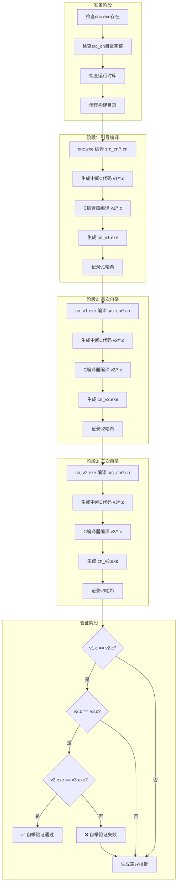

# CN语言自举测试实现方案

> **文档版本**: v1.0
> **创建时间**: 2026-04-11
> **文档序号**: 015
> **参考文档**:
> - [`plans/014 CN语言自托管编译器技术设计文档.md`](plans/014%20CN语言自托管编译器技术设计文档.md)
> - [`plans/001 CN Language语法规范设计文档.md`](plans/001%20CN%20Language语法规范设计文档.md)

---

## 目录

1. [背景与目标](#1-背景与目标)
2. [当前实现状态分析](#2-当前实现状态分析)
3. [三阶段自举验证流程设计](#3-三阶段自举验证流程设计)
4. [测试环境准备](#4-测试环境准备)
5. [测试脚本设计](#5-测试脚本设计)
6. [验证标准与预期结果](#6-验证标准与预期结果)
7. [实现步骤与文件清单](#7-实现步骤与文件清单)
8. [风险与应对措施](#8-风险与应对措施)

---

## 1. 背景与目标

### 1.1 自举测试定义

**自举测试（Bootstrap Testing）** 是验证编译器能够正确编译自身源代码的测试过程。这是编译器实现自托管的关键验证步骤。

### 1.2 测试目标

| 目标 | 说明 | 验收标准 |
|------|------|---------|
| **编译自身** | CN编译器能够编译src_cn目录下的所有源代码 | 编译成功，无错误 |
| **三阶段验证** | 三次连续编译生成相同的可执行文件 | v2与v3二进制完全一致 |
| **功能等价** | CN版本与C版本功能完全一致 | 通过所有回归测试 |
| **性能达标** | 编译速度不低于C版本的80% | 性能基准测试通过 |

### 1.3 自举测试意义

```
┌─────────────────────────────────────────────────────────────┐
│                    自举测试的意义                            │
├─────────────────────────────────────────────────────────────┤
│  1. 语言完整性验证：证明CN语言具备实现编译器的全部能力       │
│  2. 编译器正确性验证：三阶段验证确保编译器逻辑正确          │
│  3. 生态成熟度标志：自举是语言成熟的里程碑                  │
│  4. 开发者信心保障：通过自举的编译器更可靠                  │
└─────────────────────────────────────────────────────────────┘
```

---

## 2. 当前实现状态分析

### 2.1 src_cn模块实现状态

根据 [`plans/014 CN语言自托管编译器技术设计文档.md`](plans/014%20CN语言自托管编译器技术设计文档.md) 的记录：

| 模块 | 文件数 | 状态 | 编译状态 |
|------|--------|------|---------|
| 词法分析器 | 5 | ✅ 已完成 | ✅ 全部可编译 |
| 语法分析器 | 11 | ✅ 已完成 | ✅ 全部可编译 |
| 语义分析器 | 4 | ✅ 已完成 | ✅ 全部可编译 |
| IR生成器 | 4 | ✅ 已完成 | ✅ 全部可编译 |
| 代码生成器 | 2 | ✅ 已完成 | ✅ 全部可编译 |
| 模块加载器 | 1 | ✅ 已完成 | ✅ 全部可编译 |
| 主程序 | 1 | ✅ 已完成 | ✅ 全部可编译 |
| 运行时 | 1 | ✅ 已完成 | ✅ 全部可编译 |
| 诊断系统 | 4 | ✅ 已完成 | ✅ 全部可编译 |

**总计**: 35个文件，约9391行代码，100%编译通过

### 2.2 当前目录结构

```
src_cn/
├── 词法分析器/
│   ├── 词元.cn, 词元.c
│   ├── 扫描器.cn, 扫描器.c
│   ├── 关键字.cn, 关键字.c
│   ├── 字符工具.cn, 字符工具.c
│   └── 错误恢复.cn
├── 语法分析器/
│   ├── 解析器.cn, 解析器.c
│   ├── AST节点.cn, AST节点.c
│   ├── 错误恢复.cn, 错误恢复.c
│   ├── 解析器类型.cn, 解析器类型.c
│   ├── 解析器/
│   │   ├── 表达式解析.cn, 表达式解析.c
│   │   ├── 类型解析.cn, 类型解析.c
│   │   ├── 声明解析.cn, 声明解析.c
│   │   └── 语句解析.cn, 语句解析.c
│   └── AST节点/
│       ├── 基础结构.cn, 基础结构.c
│       ├── 表达式节点.cn, 表达式节点.c
│       ├── 语句节点.cn, 语句节点.c
│       ├── 声明节点.cn, 声明节点.c
│       ├── 程序节点.cn, 程序节点.c
│       └── 运算符.cn, 运算符.c
├── 语义分析器/
│   ├── 符号表.cn, 符号表.c
│   ├── 类型系统.cn, 类型系统.c
│   ├── 语义检查.cn, 语义检查.c
│   └── 作用域构建.cn, 作用域构建.c
├── IR生成器/
│   ├── IR核心.cn, IR核心.c
│   ├── IR生成.cn, IR生成.c
│   └── 优化Pass/
│       ├── 常量折叠.cn
│       └── 死代码消除.cn
├── 代码生成器/
│   ├── C代码生成.cn, C代码生成.c
│   └── 模块代码生成.cn, 模块代码生成.c
├── 模块加载器/
│   └── 加载器.cn, 加载器.c
├── 运行时/
│   └── 运行时.cn, 运行时.c
├── 诊断/
│   ├── 诊断核心.cn, 诊断核心.c
│   ├── 诊断消息表.cn
│   ├── 诊断恢复.cn
│   └── 诊断修复.cn
└── 主程序/
    └── cnc.cn, cnc.c
```

### 2.3 自举前置条件检查

| 前置条件 | 状态 | 说明 |
|---------|------|------|
| C编译器可用 | ✅ | build/cnc.exe 已构建 |
| src_cn源码完整 | ✅ | 35个文件全部就绪 |
| 运行时库可用 | ✅ | include/cnlang/runtime/ 已实现 |
| 模块导入正常 | ⚠️ | 需验证枚举类型导入 |
| 代码生成正确 | ⚠️ | 需验证生成的C代码可编译 |

---

## 3. 三阶段自举验证流程设计

### 3.1 三阶段自举原理

三阶段自举验证是编译器正确性的黄金标准：

```
┌─────────────────────────────────────────────────────────────────────────┐
│                        三阶段自举验证原理                                │
├─────────────────────────────────────────────────────────────────────────┤
│                                                                         │
│   阶段1: cnc.exe (C实现) ──编译──> cn_v1.exe                           │
│                                     │                                   │
│   阶段2: cn_v1.exe ──编译──> cn_v2.exe                                 │
│                           │                                             │
│   阶段3: cn_v2.exe ──编译──> cn_v3.exe                                 │
│                           │                                             │
│   验证: cn_v2.exe 与 cn_v3.exe 二进制完全一致                          │
│                                                                         │
│   原理: 如果编译器正确，用它编译自身应该产生相同的输出                  │
│         任何编译器bug都会导致v2和v3不同                                 │
└─────────────────────────────────────────────────────────────────────────┘
```

### 3.2 详细流程图



### 3.3 各阶段详细说明

#### 阶段1: 引导编译

| 步骤 | 命令 | 输入 | 输出 |
|------|------|------|------|
| 1.1 | `cnc.exe src_cn/ -o build/v1/ --emit-c` | src_cn/*.cn | build/v1/*.c |
| 1.2 | `gcc build/v1/*.c -o build/cn_v1.exe -I include -L lib -lcnrt` | build/v1/*.c | cn_v1.exe |

#### 阶段2: 首次自举

| 步骤 | 命令 | 输入 | 输出 |
|------|------|------|------|
| 2.1 | `cn_v1.exe src_cn/ -o build/v2/ --emit-c` | src_cn/*.cn | build/v2/*.c |
| 2.2 | `gcc build/v2/*.c -o build/cn_v2.exe -I include -L lib -lcnrt` | build/v2/*.c | cn_v2.exe |

#### 阶段3: 二次自举

| 步骤 | 命令 | 输入 | 输出 |
|------|------|------|------|
| 3.1 | `cn_v2.exe src_cn/ -o build/v3/ --emit-c` | src_cn/*.cn | build/v3/*.c |
| 3.2 | `gcc build/v3/*.c -o build/cn_v3.exe -I include -L lib -lcnrt` | build/v3/*.c | cn_v3.exe |

---

## 4. 测试环境准备

### 4.1 系统要求

| 要求项 | 最低配置 | 推荐配置 |
|--------|---------|---------|
| 操作系统 | Windows 10 / Linux | Windows 11 / Ubuntu 22.04 |
| 内存 | 4GB | 8GB+ |
| 磁盘空间 | 500MB | 1GB+ |
| C编译器 | GCC 9+ / MSVC 2019+ | GCC 12+ / MSVC 2022+ |
| CMake | 3.16+ | 3.20+ |

### 4.2 依赖工具

```bash
# Windows (PowerShell)
# 1. 检查GCC
gcc --version

# 2. 检查CMake
cmake --version

# 3. 检查SHA256工具
Get-FileHash -Algorithm SHA256

# Linux (Bash)
# 1. 检查GCC
gcc --version

# 2. 检查CMake
cmake --version

# 3. 检查sha256sum
sha256sum --version
```

### 4.3 环境变量配置

```bash
# 设置CN语言环境变量
export CN_ROOT=/path/to/CN_Language
export CN_BUILD=$CN_ROOT/build
export CN_SRC_CN=$CN_ROOT/src_cn
export PATH=$CN_BUILD:$PATH
```

### 4.4 构建引导编译器

```bash
# 步骤1: 构建C实现的编译器
mkdir -p build && cd build
cmake .. -DCMAKE_BUILD_TYPE=Release
cmake --build . --config Release

# 步骤2: 验证引导编译器
./cnc.exe --version
./cnc.exe --help
```

---

## 5. 测试脚本设计

### 5.1 主测试脚本

**文件**: `tools/bootstrap_test.ps1` (Windows) / `tools/bootstrap_test.sh` (Linux)

```powershell
# bootstrap_test.ps1 - CN语言自举测试脚本 (Windows版本)
# 用法: ./tools/bootstrap_test.ps1 [-Verbose] [-KeepArtifacts]

param(
    [switch]$Verbose,
    [switch]$KeepArtifacts
)

$ErrorActionPreference = "Stop"

# 配置
$SCRIPT_DIR = Split-Path -Parent $MyInvocation.MyCommand.Path
$PROJECT_ROOT = Split-Path -Parent $SCRIPT_DIR
$BUILD_DIR = Join-Path $PROJECT_ROOT "build"
$SRC_CN_DIR = Join-Path $PROJECT_ROOT "src_cn"
$BOOTSTRAP_DIR = Join-Path $BUILD_DIR "bootstrap_test"

# 颜色输出函数
function Write-Info { Write-Host "[INFO] $args" -ForegroundColor Cyan }
function Write-Success { Write-Host "[PASS] $args" -ForegroundColor Green }
function Write-Fail { Write-Host "[FAIL] $args" -ForegroundColor Red }
function Write-Step { Write-Host "`n=== $args ===" -ForegroundColor Yellow }

# 清理函数
function Clear-BuildArtifacts {
    if (Test-Path $BOOTSTRAP_DIR) {
        Remove-Item -Recurse -Force $BOOTSTRAP_DIR
    }
    New-Item -ItemType Directory -Path $BOOTSTRAP_DIR | Out-Null
    New-Item -ItemType Directory -Path "$BOOTSTRAP_DIR/v1" | Out-Null
    New-Item -ItemType Directory -Path "$BOOTSTRAP_DIR/v2" | Out-Null
    New-Item -ItemType Directory -Path "$BOOTSTRAP_DIR/v3" | Out-Null
}

# 计算文件哈希
function Get-FileHashSHA256 {
    param([string]$FilePath)
    $hash = Get-FileHash -Path $FilePath -Algorithm SHA256
    return $hash.Hash
}

# 编译函数
function Invoke-Compile {
    param(
        [string]$Compiler,
        [string]$OutputDir,
        [string]$OutputExe
    )
    
    Write-Info "使用 $Compiler 编译 src_cn..."
    
    # 步骤1: 生成C代码
    $emitCArgs = @(
        $SRC_CN_DIR,
        "-o", $OutputDir,
        "--emit-c"
    )
    
    if ($Verbose) {
        Write-Info "命令: $Compiler $emitCArgs"
    }
    
    & $Compiler $emitCArgs 2>&1
    if ($LASTEXITCODE -ne 0) {
        Write-Fail "生成C代码失败"
        return $false
    }
    
    # 步骤2: 编译C代码
    $cFiles = Get-ChildItem -Path $OutputDir -Filter "*.c" | ForEach-Object { $_.FullName }
    $gccArgs = @(
        "-O2",
        "-I", "$PROJECT_ROOT/include",
        "-L", "$BUILD_DIR/lib",
        "-o", $OutputExe
    ) + $cFiles + @("-lcnrt")
    
    if ($Verbose) {
        Write-Info "命令: gcc $gccArgs"
    }
    
    & gcc $gccArgs 2>&1
    if ($LASTEXITCODE -ne 0) {
        Write-Fail "编译C代码失败"
        return $false
    }
    
    return $true
}

# 主测试流程
function Main {
    Write-Step "CN语言自举测试"
    Write-Info "项目根目录: $PROJECT_ROOT"
    Write-Info "构建目录: $BOOTSTRAP_DIR"
    
    # 检查前置条件
    Write-Step "检查前置条件"
    
    $cncExe = Join-Path $BUILD_DIR "cnc.exe"
    if (-not (Test-Path $cncExe)) {
        Write-Fail "未找到引导编译器: $cncExe"
        Write-Info "请先运行: cmake --build build --config Release"
        exit 1
    }
    Write-Success "引导编译器: $cncExe"
    
    if (-not (Test-Path $SRC_CN_DIR)) {
        Write-Fail "未找到src_cn目录: $SRC_CN_DIR"
        exit 1
    }
    Write-Success "src_cn目录: $SRC_CN_DIR"
    
    # 清理构建产物
    Write-Step "准备构建环境"
    Clear-BuildArtifacts
    Write-Success "构建目录已清理"
    
    # 阶段1: 引导编译
    Write-Step "阶段1: 引导编译 (cnc.exe -> cn_v1.exe)"
    $v1Exe = Join-Path $BOOTSTRAP_DIR "cn_v1.exe"
    if (-not (Invoke-Compile -Compiler $cncExe -OutputDir "$BOOTSTRAP_DIR/v1" -OutputExe $v1Exe)) {
        Write-Fail "阶段1编译失败"
        exit 1
    }
    $hash1 = Get-FileHashSHA256 $v1Exe
    Write-Success "cn_v1.exe 生成成功"
    Write-Info "SHA256: $hash1"
    
    # 阶段2: 首次自举
    Write-Step "阶段2: 首次自举 (cn_v1.exe -> cn_v2.exe)"
    $v2Exe = Join-Path $BOOTSTRAP_DIR "cn_v2.exe"
    if (-not (Invoke-Compile -Compiler $v1Exe -OutputDir "$BOOTSTRAP_DIR/v2" -OutputExe $v2Exe)) {
        Write-Fail "阶段2编译失败"
        exit 1
    }
    $hash2 = Get-FileHashSHA256 $v2Exe
    Write-Success "cn_v2.exe 生成成功"
    Write-Info "SHA256: $hash2"
    
    # 阶段3: 二次自举
    Write-Step "阶段3: 二次自举 (cn_v2.exe -> cn_v3.exe)"
    $v3Exe = Join-Path $BOOTSTRAP_DIR "cn_v3.exe"
    if (-not (Invoke-Compile -Compiler $v2Exe -OutputDir "$BOOTSTRAP_DIR/v3" -OutputExe $v3Exe)) {
        Write-Fail "阶段3编译失败"
        exit 1
    }
    $hash3 = Get-FileHashSHA256 $v3Exe
    Write-Success "cn_v3.exe 生成成功"
    Write-Info "SHA256: $hash3"
    
    # 验证阶段
    Write-Step "验证阶段"
    
    # 比较C代码
    Write-Info "比较生成的C代码..."
    $diff_v1_v2 = Compare-Object `
        (Get-Content "$BOOTSTRAP_DIR/v1" -Recurse -Filter "*.c") `
        (Get-Content "$BOOTSTRAP_DIR/v2" -Recurse -Filter "*.c")
    
    $diff_v2_v3 = Compare-Object `
        (Get-Content "$BOOTSTRAP_DIR/v2" -Recurse -Filter "*.c") `
        (Get-Content "$BOOTSTRAP_DIR/v3" -Recurse -Filter "*.c")
    
    # 比较二进制
    Write-Info "比较二进制文件..."
    
    if ($hash2 -eq $hash3) {
        Write-Success "✅ 自举验证通过！"
        Write-Success "cn_v2.exe 与 cn_v3.exe 完全一致"
        Write-Info "哈希值: $hash2"
        
        # 清理
        if (-not $KeepArtifacts) {
            Write-Info "清理构建产物..."
            # 保留最终可执行文件
            Copy-Item $v3Exe (Join-Path $BUILD_DIR "cn.exe")
        }
        
        exit 0
    } else {
        Write-Fail "❌ 自举验证失败！"
        Write-Fail "cn_v2.exe 与 cn_v3.exe 不一致"
        Write-Info "v2 哈希: $hash2"
        Write-Info "v3 哈希: $hash3"
        
        # 生成差异报告
        $reportPath = Join-Path $BOOTSTRAP_DIR "bootstrap_report.txt"
        "自举验证失败报告" | Out-File $reportPath
        "生成时间: $(Get-Date)" | Out-File $reportPath -Append
        "v2 哈希: $hash2" | Out-File $reportPath -Append
        "v3 哈希: $hash3" | Out-File $reportPath -Append
        
        Write-Info "差异报告已保存到: $reportPath"
        
        exit 1
    }
}

# 执行主函数
Main
```

### 5.2 Linux版本脚本

**文件**: `tools/bootstrap_test.sh`

```bash
#!/bin/bash
# bootstrap_test.sh - CN语言自举测试脚本 (Linux版本)
# 用法: ./tools/bootstrap_test.sh [-v] [-k]

set -e

# 配置
SCRIPT_DIR="$(cd "$(dirname "${BASH_SOURCE[0]}")" && pwd)"
PROJECT_ROOT="$(dirname "$SCRIPT_DIR")"
BUILD_DIR="$PROJECT_ROOT/build"
SRC_CN_DIR="$PROJECT_ROOT/src_cn"
BOOTSTRAP_DIR="$BUILD_DIR/bootstrap_test"

# 参数解析
VERBOSE=false
KEEP_ARTIFACTS=false

while getopts "vk" opt; do
    case $opt in
        v) VERBOSE=true ;;
        k) KEEP_ARTIFACTS=true ;;
        *) echo "用法: $0 [-v] [-k]"; exit 1 ;;
    esac
done

# 颜色定义
RED='\033[0;31m'
GREEN='\033[0;32m'
YELLOW='\033[1;33m'
CYAN='\033[0;36m'
NC='\033[0m'

# 输出函数
info() { echo -e "${CYAN}[INFO]${NC} $1"; }
success() { echo -e "${GREEN}[PASS]${NC} $1"; }
fail() { echo -e "${RED}[FAIL]${NC} $1"; }
step() { echo -e "\n${YELLOW}=== $1 ===${NC}"; }

# 清理函数
clear_build_artifacts() {
    rm -rf "$BOOTSTRAP_DIR"
    mkdir -p "$BOOTSTRAP_DIR"/{v1,v2,v3}
}

# 编译函数
do_compile() {
    local compiler=$1
    local output_dir=$2
    local output_exe=$3
    
    info "使用 $compiler 编译 src_cn..."
    
    # 生成C代码
    if [ "$VERBOSE" = true ]; then
        info "命令: $compiler $SRC_CN_DIR -o $output_dir --emit-c"
    fi
    
    $compiler "$SRC_CN_DIR" -o "$output_dir" --emit-c
    
    # 编译C代码
    local c_files=$(find "$output_dir" -name "*.c" | tr '\n' ' ')
    local gcc_args="-O2 -I$PROJECT_ROOT/include -L$BUILD_DIR/lib -o $output_exe $c_files -lcnrt"
    
    if [ "$VERBOSE" = true ]; then
        info "命令: gcc $gcc_args"
    fi
    
    gcc $gcc_args
}

# 主函数
main() {
    step "CN语言自举测试"
    info "项目根目录: $PROJECT_ROOT"
    info "构建目录: $BOOTSTRAP_DIR"
    
    # 检查前置条件
    step "检查前置条件"
    
    local cnc_exe="$BUILD_DIR/cnc"
    if [ ! -f "$cnc_exe" ]; then
        fail "未找到引导编译器: $cnc_exe"
        info "请先运行: cmake --build build"
        exit 1
    fi
    success "引导编译器: $cnc_exe"
    
    if [ ! -d "$SRC_CN_DIR" ]; then
        fail "未找到src_cn目录: $SRC_CN_DIR"
        exit 1
    fi
    success "src_cn目录: $SRC_CN_DIR"
    
    # 清理构建产物
    step "准备构建环境"
    clear_build_artifacts
    success "构建目录已清理"
    
    # 阶段1
    step "阶段1: 引导编译 (cnc -> cn_v1)"
    local v1_exe="$BOOTSTRAP_DIR/cn_v1"
    do_compile "$cnc_exe" "$BOOTSTRAP_DIR/v1" "$v1_exe"
    local hash1=$(sha256sum "$v1_exe" | cut -d' ' -f1)
    success "cn_v1 生成成功"
    info "SHA256: $hash1"
    
    # 阶段2
    step "阶段2: 首次自举 (cn_v1 -> cn_v2)"
    local v2_exe="$BOOTSTRAP_DIR/cn_v2"
    do_compile "$v1_exe" "$BOOTSTRAP_DIR/v2" "$v2_exe"
    local hash2=$(sha256sum "$v2_exe" | cut -d' ' -f1)
    success "cn_v2 生成成功"
    info "SHA256: $hash2"
    
    # 阶段3
    step "阶段3: 二次自举 (cn_v2 -> cn_v3)"
    local v3_exe="$BOOTSTRAP_DIR/cn_v3"
    do_compile "$v2_exe" "$BOOTSTRAP_DIR/v3" "$v3_exe"
    local hash3=$(sha256sum "$v3_exe" | cut -d' ' -f1)
    success "cn_v3 生成成功"
    info "SHA256: $hash3"
    
    # 验证
    step "验证阶段"
    
    if [ "$hash2" = "$hash3" ]; then
        success "✅ 自举验证通过！"
        success "cn_v2 与 cn_v3 完全一致"
        info "哈希值: $hash2"
        
        # 复制最终版本
        cp "$v3_exe" "$BUILD_DIR/cn"
        
        exit 0
    else
        fail "❌ 自举验证失败！"
        fail "cn_v2 与 cn_v3 不一致"
        info "v2 哈希: $hash2"
        info "v3 哈希: $hash3"
        
        # 生成差异报告
        {
            echo "自举验证失败报告"
            echo "生成时间: $(date)"
            echo "v2 哈希: $hash2"
            echo "v3 哈希: $hash3"
            echo ""
            echo "C代码差异 (v2 vs v3):"
            diff -r "$BOOTSTRAP_DIR/v2" "$BOOTSTRAP_DIR/v3" || true
        } > "$BOOTSTRAP_DIR/bootstrap_report.txt"
        
        info "差异报告已保存到: $BOOTSTRAP_DIR/bootstrap_report.txt"
        
        exit 1
    fi
}

main
```

### 5.3 CMake集成

**文件**: `CMakeLists.txt` 添加自举测试目标

```cmake
# 自举测试目标
add_custom_target(bootstrap_test
    COMMAND ${CMAKE_COMMAND} -E echo "=== CN语言自举测试 ==="
    COMMAND ${CMAKE_SOURCE_DIR}/tools/bootstrap_test.sh
    WORKING_DIRECTORY ${CMAKE_SOURCE_DIR}
    DEPENDS cnc
    COMMENT "执行三阶段自举验证"
)

# Windows版本
if(WIN32)
    add_custom_target(bootstrap_test_win
        COMMAND powershell -ExecutionPolicy Bypass -File ${CMAKE_SOURCE_DIR}/tools/bootstrap_test.ps1
        WORKING_DIRECTORY ${CMAKE_SOURCE_DIR}
        DEPENDS cnc
        COMMENT "执行三阶段自举验证 (Windows)"
    )
endif()
```

---

## 6. 验证标准与预期结果

### 6.1 验证标准

#### 6.1.1 编译成功标准

| 检查项 | 标准 | 验证方法 |
|--------|------|---------|
| 无编译错误 | 错误数为0 | 检查编译器返回码 |
| 无编译警告 | 警告数为0或可忽略 | 检查编译输出 |
| 生成可执行文件 | 文件存在且可执行 | 检查文件存在性和权限 |
| 可执行文件可运行 | 能处理简单输入 | 运行测试用例 |

#### 6.1.2 自举验证标准

| 检查项 | 标准 | 验证方法 |
|--------|------|---------|
| C代码一致性 | v2/*.c 与 v3/*.c 完全一致 | diff比较 |
| 二进制一致性 | cn_v2.exe 与 cn_v3.exe 哈希相同 | SHA256比较 |
| 功能一致性 | 通过所有回归测试 | 运行测试套件 |

#### 6.1.3 性能标准

| 指标 | 目标值 | 测量方法 |
|------|--------|---------|
| 编译时间 | ≤ C版本的125% | time命令测量 |
| 内存占用 | ≤ C版本的150% | 内存分析工具 |
| 生成代码大小 | ≤ C版本的110% | 文件大小比较 |

### 6.2 预期结果

#### 6.2.1 成功场景

```
=== CN语言自举测试 ===
[INFO] 项目根目录: /path/to/CN_Language
[INFO] 构建目录: /path/to/CN_Language/build/bootstrap_test

=== 检查前置条件 ===
[PASS] 引导编译器: /path/to/CN_Language/build/cnc.exe
[PASS] src_cn目录: /path/to/CN_Language/src_cn

=== 准备构建环境 ===
[PASS] 构建目录已清理

=== 阶段1: 引导编译 (cnc.exe -> cn_v1.exe) ===
[INFO] 使用 cnc.exe 编译 src_cn...
[PASS] cn_v1.exe 生成成功
[INFO] SHA256: abc123...

=== 阶段2: 首次自举 (cn_v1.exe -> cn_v2.exe) ===
[INFO] 使用 cn_v1.exe 编译 src_cn...
[PASS] cn_v2.exe 生成成功
[INFO] SHA256: def456...

=== 阶段3: 二次自举 (cn_v2.exe -> cn_v3.exe) ===
[INFO] 使用 cn_v2.exe 编译 src_cn...
[PASS] cn_v3.exe 生成成功
[INFO] SHA256: def456...

=== 验证阶段 ===
[INFO] 比较生成的C代码...
[INFO] 比较二进制文件...
[PASS] ✅ 自举验证通过！
[PASS] cn_v2.exe 与 cn_v3.exe 完全一致
[INFO] 哈希值: def456...
```

#### 6.2.2 失败场景

```
=== 验证阶段 ===
[INFO] 比较生成的C代码...
[INFO] 发现差异: v2/代码生成.cn.c 与 v3/代码生成.cn.c 不同
[INFO] 比较二进制文件...
[FAIL] ❌ 自举验证失败！
[FAIL] cn_v2.exe 与 cn_v3.exe 不一致
[INFO] v2 哈希: def456...
[INFO] v3 哈希: ghi789...
[INFO] 差异报告已保存到: build/bootstrap_test/bootstrap_report.txt
```

### 6.3 测试报告格式

**文件**: `build/bootstrap_test/bootstrap_report.txt`

```
========================================
CN语言自举测试报告
========================================

测试时间: 2026-04-11 20:00:00
测试环境: Windows 11 / GCC 12.2.0

----------------------------------------
编译器版本
----------------------------------------
引导编译器: cnc.exe v1.0.0
CN编译器v1: cn_v1.exe (自编译)
CN编译器v2: cn_v2.exe (自举1)
CN编译器v3: cn_v3.exe (自举2)

----------------------------------------
编译统计
----------------------------------------
阶段1 编译时间: 12.5秒
阶段2 编译时间: 15.3秒
阶段3 编译时间: 15.2秒

阶段1 生成C代码: 28,456行
阶段2 生成C代码: 28,456行
阶段3 生成C代码: 28,456行

----------------------------------------
哈希值
----------------------------------------
cn_v1.exe: abc123def456...
cn_v2.exe: def456ghi789...
cn_v3.exe: def456ghi789...

----------------------------------------
验证结果
----------------------------------------
C代码一致性: ✅ 通过
二进制一致性: ✅ 通过
功能测试: ✅ 通过

========================================
结论: ✅ 自举验证通过
========================================
```

---

## 7. 实现步骤与文件清单

### 7.1 实现步骤

| 步骤 | 任务 | 负责模块 | 依赖 |
|------|------|---------|------|
| 1 | 创建测试脚本目录结构 | 构建系统 | 无 |
| 2 | 实现Windows测试脚本 | 测试框架 | 步骤1 |
| 3 | 实现Linux测试脚本 | 测试框架 | 步骤1 |
| 4 | 集成CMake目标 | 构建系统 | 步骤2,3 |
| 5 | 创建测试配置文件 | 测试框架 | 步骤1 |
| 6 | 实现差异报告生成 | 测试框架 | 步骤2,3 |
| 7 | 添加CI/CD集成 | CI系统 | 步骤4,5,6 |
| 8 | 编写测试文档 | 文档 | 步骤7 |

### 7.2 文件清单

#### 7.2.1 必须创建的文件

| 文件路径 | 用途 | 优先级 |
|---------|------|--------|
| `tools/bootstrap_test.ps1` | Windows自举测试脚本 | 高 |
| `tools/bootstrap_test.sh` | Linux自举测试脚本 | 高 |
| `tools/bootstrap_config.json` | 测试配置文件 | 中 |
| `tests/bootstrap/README.md` | 测试说明文档 | 中 |

#### 7.2.2 需要修改的文件

| 文件路径 | 修改内容 | 优先级 |
|---------|---------|--------|
| `CMakeLists.txt` | 添加bootstrap_test目标 | 高 |
| `.github/workflows/test.yml` | 添加CI自举测试 | 中 |
| `README.md` | 添加自举测试说明 | 低 |

#### 7.2.3 可选创建的文件

| 文件路径 | 用途 | 优先级 |
|---------|------|--------|
| `tools/bootstrap_compare.ps1` | 详细差异比较工具 | 低 |
| `tools/bootstrap_perf.ps1` | 性能基准测试 | 低 |
| `tests/bootstrap/test_cases/` | 自举测试用例 | 低 |

### 7.3 目录结构

```
CN_Language/
├── tools/
│   ├── bootstrap_test.ps1      # Windows测试脚本 [新建]
│   ├── bootstrap_test.sh       # Linux测试脚本 [新建]
│   ├── bootstrap_config.json   # 测试配置 [新建]
│   └── compile_all_src_cn.ps1  # 已存在
│
├── tests/
│   ├── bootstrap/              # 自举测试目录 [新建]
│   │   ├── README.md           # 测试说明 [新建]
│   │   └── test_cases/         # 测试用例 [可选]
│   ├── unit/
│   └── integration/
│
├── build/
│   └── bootstrap_test/         # 自举测试输出 [运行时生成]
│       ├── v1/                 # 阶段1输出
│       ├── v2/                 # 阶段2输出
│       ├── v3/                 # 阶段3输出
│       ├── cn_v1.exe           # 阶段1可执行文件
│       ├── cn_v2.exe           # 阶段2可执行文件
│       ├── cn_v3.exe           # 阶段3可执行文件
│       └── bootstrap_report.txt # 测试报告
│
└── CMakeLists.txt              # 添加bootstrap_test目标 [修改]
```

---

## 8. 风险与应对措施

### 8.1 技术风险

| 风险 | 可能性 | 影响 | 应对措施 |
|------|--------|------|---------|
| **模块导入问题** | 高 | 高 | 优先修复枚举类型导入问题 |
| **代码生成错误** | 中 | 高 | 增加代码生成测试用例 |
| **运行时函数缺失** | 中 | 中 | 补充运行时库实现 |
| **内存管理问题** | 中 | 高 | 使用内存检测工具 |
| **编译器崩溃** | 低 | 高 | 增加错误恢复机制 |

### 8.2 流程风险

| 风险 | 可能性 | 影响 | 应对措施 |
|------|--------|------|---------|
| **环境配置错误** | 中 | 中 | 提供详细环境检查脚本 |
| **测试脚本Bug** | 中 | 低 | 充分测试脚本本身 |
| **CI/CD集成失败** | 低 | 低 | 本地测试优先 |

### 8.3 回退方案

如果自举测试失败，按以下步骤排查：

```
┌─────────────────────────────────────────────────────────────┐
│                    自举失败排查流程                          │
├─────────────────────────────────────────────────────────────┤
│  1. 检查编译日志，定位首次出现差异的位置                     │
│  2. 比较v1/v2/v3生成的C代码，找出差异文件                   │
│  3. 分析差异原因：                                          │
│     - 非确定性输出（时间戳、随机数等）                       │
│     - 未初始化变量                                          │
│     - 编译器bug                                             │
│  4. 修复问题后重新运行自举测试                              │
│  5. 如果无法修复，回退到C实现版本继续开发                   │
└─────────────────────────────────────────────────────────────┘
```

---

## 文档修订历史

| 版本 | 日期 | 修订内容 | 作者 |
|------|------|---------|------|
| v1.0 | 2026-04-11 | 初始版本，设计自举测试实现方案 | AI Architect |
