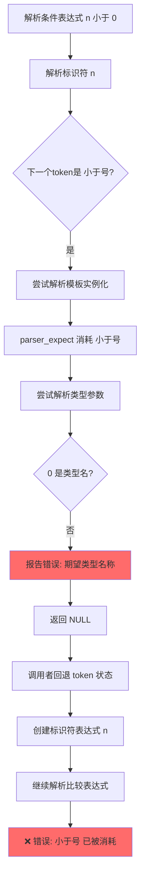

# CN语言解析器 `<` 符号解析问题分析

> **文档说明**：本文档分析 CN 语言解析器中将 `<` 符号误解析为模板参数开始符号的问题，并提供修复方案。
>
> **生成时间**：2026-03-31
> **问题来源**：编译 `examples/module-system/工具/数学/数学.cn` 时出现语法错误

---

## 目录

1. [问题描述](#一问题描述)
2. [问题根因分析](#二问题根因分析)
3. [修复方案](#三修复方案)
4. [需要修改的文件](#四需要修改的文件)
5. [修复步骤](#五修复步骤)
6. [测试验证](#六测试验证)

---

## 一、问题描述

### 1.1 错误信息

编译 `examples/module-system/工具/数学/数学.cn` 文件时，解析器报告以下错误：

```
错误(8): 数学.cn:47:17: 语法错误：期望类型名称
错误(10): 数学.cn:47:17: 语法错误：期望类型参数
```

### 1.2 问题代码

```cn
函数 绝对值(整数 n) -> 整数 {
    如果 (n < 0) {  // ← 第47行，编译器将 '<' 误认为模板参数开始
        返回 0 - n;
    }
    返回 n;
}
```

### 1.3 预期行为

解析器应该将 `n < 0` 解析为比较表达式，而不是模板实例化。

---

## 二、问题根因分析

### 2.1 问题代码定位

问题出在 [`src/frontend/parser/parser.c`](src/frontend/parser/parser.c:2499) 的标识符解析逻辑：

```c
// 第 2491-2522 行
} else if (parser->current.kind == CN_TOKEN_IDENT) {
    // 保存标识符信息
    const char *ident_name = parser->current.lexeme_begin;
    size_t ident_name_length = parser->current.lexeme_length;
    parser_advance(parser);
    
    // 检查是否是模板实例化：标识符 < ... >
    // 注意：需要区分模板实例化和比较表达式
    if (parser->current.kind == CN_TOKEN_LESS) {
        // 尝试解析模板实例化
        // 先保存当前状态，以便在不是模板实例化时回退
        CnToken saved_token = parser->current;
        int saved_has_current = parser->has_current;
        
        // 尝试解析模板实例化
        expr = parse_template_instantiation(parser, ident_name, ident_name_length);
        if (expr) {
            // 成功解析模板实例化
        } else {
            // 不是模板实例化，回退并创建普通标识符
            // 注意：parse_template_instantiation 可能已经消耗了 '<'，需要恢复状态
            parser->current = saved_token;
            parser->has_current = saved_has_current;
            expr = make_identifier(ident_name, ident_name_length);
        }
    }
    // ...
}
```

### 2.2 问题根源

问题出在 [`parse_template_instantiation()`](src/frontend/parser/parser.c:6202) 函数：

```c
// 第 6202-6259 行
static CnAstExpr *parse_template_instantiation(CnParser *parser, const char *name, size_t name_len)
{
    // ...
    
    // 期望 '<'
    if (!parser_expect(parser, CN_TOKEN_LESS)) {
        return NULL;  // 不是模板实例化，可能是比较表达式
    }
    
    // ... 分配内存 ...
    
    // 解析类型实参列表
    do {
        // 检查是否为空参数列表
        if (parser->current.kind == CN_TOKEN_GREATER) {
            break;
        }
        
        // 解析类型
        CnType *type_arg = parse_type(parser);
        if (!type_arg) {
            // ❌ 问题：这里报告了错误，但函数返回 NULL
            // 调用者虽然回退了 token 状态，但错误已经被记录到诊断系统
            if (parser->diagnostics) {
                cn_support_diagnostics_report(parser->diagnostics,
                                              CN_DIAG_SEVERITY_ERROR,
                                              CN_DIAG_CODE_PARSE_INVALID_FUNCTION_NAME,
                                              parser->lexer ? parser->lexer->filename : NULL,
                                              parser->current.line,
                                              parser->current.column,
                                              "语法错误：期望类型参数");
            }
            free(inst->type_args);
            free(inst);
            return NULL;
        }
        // ...
    } while (1);
    // ...
}
```

### 2.3 问题流程图



### 2.4 核心问题

1. **错误报告时机错误**：`parse_template_instantiation()` 在解析失败时报告了错误，但这个错误是"试探性"的，不应该立即报告。

2. **状态回退不完整**：虽然调用者保存并恢复了 token 状态，但诊断系统中已经记录了错误。

3. **缺少前瞻判断**：解析器没有在尝试解析模板实例化之前，先判断 `<` 后面是否真的是类型名。

---

## 三、修复方案

### 3.1 方案一：前瞻判断（推荐）

在尝试解析模板实例化之前，先判断 `<` 后面是否是有效的类型名。

**优点**：
- 不需要修改错误报告逻辑
- 性能开销小
- 逻辑清晰

**实现思路**：
```c
// 在第 2499 行附近添加前瞻判断
if (parser->current.kind == CN_TOKEN_LESS) {
    // 前瞻判断：检查 < 后面是否是类型名
    CnToken saved_token = parser->current;
    int saved_has_current = parser->has_current;
    
    parser_advance(parser);  // 消耗 '<'
    
    // 判断下一个 token 是否是类型关键字或标识符
    bool is_template = false;
    if (parser->current.kind == CN_TOKEN_KEYWORD_INT ||
        parser->current.kind == CN_TOKEN_KEYWORD_FLOAT ||
        parser->current.kind == CN_TOKEN_KEYWORD_STRING ||
        parser->current.kind == CN_TOKEN_KEYWORD_BOOL ||
        parser->current.kind == CN_TOKEN_KEYWORD_VOID ||
        parser->current.kind == CN_TOKEN_IDENT) {
        // 可能是模板实例化，继续尝试
        is_template = true;
    }
    
    // 恢复状态
    parser->current = saved_token;
    parser->has_current = saved_has_current;
    
    if (is_template) {
        // 尝试解析模板实例化
        expr = parse_template_instantiation(parser, ident_name, ident_name_length);
        if (!expr) {
            // 真正的模板实例化解析失败，保持错误报告
            parser->current = saved_token;
            parser->has_current = saved_has_current;
            expr = make_identifier(ident_name, ident_name_length);
        }
    } else {
        // 不是模板实例化，创建普通标识符
        expr = make_identifier(ident_name, ident_name_length);
    }
}
```

### 3.2 方案二：延迟错误报告

修改 `parse_template_instantiation()` 函数，在确认是模板实例化之前不报告错误。

**优点**：
- 更精确的错误报告
- 符合"试探性解析"的设计模式

**缺点**：
- 需要修改更多代码
- 可能影响其他调用点

### 3.3 方案三：使用解析器标志

添加一个"试探模式"标志，在试探模式下不报告错误。

**优点**：
- 最干净的解决方案
- 可复用于其他类似的试探性解析场景

**缺点**：
- 需要修改解析器结构
- 实现复杂度较高

---

## 四、需要修改的文件

| 文件路径 | 修改类型 | 说明 |
|---------|---------|------|
| [`src/frontend/parser/parser.c`](src/frontend/parser/parser.c:2499) | 修改 | 添加前瞻判断逻辑 |

---

## 五、修复步骤

### 步骤 1：添加类型判断辅助函数

在 [`parser.c`](src/frontend/parser/parser.c) 中添加一个辅助函数：

```c
/**
 * @brief 判断当前 token 是否可能是类型名的开始
 *
 * 用于区分模板实例化和比较表达式
 */
static bool is_type_start(CnParser *parser)
{
    if (!parser || !parser->has_current) {
        return false;
    }
    
    switch (parser->current.kind) {
        case CN_TOKEN_KEYWORD_INT:
        case CN_TOKEN_KEYWORD_FLOAT:
        case CN_TOKEN_KEYWORD_STRING:
        case CN_TOKEN_KEYWORD_BOOL:
        case CN_TOKEN_KEYWORD_VOID:
        case CN_TOKEN_KEYWORD_STRUCT:
        case CN_TOKEN_KEYWORD_ENUM:
        case CN_TOKEN_IDENT:
            return true;
        default:
            return false;
    }
}
```

### 步骤 2：修改标识符解析逻辑

修改 [`parser.c`](src/frontend/parser/parser.c:2499) 第 2499-2515 行：

```c
// 检查是否是模板实例化：标识符 < ... >
// 注意：需要区分模板实例化和比较表达式
if (parser->current.kind == CN_TOKEN_LESS) {
    // 前瞻判断：检查 < 后面是否是类型名
    CnToken saved_token = parser->current;
    int saved_has_current = parser->has_current;
    
    parser_advance(parser);  // 临时消耗 '<' 进行前瞻
    
    bool is_template = is_type_start(parser);
    
    // 恢复状态
    parser->current = saved_token;
    parser->has_current = saved_has_current;
    
    if (is_template) {
        // 可能是模板实例化，尝试解析
        expr = parse_template_instantiation(parser, ident_name, ident_name_length);
        if (!expr) {
            // 模板实例化解析失败，回退
            parser->current = saved_token;
            parser->has_current = saved_has_current;
            expr = make_identifier(ident_name, ident_name_length);
        }
    } else {
        // 不是模板实例化（< 后面不是类型名），创建普通标识符
        expr = make_identifier(ident_name, ident_name_length);
    }
}
```

### 步骤 3：修改 `parse_template_instantiation()` 错误处理

可选：修改 [`parser.c`](src/frontend/parser/parser.c:6246) 第 6246-6259 行，使错误信息更准确：

```c
CnType *type_arg = parse_type(parser);
if (!type_arg) {
    if (parser->diagnostics) {
        cn_support_diagnostics_report(parser->diagnostics,
                                      CN_DIAG_SEVERITY_ERROR,
                                      CN_DIAG_CODE_PARSE_INVALID_FUNCTION_NAME,
                                      parser->lexer ? parser->lexer->filename : NULL,
                                      parser->current.line,
                                      parser->current.column,
                                      "语法错误：模板参数期望类型名");
    }
    // ...
}
```

---

## 六、测试验证

### 6.1 测试用例

创建测试文件 `tests/parser/test_less_than.cn`：

```cn
// 测试比较表达式
函数 测试比较() -> 整数 {
    整数 a = 10;
    整数 b = 20;
    
    // 测试小于比较
    如果 (a < b) {
        返回 1;
    }
    
    // 测试小于等于比较
    如果 (a <= b) {
        返回 2;
    }
    
    // 测试大于比较
    如果 (a > b) {
        返回 3;
    }
    
    // 测试大于等于比较
    如果 (a >= b) {
        返回 4;
    }
    
    返回 0;
}

// 测试模板实例化（如果已实现）
函数 测试模板() -> 整数 {
    // 模板实例化语法
    整数 结果 = 最大值<整数>(10, 20);
    返回 结果;
}
```

### 6.2 验证步骤

1. 编译测试文件：
   ```bash
   ./build/src/Debug/cnc tests/parser/test_less_than.cn -o test_output.c
   ```

2. 预期结果：
   - 无语法错误
   - 生成的 C 代码包含正确的比较表达式

3. 运行现有测试：
   ```bash
   cd build && ctest -R parser
   ```

### 6.3 回归测试

确保修复不影响以下场景：

| 场景 | 测试代码 | 预期行为 |
|------|---------|---------|
| 模板实例化 | `最大值<整数>(a, b)` | 正确解析为模板实例化 |
| 比较表达式 | `如果 (n < 0)` | 正确解析为比较表达式 |
| 嵌套模板 | `映射<字符串, 数组<整数>>` | 正确解析嵌套模板 |
| 复杂表达式 | `如果 (a < b && c < d)` | 正确解析多个比较表达式 |

---

## 七、总结

### 7.1 问题本质

解析器在遇到 `标识符 <` 时，无法区分是模板实例化还是比较表达式的开始。当前的实现采用"试探性解析"策略，但在试探失败时错误地报告了错误。

### 7.2 推荐方案

采用**方案一：前瞻判断**，在尝试解析模板实例化之前，先判断 `<` 后面是否是类型名。这种方式：
- 实现简单
- 性能开销小
- 不影响现有错误报告机制

### 7.3 影响范围

- 仅需修改 [`src/frontend/parser/parser.c`](src/frontend/parser/parser.c) 一个文件
- 预计新增代码约 30 行
- 不影响其他模块

---

## 附录：相关代码引用

| 位置 | 说明 |
|------|------|
| [`parser.c:2499`](src/frontend/parser/parser.c:2499) | 标识符后跟 `<` 的处理逻辑 |
| [`parser.c:6202`](src/frontend/parser/parser.c:6202) | `parse_template_instantiation()` 函数 |
| [`parser.c:6246`](src/frontend/parser/parser.c:6246) | 类型解析失败时的错误报告 |
| [`数学.cn:47`](examples/module-system/工具/数学/数学.cn:47) | 问题代码行 |
