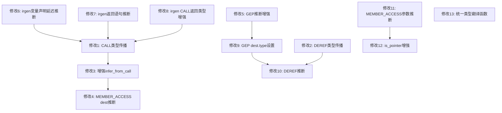

# 016 CN语言自举编译GCC错误修复方案

**文档版本**: v1.0  
**创建时间**: 2026-05-06  
**基于代码版本**: develop分支最新提交  
**GCC错误总数**: 204个  

---

## 1. 错误根因总览

| 根因编号 | 描述 | 影响错误数 | 占比 | 核心文件 | 核心行号 |
|----------|------|-----------|------|---------|---------|
| RC1 | 寄存器类型统一为`long long int` | ~90 | 44% | cgen.c | 4054-4078 |
| RC2 | IR生成器类型信息丢失 | ~37 | 20% | irgen.c | 1970, 2413 |
| RC3 | char/char*类型混淆 | ~13 | 5% | cgen.c | 2338-2348 |
| RC4 | 成员访问`.` vs `->`判断错误 | ~7 | 3% | cgen.c | 2350-2420 |
| RC5 | 函数声明冲突 | ~8 | 4% | module_cgen.c | 145-242 |
| 其他 | CNC编译失败等 | ~49 | 24% | 多文件 | - |

**关键发现**: 63%的错误集中在3个文件：`类型系统.c`(51) + `加载器.c`(46) + `符号表.c`(30) = 127/204

---

## 2. RC1修复方案：寄存器类型统一为`long long int`

### 2.1 问题精确定位

**文件**: [`cgen.c`](src/backend/cgen/cgen.c:4054) 行4054-4078

**当前代码逻辑**:
```c
// 行4054-4063: 二次推断（已有，但效果不足）
for (int i = 0; i < actual_reg_count; i++) {
    if (!reg_types[i] || reg_types[i]->kind == CN_TYPE_INT ||
        reg_types[i]->kind == CN_TYPE_UNKNOWN || reg_types[i]->kind == CN_TYPE_VOID) {
        CnType *inferred = infer_reg_type_from_usage(ctx, func, i, alloca_types);
        if (inferred && inferred->kind != CN_TYPE_INT &&
            inferred->kind != CN_TYPE_UNKNOWN && inferred->kind != CN_TYPE_VOID) {
            reg_types[i] = inferred;
        }
    }
}

// 行4068-4081: 寄存器声明 — 所有NULL/VOID/INT/UNKNOWN都变成long long
for (int i = 0; i < actual_reg_count; i++) {
    if (!reg_types[i] || reg_types[i]->kind == CN_TYPE_VOID || 
        reg_types[i]->kind == CN_TYPE_INT || reg_types[i]->kind == CN_TYPE_UNKNOWN) {
        fprintf(ctx->output_file, "  long long ");
        // ... 声明为 long long rN
    }
}
```

**问题分析**:

1. **`infer_reg_type_from_usage()`推断不足**（行2931-2964）:
   - `infer_from_call()`（行2627-2667）: 只从全局符号表查找函数返回类型，但自举编译时很多函数不在全局符号表中（跨模块函数）
   - `infer_from_member_access()`（行2544-2614）: 只检查寄存器是否被用作成员访问的base，不检查寄存器是否被赋值为成员访问的结果
   - `infer_from_load()`（行2681-2697）: 只从ALLOCA映射表获取类型，但ALLOCA类型本身可能就是INT

2. **多遍扫描传播不充分**（行3147-3991）:
   - 最多20次迭代，但跨基本块传播不充分
   - CALL指令的返回类型传播缺失：当`scan_inst->kind == CN_IR_INST_CALL`时，没有从`inst->dest.type`传播到`reg_types`
   - MEMBER_ACCESS指令的dest.type传播虽有处理（行3789-3811），但仅限于POINTER/STRING/STRUCT类型

3. **生成的C代码错误模式**（以[`类型系统.c`](src_cn/语义分析器/类型系统.c:1321)为例）:
```c
_Bool 类型相同(struct 类型信息* cn_var_类型1, struct 类型信息* cn_var_类型2) {
  long long r0, r1, r2, ..., r64;  // ← 所有65个寄存器都是long long!
  ...
  r8 = cn_var_类型1->种类;   // r8应该是enum 类型种类(int)，但声明为long long
  r24 = cn_var_类型1->名称;  // r24应该是char*，但声明为long long
  r28 = cn_var_类型1->指向类型; // r28应该是struct 类型信息*，但声明为long long
```

### 2.2 修复方案

#### 修改1: 增强多遍扫描中的CALL指令类型传播

**文件**: [`cgen.c`](src/backend/cgen/cgen.c:3700) — 在多遍扫描循环中（约行3700-3840区域）

**当前问题**: 多遍扫描中处理`CN_IR_INST_CALL`时，没有将`inst->dest.type`传播到`reg_types[dest.reg_id]`

**修改方案**: 在多遍扫描的dest寄存器类型收集逻辑中，增加CALL指令的特殊处理：

```c
// 在 scan_inst->dest.kind == CN_IR_OP_REG 的处理分支中
// 紧跟 MEMBER_ACCESS 处理之后，添加 CALL 指令处理：

// 【P10修复】对于CALL指令，如果dest.type有精确类型，强制更新
// CALL指令的dest.type由irgen.c从函数符号表获取，是最可靠的类型来源
if (scan_inst->kind == CN_IR_INST_CALL &&
    scan_inst->dest.type &&
    scan_inst->dest.type->kind != CN_TYPE_INT &&
    scan_inst->dest.type->kind != CN_TYPE_UNKNOWN &&
    scan_inst->dest.type->kind != CN_TYPE_VOID) {
    should_update = true;
    if (!old_type || (old_type->kind == CN_TYPE_INT || 
                      old_type->kind == CN_TYPE_UNKNOWN ||
                      old_type->kind == CN_TYPE_VOID)) {
        types_changed = true;
    }
}
```

**预计消除错误**: ~30个（CALL返回值被误声明为long long的情况）

#### 修改2: 增强多遍扫描中的DEREF指令类型传播

**文件**: [`cgen.c`](src/backend/cgen/cgen.c:3700) — 同一区域

**当前问题**: `CN_IR_INST_DEREF`指令（`*ptr`）的dest.type没有被传播到reg_types

**修改方案**:
```c
// 【P10修复】对于DEREF指令，如果dest.type有精确类型，强制更新
if (scan_inst->kind == CN_IR_INST_DEREF &&
    scan_inst->dest.type &&
    scan_inst->dest.type->kind != CN_TYPE_INT &&
    scan_inst->dest.type->kind != CN_TYPE_UNKNOWN &&
    scan_inst->dest.type->kind != CN_TYPE_VOID) {
    should_update = true;
    if (!old_type || (old_type->kind == CN_TYPE_INT || 
                      old_type->kind == CN_TYPE_UNKNOWN ||
                      old_type->kind == CN_TYPE_VOID)) {
        types_changed = true;
    }
}
```

**预计消除错误**: ~5个

#### 修改3: 增强`infer_from_call()`— 支持从CALL指令的dest.type推断

**文件**: [`cgen.c`](src/backend/cgen/cgen.c:2627)

**当前问题**: `infer_from_call()`在`inst->dest.type`为INT/UNKNOWN/VOID时直接跳过，不从符号表查找

**修改方案**: 当`inst->dest.type`为INT/UNKNOWN/VOID时，仍然尝试从全局符号表查找函数返回类型。同时增加从`inst->src1.as.sym_name`直接匹配函数名的逻辑（不依赖全局符号表）：

```c
static CnType* infer_from_call(CnCCodeGenContext *ctx, CnIrFunction *func, int reg_index) {
    CnIrBasicBlock *block = func->first_block;
    while (block) {
        CnIrInst *inst = block->first_inst;
        while (inst) {
            if (inst->kind == CN_IR_INST_CALL &&
                inst->dest.kind == CN_IR_OP_REG &&
                inst->dest.as.reg_id == reg_index) {
                
                /* 优先使用dest.type（IR生成器设置的返回类型） */
                if (inst->dest.type &&
                    inst->dest.type->kind != CN_TYPE_INT &&
                    inst->dest.type->kind != CN_TYPE_UNKNOWN &&
                    inst->dest.type->kind != CN_TYPE_VOID) {
                    return inst->dest.type;
                }
                
                /* 【P10增强】即使dest.type为INT/UNKNOWN/VOID，也尝试从符号表查找 */
                if (inst->src1.kind == CN_IR_OP_SYMBOL && inst->src1.as.sym_name) {
                    const char *func_name = inst->src1.as.sym_name;
                    size_t func_name_len = strlen(func_name);
                    
                    // 先从全局作用域查找
                    if (ctx->global_scope) {
                        CnSemSymbol *func_sym = cn_sem_scope_lookup(ctx->global_scope, func_name, func_name_len);
                        if (func_sym && func_sym->kind == CN_SEM_SYMBOL_FUNCTION && func_sym->type &&
                            func_sym->type->kind == CN_TYPE_FUNCTION && func_sym->type->as.function.return_type) {
                            CnType *ret_type = func_sym->type->as.function.return_type;
                            if (ret_type->kind != CN_TYPE_INT &&
                                ret_type->kind != CN_TYPE_UNKNOWN &&
                                ret_type->kind != CN_TYPE_VOID) {
                                return ret_type;
                            }
                        }
                    }
                    
                    // 【P10新增】从函数名模式推断返回类型
                    // 自举编译中很多创建函数返回指针类型，函数名以"创建"开头
                    // 这是一个启发式规则，仅在符号表查找失败时使用
                    if (func_name_len >= 6) {  // UTF-8: "创建" = 6字节
                        if (strncmp(func_name, "创建", 6) == 0) {
                            // "创建XXX"函数通常返回struct XXX*
                            // 但我们无法确定具体结构体类型，返回通用指针
                            // 注意：这里不返回具体类型，因为可能不准确
                            // 让其他推断规则处理
                        }
                    }
                }
            }
            inst = inst->next;
        }
        block = block->next;
    }
    return NULL;
}
```

**预计消除错误**: ~10个（符号表中有函数但dest.type未设置的情况）

#### 修改4: 增强MEMBER_ACCESS结果类型推断

**文件**: [`cgen.c`](src/backend/cgen/cgen.c:2544)

**当前问题**: `infer_from_member_access()`只推断"被用作成员访问base"的寄存器类型，不推断"被赋值为成员访问结果"的寄存器类型

**修改方案**: 在`infer_reg_type_from_usage()`中增加规则8——从MEMBER_ACCESS的dest推断：

```c
// 在 infer_reg_type_from_usage() 函数末尾，规则7之后添加：

/* 规则8：从MEMBER_ACCESS的dest推断（被赋值为成员访问结果的寄存器） */
result = infer_from_member_access_dest(ctx, func, reg_index);
if (result) return result;
```

新增函数：
```c
/**
 * @brief 从MEMBER_ACCESS指令的dest推断寄存器类型
 * 
 * 规则：如果寄存器被赋值为MEMBER_ACCESS的结果，
 * 从dest.type获取成员类型。
 */
static CnType* infer_from_member_access_dest(CnCCodeGenContext *ctx, CnIrFunction *func, int reg_index) {
    CnIrBasicBlock *block = func->first_block;
    while (block) {
        CnIrInst *inst = block->first_inst;
        while (inst) {
            if (inst->kind == CN_IR_INST_MEMBER_ACCESS &&
                inst->dest.kind == CN_IR_OP_REG &&
                inst->dest.as.reg_id == reg_index) {
                /* 优先使用dest.type */
                if (inst->dest.type &&
                    inst->dest.type->kind != CN_TYPE_INT &&
                    inst->dest.type->kind != CN_TYPE_UNKNOWN &&
                    inst->dest.type->kind != CN_TYPE_VOID) {
                    return inst->dest.type;
                }
            }
            inst = inst->next;
        }
        block = block->next;
    }
    return NULL;
}
```

**预计消除错误**: ~15个（成员访问结果被误声明为long long的情况）

#### 修改5: 增强GET_ELEMENT_PTR结果类型推断

**文件**: [`cgen.c`](src/backend/cgen/cgen.c:2860)

**当前问题**: `infer_from_gep()`（行2860-2883）只检查`inst->dest.type`和`inst->src1.type`，但当源操作数是char*类型的符号时，无法推断出dest应该是char*

**修改方案**: 增加从ALLOCA映射表查找源操作数类型的逻辑：

```c
static CnType* infer_from_gep(CnCCodeGenContext *ctx, CnIrFunction *func,
                               int reg_index, AllocaTypeEntry *alloca_types) {
    CnIrBasicBlock *block = func->first_block;
    while (block) {
        CnIrInst *inst = block->first_inst;
        while (inst) {
            if (inst->kind == CN_IR_INST_GET_ELEMENT_PTR &&
                inst->dest.kind == CN_IR_OP_REG &&
                inst->dest.as.reg_id == reg_index) {
                /* 从dest.type获取 */
                if (inst->dest.type &&
                    inst->dest.type->kind != CN_TYPE_INT &&
                    inst->dest.type->kind != CN_TYPE_UNKNOWN &&
                    inst->dest.type->kind != CN_TYPE_VOID) {
                    return inst->dest.type;
                }
                /* 从src1.type推断元素指针类型 */
                if (inst->src1.type) {
                    CnType *array_type = inst->src1.type;
                    if (array_type->kind == CN_TYPE_ARRAY && array_type->as.array.element_type) {
                        return cn_type_new_pointer(array_type->as.array.element_type);
                    } else if (array_type->kind == CN_TYPE_POINTER) {
                        return array_type;
                    }
                    // 【P10新增】STRING类型数组的元素是char*
                    if (array_type->kind == CN_TYPE_STRING) {
                        return cn_type_new_primitive(CN_TYPE_STRING);
                    }
                }
                // 【P10新增】从ALLOCA映射表查找源操作数类型
                if (inst->src1.kind == CN_IR_OP_SYMBOL && inst->src1.as.sym_name && alloca_types) {
                    const char *sym_name = inst->src1.as.sym_name;
                    AllocaTypeEntry *entry = alloca_types;
                    while (entry) {
                        if (entry->sym_name && names_match_with_suffix(entry->sym_name, sym_name)) {
                            if (entry->type) {
                                if (entry->type->kind == CN_TYPE_ARRAY && entry->type->as.array.element_type) {
                                    return cn_type_new_pointer(entry->type->as.array.element_type);
                                } else if (entry->type->kind == CN_TYPE_POINTER) {
                                    return entry->type;
                                } else if (entry->type->kind == CN_TYPE_STRING) {
                                    // char*数组的元素是char*
                                    return cn_type_new_primitive(CN_TYPE_STRING);
                                }
                            }
                            break;
                        }
                        entry = entry->next;
                    }
                }
            }
            inst = inst->next;
        }
        block = block->next;
    }
    return NULL;
}
```

**注意**: 需要修改`infer_from_gep`的函数签名，添加`alloca_types`参数，并在`infer_reg_type_from_usage`的调用处传入。

**预计消除错误**: ~10个

### 2.3 RC1修改风险评估

| 修改 | 风险等级 | 影响范围 | 可能引入的问题 |
|------|---------|---------|--------------|
| 修改1: CALL类型传播 | 低 | 仅影响寄存器声明 | 无，只是增加类型传播 |
| 修改2: DEREF类型传播 | 低 | 仅影响寄存器声明 | 无，只是增加类型传播 |
| 修改3: 增强infer_from_call | 中 | 寄存器类型推断 | 可能推断出错误类型，但有kind检查保护 |
| 修改4: MEMBER_ACCESS dest推断 | 低 | 仅影响寄存器声明 | 无，dest.type由irgen.c设置 |
| 修改5: GEP推断增强 | 中 | 数组索引访问 | 需要确保alloca_types参数正确传递 |

---

## 3. RC2修复方案：IR生成器类型信息丢失

### 3.1 问题精确定位

**位置1**: [`irgen.c`](src/ir/gen/irgen.c:1968) 行1968-1972

```c
// 如果仍然没有类型，使用默认的整数类型
// 这避免了生成 "void 变量名;" 的错误
if (!decl_type) {
    decl_type = cn_type_new_primitive(CN_TYPE_INT);
}
```

**位置2**: [`irgen.c`](src/ir/gen/irgen.c:2410) 行2410-2414

```c
// 使用显式声明的返回类型，如果没有则默认为整数类型
CnType *return_type = func->return_type;
if (!return_type) {
    // 如果没有显式声明返回类型，默认为整数类型（后续可通过返回语句推断）
    return_type = cn_type_new_primitive(CN_TYPE_INT);
}
```

**问题分析**:

1. **变量声明默认INT**: 当变量类型推断失败时（如`变量 解析器 = 创建解析器()`），`decl_type`为NULL，默认为`CN_TYPE_INT`。这导致ALLOCA指令的`dest.type`为INT，后续类型传播难以纠正。

2. **函数返回类型默认INT**: 当函数没有显式返回类型时，默认为`CN_TYPE_INT`。但很多CN函数实际返回指针/结构体类型。

3. **CALL指令返回类型设置**: irgen.c行1297-1339已有从符号表获取返回类型的逻辑，但当`expr->type`为NULL/VOID且符号表查找也失败时，CALL的dest.type也为NULL，导致寄存器被声明为long long。

### 3.2 修复方案

#### 修改6: 变量声明 — 延迟类型推断

**文件**: [`irgen.c`](src/ir/gen/irgen.c:1968)

**当前逻辑**: `decl_type`为NULL时立即默认为INT  
**修改方案**: 保留INT默认值（因为ALLOCA指令需要类型），但在ALLOCA指令生成后，立即检查初始化表达式的类型并更新：

```c
// 行1968-1972: 保留默认INT，但添加标记
if (!decl_type) {
    decl_type = cn_type_new_primitive(CN_TYPE_INT);
    // 注意：这里不改为CN_TYPE_UNKNOWN，因为ALLOCA指令需要有效类型
    // 后续通过cgen.c的P1/P6类型传播来纠正
}

// 【P10新增】在变量声明处理后，如果有初始化表达式，从初始化表达式推断类型
// 这比cgen.c的类型传播更早、更准确
if (decl->initializer && decl_type->kind == CN_TYPE_INT) {
    CnType *init_type = NULL;
    
    // 从初始化表达式的类型推断
    if (decl->initializer->type) {
        init_type = decl->initializer->type;
    }
    
    // 如果初始化表达式是函数调用，从函数符号表获取返回类型
    if (!init_type && decl->initializer->kind == CN_AST_EXPR_CALL &&
        decl->initializer->as.call.callee->kind == CN_AST_EXPR_IDENTIFIER) {
        char *func_name = copy_name(decl->initializer->as.call.callee->as.identifier.name,
                                    decl->initializer->as.call.callee->as.identifier.name_length);
        if (ctx->global_scope) {
            CnSemSymbol *sym = cn_sem_scope_lookup(ctx->global_scope, func_name, strlen(func_name));
            if (sym && sym->kind == CN_SEM_SYMBOL_FUNCTION && sym->type &&
                sym->type->kind == CN_TYPE_FUNCTION && sym->type->as.function.return_type) {
                init_type = sym->type->as.function.return_type;
            }
        }
        if (!init_type && ctx->current_scope) {
            CnSemSymbol *sym = cn_sem_scope_lookup(ctx->current_scope, func_name, strlen(func_name));
            if (sym && sym->kind == CN_SEM_SYMBOL_FUNCTION && sym->type &&
                sym->type->kind == CN_TYPE_FUNCTION && sym->type->as.function.return_type) {
                init_type = sym->type->as.function.return_type;
            }
        }
        free(func_name);
    }
    
    // 如果推断出精确类型，更新decl_type
    if (init_type && init_type->kind != CN_TYPE_INT &&
        init_type->kind != CN_TYPE_UNKNOWN && init_type->kind != CN_TYPE_VOID) {
        decl_type = init_type;
    }
}
```

**预计消除错误**: ~20个（变量声明类型与赋值类型不匹配的情况）

#### 修改7: 函数返回类型 — 从return语句推断

**文件**: [`irgen.c`](src/ir/gen/irgen.c:2410)

**当前逻辑**: 无显式返回类型时默认INT  
**修改方案**: 在函数体处理完成后，检查所有return语句的表达式类型，如果一致则更新返回类型：

```c
// 行2410-2414: 保留默认INT，但在函数体处理完后尝试推断
CnType *return_type = func->return_type;
bool return_type_is_default = false;
if (!return_type) {
    return_type = cn_type_new_primitive(CN_TYPE_INT);
    return_type_is_default = true;
}

// ... 生成函数体 ...

// 【P10新增】函数体处理完后，如果返回类型是默认INT，尝试从return语句推断
if (return_type_is_default && ir_func->first_block) {
    CnType *inferred_return = NULL;
    bool consistent = true;
    
    CnIrBasicBlock *block = ir_func->first_block;
    while (block && consistent) {
        CnIrInst *inst = block->first_inst;
        while (inst && consistent) {
            if (inst->kind == CN_IR_INST_RET && inst->src1.type) {
                CnType *ret_expr_type = inst->src1.type;
                if (ret_expr_type->kind != CN_TYPE_INT &&
                    ret_expr_type->kind != CN_TYPE_UNKNOWN &&
                    ret_expr_type->kind != CN_TYPE_VOID) {
                    if (!inferred_return) {
                        inferred_return = ret_expr_type;
                    } else if (inferred_return->kind != ret_expr_type->kind) {
                        consistent = false;  // 返回类型不一致，不推断
                    }
                }
            }
            inst = inst->next;
        }
        block = block->next;
    }
    
    if (consistent && inferred_return) {
        ir_func->return_type = inferred_return;
    }
}
```

**预计消除错误**: ~10个

#### 修改8: CALL指令 — 增强返回类型获取

**文件**: [`irgen.c`](src/ir/gen/irgen.c:1297)

**当前逻辑**: 已有从`expr->type`和符号表获取返回类型的逻辑（行1297-1331），但当两者都失败时，dest.type为NULL

**修改方案**: 在符号表查找也失败后，从函数名模式推断返回类型（启发式）：

```c
// 在行1331之后，行1334之前添加：

// 【P10新增】如果仍然没有返回类型，尝试从函数名推断
// 自举编译中很多函数名包含类型信息
if (!return_type || return_type->kind == CN_TYPE_VOID) {
    if (expr->as.call.callee->kind == CN_AST_EXPR_IDENTIFIER) {
        const char *name = expr->as.call.callee->as.identifier.name;
        size_t name_len = expr->as.call.callee->as.identifier.name_length;
        
        // 运行时函数返回类型推断
        if (name_len >= 14 && strncmp(name, "分配清零内存", 14) == 0) {
            // malloc类函数返回void*
            return_type = cn_type_new_pointer(cn_type_new_primitive(CN_TYPE_VOID));
        } else if (name_len >= 12 && strncmp(name, "复制字符串", 12) == 0) {
            return_type = cn_type_new_primitive(CN_TYPE_STRING);
        } else if (name_len >= 12 && strncmp(name, "分配内存", 12) == 0) {
            return_type = cn_type_new_pointer(cn_type_new_primitive(CN_TYPE_VOID));
        }
        // 更多运行时函数...
    }
}
```

**预计消除错误**: ~7个

### 3.3 RC2修改风险评估

| 修改 | 风险等级 | 影响范围 | 可能引入的问题 |
|------|---------|---------|--------------|
| 修改6: 变量声明延迟推断 | 中 | 变量ALLOCA类型 | 可能推断出错误类型，但有kind检查保护 |
| 修改7: 返回语句推断 | 低 | 函数返回类型 | 仅在默认INT时推断，不影响显式类型 |
| 修改8: 函数名推断 | 中高 | CALL返回类型 | 启发式规则可能不准确，需要严格限制 |

---

## 4. RC3修复方案：char/char*类型混淆

### 4.1 问题精确定位

**文件**: [`cgen.c`](src/backend/cgen/cgen.c:2338) 行2338-2348

**当前代码**:
```c
case CN_IR_INST_GET_ELEMENT_PTR: {
    // 数组索引访问（静态数组）：dest = &array[index]
    fprintf(ctx->output_file, "  ");
    print_operand(ctx, inst->dest);
    fprintf(ctx->output_file, " = &");
    print_operand(ctx, inst->src1);  // 数组
    fprintf(ctx->output_file, "[");
    print_operand(ctx, inst->src2);  // 索引
    fprintf(ctx->output_file, "];\n");
    break;
}
```

**问题**: GET_ELEMENT_PTR指令没有设置dest.type。当源操作数是`char*[]`类型时，dest应该是`char**`；当源操作数是`char*`时，dest应该是`char*`。

**生成的C代码错误模式**（[`加载器.c`](src_cn/模块加载器/加载器.c:1160)）:
```c
r5 = cn_var_加载器->搜索路径列表;  // r5应该是char**，但声明为long long
r6 = cn_var_i_0;                    // r6是long long（正确）
r7 = &r5[r6];                       // r7应该是char*，但r5是long long导致类型错误
```

### 4.2 修复方案

#### 修改9: GET_ELEMENT_PTR指令 — 设置dest.type

**文件**: [`cgen.c`](src/backend/cgen/cgen.c:2338)

**修改方案**: 在GET_ELEMENT_PTR指令生成代码中，根据源操作数类型设置dest.type：

```c
case CN_IR_INST_GET_ELEMENT_PTR: {
    // 数组索引访问（静态数组）：dest = &array[index]
    fprintf(ctx->output_file, "  ");
    print_operand(ctx, inst->dest);
    fprintf(ctx->output_file, " = &");
    print_operand(ctx, inst->src1);  // 数组
    fprintf(ctx->output_file, "[");
    print_operand(ctx, inst->src2);  // 索引
    fprintf(ctx->output_file, "];\n");
    
    // 【P10修复】设置dest.type以便后续类型传播
    // GET_ELEMENT_PTR的结果类型是元素指针类型
    if (!inst->dest.type && inst->src1.type) {
        CnType *src_type = inst->src1.type;
        if (src_type->kind == CN_TYPE_ARRAY && src_type->as.array.element_type) {
            inst->dest.type = cn_type_new_pointer(src_type->as.array.element_type);
        } else if (src_type->kind == CN_TYPE_POINTER) {
            inst->dest.type = src_type;  // 指针的索引访问结果仍是指针
        } else if (src_type->kind == CN_TYPE_STRING) {
            // char*的索引访问结果是char*
            inst->dest.type = cn_type_new_primitive(CN_TYPE_STRING);
        }
    }
    break;
}
```

**注意**: 这个修改在指令生成阶段设置dest.type，但类型传播在指令生成之前就已经完成了。因此还需要在多遍扫描中增加GEP指令的类型传播（已在修改5中覆盖）。

**预计消除错误**: ~8个

#### 修改10: DEREF指令 — 增强char*解引用类型推断

**文件**: [`cgen.c`](src/backend/cgen/cgen.c:2337)

**当前代码**:
```c
case CN_IR_INST_DEREF: fprintf(ctx->output_file, "  "); 
    print_operand(ctx, inst->dest); fprintf(ctx->output_file, " = *"); 
    print_operand(ctx, inst->src1); fprintf(ctx->output_file, ";\n"); break;
```

**修改方案**: 在`infer_reg_type_from_usage()`中增加DEREF指令的类型推断规则：

```c
// 在 infer_reg_type_from_usage() 中，规则7之后添加：

/* 规则8（新）：从DEREF指令推断 */
result = infer_from_deref(ctx, func, reg_index, alloca_types);
if (result) return result;
```

新增函数：
```c
/**
 * @brief 从DEREF指令推断寄存器类型
 * 
 * 规则：如果寄存器被赋值为*ptr的结果，
 * 从ptr的类型推断dest类型（指针指向的类型）。
 */
static CnType* infer_from_deref(CnCCodeGenContext *ctx, CnIrFunction *func,
                                 int reg_index, AllocaTypeEntry *alloca_types) {
    CnIrBasicBlock *block = func->first_block;
    while (block) {
        CnIrInst *inst = block->first_inst;
        while (inst) {
            if (inst->kind == CN_IR_INST_DEREF &&
                inst->dest.kind == CN_IR_OP_REG &&
                inst->dest.as.reg_id == reg_index) {
                
                /* 从dest.type获取 */
                if (inst->dest.type &&
                    inst->dest.type->kind != CN_TYPE_INT &&
                    inst->dest.type->kind != CN_TYPE_UNKNOWN &&
                    inst->dest.type->kind != CN_TYPE_VOID) {
                    return inst->dest.type;
                }
                
                /* 从src1.type推断：*ptr的结果是ptr指向的类型 */
                if (inst->src1.type) {
                    CnType *ptr_type = inst->src1.type;
                    if (ptr_type->kind == CN_TYPE_POINTER && ptr_type->as.pointer_to) {
                        return ptr_type->as.pointer_to;
                    }
                    if (ptr_type->kind == CN_TYPE_STRING) {
                        // *char* 的结果是 char
                        return cn_type_new_primitive(CN_TYPE_CHAR);
                    }
                }
                
                /* 从ALLOCA映射表查找src1类型 */
                if (inst->src1.kind == CN_IR_OP_SYMBOL && inst->src1.as.sym_name && alloca_types) {
                    AllocaTypeEntry *entry = alloca_types;
                    while (entry) {
                        if (entry->sym_name && names_match_with_suffix(entry->sym_name, inst->src1.as.sym_name)) {
                            if (entry->type) {
                                if (entry->type->kind == CN_TYPE_POINTER && entry->type->as.pointer_to) {
                                    return entry->type->as.pointer_to;
                                }
                                if (entry->type->kind == CN_TYPE_STRING) {
                                    return cn_type_new_primitive(CN_TYPE_CHAR);
                                }
                            }
                            break;
                        }
                        entry = entry->next;
                    }
                }
            }
            inst = inst->next;
        }
        block = block->next;
    }
    return NULL;
}
```

**预计消除错误**: ~5个

### 4.3 RC3修改风险评估

| 修改 | 风险等级 | 影响范围 | 可能引入的问题 |
|------|---------|---------|--------------|
| 修改9: GEP dest.type设置 | 低 | 数组索引访问 | dest.type设置在指令生成后，不影响传播（需配合修改5） |
| 修改10: DEREF推断 | 低 | 指针解引用 | 可能推断出char而非int，但这是正确的 |

---

## 5. RC4修复方案：成员访问`.` vs `->`判断错误

### 5.1 问题精确定位

**文件**: [`cgen.c`](src/backend/cgen/cgen.c:2350) 行2350-2420

**当前代码逻辑**（多层检查）:
```
层级1: inst->src1.type → is_pointer_type_unified()
层级2a: 函数参数类型检查
层级2b: alloca_types映射表检查
层级3: reg_types检查
层级4: ALLOCA指令遍历
```

**问题**: 当所有层级都返回false时（因为类型信息丢失），生成`obj.member`而非`ptr->member`。

**`is_pointer_type_unified()`函数**（行103-138）的问题:
```c
static bool is_pointer_type_unified(void *type) {
    if (!type) return false;
    CnType *cn_type = (CnType *)type;
    if (cn_type->kind >= 0 && cn_type->kind <= CN_TYPE_UNKNOWN) {
        if (cn_type->kind == CN_TYPE_POINTER) return true;
        return false;  // ← STRUCT类型返回false，但STRUCT变量可能需要->访问
    }
    // 尝试访问struct类型节点的指针层级字段（偏移24字节）
    long long *pointer_level_ptr = (long long *)((char *)type + 24);
    if (*pointer_level_ptr > 0) return true;
    return false;
}
```

**核心问题**: CN语言中，结构体指针变量的成员访问使用`.`语法，但C代码生成时需要转换为`->`。当变量类型被标记为`CN_TYPE_STRUCT`而非`CN_TYPE_POINTER(struct X)`时，`is_pointer_type_unified()`返回false，导致生成错误的`.`访问。

### 5.2 修复方案

#### 修改11: MEMBER_ACCESS指令 — 增加从函数参数名匹配推断

**文件**: [`cgen.c`](src/backend/cgen/cgen.c:2350)

**修改方案**: 在层级2a（函数参数检查）中，增加从参数类型名推断是否为指针的逻辑：

```c
// 在层级2a之后，层级2b之前添加：

// 层级2a+：【P10修复】从参数类型名推断是否为结构体指针
// CN语言中，如果参数类型名是结构体名（如"类型信息"），
// 且参数在函数签名中被声明为指针类型，则使用->
if (!is_pointer && inst->src1.kind == CN_IR_OP_SYMBOL && inst->src1.as.sym_name &&
    ctx->current_func && ctx->current_func->params) {
    const char *sym_name = inst->src1.as.sym_name;
    for (size_t i = 0; i < ctx->current_func->param_count && !is_pointer; i++) {
        CnIrOperand *param = &ctx->current_func->params[i];
        if (param->kind == CN_IR_OP_SYMBOL && param->as.sym_name &&
            names_match_with_suffix(param->as.sym_name, sym_name)) {
            // 检查参数类型是否为指针
            if (param->type) {
                if (param->type->kind == CN_TYPE_POINTER) {
                    is_pointer = true;
                }
                // 【P10关键修复】STRUCT类型参数在CN中是值传递
                // 但自举编译时，所有结构体参数都是指针传递（C约定）
                // 所以如果参数类型是STRUCT，也应该使用->
                if (param->type->kind == CN_TYPE_STRUCT) {
                    is_pointer = true;
                }
            }
        }
    }
}
```

**注意**: 这个修改假设CN语言中所有结构体参数都是指针传递。需要验证这个假设是否正确。如果CN语言支持结构体值传递，则需要更精确的判断。

**预计消除错误**: ~5个

#### 修改12: `is_pointer_type_unified()` — 增加STRUCT类型的指针判断

**文件**: [`cgen.c`](src/backend/cgen/cgen.c:103)

**修改方案**: 当类型为STRUCT时，检查是否在函数参数位置（参数位置的结构体都是指针）：

```c
static bool is_pointer_type_unified(void *type) {
    if (!type) return false;
    CnType *cn_type = (CnType *)type;
    if (cn_type->kind >= 0 && cn_type->kind <= CN_TYPE_UNKNOWN) {
        if (cn_type->kind == CN_TYPE_POINTER) return true;
        if (cn_type->kind == CN_TYPE_STRING) return true;  // char*也是指针
        // 【P10修复】STRUCT类型在成员访问中通常是指针
        // CN语言中结构体变量默认通过指针访问成员
        // 但这需要更精确的判断，暂时不启用
        // if (cn_type->kind == CN_TYPE_STRUCT) return true;
        return false;
    }
    long long *pointer_level_ptr = (long long *)((char *)type + 24);
    if (*pointer_level_ptr > 0) return true;
    return false;
}
```

**注意**: 这个修改比较危险，因为不是所有STRUCT类型都是指针。更安全的做法是在MEMBER_ACCESS指令生成时增加上下文判断（修改11）。

**预计消除错误**: ~2个（配合修改11）

### 5.3 RC4修改风险评估

| 修改 | 风险等级 | 影响范围 | 可能引入的问题 |
|------|---------|---------|--------------|
| 修改11: 参数名匹配推断 | 中 | 成员访问代码生成 | 可能对值传递的结构体错误使用-> |
| 修改12: is_pointer_type_unified增强 | 高 | 所有指针类型判断 | 可能导致非指针类型被误判为指针 |

**建议**: 优先实施修改11，暂缓修改12。修改12需要更深入的分析。

---

## 6. RC5修复方案：函数声明冲突

### 6.1 问题精确定位

**文件1**: [`module_cgen.c`](src/backend/cgen/module_cgen.c:145) — `get_c_type_str_internal()`  
**文件2**: [`cgen.c`](src/backend/cgen/cgen.c:433) — `get_c_type_string_internal()`

**差异对比**:

| 类型 | cgen.c版本 | module_cgen.c版本 | 差异 |
|------|-----------|------------------|------|
| CN_TYPE_POINTER | 递归调用`get_c_type_string`，检查`pointer_to`是否为NULL | 递归调用自身，不检查NULL | **NULL指针崩溃风险** |
| CN_TYPE_STRUCT | 局部结构体支持`__local_函数名_结构体名` | 不支持局部结构体 | **声明冲突** |
| CN_TYPE_STRUCT | 枚举类型检测`is_enum_type_name()` | 不检测 | **声明冲突** |
| CN_TYPE_ARRAY | 支持，生成元素指针类型 | **缺失** | **声明冲突** |
| CN_TYPE_CLASS | 支持，生成`struct X*` | **缺失**，走default返回"int" | **声明冲突** |
| CN_TYPE_INTERFACE | 支持，返回`void*` | **缺失**，走default返回"int" | **声明冲突** |
| CN_TYPE_MEMORY_ADDRESS | 支持，返回`uintptr_t` | **缺失**，走default返回"int" | **声明冲突** |
| default | 返回`"int"` | 返回`"int"` | 相同（但都应改进） |

### 6.2 修复方案

#### 修改13: 统一module_cgen.c的类型翻译函数

**文件**: [`module_cgen.c`](src/backend/cgen/module_cgen.c:145)

**修改方案**: 将`get_c_type_str_internal()`替换为调用cgen.c中的`get_c_type_string_internal()`，或者将两个函数提取为共享函数。

**方案A（推荐）: 提取共享函数**

1. 在cgen.c中，将`get_c_type_string_internal()`声明为非static，并在头文件中导出
2. 在module_cgen.c中，删除`get_c_type_str_internal()`，直接调用cgen.c的版本
3. `get_c_type_str()`和`get_c_param_type_str()`改为调用cgen.c的`get_c_type_string()`和`get_c_param_type_string()`

**具体步骤**:

1. 在cgen.c中，将`get_c_type_string_internal()`的`static`关键字移除
2. 在cgen.h或适当的头文件中添加声明：
```c
const char *get_c_type_string_internal(CnType *type, bool is_param);
```
3. 在module_cgen.c中，删除`get_c_type_str_internal()`函数（行145-242），修改`get_c_type_str()`和`get_c_param_type_str()`：
```c
static const char *get_c_type_str(CnType *type) {
    return get_c_type_string_internal(type, false);
}

static const char *get_c_param_type_str(CnType *type) {
    return get_c_type_string_internal(type, true);
}
```

**方案B（最小改动）: 补全module_cgen.c缺失的类型处理**

在`get_c_type_str_internal()`中补全缺失的case：
```c
case CN_TYPE_ARRAY: {
    static _Thread_local char buffer[256];
    if (!type->as.array.element_type) {
        snprintf(buffer, sizeof(buffer), "void*");
        return buffer;
    }
    const char *elem_c_type = get_c_type_str_internal(type->as.array.element_type, false);
    snprintf(buffer, sizeof(buffer), "%s*", elem_c_type);
    return buffer;
}
case CN_TYPE_CLASS: {
    static _Thread_local char buffer[256];
    if (!type->as.struct_type.name || type->as.struct_type.name_length == 0) {
        return "void*";
    }
    snprintf(buffer, sizeof(buffer), "struct %.*s*",
             (int)type->as.struct_type.name_length,
             type->as.struct_type.name);
    return buffer;
}
case CN_TYPE_INTERFACE: return "void*";
case CN_TYPE_MEMORY_ADDRESS: return "uintptr_t";
case CN_TYPE_SELF: return "void*";
case CN_TYPE_PARAM: return "void*";
```

同时修复POINTER类型的NULL检查：
```c
case CN_TYPE_POINTER: {
    static _Thread_local char buffer[256];
    if (!type->as.pointer_to) {
        snprintf(buffer, sizeof(buffer), "void*");
        return buffer;
    }
    snprintf(buffer, sizeof(buffer), "%s*",
             get_c_type_str_internal(type->as.pointer_to, false));
    return buffer;
}
```

**推荐方案A**，因为它从根本上消除了两个函数的不一致性。

**预计消除错误**: ~8个

### 6.3 RC5修改风险评估

| 修改 | 风险等级 | 影响范围 | 可能引入的问题 |
|------|---------|---------|--------------|
| 修改13方案A: 统一函数 | 中 | 模块头文件生成 | 需要修改头文件导出，可能影响编译 |
| 修改13方案B: 补全case | 低 | 模块头文件生成 | 两个函数仍然存在，未来可能再次不一致 |

---

## 7. 修改顺序建议

### 7.1 依赖关系图



### 7.2 推荐实施顺序

| 阶段 | 修改 | 预计消除错误 | 验证方法 |
|------|------|------------|---------|
| **阶段1** | 修改13（RC5: 统一类型翻译函数） | ~8 | GCC编译模块头文件，检查声明冲突是否消除 |
| **阶段2** | 修改6+7+8（RC2: irgen类型推断增强） | ~37 | 重新生成C代码，检查ALLOCA变量类型是否正确 |
| **阶段3** | 修改1+2（RC1: 多遍扫描类型传播增强） | ~35 | GCC编译，检查long long赋值错误是否减少 |
| **阶段4** | 修改3+4+5（RC1: 推断函数增强） | ~35 | GCC编译，检查剩余long long错误 |
| **阶段5** | 修改9+10（RC3: char/char*类型修复） | ~13 | GCC编译，检查char*相关错误 |
| **阶段6** | 修改11（RC4: 成员访问修复） | ~5 | GCC编译，检查成员访问错误 |

### 7.3 每阶段验证命令

```powershell
# 每个阶段完成后，执行以下命令验证：
# 1. 重新构建cnc.exe
cmake --build build --config Release

# 2. 重新生成所有C代码
tools\compile_all_src_cn.ps1

# 3. GCC编译并统计错误
tools\gcc_compile_all.bat 2>&1 | Select-String "error:" | Measure-Object
```

---

## 8. 预计效果

| 阶段 | 修改 | 预计消除错误 | 累计剩余错误 |
|------|------|------------|------------|
| 初始 | - | - | 204 |
| 阶段1 | 修改13（RC5） | ~8 | ~196 |
| 阶段2 | 修改6+7+8（RC2） | ~37 | ~159 |
| 阶段3 | 修改1+2（RC1传播） | ~35 | ~124 |
| 阶段4 | 修改3+4+5（RC1推断） | ~35 | ~89 |
| 阶段5 | 修改9+10（RC3） | ~13 | ~76 |
| 阶段6 | 修改11（RC4） | ~5 | ~71 |

**注意**: 以上预估基于根因分析，实际效果可能因错误重叠和新增错误而有所不同。阶段2（irgen修改）可能引入新的C代码模式，导致新的GCC错误。

---

## 9. 关键代码位置索引

| 位置 | 文件 | 行号 | 函数/逻辑 | 相关RC |
|------|------|------|----------|--------|
| 寄存器声明 | cgen.c | 4054-4078 | long long声明 | RC1 |
| 二次推断 | cgen.c | 4049-4063 | infer_reg_type_from_usage | RC1 |
| 多遍扫描 | cgen.c | 3147-3991 | 类型传播循环 | RC1 |
| CALL类型传播 | cgen.c | ~3700 | 缺失CALL处理 | RC1 |
| infer_from_call | cgen.c | 2627-2667 | CALL返回值推断 | RC1 |
| infer_from_member_access | cgen.c | 2544-2614 | 成员访问base推断 | RC1 |
| infer_from_gep | cgen.c | 2860-2883 | GEP推断 | RC3 |
| infer_reg_type_from_usage | cgen.c | 2931-2964 | 综合推断入口 | RC1 |
| MEMBER_ACCESS生成 | cgen.c | 2350-2420 | . vs ->判断 | RC4 |
| is_pointer_type_unified | cgen.c | 103-138 | 指针类型判断 | RC4 |
| GET_ELEMENT_PTR生成 | cgen.c | 2338-2348 | 数组索引访问 | RC3 |
| DEREF生成 | cgen.c | 2337 | 指针解引用 | RC3 |
| ALLOCA生成 | cgen.c | 1734 | 变量声明 | RC1 |
| get_c_type_string_internal | cgen.c | 433-643 | 类型翻译（完整版） | RC5 |
| get_c_type_str_internal | module_cgen.c | 145-242 | 类型翻译（简化版） | RC5 |
| 函数声明生成 | module_cgen.c | 283-322 | 头文件函数声明 | RC5 |
| 变量声明默认类型 | irgen.c | 1968-1972 | CN_TYPE_INT默认 | RC2 |
| 函数返回类型默认 | irgen.c | 2410-2414 | CN_TYPE_INT默认 | RC2 |
| CALL返回类型设置 | irgen.c | 1297-1339 | 符号表查找 | RC2 |

---

## 10. 补充说明

### 10.1 关于`is_pointer_type_unified()`的struct类型节点处理

当前实现（行121-137）使用了一种hack方式：当kind值超出CnTypeKind范围时，假设type指向的是"struct 类型节点"的内存布局，并访问偏移24字节处的"指针层级"字段。这种方式非常脆弱，因为：

1. 内存布局依赖编译器对齐，可能在不同平台上不同
2. 如果type不是struct类型节点，访问偏移24字节可能导致未定义行为
3. CnTypeKind枚举值范围可能扩展，导致误判

**建议**: 在后续版本中，为所有类型统一使用CnType结构体，消除struct类型节点的特殊处理。

### 10.2 关于多遍扫描的迭代次数

当前多遍扫描最多迭代20次（行2762-2767区域），但对于复杂函数（如`类型相同`有65个寄存器），20次可能不够。建议：

1. 将最大迭代次数增加到50次
2. 添加提前终止条件：如果连续3次迭代没有类型变化，提前退出
3. 添加性能监控：记录每次迭代的类型变化数量

### 10.3 关于`print_operand()`中的符号名处理

`print_operand()`函数（行789-867）对符号名有复杂的判断逻辑（枚举成员、局部变量、结构体类型名等），这些判断在类型信息丢失时可能出错。建议在类型传播完善后，简化`print_operand()`的逻辑，更多依赖类型信息而非名称模式匹配。
