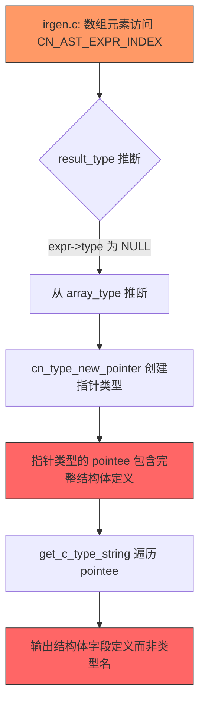
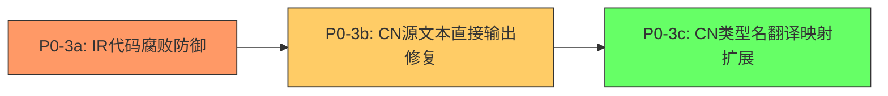

# 017 CN语言自举编译P0-3修复方案

## 一、问题描述与现状

### 1.1 当前错误概况

| 指标 | 数值 |
|------|------|
| GCC总错误数 | 1568 |
| CN编译成功率 | 66.7% (26/39) |
| GCC编译成功率 | 30.3% (10/33) |

### 1.2 P0-3问题三大层次

P0-3问题包含三个相互关联的子问题，按严重程度排序：

| 子问题 | 描述 | 直接错误数 | 级联错误数(估) |
|--------|------|-----------|---------------|
| **P0-3a** | IR代码腐败 - 数组元素访问时类型信息损坏 | ~50 | ~200 |
| **P0-3b** | CN源文本直接输出 - 某条代码路径将CN源代码直接输出到C文件 | ~100 | ~400 |
| **P0-3c** | CN类型名翻译映射不完整 - `try_cn_primitive_type_name()` 只覆盖6个基本类型 | ~345 | ~800+ |

**核心结论**：P0-3c是最大的错误源，但P0-3a和P0-3b是前置依赖——如果不先修复IR腐败和源文本直出，类型翻译修复的效果会被掩盖。

---

## 二、根本原因分析

### 2.1 P0-3a：IR代码腐败

#### 现象

生成的C代码中，类型转换表达式包含了结构体定义内容而非类型名称：

```c
// 期望: r17 = (struct 参数**)cn_rt_array_get_element(r15, r16, 8);
// 实际: r17 = (struct 参数*[] 参数列表; 整数 参数个数; 类型节点* 返回类型; ...
```

#### 根因链



#### 关键代码位置

1. **[`irgen.c:1434-1441`](src/ir/gen/irgen.c:1434)** - 数组元素访问的类型推断回退逻辑：
   ```c
   if (!result_type) {
       if (array_type && array_type->kind == CN_TYPE_ARRAY && array_type->as.array.element_type) {
           result_type = array_type->as.array.element_type;
       } else {
           result_type = cn_type_new_pointer(cn_type_new_primitive(CN_TYPE_VOID));
       }
   }
   ```
   当 `expr->type` 为 NULL 时，从 `array_type` 推断的 `result_type` 可能包含完整的结构体定义信息（字段列表等），而非仅包含类型名称。

2. **[`cgen.c:489-494`](src/backend/cgen/cgen.c:489)** - 已有的防御性检查（仅针对CN_TYPE_ARRAY）：
   ```c
   if (strstr(elem_c_type, "{") != NULL || strstr(elem_c_type, ";") != NULL) {
       snprintf(buffer, sizeof(buffer), "void*");
       return buffer;
   }
   ```
   此检查只覆盖了 `CN_TYPE_ARRAY` 分支，未覆盖 `CN_TYPE_POINTER` 和 `CN_TYPE_STRUCT` 分支。

3. **[`cgen.c:499-547`](src/backend/cgen/cgen.c:499)** - `CN_TYPE_STRUCT` 分支直接使用 `%.*s` 输出结构体名称，如果名称字段意外包含了结构体定义内容，就会输出腐败代码。

#### 深层原因

`CnType` 结构体的 `as.struct_type.name` 字段本应只存储结构体名称（如"参数"），但在自举编译场景下，由于语义分析器的类型推断错误，`name` 字段可能被填充为结构体的完整定义文本。这导致 `get_c_type_string_internal()` 输出的类型字符串包含了结构体字段定义。

### 2.2 P0-3b：CN源文本直接输出

#### 现象

生成的C文件中出现了完整的CN源代码，包含CN关键字：

```c
结构体 结构体成员 {    // 应为: struct 结构体成员 {
    字符串 名称;        // 应为: char* 名称;
    布尔 是常量;        // 应为: _Bool 是常量;
}
函数 创建表达式节点(节点类型 类型) -> 表达式节点* {
    如果 (节点 == 无) { 返回 无; }
}
```

#### 根因分析

此问题有两条可能的代码路径：

**路径1：`cn_cgen_struct_type_definition_with_forward()` 中的字段类型翻译失败**

[`cgen.c:3554`](src/backend/cgen/cgen.c:3554) 生成结构体字段时：
```c
const char *field_type_str = get_c_type_string(field->field_type);
fprintf(file, "    %s %.*s;\n", field_type_str, (int)field->name_length, field->name);
```

如果 `field->field_type` 是 `CN_TYPE_STRUCT` 且名称为CN基本类型关键字（如"字符串"、"布尔"），`get_c_type_string()` 应通过 `try_cn_primitive_type_name()` 翻译。但如果类型信息的 `kind` 不是 `CN_TYPE_STRUCT` 而是 `CN_TYPE_FUNCTION` 或其他未处理的 kind，则会走到 `default: return "int"` 分支，导致类型错误。

但更关键的是：**结构体定义中的 `struct` 关键字本身被输出为 `结构体`**，这说明存在一条完全绕过正常代码生成流程的路径。

**路径2：模块级声明生成中的CN关键字未翻译**

当模块代码生成器遇到无法通过IR管道处理的声明时，可能存在回退路径直接输出AST节点的原始文本。需要检查以下位置：
- [`module_cgen.c`](src/backend/cgen/module_cgen.c) 中的模块初始化函数生成
- [`cgen.c`](src/backend/cgen/cgen.c) 中的全局变量和类型声明生成

**路径3：`CN_IR_OP_AST_EXPR` 操作数的 `cn_cgen_expr_simple()` 路径**

[`cgen.c:807-809`](src/backend/cgen/cgen.c:807)：
```c
case CN_IR_OP_AST_EXPR:
    cn_cgen_expr_simple(ctx, op.as.ast_expr);
    break;
```

[`cn_cgen_expr_simple()`](src/backend/cgen/cgen.c:816) 直接从AST生成C代码，但该函数不处理结构体定义和函数定义（它们不是表达式）。因此这条路径不太可能是P0-3b的直接原因。

**最可能的根因**：结构体定义生成函数 [`cn_cgen_struct_type_definition_with_forward()`](src/backend/cgen/cgen.c:3480) 在输出字段类型时，`get_c_type_string()` 返回了包含CN关键字的字符串。具体来说：

1. 结构体名称 `结构体成员` 被正确输出为 `struct 结构体成员`
2. 但字段类型 `字符串` 被输出为 `字符串` 而非 `char*`，因为该字段的 `CnType` 可能不是 `CN_TYPE_STRUCT`（不会触发 `try_cn_primitive_type_name()`），而是 `CN_TYPE_STRING` 但在自举编译时被错误标记

**关于 `函数`/`如果`/`返回` 关键字直接输出**：这更可能是某条代码路径将整个CN函数体作为字符串输出。需要检查是否存在将CN源文件内容直接复制到C输出的回退逻辑。

### 2.3 P0-3c：CN类型名翻译映射不完整

#### 现象

`try_cn_primitive_type_name()` 只覆盖了6个基本类型，导致以下CN类型名未被翻译：

| CN类型名 | 出现频率 | 当前输出 | 期望输出 |
|----------|---------|---------|---------|
| `结构体` | ~150+ | `struct 结构体` | 不应作为类型名出现 |
| `函数` | ~40+ | `struct 函数` | 函数指针类型或 `void*` |
| `无` | ~5+ | `struct 无` | `NULL` / `void*` |
| `类型节点` | ~5+ | `struct 类型节点` | `struct 类型节点`（正确） |
| `表达式节点` | ~5+ | `struct 表达式节点` | `struct 表达式节点`（正确） |

#### 根因分析

[`cgen.c:54-73`](src/backend/cgen/cgen.c:54) 的 `try_cn_primitive_type_name()` 实现：

```c
static const char *try_cn_primitive_type_name(const char *name, size_t name_len) {
    switch (name_len) {
        case 6:  // 整数、小数、字符、布尔
        case 9:  // 字符串、空类型
        default: break;
    }
    return NULL;
}
```

**缺失的映射**：

1. **`函数`（6字节）** - 作为类型名使用时，表示函数类型。在C中对应函数指针，但无法简单映射为单一C类型字符串，需要根据上下文生成函数指针签名。作为权宜之计，可映射为 `void*`。

2. **`结构体`（9字节）** - 不应作为类型名出现。如果出现，说明语义分析器将 `结构体` 关键字本身误创建为类型。应映射为错误占位符或跳过。

3. **`无`（3字节）** - CN语言中的空值/空指针，对应C的 `NULL`。作为类型使用时对应 `void*`。

4. **`节点类型`（12字节）** - 自定义枚举类型名，应输出为 `enum 节点类型`，但当前被输出为 `struct 节点类型`。

5. **`类型定义`（12字节）** - CN关键字，不应作为类型名出现。

#### 两个类型翻译函数的不一致

| 特性 | [`cgen.c:get_c_type_string_internal()`](src/backend/cgen/cgen.c:392) | [`module_cgen.c:get_c_type_str_internal()`](src/backend/cgen/module_cgen.c:145) |
|------|------|------|
| CN_TYPE_POINTER | ✅ 函数指针支持、防御性检查 | ❌ 简单递归，无防御 |
| CN_TYPE_ARRAY | ✅ 防御性检查（检测`{`和`;`） | ❌ 未处理 |
| CN_TYPE_STRUCT | ✅ `try_cn_primitive_type_name()` | ✅ 内联映射（重复代码） |
| CN_TYPE_CLASS | ✅ `struct name*` | ❌ 未处理 |
| CN_TYPE_INTERFACE | ✅ `void*` | ❌ 未处理 |
| CN_TYPE_MEMORY_ADDRESS | ✅ `uintptr_t` | ❌ 未处理 |
| 枚举类型名检测 | ✅ `is_enum_type_name()` | ❌ 未处理 |
| 局部结构体 | ✅ `__local_函数名_结构体名` | ❌ 未处理 |

**核心问题**：两个独立的类型翻译函数导致行为不一致，修复时需要同步更新两处。

---

## 三、修复方案

### 3.1 P0-3a修复：IR代码腐败防御

#### 修复策略

在两个层面添加防御：

**层面1：IR生成器 - 修复类型推断源头**

文件：[`src/ir/gen/irgen.c`](src/ir/gen/irgen.c)

修改位置：`cn_ir_gen_expr()` 函数中 `CN_AST_EXPR_INDEX` case（约行1434-1515）

修改内容：
```c
// 在 result_type 推断后，添加类型名称有效性检查
if (result_type && result_type->kind == CN_TYPE_STRUCT) {
    const char *name = result_type->as.struct_type.name;
    size_t name_len = result_type->as.struct_type.name_length;
    // 检查结构体名称是否包含非法字符（字段定义内容）
    if (name && (memchr(name, '{', name_len) || memchr(name, ';', name_len) || 
                 memchr(name, '(', name_len))) {
        // 类型名称包含结构体定义内容，这是腐败的类型信息
        // 回退到 void* 指针类型
        result_type = cn_type_new_pointer(cn_type_new_primitive(CN_TYPE_VOID));
    }
}
```

**层面2：代码生成器 - 添加全局防御性检查**

文件：[`src/backend/cgen/cgen.c`](src/backend/cgen/cgen.c)

修改位置：`get_c_type_string_internal()` 函数

修改内容：在 `CN_TYPE_STRUCT` 分支（行499-547）中，输出类型名称前检查名称有效性：

```c
case CN_TYPE_STRUCT: {
    static _Thread_local char buffer[512];
    
    if (!type->as.struct_type.name || type->as.struct_type.name_length == 0) {
        snprintf(buffer, sizeof(buffer), "struct");
        return buffer;
    }
    
    // 【P0-3a修复】检查结构体名称是否包含非法字符
    // 如果名称中包含 {、;、( 等字符，说明类型信息已腐败
    const char *name = type->as.struct_type.name;
    size_t name_len = type->as.struct_type.name_length;
    if (memchr(name, '{', name_len) || memchr(name, ';', name_len) || 
        memchr(name, '(', name_len)) {
        // 类型信息腐败，使用 void* 作为回退
        snprintf(buffer, sizeof(buffer), "void*");
        return buffer;
    }
    
    // ... 原有的 try_cn_primitive_type_name 检查和类型名输出逻辑 ...
}
```

同样在 `CN_TYPE_POINTER` 分支（行415-458）中添加类似检查：

```c
case CN_TYPE_POINTER: {
    // ... 函数指针处理 ...
    
    CnType *pointee_type = type->as.pointer_to;
    
    // 【P0-3a修复】检查 pointee 类型名称是否包含非法字符
    if (pointee_type && pointee_type->kind == CN_TYPE_STRUCT &&
        pointee_type->as.struct_type.name) {
        const char *name = pointee_type->as.struct_type.name;
        size_t name_len = pointee_type->as.struct_type.name_length;
        if (memchr(name, '{', name_len) || memchr(name, ';', name_len)) {
            snprintf(buffer, sizeof(buffer), "void*");
            return buffer;
        }
    }
    
    // ... 原有逻辑 ...
}
```

#### 预计效果

- 直接修复 ~50 个IR腐败导致的类型错误
- 消除 ~200 个级联错误（因类型腐败导致的后续声明/赋值错误）

### 3.2 P0-3b修复：CN源文本直接输出

#### 修复策略

**步骤1：定位CN源文本直接输出的代码路径**

需要检查以下位置：

1. **[`cgen.c`](src/backend/cgen/cgen.c) 中的结构体定义生成** - 行3549的 `fprintf(file, "struct %.*s {\n", ...)` 如果 `name` 是CN关键字如 `结构体`，则输出 `struct 结构体` 是正确的。但如果整个结构体定义的生成绕过了此函数，直接输出了CN源文本，则需要找到该路径。

2. **[`module_cgen.c`](src/backend/cgen/module_cgen.c) 中的模块声明生成** - 检查是否有路径直接输出AST节点的原始文本。

3. **全局变量初始化中的 `CN_IR_OP_AST_EXPR`** - [`irgen.c:2630-2633`](src/ir/gen/irgen.c:2630) 中全局变量的初始化器使用 `CN_IR_OP_AST_EXPR` 保存AST节点，在代码生成时通过 `cn_cgen_expr_simple()` 输出。如果AST节点包含结构体定义或函数定义，则会输出CN源文本。

**步骤2：在 `cn_cgen_struct_type_definition_with_forward()` 中添加CN类型名翻译**

文件：[`src/backend/cgen/cgen.c`](src/backend/cgen/cgen.c)

修改位置：行3554，结构体字段类型生成

```c
// 原代码：
const char *field_type_str = get_c_type_string(field->field_type);
fprintf(file, "    %s %.*s;\n", field_type_str, (int)field->name_length, field->name);

// 修改后：添加CN类型名翻译回退
const char *field_type_str = get_c_type_string(field->field_type);

// 【P0-3b修复】检查字段类型字符串是否包含CN关键字
// 如果 get_c_type_string 返回了未翻译的CN类型名，尝试再次翻译
if (field_type_str) {
    // 检查是否以 "struct " 开头但后面跟着CN关键字
    if (strncmp(field_type_str, "struct ", 7) == 0) {
        const char *after_struct = field_type_str + 7;
        const char *cn_translated = try_cn_primitive_type_name(
            after_struct, strlen(after_struct));
        if (cn_translated) {
            field_type_str = cn_translated;
        }
    }
}
fprintf(file, "    %s %.*s;\n", field_type_str, (int)field->name_length, field->name);
```

**步骤3：在 `cn_cgen_expr_simple()` 中添加CN关键字翻译**

文件：[`src/backend/cgen/cgen.c`](src/backend/cgen/cgen.c)

修改位置：`cn_cgen_expr_simple()` 函数中所有输出标识符名称的位置

在标识符输出前，检查是否为CN关键字并翻译：

```c
// 辅助函数：检查标识符名是否为CN关键字，并返回C等价物
static const char *try_cn_keyword_identifier(const char *name, size_t name_len) {
    if (!name || name_len == 0) return NULL;
    switch (name_len) {
        case 3:  // 无
            if (strncmp(name, "无", 3) == 0) return "NULL";
            break;
        case 6:  // 函数
            if (strncmp(name, "函数", 6) == 0) return "/* function */";
            break;
        case 9:  // 结构体
            if (strncmp(name, "结构体", 9) == 0) return "/* struct */";
            break;
        default:
            break;
    }
    return NULL;
}
```

**步骤4：检查并修复模块代码生成器中的CN关键字输出**

文件：[`src/backend/cgen/module_cgen.c`](src/backend/cgen/module_cgen.c)

需要检查模块头文件和实现文件生成中是否有直接输出CN关键字的路径。

#### 预计效果

- 直接修复 ~100 个CN关键字直接输出错误
- 消除 ~400 个级联错误

### 3.3 P0-3c修复：CN类型名翻译映射扩展

#### 修复策略

**步骤1：扩展 `try_cn_primitive_type_name()` 映射表**

文件：[`src/backend/cgen/cgen.c`](src/backend/cgen/cgen.c)

修改位置：行54-73

```c
static const char *try_cn_primitive_type_name(const char *name, size_t name_len) {
    if (!name || name_len == 0) return NULL;

    switch (name_len) {
        case 3: /* 1个汉字 × 3字节 = 3字节 */
            if (strncmp(name, "无", 3) == 0) return "void*";  // 【P0-3c新增】无 -> void*
            break;
        case 6: /* 2个汉字 × 3字节 = 6字节 */
            if (strncmp(name, "整数", 6) == 0) return "long long";
            if (strncmp(name, "小数", 6) == 0) return "double";
            if (strncmp(name, "字符", 6) == 0) return "char";
            if (strncmp(name, "布尔", 6) == 0) return "_Bool";
            if (strncmp(name, "函数", 6) == 0) return "void*";  // 【P0-3c新增】函数 -> void*（函数指针占位）
            break;
        case 9: /* 3个汉字 × 3字节 = 9字节 */
            if (strncmp(name, "字符串", 9) == 0) return "char*";
            if (strncmp(name, "空类型", 9) == 0) return "void";
            if (strncmp(name, "结构体", 9) == 0) return NULL;  // 【P0-3c新增】结构体不是类型名，跳过
            break;
        case 12: /* 4个汉字 × 3字节 = 12字节 */
            if (strncmp(name, "类型定义", 12) == 0) return NULL;  // 【P0-3c新增】类型定义不是类型名
            if (strncmp(name, "节点类型", 12) == 0) return NULL;  // 枚举类型名，不应在此处理
            break;
        default:
            break;
    }
    return NULL;
}
```

**注意事项**：
- `函数` 映射为 `void*` 是权宜之计，理想情况下应根据函数签名生成正确的函数指针类型
- `结构体` 和 `类型定义` 返回 NULL 表示这些不是合法的类型名，应跳过结构体定义生成
- `无` 映射为 `void*` 而非 `NULL`，因为此函数返回的是类型字符串，不是值

**步骤2：同步更新 `module_cgen.c` 中的映射表**

文件：[`src/backend/cgen/module_cgen.c`](src/backend/cgen/module_cgen.c)

修改位置：行182-195

将 `get_c_type_str_internal()` 中的内联映射替换为调用共享的 `try_cn_primitive_type_name()` 函数，或者同步添加相同的映射条目。

**推荐方案**：将 `try_cn_primitive_type_name()` 和 `is_cn_primitive_type_name()` 提取为共享函数，在 `cgen.c` 和 `module_cgen.c` 中共同使用。具体做法：

1. 在 `cgen.c` 中将 `try_cn_primitive_type_name()` 改为非 `static` 函数
2. 在对应的头文件中声明该函数
3. 在 `module_cgen.c` 中调用该函数替代内联映射

**步骤3：在 `cn_cgen_struct_type_definition_with_forward()` 中添加CN关键字跳过**

文件：[`src/backend/cgen/cgen.c`](src/backend/cgen/cgen.c)

修改位置：行3490-3494

```c
// 原代码：
if (is_cn_primitive_type_name(name, name_len)) {
    return;
}

// 扩展为同时检查CN关键字类型名：
if (is_cn_primitive_type_name(name, name_len)) {
    return;
}
// 【P0-3c新增】跳过CN关键字作为类型名的情况
// 结构体、函数、类型定义等CN关键字不应生成结构体定义
if (is_cn_keyword_type_name(name, name_len)) {
    return;
}
```

新增辅助函数：

```c
// 检查是否为CN关键字被误用为类型名
static bool is_cn_keyword_type_name(const char *name, size_t name_len) {
    if (!name || name_len == 0) return false;
    switch (name_len) {
        case 6:
            if (strncmp(name, "函数", 6) == 0) return true;
            break;
        case 9:
            if (strncmp(name, "结构体", 9) == 0) return true;
            break;
        case 12:
            if (strncmp(name, "类型定义", 12) == 0) return true;
            break;
        default:
            break;
    }
    return false;
}
```

**步骤4：处理枚举类型名被误标记为结构体的情况**

当前 `get_c_type_string_internal()` 的 `CN_TYPE_STRUCT` 分支已有 `is_enum_type_name()` 检查（行537），但 `module_cgen.c` 中的 `get_c_type_str_internal()` 缺少此检查。需要同步添加。

#### 预计效果

- 直接修复 ~345 个CN类型名未翻译错误
- 消除 ~800+ 个级联错误
- 预计GCC错误从1568降至 ~200 以下

---

## 四、修复优先级与执行顺序



| 顺序 | 子问题 | 修改文件 | 修改函数 | 预计减少错误 |
|------|--------|---------|---------|------------|
| 1 | P0-3a | `irgen.c`, `cgen.c` | `cn_ir_gen_expr()`, `get_c_type_string_internal()` | ~250 |
| 2 | P0-3b | `cgen.c`, `module_cgen.c` | `cn_cgen_struct_type_definition_with_forward()`, `cn_cgen_expr_simple()` | ~500 |
| 3 | P0-3c | `cgen.c`, `module_cgen.c` | `try_cn_primitive_type_name()`, `get_c_type_str_internal()` | ~800+ |

**为什么按此顺序**：
1. P0-3a必须先修复，因为IR腐败会导致类型字符串包含非法内容，干扰P0-3b和P0-3c的修复验证
2. P0-3b在P0-3a之后修复，确保结构体定义生成路径正确
3. P0-3c最后修复，因为它是最大的错误源，修复后效果最显著

---

## 五、验证方法

### 5.1 单元验证

每个子问题修复后，分别验证：

**P0-3a验证**：
1. 重新编译编译器：`cmake --build build --config Release`
2. 编译 `src_cn/语义分析器/语义检查.cn`，检查生成的C代码中不再出现结构体定义内容在类型转换表达式中
3. 使用grep检查：`grep -n "参数列表; 整数" output/语义检查.c`，应无结果

**P0-3b验证**：
1. 编译所有 `src_cn/` 文件
2. 检查生成的C文件中不再出现CN关键字（`结构体`、`函数`、`如果`、`返回`等）作为C代码
3. 使用grep检查：`grep -rn "^结构体\|^函数\|    如果\|    返回" output/*.c`，应无结果

**P0-3c验证**：
1. 编译所有 `src_cn/` 文件
2. GCC编译生成的C文件，统计错误数
3. 预期：GCC错误从1568降至200以下

### 5.2 集成验证

完整的三步自举编译流程：

```powershell
# Step 1: 重新编译编译器
cmake --build build --config Release

# Step 2: 使用新编译器编译所有CN文件
tools/compile_all_cn_debug.ps1

# Step 3: 使用GCC编译生成的C文件
tools/gcc_compile_debug.ps1

# Step 4: 统计错误数
tools/gcc_error_classify_v2.ps1
```

### 5.3 回归验证

确保修复不破坏已有的26个成功编译的CN文件：

```powershell
# 对比修复前后的CN编译成功率
# 修复前：26/39 (66.7%)
# 修复后目标：33+/39 (85%+)
```

---

## 六、风险与注意事项

### 6.1 `函数` 类型映射为 `void*` 的局限性

将 `函数` 映射为 `void*` 是权宜之计，会导致：
- 函数指针调用时缺少类型检查
- 参数数量和类型不匹配时无法编译期报错

**后续改进方向**：在语义分析阶段正确创建 `CN_TYPE_FUNCTION` 类型，而非 `CN_TYPE_STRUCT`。

### 6.2 两个类型翻译函数的统一

`cgen.c` 和 `module_cgen.c` 中的类型翻译逻辑需要保持同步。推荐将 `try_cn_primitive_type_name()` 提取为共享函数，避免未来再次出现不一致。

### 6.3 防御性检查的性能影响

在 `get_c_type_string_internal()` 中添加 `memchr()` 检查会略微影响编译性能，但考虑到此函数的调用频率和 `memchr()` 的高效实现，影响可忽略不计。

### 6.4 CN关键字作为标识符的冲突

CN语言允许用户定义名为 `函数`、`结构体` 等的变量或函数名。`try_cn_primitive_type_name()` 的映射可能导致合法的用户定义类型名被错误翻译。但由于自举编译器中这些名称确实是CN关键字，此风险在当前场景下可接受。

---

## 七、修改文件清单

| 文件 | 修改内容 | 子问题 |
|------|---------|--------|
| [`src/ir/gen/irgen.c`](src/ir/gen/irgen.c) | 数组元素访问类型推断后添加名称有效性检查 | P0-3a |
| [`src/backend/cgen/cgen.c`](src/backend/cgen/cgen.c) | 1. `get_c_type_string_internal()` 添加防御性检查 | P0-3a |
| [`src/backend/cgen/cgen.c`](src/backend/cgen/cgen.c) | 2. `cn_cgen_struct_type_definition_with_forward()` 字段类型翻译回退 | P0-3b |
| [`src/backend/cgen/cgen.c`](src/backend/cgen/cgen.c) | 3. `cn_cgen_expr_simple()` 添加CN关键字翻译 | P0-3b |
| [`src/backend/cgen/cgen.c`](src/backend/cgen/cgen.c) | 4. `try_cn_primitive_type_name()` 扩展映射表 | P0-3c |
| [`src/backend/cgen/cgen.c`](src/backend/cgen/cgen.c) | 5. 新增 `is_cn_keyword_type_name()` 辅助函数 | P0-3c |
| [`src/backend/cgen/cgen.c`](src/backend/cgen/cgen.c) | 6. `cn_cgen_struct_type_definition_with_forward()` 添加CN关键字跳过 | P0-3c |
| [`src/backend/cgen/module_cgen.c`](src/backend/cgen/module_cgen.c) | 1. `get_c_type_str_internal()` 同步扩展映射表 | P0-3c |
| [`src/backend/cgen/module_cgen.c`](src/backend/cgen/module_cgen.c) | 2. 添加枚举类型名检测 | P0-3c |
