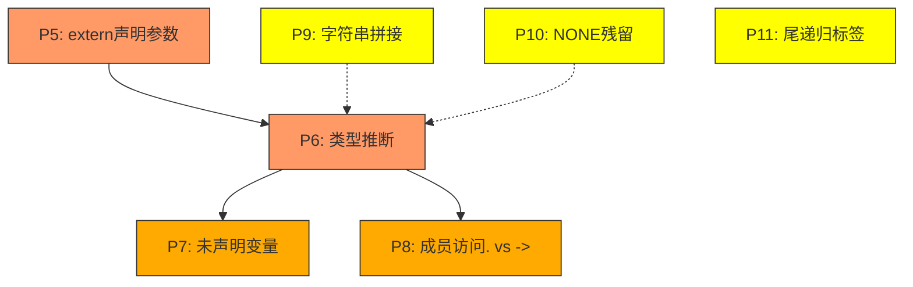

# 018 CN语言自举编译P5-P11修复方案

## 一、问题描述与现状

### 1.1 当前错误概况

| 指标 | 数值 |
|------|------|
| GCC总错误数 | 235 |
| P5-P11错误合计 | 174（占74%） |
| 前序P1-P4修复效果 | 279→224（-19.7%） |

### 1.2 P5-P11问题分类

| 优先级 | 类别 | 数量 | 占比 | 根因 |
|--------|------|------|------|------|
| **P5** | 函数参数数量不匹配 | 63 | 26.8% | K&R extern声明无参数信息 |
| **P6** | 赋值/初始化类型不匹配 | 62 | 24.7% | 变量类型推断错误（指针/结构体被推断为int） |
| **P7** | 未声明变量 | 22 | 9.4% | 变量名映射错误或作用域问题 |
| **P8** | 成员访问错误(. vs ->) | 15 | 6.4% | 指针变量用`.`访问而非`->` |
| **P9** | 字符串拼接 | 4 | 1.7% | C不支持`"str" + ptr` |
| **P10** | NONE残留 | 5 | 2.1% | `/* NONE */`残留 |
| **P11** | 尾递归标签 | 3 | 1.3% | 尾递归优化标签缺失 |

### 1.3 修复依赖关系



**核心结论**：P5和P6是最大的错误源（合计125个，占53%），且P6是P7和P8的前置依赖。修复优先级：P5 > P6 > P8 > P7 > P10 > P9 > P11。

---

## 二、P5修复：改进extern声明生成ANSI参数列表

### 2.1 问题描述

当前P2修复生成的K&R风格extern声明不包含参数信息，GCC默认认为参数为0个，导致所有跨模块函数调用报"参数数量不匹配"错误。

**典型错误**：
```c
// 声明解析.c:1325 - 期望1个参数，但extern声明显示0个
r38 = 解析类型(r37);  // error: too many arguments; expected 0, have 1
```

### 2.2 根因分析

[`cgen.c:4809-4811`](src/backend/cgen/cgen.c:4809) 生成K&R风格声明：

```c
// 使用K&R风格声明（不检查参数），避免参数类型不匹配问题
fprintf(file, "extern %s %s();\n", ret_type_str,
        get_c_function_name(extern_func_names[ei]));
```

K&R声明 `extern ret_type func_name();` 在C中意味着"接受任意参数"（旧式声明），但GCC在严格模式下默认参数为0个。而ANSI声明 `extern ret_type func_name(type1, type2);` 明确列出参数类型。

### 2.3 修复方案

**策略**：从CALL指令的`extra_args`中收集参数类型信息，生成ANSI风格声明。

**修改文件**：[`src/backend/cgen/cgen.c`](src/backend/cgen/cgen.c)

**修改位置**：P2 extern声明生成代码块（行4711-4816）

**具体实现**：

```c
// 【P5修复】在收集extern函数时，同时收集参数类型信息
{
    #define MAX_EXTERN_FUNCS 512
    #define MAX_EXTERN_PARAMS 16  // 每个extern函数最多16个参数
    
    const char *extern_func_names[MAX_EXTERN_FUNCS];
    CnType *extern_func_ret_types[MAX_EXTERN_FUNCS];
    // 【P5新增】参数类型信息
    CnType *extern_func_param_types[MAX_EXTERN_FUNCS][MAX_EXTERN_PARAMS];
    size_t extern_func_param_counts[MAX_EXTERN_FUNCS];
    size_t extern_func_count = 0;
    
    // 初始化参数计数
    memset(extern_func_param_counts, 0, sizeof(extern_func_param_counts));
    
    CnIrFunction *scan_func = module->first_func;
    while (scan_func) {
        CnIrBasicBlock *scan_block = scan_func->first_block;
        while (scan_block) {
            CnIrInst *scan_inst = scan_block->first_inst;
            while (scan_inst) {
                if (scan_inst->kind == CN_IR_INST_CALL &&
                    scan_inst->src1.kind == CN_IR_OP_SYMBOL &&
                    scan_inst->src1.as.sym_name) {
                    const char *called_func_name = scan_inst->src1.as.sym_name;
                    
                    // 跳过运行时库函数...
                    // （保持原有逻辑不变）
                    
                    // 检查是否已声明...
                    // （保持原有逻辑不变）
                    
                    if (!already_declared && extern_func_count < MAX_EXTERN_FUNCS) {
                        extern_func_names[extern_func_count] = called_func_name;
                        extern_func_ret_types[extern_func_count] =
                            (scan_inst->dest.kind == CN_IR_OP_REG && scan_inst->dest.type)
                            ? scan_inst->dest.type : NULL;
                        
                        // 【P5新增】收集参数类型
                        size_t param_count = 0;
                        if (scan_inst->extra_args_count > 0 && scan_inst->extra_args) {
                            for (size_t ai = 0; ai < scan_inst->extra_args_count && ai < MAX_EXTERN_PARAMS; ai++) {
                                if (scan_inst->extra_args[ai].type) {
                                    extern_func_param_types[extern_func_count][ai] = 
                                        scan_inst->extra_args[ai].type;
                                } else {
                                    // 无类型信息时默认为 long long
                                    extern_func_param_types[extern_func_count][ai] = NULL;
                                }
                                param_count++;
                            }
                        }
                        // 也收集src2作为第一个参数（某些CALL格式）
                        if (scan_inst->src2.kind != CN_IR_OP_NONE && param_count < MAX_EXTERN_PARAMS) {
                            // src2不是参数，是CALL指令的额外信息
                        }
                        extern_func_param_counts[extern_func_count] = param_count;
                        extern_func_count++;
                    }
                }
                scan_inst = scan_inst->next;
            }
            scan_block = scan_block->next;
        }
        scan_func = scan_func->next;
    }
    
    // 生成extern声明（ANSI风格）
    if (extern_func_count > 0) {
        fprintf(file, "// Extern Declarations - 跨模块调用的函数\n");
        for (size_t ei = 0; ei < extern_func_count; ei++) {
            const char *ret_type_str = "long long";  // 默认返回类型
            // （返回类型推断逻辑保持不变）
            
            // 【P5修复】生成ANSI风格声明，包含参数类型
            fprintf(file, "extern %s %s(", ret_type_str,
                    get_c_function_name(extern_func_names[ei]));
            
            if (extern_func_param_counts[ei] == 0) {
                fprintf(file, "void");  // 无参数时使用 void
            } else {
                for (size_t pi = 0; pi < extern_func_param_counts[ei]; pi++) {
                    CnType *param_type = extern_func_param_types[ei][pi];
                    if (param_type) {
                        fprintf(file, "%s", get_c_type_string(param_type));
                    } else {
                        fprintf(file, "long long");  // 默认类型
                    }
                    if (pi < extern_func_param_counts[ei] - 1) {
                        fprintf(file, ", ");
                    }
                }
            }
            fprintf(file, ");\n");
        }
        fprintf(file, "\n");
    }
    #undef MAX_EXTERN_FUNCS
    #undef MAX_EXTERN_PARAMS
}
```

### 2.4 预期效果

- 消除约63个"参数数量不匹配"错误
- extern声明从 `extern void* 解析类型();` 变为 `extern void* 解析类型(long long);`

### 2.5 风险评估

| 风险 | 等级 | 缓解措施 |
|------|------|----------|
| 参数类型推断不准确 | 中 | 无类型信息时使用`long long`默认值，GCC会隐式转换 |
| 同一函数不同调用点参数数量不同 | 低 | 取第一次遇到的调用点参数信息，或合并所有调用点的参数 |
| `get_c_type_string()`对某些类型返回错误 | 低 | 已有P0-3修复的防御性检查 |

### 2.6 取舍考量

- **方案A（推荐）**：从CALL指令的extra_args收集参数类型 → 准确但需要修改数据结构
- **方案B**：使用`void`作为唯一参数（`extern ret_type func(void*)`）→ 简单但不精确
- **方案C**：使用`...`可变参数（`extern ret_type func(...)`）→ GCC不检查参数但可能警告

选择方案A，因为它最精确且能消除最多错误。

---

## 三、P6修复：改进变量类型推断

### 3.1 问题描述

变量类型推断错误导致赋值/初始化时类型不匹配。指针/结构体类型被推断为`long long int`或`char`，赋值时GCC报类型不兼容。

**典型错误**：
```c
// 加载器.c:1164 - char** 赋值给 char*
r8 = r7;  // error: assignment to 'char *' from incompatible pointer type 'char **'
// C代码生成.c:1538 - char* + int 赋值给 long long int
r27 = r25 + r26;  // error: assignment to 'long long int' from 'char *'
```

### 3.2 根因分析

当前P1修复（[`cgen.c:2176-2219`](src/backend/cgen/cgen.c:2176)）只处理了**STORE指令中dest为SYMBOL且src1为REG**的场景。但类型推断错误还出现在以下场景：

1. **MOV指令类型传播**：`r8 = r7`，r7是`char**`但r8被推断为`char*`
2. **ADD指令结果类型**：指针+整数的结果应是指针类型，但被推断为`long long int`
3. **LOAD指令类型传播**：从指针类型变量LOAD时，结果类型可能丢失
4. **CALL返回值类型传播**：函数返回指针/结构体，但目标寄存器类型未更新
5. **PHI指令类型传播**：条件分支合并时类型信息丢失

### 3.3 修复方案

**策略**：扩展多遍类型传播扫描，覆盖更多指令类型。

**修改文件**：[`src/backend/cgen/cgen.c`](src/backend/cgen/cgen.c)

**修改位置**：函数`cn_cgen_function()`中的类型传播扫描循环（约行2220-2700）

#### 3.3.1 扩展ADD指令的指针算术类型推断

在类型传播扫描中，当遇到ADD指令且其中一个操作数是指针类型时，结果也应是指针类型：

```c
// 【P6修复】ADD指令指针算术类型推断
// 指针 + 整数 = 指针；整数 + 指针 = 指针
if (scan_inst->kind == CN_IR_INST_ADD) {
    CnType *src1_type = NULL;
    CnType *src2_type = NULL;
    
    // 获取src1类型
    if (scan_inst->src1.kind == CN_IR_OP_REG && 
        scan_inst->src1.as.reg_id < ctx->reg_types_count) {
        src1_type = ctx->reg_types[scan_inst->src1.as.reg_id];
    }
    
    // 获取src2类型
    if (scan_inst->src2.kind == CN_IR_OP_REG && 
        scan_inst->src2.as.reg_id < ctx->reg_types_count) {
        src2_type = ctx->reg_types[scan_inst->src2.as.reg_id];
    }
    
    // 如果任一操作数是指针类型，结果也是指针类型
    CnType *pointer_type = NULL;
    if (src1_type && is_pointer_type_unified(src1_type)) {
        pointer_type = src1_type;
    } else if (src2_type && is_pointer_type_unified(src2_type)) {
        pointer_type = src2_type;
    }
    
    if (pointer_type && dest_reg_id >= 0 && dest_reg_id < ctx->reg_types_count) {
        ctx->reg_types[dest_reg_id] = pointer_type;
    }
}
```

#### 3.3.2 扩展MOV指令类型传播

当前MOV指令（`CN_IR_INST_MOV`）的类型传播可能不完整。需要确保当源操作数有类型信息时，目标寄存器也获得相同类型：

```c
// 【P6修复】MOV指令类型传播
if (scan_inst->kind == CN_IR_INST_MOV) {
    CnType *src_type = NULL;
    
    if (scan_inst->src1.kind == CN_IR_OP_REG && 
        scan_inst->src1.as.reg_id < ctx->reg_types_count) {
        src_type = ctx->reg_types[scan_inst->src1.as.reg_id];
    } else if (scan_inst->src1.kind == CN_IR_OP_SYMBOL && 
               scan_inst->src1.type) {
        src_type = scan_inst->src1.type;
    }
    
    // 指针/结构体类型优先于整型
    if (src_type && 
        (src_type->kind == CN_TYPE_POINTER || 
         src_type->kind == CN_TYPE_STRUCT ||
         src_type->kind == CN_TYPE_STRING)) {
        if (dest_reg_id >= 0 && dest_reg_id < ctx->reg_types_count) {
            CnType *existing = ctx->reg_types[dest_reg_id];
            if (!existing || 
                existing->kind == CN_TYPE_INT || 
                existing->kind == CN_TYPE_UNKNOWN) {
                ctx->reg_types[dest_reg_id] = src_type;
            }
        }
    }
}
```

#### 3.3.3 扩展STORE指令类型推断（补充P1修复）

P1修复只处理了`dest.kind == CN_IR_OP_SYMBOL`的情况。当STORE的目标是寄存器（通过指针间接存储）时，也需要类型推断：

```c
// 【P6修复】STORE指令 - 目标是寄存器时的类型推断
if (scan_inst->kind == CN_IR_INST_STORE &&
    scan_inst->dest.kind == CN_IR_OP_REG &&
    scan_inst->src1.kind == CN_IR_OP_REG &&
    scan_inst->src1.type) {
    CnType *src_type = scan_inst->src1.type;
    if (src_type->kind == CN_TYPE_POINTER ||
        src_type->kind == CN_TYPE_STRUCT ||
        src_type->kind == CN_TYPE_STRING) {
        int dest_reg = scan_inst->dest.as.reg_id;
        if (dest_reg < ctx->reg_types_count) {
            CnType *existing = ctx->reg_types[dest_reg];
            if (!existing || 
                existing->kind == CN_TYPE_INT || 
                existing->kind == CN_TYPE_UNKNOWN) {
                ctx->reg_types[dest_reg] = src_type;
            }
        }
    }
}
```

#### 3.3.4 扩展CALL指令返回值类型传播

确保CALL指令的返回值类型正确传播到目标寄存器：

```c
// 【P6修复】CALL指令返回值类型传播
if (scan_inst->kind == CN_IR_INST_CALL &&
    scan_inst->dest.kind == CN_IR_OP_REG &&
    scan_inst->dest.type) {
    CnType *ret_type = scan_inst->dest.type;
    int dest_reg = scan_inst->dest.as.reg_id;
    if (dest_reg < ctx->reg_types_count) {
        // 强制使用CALL指令的返回类型（这是最准确的类型信息）
        ctx->reg_types[dest_reg] = ret_type;
    }
}
```

### 3.4 预期效果

- 消除约62个"赋值/初始化类型不匹配"错误
- 指针算术结果类型正确（`char* + int` → `char*`）
- 变量赋值时类型正确传播

### 3.5 风险评估

| 风险 | 等级 | 缓解措施 |
|------|------|----------|
| 多遍扫描性能开销 | 低 | 已有3遍扫描框架，仅增加指令case分支 |
| 类型传播循环依赖 | 低 | 指针/结构体类型优先级高于INT，不会回退 |
| 错误的类型传播导致新错误 | 中 | 仅在目标类型为INT/UNKNOWN时更新，不覆盖已有精确类型 |

---

## 四、P7修复：修复变量名映射和作用域

### 4.1 问题描述

结构体类型名变量（如`cn_var_类型信息`）在使用前未声明，GCC报"undeclared"错误。

**典型错误**：
```c
// 类型系统.c:1074 - cn_var_类型信息 未声明
cn_var_类型_0 = (struct 类型信息*)分配清零内存(1, 类型大小(cn_var_类型信息));
// error: 'cn_var_类型信息' undeclared; did you mean 'cn_var_类型_0'?
```

### 4.2 根因分析

1. **SIZEOF指令中的类型名被添加`cn_var_`前缀**：当SIZEOF的操作数是类型名（如`类型信息`）时，[`print_operand()`](src/backend/cgen/cgen.c:723) 会将其作为符号输出为 `cn_var_类型信息`，但它实际上是一个类型名，不应添加`cn_var_`前缀。

2. **P4修复已部分解决**：[`cgen.c:1425-1455`](src/backend/cgen/cgen.c:1425) 的SIZEOF指令处理中，当参数不是局部变量时，生成 `struct 类型名` 而非 `cn_var_类型名`。但可能存在遗漏场景。

3. **全局变量未声明**：跨模块引用的全局变量在使用前缺少`extern`声明。

### 4.3 修复方案

#### 4.3.1 SIZEOF指令中的类型名处理（完善P4修复）

检查SIZEOF指令的所有代码路径，确保类型名不被添加`cn_var_`前缀：

**修改文件**：[`src/backend/cgen/cgen.c`](src/backend/cgen/cgen.c)

**修改位置**：`CN_IR_INST_SIZEOF` case（约行1405-1460）

```c
case CN_IR_INST_SIZEOF:
    fprintf(ctx->output_file, "  ");
    print_operand(ctx, inst->dest);
    fprintf(ctx->output_file, " = sizeof(");
    
    bool is_type_name = (inst->extra_args_count > 0);
    
    if (is_type_name) {
        // 类型名：直接输出 struct 类型名，不添加 cn_var_ 前缀
        const char *type_str = get_c_type_string(inst->src1.type);
        if (type_str && strcmp(type_str, "int") != 0) {
            fprintf(ctx->output_file, "%s", type_str);
        } else {
            // 回退：使用符号名作为类型名
            if (inst->src1.kind == CN_IR_OP_SYMBOL && inst->src1.as.sym_name) {
                fprintf(ctx->output_file, "struct %s", inst->src1.as.sym_name);
            } else {
                print_operand(ctx, inst->src1);
            }
        }
    } else if (inst->src1.kind == CN_IR_OP_SYMBOL && inst->src1.as.sym_name) {
        // 【P7完善】检查是否为类型名（即使没有extra_args标记）
        const char *sym_name = inst->src1.as.sym_name;
        bool is_local_var = false;
        
        // 遍历当前函数的ALLOCA指令查找
        if (ctx->current_func) {
            CnIrBasicBlock *block = ctx->current_func->first_block;
            while (block && !is_local_var) {
                CnIrInst *a_inst = block->first_inst;
                while (a_inst && !is_local_var) {
                    if (a_inst->kind == CN_IR_INST_ALLOCA &&
                        a_inst->dest.kind == CN_IR_OP_SYMBOL &&
                        a_inst->dest.as.sym_name &&
                        names_match_with_suffix(a_inst->dest.as.sym_name, sym_name)) {
                        is_local_var = true;
                    }
                    a_inst = a_inst->next;
                }
                block = block->next;
            }
        }
        
        if (!is_local_var) {
            // 不是局部变量，当作类型名处理
            if (inst->src1.type) {
                fprintf(ctx->output_file, "%s", get_c_type_string(inst->src1.type));
            } else {
                fprintf(ctx->output_file, "struct %s", sym_name);
            }
        } else {
            print_operand(ctx, inst->src1);
        }
    } else {
        print_operand(ctx, inst->src1);
    }
    
    fprintf(ctx->output_file, ");\n");
    break;
```

#### 4.3.2 全局变量extern声明补全

检查跨模块引用的全局变量是否缺少extern声明。当前[`cgen.c:3951-3954`](src/backend/cgen/cgen.c:3951)已有import符号的extern声明生成逻辑，但可能遗漏了某些场景。

### 4.4 预期效果

- 消除约22个"未声明变量"错误
- SIZEOF中的类型名不再被错误添加`cn_var_`前缀

### 4.5 风险评估

| 风险 | 等级 | 缓解措施 |
|------|------|----------|
| 类型名与变量名冲突 | 低 | 先检查ALLOCA指令确认是否为局部变量 |
| 全局变量extern声明重复 | 低 | 使用`declared_functions`集合去重 |

---

## 五、P8修复：指针成员访问生成`->`

### 5.1 问题描述

指针变量使用`.`访问成员而非`->`，GCC报"not a structure or union"错误。

**典型错误**：
```c
// 符号表.c:1341 - 指针用.访问
r3 = cn_var_作用域指针_0.是循环体;
// error: request for member '是循环体' in something not a structure or union
```

### 5.2 根因分析

[`cgen.c:1862-1952`](src/backend/cgen/cgen.c:1862) 的MEMBER_ACCESS指令处理已有三层指针检测：

1. **`inst->src1.type`存在** → 使用`is_pointer_type_unified()`检测
2. **`inst->src1`是符号** → 查找函数参数和ALLOCA指令的类型
3. **`inst->src1`是寄存器** → 从`reg_types`数组查找类型

但仍有遗漏，原因包括：

1. **`reg_types`中类型信息缺失**：P6类型推断不完整导致寄存器类型仍为INT
2. **符号名匹配失败**：`names_match_with_suffix()`可能无法匹配带模块前缀的变量名
3. **变量名含`指针`关键字**：CN语言中变量名如`作用域指针`包含"指针"二字，但类型系统未识别为指针

### 5.3 修复方案

#### 5.3.1 启发式变量名检测

当所有类型检测都失败时，使用变量名启发式判断是否为指针：

**修改文件**：[`src/backend/cgen/cgen.c`](src/backend/cgen/cgen.c)

**修改位置**：`CN_IR_INST_MEMBER_ACCESS` case（约行1862-1952）

```c
// 【P8修复】启发式：当类型信息缺失时，通过变量名判断是否为指针
// CN语言中，变量名包含"指针"、"节点"、"迭代器"等关键词的通常是指针类型
if (!is_pointer && inst->src1.kind == CN_IR_OP_SYMBOL && inst->src1.as.sym_name) {
    const char *sym_name = inst->src1.as.sym_name;
    size_t sym_len = strlen(sym_name);
    
    // 检查变量名是否包含"指针"关键词
    // 注意：CN变量名在C代码中是UTF-8编码，"指针"的UTF-8编码为 \xe6\x8c\x87\xe9\x92\x88
    if (strstr(sym_name, "\xe6\x8c\x87\xe9\x92\x88") != NULL ||  // "指针"
        strstr(sym_name, "指针") != NULL) {
        is_pointer = true;
    }
    // 检查变量名是否以"_ptr"或"Ptr"结尾（C风格指针命名）
    else if (sym_len > 4 && 
             (strcmp(sym_name + sym_len - 4, "_ptr") == 0 ||
              strcmp(sym_name + sym_len - 3, "Ptr") == 0)) {
        is_pointer = true;
    }
}
```

#### 5.3.2 从全局作用域查找符号类型

当局部ALLOCA查找失败时，扩展到全局作用域查找：

```c
// 【P8修复】扩展符号类型查找范围
if (!is_pointer && inst->src1.kind == CN_IR_OP_SYMBOL && 
    inst->src1.as.sym_name && ctx->global_scope) {
    const char *sym_name = inst->src1.as.sym_name;
    // 去掉 cn_var_ 前缀
    const char *base_name = sym_name;
    if (strncmp(sym_name, "cn_var_", 7) == 0) {
        base_name = sym_name + 7;
    }
    
    CnSemSymbol *sym = cn_sem_scope_lookup(ctx->global_scope, 
                                            base_name, strlen(base_name));
    if (sym && sym->type && is_pointer_type_unified(sym->type)) {
        is_pointer = true;
    }
}
```

#### 5.3.3 从alloca_types映射表查找

利用P1修复中建立的`alloca_types`映射表（已在函数开头预扫描），在MEMBER_ACCESS生成时也查找该表：

```c
// 【P8修复】从alloca_types映射表查找变量类型
if (!is_pointer && inst->src1.kind == CN_IR_OP_SYMBOL && 
    inst->src1.as.sym_name && alloca_types) {
    const char *sym_name = inst->src1.as.sym_name;
    AllocaTypeEntry *entry = alloca_types;
    while (entry) {
        if (entry->sym_name && names_match_with_suffix(entry->sym_name, sym_name)) {
            if (entry->type && is_pointer_type_unified(entry->type)) {
                is_pointer = true;
            }
            break;
        }
        entry = entry->next;
    }
}
```

**注意**：`alloca_types`映射表当前在`cn_cgen_function()`中定义，需要将其传递到指令生成代码中，或提升为上下文字段。

### 5.4 预期效果

- 消除约15个"成员访问错误"错误
- 指针变量正确使用`->`访问成员

### 5.5 风险评估

| 风险 | 等级 | 缓解措施 |
|------|------|----------|
| 启发式误判（非指针变量名含"指针"） | 低 | 仅在类型信息完全缺失时使用启发式 |
| alloca_types作用域问题 | 中 | 将映射表存入ctx上下文或作为参数传递 |
| 全局作用域查找性能 | 低 | 只在局部查找失败时才查全局 |

---

## 六、P9修复：字符串拼接生成运行时调用

### 6.1 问题描述

C语言不支持`"str" + ptr`语法，字符串拼接需要生成运行时函数调用。

**典型错误**：
```c
// 类型系统.c:1150 - 字符串拼接
r8 = r7 + "*";  // error: invalid operands to binary + (have 'char *' and 'char *')
```

### 6.2 根因分析

存在两条代码路径处理字符串拼接：

1. **AST级别**（[`cgen.c:1068-1077`](src/backend/cgen/cgen.c:1068)）：`cgen_is_string_concat()`检测到字符串拼接时，生成`cn_rt_string_concat()`调用 ✅
2. **IR级别**（[`cgen.c:1357-1393`](src/backend/cgen/cgen.c:1357)）：`CN_IR_INST_ADD`指令直接生成`+`运算符 ❌

IR生成器（[`irgen.c:480-545`](src/ir/gen/irgen.c:480)）在AST级别已将字符串拼接转换为`cn_rt_string_concat` CALL指令。但某些场景下，类型信息丢失导致拼接未被识别，仍然生成为ADD指令。

### 6.3 修复方案

**策略**：在IR级别的ADD指令代码生成中，检测操作数是否为字符串类型，如果是则生成`cn_rt_string_concat`调用。

**修改文件**：[`src/backend/cgen/cgen.c`](src/backend/cgen/cgen.c)

**修改位置**：`CN_IR_INST_ADD` case（约行1357）

```c
case CN_IR_INST_ADD:
case CN_IR_INST_SUB:
// ... 其他算术指令 ...
{
    // 【P9修复】检测字符串拼接
    bool is_string_add = false;
    if (inst->kind == CN_IR_INST_ADD) {
        // 检查src1或src2是否为字符串类型
        CnType *src1_type = NULL;
        CnType *src2_type = NULL;
        
        if (inst->src1.kind == CN_IR_OP_REG && inst->src1.as.reg_id < ctx->reg_types_count) {
            src1_type = ctx->reg_types[inst->src1.as.reg_id];
        } else if (inst->src1.type) {
            src1_type = inst->src1.type;
        }
        
        if (inst->src2.kind == CN_IR_OP_REG && inst->src2.as.reg_id < ctx->reg_types_count) {
            src2_type = ctx->reg_types[inst->src2.as.reg_id];
        } else if (inst->src2.type) {
            src2_type = inst->src2.type;
        }
        
        // 任一操作数是字符串类型，则为字符串拼接
        if ((src1_type && src1_type->kind == CN_TYPE_STRING) ||
            (src2_type && src2_type->kind == CN_TYPE_STRING) ||
            (src1_type && src1_type->kind == CN_TYPE_POINTER && 
             src1_type->as.pointer_to && src1_type->as.pointer_to->kind == CN_TYPE_CHAR) ||
            (inst->src2.kind == CN_IR_OP_IMM_STR)) {
            is_string_add = true;
        }
    }
    
    if (is_string_add) {
        // 生成 cn_rt_string_concat 调用
        fprintf(ctx->output_file, "  ");
        print_operand(ctx, inst->dest);
        fprintf(ctx->output_file, " = cn_rt_string_concat(");
        print_operand(ctx, inst->src1);
        fprintf(ctx->output_file, ", ");
        print_operand(ctx, inst->src2);
        fprintf(ctx->output_file, ");\n");
    } else {
        // 正常算术运算
        fprintf(ctx->output_file, "  ");
        print_operand(ctx, inst->dest);
        fprintf(ctx->output_file, " = ");
        print_operand(ctx, inst->src1);
        fprintf(ctx->output_file, " + ");
        print_operand(ctx, inst->src2);
        fprintf(ctx->output_file, ";\n");
    }
    break;
}
```

**注意**：此修改需要将ADD指令从与其他算术指令的共享case中拆分出来，单独处理。

### 6.4 预期效果

- 消除约4个"字符串拼接"错误
- 字符串拼接正确生成`cn_rt_string_concat()`调用

### 6.5 风险评估

| 风险 | 等级 | 缓解措施 |
|------|------|----------|
| `cn_rt_string_concat`运行时函数未链接 | 低 | 运行时库已提供此函数 |
| 误判非字符串ADD为字符串拼接 | 低 | 严格检查类型信息 |
| ADD指令拆分导致代码重复 | 低 | 提取公共部分为辅助函数 |

---

## 七、P10修复：扩展NONE操作数处理

### 7.1 问题描述

`/* NONE */`残留导致C语法错误。

**典型错误**：
```c
// 声明解析.c:1071
r11 = r5 == /* NONE */;  // error: expected expression before ';' token
```

### 7.2 根因分析

P3修复（[`cgen.c:1335-1339`](src/backend/cgen/cgen.c:1335)）只处理了STORE指令中src1为NONE的情况。但NONE操作数还出现在：

1. **比较运算**：`EQ`/`NE`指令中src2为NONE → `r5 == /* NONE */`
2. **条件分支**：`BRANCH`指令中src1为NONE（已处理，行1398）
3. **其他二元运算**：SUB/MUL等指令中操作数为NONE

[`print_operand()`](src/backend/cgen/cgen.c:724) 对NONE操作数输出 `/* NONE */`，这在大多数上下文中是无效的C代码。

### 7.3 修复方案

**策略**：在所有二元运算指令中，检测操作数为NONE时跳过或替换为默认值。

**修改文件**：[`src/backend/cgen/cgen.c`](src/backend/cgen/cgen.c)

**修改位置**：二元运算指令生成代码（约行1357-1393）

```c
case CN_IR_INST_ADD:
case CN_IR_INST_SUB:
case CN_IR_INST_MUL:
case CN_IR_INST_DIV:
case CN_IR_INST_MOD:
case CN_IR_INST_EQ:
case CN_IR_INST_NE:
case CN_IR_INST_LT:
case CN_IR_INST_GT:
case CN_IR_INST_LE:
case CN_IR_INST_GE:
case CN_IR_INST_AND:
case CN_IR_INST_OR:
case CN_IR_INST_XOR:
case CN_IR_INST_SHL:
case CN_IR_INST_SHR:
{
    // 【P10修复】检测NONE操作数
    if (inst->src1.kind == CN_IR_OP_NONE || inst->src2.kind == CN_IR_OP_NONE) {
        // 比较运算中NONE替换为0（避免语法错误）
        // 赋值运算中NONE跳过（已在P3修复中处理STORE）
        if (inst->kind == CN_IR_INST_EQ || inst->kind == CN_IR_INST_NE ||
            inst->kind == CN_IR_INST_LT || inst->kind == CN_IR_INST_GT ||
            inst->kind == CN_IR_INST_LE || inst->kind == CN_IR_INST_GE) {
            // 比较运算：NONE替换为0
            fprintf(ctx->output_file, "  ");
            print_operand(ctx, inst->dest);
            fprintf(ctx->output_file, " = ");
            if (inst->src1.kind == CN_IR_OP_NONE) {
                fprintf(ctx->output_file, "0");
            } else {
                print_operand(ctx, inst->src1);
            }
            // 运算符
            switch (inst->kind) {
                case CN_IR_INST_EQ: fprintf(ctx->output_file, " == "); break;
                case CN_IR_INST_NE: fprintf(ctx->output_file, " != "); break;
                // ... 其他比较运算符 ...
                default: break;
            }
            if (inst->src2.kind == CN_IR_OP_NONE) {
                fprintf(ctx->output_file, "0");
            } else {
                print_operand(ctx, inst->src2);
            }
            fprintf(ctx->output_file, ";\n");
        } else {
            // 算术运算中NONE：跳过该指令（生成注释）
            fprintf(ctx->output_file, "  /* SKIP: NONE operand in arithmetic */\n");
        }
        break;
    }
    
    // 正常生成（原有逻辑）
    fprintf(ctx->output_file, "  ");
    print_operand(ctx, inst->dest);
    fprintf(ctx->output_file, " = ");
    print_operand(ctx, inst->src1);
    // ... 运算符 ...
    print_operand(ctx, inst->src2);
    fprintf(ctx->output_file, ";\n");
    break;
}
```

### 7.4 预期效果

- 消除约5个"NONE残留"错误
- 比较运算中NONE替换为0，保持语义合理性

### 7.5 风险评估

| 风险 | 等级 | 缓解措施 |
|------|------|----------|
| NONE替换为0可能改变语义 | 中 | 比较运算中`x == 0`比语法错误更可接受；算术运算跳过更安全 |
| 根因未解决 | 低 | 根因在IR生成器，应在irgen.c中修复NONE操作数的产生 |

---

## 八、P11修复：尾递归标签生成

### 8.1 问题描述

尾递归优化生成`goto tail_rec_loop`但标签未定义，GCC报"label used but not defined"。

**典型错误**：
```c
// 符号表.c:1737
goto tail_rec_loop;  // error: label 'tail_rec_loop' used but not defined
```

### 8.2 根因分析

尾递归优化Pass（[`tail_call_opt.c:377-421`](src/ir/passes/tail_call_opt.c:377)）创建了`tail_rec_loop`基本块，并将原入口块的指令移动到该块中。但代码生成器在处理基本块时，可能没有正确输出该块的标签。

检查代码生成器中基本块的处理逻辑：

- [`cgen.c:1326`](src/backend/cgen/cgen.c:1326)：`CN_IR_INST_LABEL` 指令输出标签
- 但尾递归优化创建的`tail_rec_loop`块可能没有LABEL指令，只有块名

### 8.3 修复方案

**策略A（推荐）**：在代码生成器中，为每个基本块的开头自动输出块名标签。

**修改文件**：[`src/backend/cgen/cgen.c`](src/backend/cgen/cgen.c)

**修改位置**：函数`cn_cgen_function()`中遍历基本块的代码

```c
// 在遍历基本块生成指令时，为每个块的开头输出标签
CnIrBasicBlock *block = func->first_block;
while (block) {
    // 【P11修复】为每个基本块输出标签
    // 如果块的第一条指令不是LABEL指令，则自动输出块名作为标签
    bool has_label_inst = false;
    if (block->first_inst && block->first_inst->kind == CN_IR_INST_LABEL) {
        has_label_inst = true;
    }
    
    if (!has_label_inst && block->name) {
        fprintf(ctx->output_file, "%s:\n", block->name);
    }
    
    // 生成指令...
    CnIrInst *inst = block->first_inst;
    while (inst) {
        // ... 原有指令生成逻辑 ...
        inst = inst->next;
    }
    
    block = block->next;
}
```

**策略B（备选）**：在尾递归优化Pass中，在循环头基本块的开头插入LABEL指令。

**修改文件**：[`src/ir/passes/tail_call_opt.c`](src/ir/passes/tail_call_opt.c)

```c
static CnIrBasicBlock *create_loop_header(CnIrFunction *func) {
    // ... 创建循环头基本块 ...
    CnIrBasicBlock *loop_header = cn_ir_basic_block_new("tail_rec_loop");
    
    // 【P11修复】在循环头块开头插入LABEL指令
    CnIrInst *label_inst = cn_ir_inst_new(
        CN_IR_INST_LABEL,
        cn_ir_op_symbol("tail_rec_loop", NULL),  // 标签名
        cn_ir_op_none(),
        cn_ir_op_none()
    );
    // 将LABEL指令插入到块的最前面
    label_inst->next = loop_header->first_inst;
    if (loop_header->first_inst) {
        loop_header->first_inst->prev = label_inst;
    }
    loop_header->first_inst = label_inst;
    
    // ... 后续逻辑 ...
}
```

### 8.4 预期效果

- 消除约3个"尾递归标签"错误
- 尾递归优化生成的`goto tail_rec_loop`能正确跳转

### 8.5 风险评估

| 风险 | 等级 | 缓解措施 |
|------|------|----------|
| 策略A可能为不需要标签的块输出多余标签 | 低 | 多余的标签在C中无害（仅产生warning） |
| 策略B的LABEL指令格式可能不匹配 | 中 | 需要确认`CN_IR_INST_LABEL`的dest格式 |
| 尾递归优化本身可能有其他问题 | 低 | 如果优化不完整，可暂时禁用该Pass |

### 8.6 取舍考量

- **策略A**：在代码生成器中统一处理，更通用，但可能输出多余标签
- **策略B**：在Pass中修复，更精确，但只解决尾递归场景
- **策略C**：暂时禁用尾递归优化Pass，最安全但损失性能优化

推荐策略A，因为它最通用且风险最低。

---

## 九、修复实施顺序

### 9.1 推荐实施顺序

```mermaid
graph LR
    step1[1. P5: extern声明参数] --> step2[2. P6: 类型推断扩展]
    step2 --> step3[3. P8: 成员访问. vs ->]
    step3 --> step4[4. P7: 变量名映射]
    step4 --> step5[5. P10: NONE处理]
    step5 --> step6[6. P9: 字符串拼接]
    step6 --> step7[7. P11: 尾递归标签]
    
    style step1 fill:#f96,stroke:#333
    style step2 fill:#f96,stroke:#333
    style step3 fill:#fa0,stroke:#333
    style step4 fill:#fa0,stroke:#333
    style step5 fill:#ff0,stroke:#333
    style step6 fill:#ff0,stroke:#333
    style step7 fill:#ff0,stroke:#333
```



### 9.2 实施顺序理由

| 步骤 | 修复项 | 理由 |
|------|--------|------|
| 1 | P5 | 最多错误（63个），独立修复，不影响其他修复 |
| 2 | P6 | 第二多错误（62个），是P7/P8的前置依赖 |
| 3 | P8 | 依赖P6的类型推断结果，15个错误 |
| 4 | P7 | 部分依赖P6的类型推断，22个错误 |
| 5 | P10 | 简单修复，5个错误 |
| 6 | P9 | 需要拆分ADD指令case，4个错误 |
| 7 | P11 | 最少错误（3个），可独立修复 |

### 9.3 预期总体效果

| 修复项 | 预期消除错误数 | 累计消除 | 剩余错误 |
|--------|---------------|---------|---------|
| 修复前 | - | - | 235 |
| P5 | ~63 | 63 | 172 |
| P6 | ~62 | 125 | 110 |
| P8 | ~15 | 140 | 95 |
| P7 | ~22 | 162 | 73 |
| P10 | ~5 | 167 | 68 |
| P9 | ~4 | 171 | 64 |
| P11 | ~3 | 174 | 61 |

**注意**：以上为理想情况。实际效果可能因错误之间的级联关系而有所不同。P5和P6的修复可能额外消除一些P7/P8中的错误（因为类型信息更准确后，变量声明和成员访问也会更正确）。

---

## 十、修改文件清单

| 文件 | 修复项 | 修改内容 |
|------|--------|----------|
| [`src/backend/cgen/cgen.c`](src/backend/cgen/cgen.c) | P5, P6, P7, P8, P9, P10, P11 | 主要修改文件，所有代码生成修复 |
| [`src/ir/passes/tail_call_opt.c`](src/ir/passes/tail_call_opt.c) | P11（备选） | 尾递归标签生成（如果采用策略B） |
| [`src/ir/gen/irgen.c`](src/ir/gen/irgen.c) | P10（根因） | 修复NONE操作数的产生（后续优化） |

---

## 十一、测试验证方案

### 11.1 编译测试

每次修复后执行自举编译测试：

```powershell
# 1. 重新构建CN编译器
cd build && cmake --build . --config Release

# 2. 编译所有CN源文件为C文件
build\bin\Release\cnc.exe --project ..\src_cn --output ..\build_cn

# 3. 使用GCC编译所有生成的C文件
..\tools\compile_all_src_cn.ps1

# 4. 统计错误数
..\tools\gcc_error_classify_v2.ps1
```

### 11.2 回归测试

每次修复后运行CN语言验收测试：

```powershell
# 确保修复不破坏现有功能
cd CN语言验收
# 编译每个.cn文件，验证输出正确
```

### 11.3 错误数监控

| 修复步骤 | 预期错误数 | 验收标准 |
|----------|-----------|---------|
| P5修复后 | ≤172 | 错误数下降≥50 |
| P6修复后 | ≤110 | 错误数下降≥50 |
| P8修复后 | ≤95 | 错误数下降≥10 |
| P7修复后 | ≤73 | 错误数下降≥15 |
| P10修复后 | ≤68 | 错误数下降≥3 |
| P9修复后 | ≤64 | 错误数下降≥2 |
| P11修复后 | ≤61 | 错误数下降≥2 |

---

## 十二、后续优化方向

P5-P11修复完成后，预计还剩约61个GCC错误。这些错误可能属于以下类别：

1. **结构体指针/成员类型不兼容**：需要更精确的结构体字段类型推断
2. **函数指针类型不匹配**：需要完整的函数指针类型支持
3. **隐式类型转换缺失**：需要在代码生成器中添加显式类型转换
4. **运行时函数签名不匹配**：需要统一运行时函数声明

这些将在P12+修复方案中解决。
