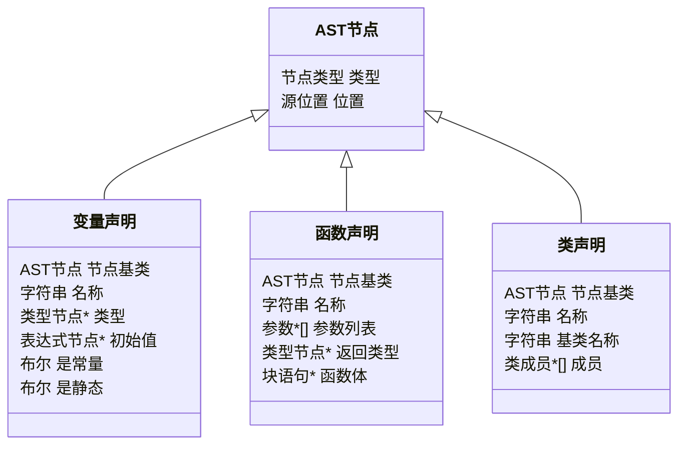
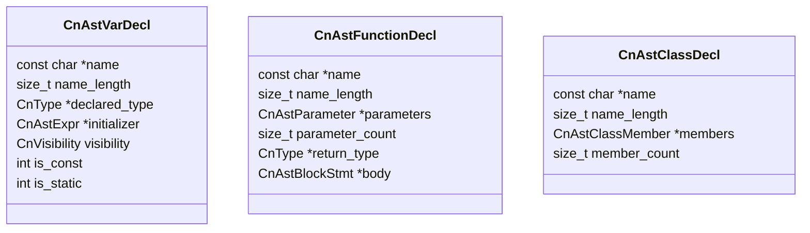
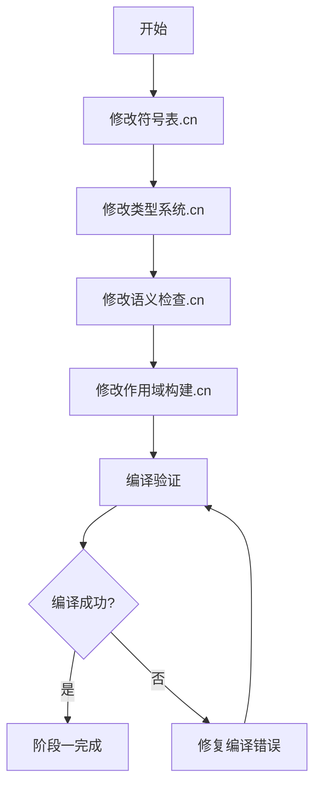
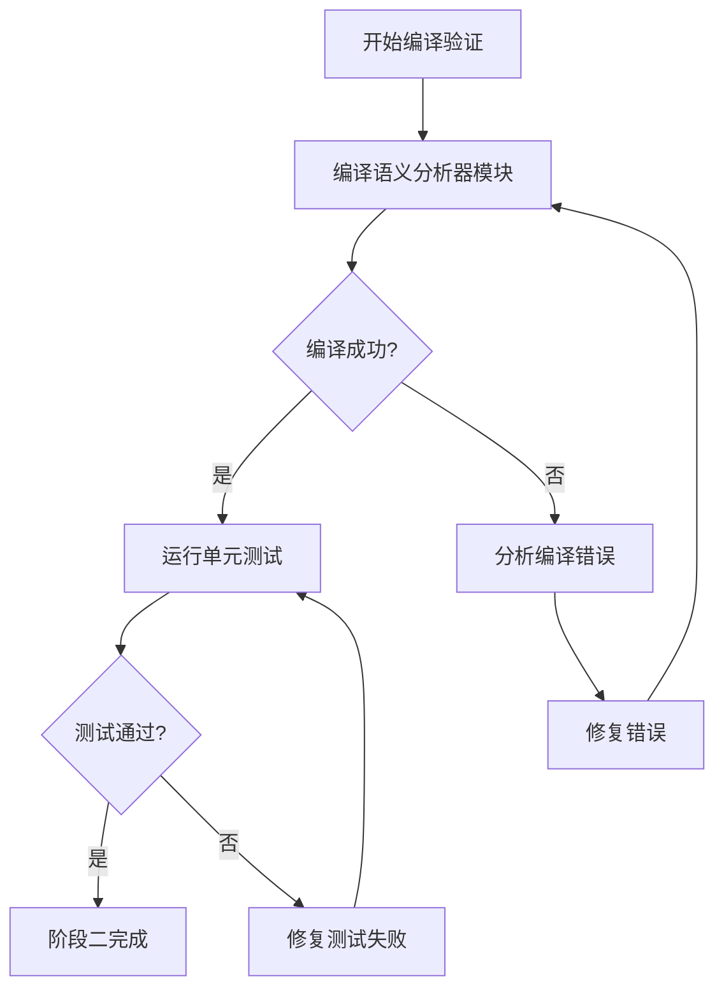

# CN语言语义分析器模块重构方案

> **文档说明**：本文档针对 `src_cn/语义分析器/` 目录下的CN语言源文件无法编译的问题，设计重构方案。
>
> **创建时间**：2026-04-06
> **问题来源**：关键字冲突、AST结构不匹配

---

## 目录

1. [问题分析](#1-问题分析)
2. [CN语言AST节点结构分析](#2-cn语言ast节点结构分析)
3. [重构方案](#3-重构方案)
4. [实施步骤](#4-实施步骤)
5. [风险评估](#5-风险评估)

---

## 1. 问题分析

### 1.1 关键字冲突问题

**问题描述**：在 [`符号表.cn`](src_cn/语义分析器/符号表.cn:99) 中使用了 `基类符号` 作为字段名：

```cn
结构体 符号 {
    // ...
    符号* 基类符号;          // 基类符号（类专用）  ← 问题所在
    符号*[] 实现接口;        // 实现的接口列表（类专用）
    // ...
}
```

**根本原因**：根据 [`001 CN Language语法规范设计文档.md`](plans/001 CN Language语法规范设计文档.md:102)，`基类` 是CN语言的保留关键字：

| 关键字 | Token类型 | 说明 |
|--------|-----------|------|
| `基类` | `CN_TOKEN_KEYWORD_BASE` | 基类访问 |

词法分析器会将 `基类符号` 解析为 `基类` 关键字 + `符号` 标识符，导致语法错误。

**影响范围**：搜索结果显示 `基类符号` 在以下文件中出现：

| 文件 | 出现次数 | 用途 |
|------|---------|------|
| [`符号表.cn`](src_cn/语义分析器/符号表.cn) | 6次 | 符号结构体字段、创建类符号函数 |
| [`类型系统.cn`](src_cn/语义分析器/类型系统.cn) | 4次 | 类型兼容性检查、接口实现检查 |
| [`语义检查.cn`](src_cn/语义分析器/语义检查.cn) | 2次 | 类声明检查 |
| [`作用域构建.cn`](src_cn/语义分析器/作用域构建.cn) | 3次 | 类声明作用域构建 |

### 1.2 AST结构差异

**CN语言AST结构**（来自 [`src_cn/语法分析器/AST节点/`](src_cn/语法分析器/AST节点/) 目录）：



**C语言AST结构**（来自 [`include/cnlang/frontend/ast.h`](include/cnlang/frontend/ast.h)）：



**主要差异**：

| 方面 | CN语言AST | C语言AST |
|------|----------|----------|
| 命名风格 | 中文（`变量声明`） | 英文（`CnAstVarDecl`） |
| 基类机制 | 内嵌 `节点基类` 字段 | 无基类，扁平结构 |
| 字符串类型 | `字符串` | `const char*` + `size_t` |
| 数组类型 | `类型*[]` | `类型**` + `size_t` |

---

## 2. CN语言AST节点结构分析

### 2.1 核心结构体定义

#### 基础结构（[`基础结构.cn`](src_cn/语法分析器/AST节点/基础结构.cn)）

```cn
// AST节点类型枚举
枚举 节点类型 {
    程序节点, 函数声明, 变量声明, 结构体声明, 枚举声明,
    类声明, 接口声明, 模板函数声明, 模板结构体声明,
    // ... 语句和表达式类型
}

// 源位置结构
结构体 源位置 {
    字符串 文件名;
    整数 行号;
    整数 列号;
}

// AST节点基类
结构体 AST节点 {
    节点类型 类型;
    源位置 位置;
}

// 类型节点
结构体 类型节点 {
    节点类型 类型;
    字符串 名称;
    类型节点* 元素类型;
    整数 指针层级;
    整数 数组维度;
    布尔 是常量;
}
```

#### 声明节点（[`声明节点.cn`](src_cn/语法分析器/AST节点/声明节点.cn)）

```cn
// 参数结构
结构体 参数 {
    字符串 名称;
    类型节点* 类型;
    布尔 是常量;
    布尔 是数组;
}

// 变量声明
结构体 变量声明 {
    AST节点 节点基类;           // 内嵌基类
    字符串 名称;
    类型节点* 类型;
    表达式节点* 初始值;
    布尔 是常量;
    布尔 是静态;
    可见性 可见性;
}

// 函数声明
结构体 函数声明 {
    AST节点 节点基类;
    字符串 名称;
    参数*[] 参数列表;
    整数 参数个数;
    类型节点* 返回类型;
    块语句* 函数体;
    可见性 可见性;
    布尔 是静态;
    布尔 是重写;
    布尔 是虚拟;
    布尔 是抽象;
}

// 类声明
结构体 类声明 {
    AST节点 节点基类;
    字符串 名称;
    字符串 基类名称;        // 注意：使用"基类名称"而非"基类符号"
    字符串[] 实现接口;
    类成员*[] 成员;
    布尔 是抽象;
}
```

### 2.2 与C语言AST的关键差异

| 特性 | CN语言AST | C语言AST | 适配方案 |
|------|----------|----------|----------|
| 基类继承 | 内嵌 `节点基类` 字段 | 无继承机制 | 使用组合模式 |
| 字符串 | `字符串` 类型 | `const char*` + `length` | 代码生成时转换 |
| 动态数组 | `类型*[]` 语法 | `类型**` + `count` | 代码生成时转换 |
| 可见性 | `可见性` 枚举 | `CnVisibility` 枚举 | 直接映射 |

---

## 3. 重构方案

### 3.1 关键字冲突解决方案

**方案：重命名冲突字段**

将所有使用 `基类` 开头的标识符重命名为替代名称：

| 原名称 | 新名称 | 说明 |
|--------|--------|------|
| `基类符号` | `父类符号` | 使用"父类"替代"基类" |
| `基类名称` | `父类名称` | 保持一致性 |
| `基类类型` | `父类类型` | 保持一致性 |

**选择"父类"的理由**：
1. `父类` 不是CN语言关键字
2. 语义上与 `基类` 等价，易于理解
3. 与面向对象编程的常用术语一致

**替代方案对比**：

| 方案 | 优点 | 缺点 |
|------|------|------|
| `父类符号` | 语义清晰，非关键字 | 与C语言代码中的"base"术语不一致 |
| `超类符号` | 非关键字，面向对象术语 | 中文语境下不如"父类"直观 |
| `继承源符号` | 非关键字 | 名称较长，不够直观 |

### 3.2 AST结构适配方案

**方案：保持CN语言AST结构，代码生成时转换**

CN语言AST结构已经设计完善，不需要修改。在代码生成阶段，编译器会将CN语言AST转换为C代码。

**关键适配点**：

1. **内嵌基类处理**：
   ```cn
   // CN语言结构体
   结构体 变量声明 {
       AST节点 节点基类;    // 内嵌
       字符串 名称;
       // ...
   }
   
   // 生成的C代码
   typedef struct 变量声明 {
       AST节点 节点基类;    // 直接内嵌，C语言支持
       const char* 名称;
       // ...
   } 变量声明;
   ```

2. **字符串类型转换**：
   ```cn
   // CN语言
   字符串 名称;
   
   // 生成的C代码
   const char* 名称;
   ```

3. **动态数组转换**：
   ```cn
   // CN语言
   参数*[] 参数列表;
   整数 参数个数;
   
   // 生成的C代码
   参数** 参数列表;
   int 参数个数;
   ```

### 3.3 需要修改的文件列表

#### 高优先级（关键字冲突修复）

| 文件 | 修改内容 | 影响范围 |
|------|----------|----------|
| [`符号表.cn`](src_cn/语义分析器/符号表.cn) | `基类符号` → `父类符号` | 符号结构体定义、创建类符号函数 |
| [`类型系统.cn`](src_cn/语义分析器/类型系统.cn) | `基类符号` → `父类符号` | 类型兼容性检查、接口实现检查 |
| [`语义检查.cn`](src_cn/语义分析器/语义检查.cn) | `基类符号` → `父类符号` | 类声明语义检查 |
| [`作用域构建.cn`](src_cn/语义分析器/作用域构建.cn) | `基类符号` → `父类符号` | 类声明作用域构建 |

#### 中优先级（AST结构适配）

| 文件 | 修改内容 | 说明 |
|------|----------|------|
| [`声明节点.cn`](src_cn/语法分析器/AST节点/声明节点.cn) | 确认 `基类名称` 字段 | 已使用正确命名，无需修改 |

---

## 4. 实施步骤

### 阶段一：关键字冲突修复（预计修改4个文件）



#### 步骤1：修改 [`符号表.cn`](src_cn/语义分析器/符号表.cn)

**修改位置**：
- 第99行：`符号* 基类符号;` → `符号* 父类符号;`
- 第291行：`符号指针.基类符号 = 无;` → `符号指针.父类符号 = 无;`
- 第577-578行：`类符号.基类符号` → `类符号.父类符号`

**预期结果**：符号结构体定义不再包含关键字冲突

#### 步骤2：修改 [`类型系统.cn`](src_cn/语义分析器/类型系统.cn)

**修改位置**：
- 第441行：`当前.基类符号` → `当前.父类符号`
- 第472-474行：`类符号.基类符号` → `类符号.父类符号`

**预期结果**：类型兼容性检查函数正确引用父类符号

#### 步骤3：修改 [`语义检查.cn`](src_cn/语义分析器/语义检查.cn)

**修改位置**：
- 第331-335行：`基类符号` → `父类符号`

**预期结果**：类声明语义检查正确处理继承关系

#### 步骤4：修改 [`作用域构建.cn`](src_cn/语义分析器/作用域构建.cn)

**修改位置**：
- 第392-396行：`基类符号` → `父类符号`

**预期结果**：类声明作用域构建正确处理继承关系

### 阶段二：编译验证



**验证命令**：
```powershell
# 编译语义分析器模块
.\tools\compile_all_src_cn.bat

# 或单独编译
.\build\cnlang.exe src_cn/语义分析器/符号表.cn -o output/符号表.c
.\build\cnlang.exe src_cn/语义分析器/类型系统.cn -o output/类型系统.c
.\build\cnlang.exe src_cn/语义分析器/语义检查.cn -o output/语义检查.c
.\build\cnlang.exe src_cn/语义分析器/作用域构建.cn -o output/作用域构建.c
```

**预期结果**：
- 所有语义分析器模块文件编译成功
- 生成的C代码语法正确
- 无关键字冲突错误

### 阶段三：集成测试

**测试范围**：
1. 符号表创建和查询
2. 类型兼容性检查
3. 类继承关系处理
4. 作用域构建

**测试用例**：

```cn
// 测试类继承语义检查
类 动物 {
    字符串 名称;
    函数 说话() -> 空类型;
}

类 狗 : 动物 {
    重写 函数 说话() -> 空类型 {
        打印("汪汪");
    }
}

// 测试接口实现
接口 可序列化 {
    函数 序列化() -> 字符串;
}

类 人员 : 动物 实现 可序列化 {
    重写 函数 序列化() -> 字符串 {
        返回 自身.名称;
    }
}
```

---

## 5. 风险评估

### 5.1 技术风险

| 风险 | 等级 | 影响 | 缓解措施 |
|------|------|------|----------|
| 重命名后语义不一致 | 低 | 代码可读性下降 | 添加注释说明"父类"与"基类"等价 |
| 遗漏某些引用 | 中 | 编译失败 | 使用全局搜索确保所有引用已修改 |
| 代码生成器依赖旧名称 | 中 | 运行时错误 | 检查代码生成器是否依赖字段名 |

### 5.2 影响范围分析

**直接影响**：
- `src_cn/语义分析器/` 目录下的4个文件
- 约15处代码修改

**间接影响**：
- 无，因为这是内部实现细节，不影响公开API

### 5.3 回滚方案

如果重构导致问题，可以通过Git回滚：

```powershell
git checkout HEAD -- src_cn/语义分析器/
```

---

## 6. 总结

### 6.1 问题根源

CN语言使用 `基类` 作为保留关键字，导致在语义分析器模块中使用 `基类符号` 作为字段名时发生关键字冲突。

### 6.2 解决方案

将所有 `基类符号` 重命名为 `父类符号`，这是一个语义等价且非关键字的标识符。

### 6.3 修改清单

| 文件 | 修改次数 | 修改类型 |
|------|---------|----------|
| [`符号表.cn`](src_cn/语义分析器/符号表.cn) | 3处 | 字段重命名 |
| [`类型系统.cn`](src_cn/语义分析器/类型系统.cn) | 3处 | 变量重命名 |
| [`语义检查.cn`](src_cn/语义分析器/语义检查.cn) | 2处 | 变量重命名 |
| [`作用域构建.cn`](src_cn/语义分析器/作用域构建.cn) | 3处 | 变量重命名 |

### 6.4 后续工作

完成语义分析器模块重构后，需要继续处理其他模块的编译问题：
1. 词法分析器模块
2. IR生成器模块
3. 代码生成器模块
4. 模块加载器模块
5. 诊断模块
6. 运行时模块

---

## 附录A：关键字冲突检测脚本

以下PowerShell脚本可用于检测CN语言源文件中的关键字冲突：

```powershell
# CN语言关键字列表
$keywords = @(
    "如果", "否则", "当", "循环", "返回", "中断", "继续", "选择", "情况", "默认",
    "整数", "小数", "字符串", "布尔", "空类型", "结构体", "枚举",
    "函数", "变量", "导入", "从", "公开", "私有", "静态",
    "真", "假", "无",
    "尝试", "捕获", "抛出", "最终",
    "类", "接口", "保护", "虚拟", "重写", "抽象", "实现", "自身", "基类"
)

# 搜索以关键字开头的标识符
foreach ($keyword in $keywords) {
    $pattern = "$keyword`p{L}|$keyword`d"
    $results = Select-String -Path "src_cn/**/*.cn" -Pattern $pattern
    if ($results) {
        Write-Host "发现关键字冲突: $keyword" -ForegroundColor Yellow
        $results | ForEach-Object { Write-Host "  $($_.Path):$($_.LineNumber): $($_.Line.Trim())" }
    }
}
```

---

## 附录B：CN语言AST节点完整结构

### B.1 节点类型枚举

```cn
枚举 节点类型 {
    // 程序节点
    程序节点,
    
    // 声明节点
    函数声明, 变量声明, 结构体声明, 枚举声明,
    模块声明, 导入声明, 类声明, 接口声明,
    模板函数声明, 模板结构体声明,
    
    // 语句节点
    表达式语句, 块语句, 如果语句, 当语句, 循环语句,
    返回语句, 中断语句, 继续语句, 选择语句,
    尝试语句, 抛出语句, 最终语句,
    
    // 表达式节点
    二元表达式, 一元表达式, 字面量表达式, 标识符表达式,
    函数调用表达式, 成员访问表达式, 数组访问表达式,
    赋值表达式, 三元表达式, 数组字面量表达式,
    结构体字面量表达式, 逻辑表达式, 模板实例化表达式,
    
    // 类型节点
    基础类型, 指针类型, 数组类型, 函数类型,
    结构体类型, 枚举类型, 类类型, 接口类型
}
```

### B.2 核心结构体

```cn
// 源位置
结构体 源位置 {
    字符串 文件名;
    整数 行号;
    整数 列号;
}

// AST节点基类
结构体 AST节点 {
    节点类型 类型;
    源位置 位置;
}

// 类型节点
结构体 类型节点 {
    节点类型 类型;
    字符串 名称;
    类型节点* 元素类型;
    整数 指针层级;
    整数 数组维度;
    整数 数组大小;
    布尔 是常量;
}

// 可见性枚举
枚举 可见性 {
    默认可见, 公开可见, 私有可见, 保护可见
}
```

---

*文档创建时间：2026-04-06*
*最后更新：2026-04-06*